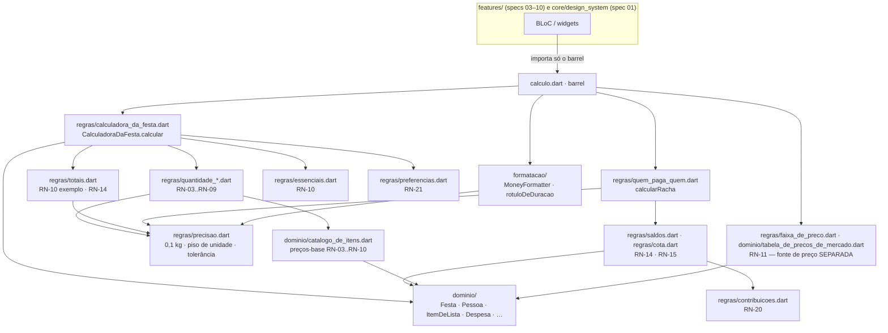

# Cálculo — Design

**Spec**: `.specs/features/calculo/spec.md`
**Tasks**: `.specs/features/calculo/tasks.md`
**Status**: Draft
**Data**: 2026-08-20

> Escopo: CALC-01..CALC-27. Esta é a camada que o `CLAUDE.md` declara única: **toda** aritmética do produto mora aqui e **nenhuma outra camada recalcula**. Três decisões deste documento são candidatas a AD no `.specs/STATE.md` (ver §Tech Decisions).

---

## Restrições herdadas

| Fonte | Restrição que este design obedece |
|---|---|
| `CLAUDE.md` | `core/calculo/` é **Dart puro**: sem `package:flutter`, sem `dart:ui`, sem Firebase · domínio em **PT-BR** com o vocabulário da spec (`Festa`, `Pessoa`, `ItemDeLista`, `Despesa`, `calcularRacha`, `fatorDuracao`), utilitários em inglês (`MoneyFormatter`) · `test/` espelha `lib/` · dinheiro é sempre `R$ + round(valor)` inteiro · criança nunca entra no racha · os exemplos numéricos do arquivo 03 são casos de teste literais |
| **AD-001** | `calculo` é a spec 02, do marco M0, e é a dona das entidades compartilhadas |
| **AD-002** (`get_it`, zero codegen) | Obedecida por **não uso**: nenhum arquivo desta camada importa `get_it`. Quem registra dependência é a feature; a camada é composta de funções puras e valores |
| **AD-005** (observabilidade via `AppLogger`) | Obedecida por **não uso**: `core/observability` importa Flutter; importar aqui quebraria FUND-06. A camada não registra nada — quem observa é o bloc consumidor |
| **AD-007** (breakpoint em `core/responsive/`) | Sem interseção; nenhuma regra aqui conhece largura de tela |
| **FUND-06** (`test/architecture/calculo_isolation_test.dart`) | Policia a pasta a cada `flutter test` e nomeia o arquivo infrator. É o gate mais barato desta spec |
| **FUND-18/19** (fixture RN-30 bruta) | O compromisso herdado é **tipar** a fixture (`spec.md` da fundação, §Nota de dependência) sem tocar no dado bruto |
| Lessons | `python3 .claude/skills/tlc-spec-driven/scripts/lessons.py list --status confirmed` → *(no confirmed lessons)* — nada a aplicar |
| Workflow paralelo (spec 01) | **Proibido** tocar em `pubspec.yaml`, `lib/core/design_system/`, `lib/core/routing/`. Nenhuma dependência nova pode ser adicionada |

---

## Exploração de abordagens

Três bifurcações reais, todas herdadas pelas dez specs que consomem esta camada.

**Bifurcação 1 — forma da API**

| Abordagem | Trade-off | Veredito |
|---|---|---|
| **A · Funções puras por RN + um orquestrador que devolve valor imutável** | Cada RN-xx é chamável e testável sozinha (é o que o `CLAUDE.md` pede); o orquestrador só compõe. Custa um objeto de entrada e um de saída. | ✅ **Escolhida** |
| B · Classe calculadora com estado mutável (`calc..homens = 3`) | Ergonômica para a UI, mas o estado é do BLoC, não da fórmula — e teste de regra isolada vira teste de sequência de mutações | Rejeitada |
| C · Cada RN como usecase injetado por `get_it` | Cerimônia de 20 registros para funções sem dependência, e acopla Dart puro ao container de DI | Rejeitada |

**Bifurcação 2 — onde vivem as entidades compartilhadas** (aberta pelo ROADMAP §2)

| Abordagem | Trade-off | Veredito |
|---|---|---|
| **A · `lib/core/calculo/dominio/`** | Candidato natural do ROADMAP; as regras já dependem das entidades, e a pasta é a **única** com isolamento policiado por teste | ✅ **Escolhida** |
| B · `lib/core/dominio/` separada | Simetria conceitual, mas cria uma segunda pasta "pura" que **ninguém policia** — FUND-06 só varre `core/calculo`. Entidade com import de Firestore passaria despercebida | Rejeitada |
| C · Cada feature define as suas | É exatamente o que o `CLAUDE.md` proíbe (`FestaRepository` sim, `PartyRepository` não — a entidade manda) | Rejeitada |

**Bifurcação 3 — unidade monetária interna**

| Abordagem | Trade-off | Veredito |
|---|---|---|
| **A · `double` em reais, arredondamento só na formatação (RN-13)** | Os casos literais dependem de 21,60 e 210,60 sobreviverem sem arredondamento intermediário; a "tolerância de 1 centavo" de RN-16 é a assinatura de um modelo de ponto flutuante. Custa disciplina: nunca somar valores já arredondados | ✅ **Escolhida** |
| B · `int` em centavos | Exato, mas RN-03 produz 1,2 kg × R$ 45/kg e RN-09 divide ml entre destilados — converter cedo arredonda cedo, e a tolerância de RN-16 perderia sentido. Obrigaria conversão em toda fronteira | Rejeitada — **revisitar** se o produto passar a cobrar de verdade (Pix com centavos) |

---

## Architecture Overview

Quatro camadas concêntricas dentro de uma pasta só. O sentido das setas é o sentido do import: **nada aponta para fora da pasta**.



**Duas fontes de preço, de propósito** (A-03): `dominio/catalogo_de_itens.dart` alimenta a calculadora (RN-03..RN-10, o "SAI POR" que dá R$ 211) e `dominio/tabela_de_precos_de_mercado.dart` alimenta a tela Lista no modo PLANEJAR (RN-11, média real de mercados). Elas **não se falam** e não têm o mesmo conjunto de itens. Nenhum arquivo importa as duas ao mesmo tempo, exceto o barrel.

**Princípio de testabilidade:** toda função é pura — mesma entrada, mesma saída, sem relógio, sem aleatório, sem I/O, sem estado global. É o que permite que cada `RN-xx` tenha teste próprio e que os quatro casos literais do arquivo 03 sejam asserções diretas, não roteiros.

---

## Code Reuse Analysis

Reuso aqui significa sobretudo **o que não vamos escrever nem instalar**.

| Recurso | Origem | Como usamos |
|---|---|---|
| `test/architecture/calculo_isolation_test.dart` | fundação (FUND-06) | Já policia a pasta. Nenhum teste novo de isolamento precisa nascer — só não violar |
| `test/fixtures/rn30_estado_inicial.dart` | fundação (FUND-18) | **Fonte única** do estado RN-30. A versão tipada é derivada dele, não uma segunda cópia |
| `lib/core/calculo/calculo.dart` | fundação (T3) | Barrel já existe com doc comment; vira a superfície pública (o texto "nenhuma fórmula mora aqui ainda" sai) |
| `dart:math` | SDK | `max`, `min`. É o **único** import de biblioteca desta camada |
| `flutter_test` | SDK (dev) | Runner dos testes — `expect`, `closeTo`, `group`. Vive só em `test/` |
| `package:intl` | — | **Não usado**: não está no `pubspec.yaml` e o `pubspec.yaml` é do workflow paralelo (A-18). RN-13 é 12 linhas à mão |
| `package:meta` | — | **Não usado**: é dependência transitiva, e importá-la dispara `depend_on_referenced_packages`, quebrando o gate `flutter analyze` (A-19) |
| `get_it`, `flutter_bloc`, Firebase | — | **Não usados** por contrato (FUND-06) |

**Integration points:** nenhum em tempo de execução. A integração é de compilação: as features importam `package:bora/core/calculo/calculo.dart`.

---

## Estrutura de diretórios

```
lib/core/calculo/
  calculo.dart                          # barrel — ÚNICA porta de entrada (CALC-27)
  dominio/
    dieta.dart                          # enum Dieta
    papel_na_festa.dart                 # enum PapelNaFesta
    status_de_presenca.dart             # enum StatusDePresenca
    status_da_festa.dart                # enum StatusDaFesta
    pessoa.dart                         # Pessoa
    festa.dart                          # Festa
    contagem_de_pessoas.dart            # ContagemDePessoas (RN-01)
    chave_item.dart                     # enum ChaveItem + UnidadeDeItem
    item_de_lista.dart                  # ItemDeLista + OverrideDeItem
    catalogo_de_itens.dart              # DefinicaoDeItem + catálogo (RN-03..RN-10, RN-12, RN-21)
    composicao_da_festa.dart            # ComposicaoDaFesta (entrada do cálculo)
    despesa.dart                        # Despesa
    saldo_de_pessoa.dart                # SaldoDePessoa + SituacaoDeSaldo
    linha_de_acerto.dart                # LinhaDeAcerto
    corredor.dart                       # enum Corredor (só RN-11)
    preco_de_mercado.dart               # PrecoDeMercado
    tabela_de_precos_de_mercado.dart    # as 8 linhas literais de RN-11
  regras/
    precisao.dart                       # arredondamento e tolerância — base de tudo
    fator_duracao.dart                  # RN-02
    quantidade_de_carne.dart            # RN-03
    quantidades_por_pessoa.dart         # RN-04, RN-08
    quantidades_de_bebida.dart          # RN-06, RN-07
    quantidade_de_cerveja.dart          # RN-05
    quantidade_de_destilado.dart        # RN-09
    essenciais.dart                     # RN-10
    preferencias.dart                   # RN-21
    calculadora_da_festa.dart           # orquestrador + ResultadoDoCalculo
    totais.dart                         # totais e estimativas (RN-10 exemplo, RN-14)
    overrides.dart                      # RN-12
    contribuicoes.dart                  # RN-20
    cota.dart                           # RN-14
    saldos.dart                         # RN-15
    quem_paga_quem.dart                 # RN-16 — calcularRacha
    split_de_despesa.dart               # RN-17
    quitacao.dart                       # RN-18
    faixa_de_preco.dart                 # RN-11 (marcador e totais de mercado)
    total_do_pedido.dart                # RN-27 (só os totais)
  formatacao/
    money_formatter.dart                # MoneyFormatter — RN-13 (nome em inglês por CLAUDE.md)
    rotulo_de_duracao.dart              # RN-13 (horas)

test/core/calculo/                      # espelho exato, um _test.dart por arquivo acima
  casos_literais_do_arquivo_03_test.dart  # os quatro casos literais, num arquivo só e visível
test/fixtures/
  rn30_estado_inicial.dart              # INTOCADO (fundação)
  rn30_estado_inicial_test.dart         # INTOCADO — nenhuma asserção enfraquecida
  rn30_estado_inicial_tipado.dart       # NOVO — visão tipada, derivada do bruto (CALC-06)
  rn30_estado_inicial_tipado_test.dart  # NOVO
```

**Por que `dominio/` e `regras/` em PT-BR** enquanto as features usam `domain/`/`data/`/`presentation/`: as pastas de feature nomeiam **camadas de arquitetura** (inglês, por AD/CLAUDE.md); estas nomeiam **conteúdo de domínio**, que o `CLAUDE.md` manda escrever em PT-BR. `formatacao/` guarda o único utilitário, e ele mantém o nome inglês que o `CLAUDE.md` cita literalmente (`MoneyFormatter`).

**`test/core/calculo/.gitkeep` permanece** — inofensivo e evita mexer no que `project_structure_test.dart` já verifica.

---

## Política de precisão e arredondamento

A decisão mais fácil de errar em silêncio, e a que decide se os casos literais fecham. Vale para **toda** a camada.

| Onde | Regra | Por quê |
|---|---|---|
| Aritmética interna | `double`, em **reais**, **sem arredondar** em nenhum passo intermediário | O Frango vale 21,60 e o total 210,60; arredondar item a item acumularia erro e mudaria totais em listas grandes |
| Totais | `total = round(soma dos valores exatos)`, **nunca** soma de valores já arredondados | Para o caso literal as duas contas coincidem (211), então o teste literal **não discrimina** — a regra tem teste próprio, com um item de valor fracionário |
| Quantidade de carne (RN-03) | `kg = max(0,5; (gramas / 100).round() / 10)` — arredonda **em gramas**, não em kg | ⚠️ `(1.15 * 10).round()` dá **11** (o binário guarda 11,499999…) → 1,1 kg → Bovina R$ 49,50 e o R$ 211 **quebra**. Em gramas: `1150/100 = 11.5` exato → 12 → **1,2 kg** |
| Quantidade de unidades (RN-04..RN-09) | `max(1, ceil(bruto))` — o `ceil` é **regra de negócio** (não dá para comprar meia lata), não formatação | Piso e teto declarados por RN-04..RN-09 |
| Dinheiro exibido (RN-13) | `R$ ` + `valor.round()`, **uma única vez**, na formatação. Meio afastado do zero (30,5 → 31) | `Math.round` do protótipo arredonda .5 para cima; para valores positivos, `round()` do Dart é idêntico. O produto só formata magnitudes |
| Tolerância (RN-16) | `const double toleranciaDeCentavo = 0.01`; resíduo de crédito/dívida `<= 0.01` conta como **zero** e não gera linha | Concilia com "dinheiro sempre inteiro" por camada: a tolerância vive na **aritmética**, o inteiro na **exibição** (A-13) |
| Comparação em teste | Dinheiro exato compara com `closeTo(valor, 0.001)`; dinheiro exibido compara com a **string** formatada | Evita teste verde por acaso e teste vermelho por ruído de `double` |

Tudo isso mora em `regras/precisao.dart`, com uma função por regra — nenhum literal `0.01`, `100` ou `round()` espalhado pelos outros arquivos.

---

## Componentes

### `precisao` (base)

- **Purpose**: as três primitivas numéricas de que todas as regras dependem.
- **Location**: `lib/core/calculo/regras/precisao.dart`
- **Interfaces**:
  - `double kgArredondadoEmDecimos(double gramas)` — `(gramas / 100).round() / 10`
  - `int unidadesComPisoDeUm(double bruto)` — `math.max(1, bruto.ceil())`
  - `const double toleranciaDeCentavo = 0.01`
  - `bool ehZeroNaTolerancia(double valor)` — `valor.abs() <= toleranciaDeCentavo`
- **Dependencies**: `dart:math`

### `ContagemDePessoas` (RN-01 · CALC-01)

- **Purpose**: a contagem do card "CONFIRMADOS + EXTRAS SEM APP" — a **única** fonte de cabeças do produto (A-05, A-22).
- **Location**: `lib/core/calculo/dominio/contagem_de_pessoas.dart`
- **Interfaces**:
  - `ContagemDePessoas({int homens = 0, int mulheres = 0, int criancas = 0})` — lança `ArgumentError` para qualquer valor negativo
  - `int get adultos` → `homens + mulheres` · `int get pessoas` → `adultos + criancas`
  - `ContagemDePessoas copyWith({int? homens, int? mulheres, int? criancas})`
- **Nota**: **não** é `const` — o construtor valida, e construtor `const` não lança. O ganho (impossível existir contagem negativa) vale a perda.

### `fatorDuracao` (RN-02 · CALC-02)

- **Location**: `lib/core/calculo/regras/fator_duracao.dart`
- **Interfaces**: `double fatorDuracao(num horas)` → `math.max(0.5, horas / 4)`
- **Nome exigido pelo `CLAUDE.md`** — não renomear.

### `MoneyFormatter` · `rotuloDeDuracao` (RN-13 · CALC-03, CALC-04)

- **Purpose**: a única forma de escrever dinheiro no produto — **contrato de fronteira nº 2 com a spec 01**.
- **Location**: `lib/core/calculo/formatacao/`
- **Interfaces**:
  - `abstract final class MoneyFormatter { static String reais(num valor); }` → `R$ 211`, `R$ 1.234`, `R$ 0`, `-R$ 5`
  - `String rotuloDeDuracao(int horas)` → `2 horas` · `4 horas` · `6 horas` · `Dia todo` (10)
- **Implementação de `reais`**: `valor.round()`, agrupa 3 dígitos com `.` da direita para a esquerda, prefixa `R$ ` (sinal antes do `R$`). Sem centavos, sem `intl` (A-18).
- **Dependencies**: nenhuma.

### `dominio/` — entidades (CALC-05)

Todas imutáveis, com `const` onde não há validação, `==`/`hashCode` escritos à mão (A-19) e `copyWith` onde a UI precisa mutar.

| Tipo | Campos | Notas |
|---|---|---|
| `Dieta` | `tudo`, `veggie`, `semPorco` | Rótulos do arquivo 01 §6 (`tudo`/`veggie`/`semporco`) mapeados em `chave` |
| `PapelNaFesta` | `anfitriao`, `coAnfitriao`, `convidado`, `soVe` | `chave`: `host`/`cohost`/`guest`/`viewer` (arquivo 01 §6). **Só o enum** — a tabela de permissões de RN-22 é de `galera` |
| `StatusDePresenca` | `confirmado`, `pendente`, `recusou` | |
| `StatusDaFesta` | `chegando`, `passada` | |
| `Pessoa` | `nome`, `papel`, `status`, `dieta` (`Dieta?`), `bebe` (`bool?`), `voce` | `dieta`/`bebe` **anuláveis**: `null` = não declarado ≠ "não bebe" (A-08). `String get inicial` derivado do nome. Cor de avatar **não** existe aqui — é token (spec 01) |
| `Festa` | `nome`, `data` (String), `hora` (String), `local`, `duracaoHoras`, `status` | `data`/`hora` como rótulo literal (A-23); `link`/`nível` ficam para `galera` (A-21) |
| `ChaveItem` | 16 valores + `chave` snake_case + `static ChaveItem? porChave(String)` | `bovina`, `suina`, `frango`, `paoDeAlho`, `refrigerante`, `suco`, `agua`, `cerveja`, `vodka`, `cachaca`, `whisky`, `legumesParaGrelha`, `carvao`, `gelo`, `salGrosso`, `coposEPratos`. As chaves batem com `itensPadraoRn30` |
| `UnidadeDeItem` | `kg`, `unidade`, `garrafa`, `lata`, `litro`, `saco`, `kit` | |
| `ItemDeLista` | `chave`, `nome`, `emoji`, `unidade`, `quantidadeAutomatica`, `precoBase`, `quantidadeOverride?`, `precoOverride?`, `essencial`, `fonteDaProporcao?`, `quemLeva?`, `noCarrinho` | Derivados: `quantidade`, `preco`, `valor = quantidade × preco`, `editado`. `quemLeva` é o **nome** da pessoa (A-24); `noCarrinho` é estado de `lista`, guardado aqui só porque o arquivo 01 §6 o declara no item |
| `OverrideDeItem` | `quantidade?`, `preco?` | O que a feature guarda por item; `null` = sem override |
| `ComposicaoDaFesta` | `contagem`, `duracaoHoras`, `pessoas`, `itensSelecionados` (`Set<ChaveItem>`), `overrides` (`Map<ChaveItem, OverrideDeItem>`) | Entrada única do orquestrador |
| `Despesa` | `quemPagou`, `descricao`, `valor` | |
| `SaldoDePessoa` | `pessoa`, `contribuicao`, `cota`, `saldo` + `SituacaoDeSaldo get situacao` | |
| `SituacaoDeSaldo` | `recebe`, `paga`, `noZero` | Tags de RN-15 |
| `LinhaDeAcerto` | `de`, `para`, `valor`, `paga` | **Sem** campo de meio de pagamento — RN-19 é de `custos` |
| `Corredor` | `acougue`, `hortifruti`, `padaria`, `bebidas`, `mercearia` | Só atributo; a **ordem** de RN-27 é de `lista` (A-17) |
| `PrecoDeMercado` | `nome`, `emoji`, `corredor`, `rotuloDeQuantidade`, `media`, `minimo`, `maximo`, `fontes`, `chave` (`ChaveItem?`) | `chave` **anulável**: a Linguiça toscana de RN-11 não existe no catálogo da calculadora (A-03) |

### `catalogo_de_itens` (RN-03..RN-10, RN-12, RN-21 · base de CALC-07..CALC-14)

- **Purpose**: preço-base, unidade, passo e metadado de cada item **para a calculadora** — a fonte de preço de RN-03..RN-10 (nunca a de RN-11).
- **Location**: `lib/core/calculo/dominio/catalogo_de_itens.dart`
- **Interfaces**:
  - `class DefinicaoDeItem { ChaveItem chave; String nome, emoji; UnidadeDeItem unidade; double precoBase; double passoDeQuantidade; bool essencial; String? fonteDaProporcao; double? quantidadeDefault; bool entraNoTotal; }`
  - `const Map<ChaveItem, DefinicaoDeItem> catalogoDeItens`
  - `const List<ChaveItem> ordemCanonicaDaLista` — a ordem estável em que os itens saem (CALC-15 AC3)
- **Dados literais** (arquivo 03 e T-03):

| Chave | Nome · emoji | Unidade | Preço-base | Passo (RN-12) |
|---|---|---|---|---|
| `bovina` | 🥩 BOVINA | kg | 45,00 /kg | 0,5 |
| `suina` | 🐷 SUÍNA | kg | 28,00 /kg | 0,5 |
| `frango` | 🍗 FRANGO | kg | 18,00 /kg | 0,5 |
| `paoDeAlho` | 🧄 PÃO DE ALHO | unidade | 6,00 | 1 |
| `refrigerante` | 🥤 REFRIGERANTE | garrafa 2 L | 9,00 | 1 |
| `suco` | 🧃 SUCO | litro | 8,00 | 1 |
| `agua` | 💧 ÁGUA | garrafa 1,5 L | 3,00 | 1 |
| `cerveja` | 🍺 CERVEJA | lata | 4,00 | **2** |
| `vodka` | 🍸 VODKA | garrafa 1 L | 40,00 | 1 |
| `cachaca` | 🍹 CACHAÇA | garrafa 1 L | 15,00 | 1 |
| `whisky` | 🥃 WHISKY | garrafa 1 L | 90,00 | 1 |
| `legumesParaGrelha` | 🥗 Legumes p/ grelha (kit veggie) | kit | **28,00** (A-10) | 1 |
| `carvao` | 🔥 Carvão | saco 5 kg | 22,00 | 1 |
| `gelo` | 🧊 Gelo | saco | 10,00 | 1 |
| `salGrosso` | 🧂 Sal grosso | kg | 8,00 | 1 |
| `coposEPratos` | 🍽️ Copos & pratos | kit | 15,00 | 1 |

- **Nota de copy**: o nome é copiado **literalmente da fonte** — chips de T-03 em caixa alta, itens de RN-10/RN-21 em sentence case. Transformar caixa é trabalho da UI (`CLAUDE.md`, §Copy).

### `essenciais` (RN-10 · CALC-14) — e a assimetria "lista × total"

- **Purpose**: os quatro itens que entram sozinhos, e a distinção entre **aparecer na lista** e **somar no total**.
- **Location**: `lib/core/calculo/regras/essenciais.dart`
- **Interfaces**:
  - `List<ItemDeLista> essenciaisAutomaticos()` — os **quatro**, sempre, com as quantidades default de RN-10 e a `fonteDaProporcao` preenchida (A-09)
  - `double totalDosEssenciais(Iterable<ItemDeLista> essenciais)` — soma **só** os que têm `entraNoTotal`
- **A assimetria, explicitada** (decisão do usuário em 2026-08-20, A-01/A-02):

| Item | Qtd default | Valor | Entra na lista (RN-10) | Entra no total do exemplo |
|---|---|---|---|---|
| 🔥 Carvão | 1 saco 5 kg | 22,00 | ✅ | ✅ `entraNoTotal: true` |
| 🧊 Gelo | 3 sacos | 30,00 | ✅ | ✅ `entraNoTotal: true` |
| 🧂 Sal grosso | 1 kg | 8,00 | ✅ | ✅ `entraNoTotal: true` |
| 🍽️ Copos & pratos | 1 kit | 15,00 | ✅ | ❌ `entraNoTotal: false` |
| | | **60,00** | 4 itens | 3 itens |

  O modelo distingue as duas coisas em lugares diferentes: **aparecer** é consequência de `essenciaisAutomaticos()` devolver os quatro; **somar** é o `bool entraNoTotal` de `DefinicaoDeItem`. Trocar para a leitura (b) do arquivo 03 é **uma linha** (`entraNoTotal: true` em `coposEPratos`), e o efeito esperado está documentado no próprio doc comment do campo: R$ 286 e ≈R$ 48/adulto. Nenhum `60` literal existe em código fora do teste.

### Regras de quantidade (RN-03..RN-09 · CALC-07..CALC-13)

Todas puras, todas recebendo `fator` já calculado (nunca `horas`), todas em arquivos separados.

| Arquivo | Assinatura | Regra |
|---|---|---|
| `quantidade_de_carne.dart` | `double gramasDeCarne({required ContagemDePessoas contagem, required double fator})` | `(H×400 + M×300 + C×200) × f` |
| | `double kgPorCarne({required double gramasTotais, required int carnesSelecionadas})` | `max(0,5; kgArredondadoEmDecimos(gramasTotais / carnes))`; `carnesSelecionadas == 0` ⇒ **0,0** (sem divisão) |
| `quantidades_por_pessoa.dart` | `int unidadesDePaoDeAlho({required int pessoas, required double fator})` | `max(1, ceil(pessoas × 0,5 × f))` |
| | `int garrafasDeAgua({required int pessoas, required double fator})` | `max(1, ceil(pessoas × 400 × f / 1500))` |
| `quantidades_de_bebida.dart` | `int garrafasDeRefrigerante({required int adultos, required int criancas, required double fator})` | `max(1, ceil((A×400 + C×500) × f / 2000))` |
| | `int litrosDeSuco({required int adultos, required int criancas, required double fator})` | `max(1, ceil((A×250 + C×400) × f / 1000))` |
| `quantidade_de_cerveja.dart` | `int latasDeCerveja({required int adultosQueBebem, required double fator})` | `max(1, ceil(bebem × 1000 × f / 350))`; `bebem == 0` ⇒ **0** (A-12) |
| `quantidade_de_destilado.dart` | `int garrafasPorDestilado({required int adultos, required double fator, required int destiladosSelecionados})` | `ml = adultos × 120 × f / n`; `max(1, ceil(ml/1000))`; `adultos == 0` ou `n == 0` ⇒ **0** (A-12) |

### `preferencias` (RN-21 · CALC-15)

- **Location**: `lib/core/calculo/regras/preferencias.dart`
- **Interfaces**:
  - `class EfeitosDasPreferencias { int veggies, semPorco, bebem; bool incluirKitVeggie; bool removerSuina; int adultosQueBebem; }`
  - `EfeitosDasPreferencias efeitosDasPreferencias({required List<Pessoa> pessoas, required int adultos})`
  - `String resumoDasPreferencias(EfeitosDasPreferencias efeitos)` — copy literal de RN-21: `A lista já se ajusta às preferências: {n} veggie 🥗 · {n} sem porco 🚫 · {n} bebem 🍺`, **omitindo termos zerados**
- **Dois números que parecem um** (armadilha declarada):
  - `bebem` = pessoas **nomeadas** com `bebe == true` → é o que aparece no **resumo** de RN-21;
  - `adultosQueBebem` = `max(0, adultos − nomeadas com bebe == false)` → é o que **dimensiona a cerveja** (A-06).
  Sem pessoas nomeadas, `adultosQueBebem == adultos` e RN-05 fica intacta. `bebe == null` (Duda) **não** entra em nenhuma das duas contagens de abstinência (A-08).

### `CalculadoraDaFesta` · `ResultadoDoCalculo` (CALC-15, CALC-16)

- **Purpose**: o orquestrador. É o que a tela Montar e a tela Lista consomem; **é o único lugar onde as regras se encontram**.
- **Location**: `lib/core/calculo/regras/calculadora_da_festa.dart`
- **Interfaces**:
  - `abstract final class CalculadoraDaFesta { static ResultadoDoCalculo calcular(ComposicaoDaFesta composicao); }`
  - `class ResultadoDoCalculo { List<ItemDeLista> itens; List<ItemDeLista> essenciais; ContagemDePessoas contagem; double fator; double totalDosItens; double totalDosEssenciais; double totalComEssenciais; double porCabeca; double porAdulto; List<ItemDeLista> get todosOsItens; bool get temOverrides; }`
- **Ordem interna do `calcular`** (determinística, e a ordem importa):
  1. `pessoas == 0` ⇒ devolve resultado vazio com todos os totais 0 (A-11, UC-03 E1) — **antes** de qualquer piso;
  2. `fator = fatorDuracao(duracaoHoras)`;
  3. `efeitos = efeitosDasPreferencias(...)` — remove `suina` da seleção e injeta `legumesParaGrelha` se houver veggie;
  4. gramas de carne e divisão pelas carnes **restantes** (depois da remoção da suína — CALC-15 AC5);
  5. quantidade de cada consumível selecionado, na `ordemCanonicaDaLista`; quantidade 0 ⇒ item **não entra**;
  6. aplica `overrides` (RN-12) sobre `quantidadeAutomatica`/`precoBase`;
  7. `essenciais = essenciaisAutomaticos()`;
  8. totais e estimativas (`totais.dart`).
- **Estimativas** (`regras/totais.dart`, A-04): `porCabeca = totalDosItens / pessoas` (Montar, "≈ R$ X / cabeça" → **30**) e `porAdulto = totalComEssenciais / adultos` (Lista, "por adulto" → **45**). `pessoas == 0` ou `adultos == 0` ⇒ **0,0**, nunca `NaN`/`Infinity`.

### `overrides` (RN-12 · CALC-17)

- **Location**: `lib/core/calculo/regras/overrides.dart`
- **Interfaces**:
  - `ItemDeLista comPassoDeQuantidade(ItemDeLista item, int passos)` — soma `passos × passoDeQuantidade`, com piso de **um passo** (carne 0,5 kg · cerveja 2 latas · demais 1)
  - `ItemDeLista comPassoDePreco(ItemDeLista item, int passos)` — passo R$ 1, piso R$ 1
  - `ItemDeLista restaurado(ItemDeLista item)` — zera os dois overrides
  - `Map<ChaveItem, OverrideDeItem> semOverrides()` — o "RESTAURAR" global
- **Transição declarada**: automático → editado (`editado == true`) → restaurado (volta **exatamente** ao valor automático).

### Racha e acerto (RN-14..RN-18, RN-20 · CALC-18..CALC-23)

| Arquivo | Assinatura | Notas |
|---|---|---|
| `contribuicoes.dart` | `Map<String, double> contribuicoesPorPessoa({required Iterable<String> participantes, Iterable<ItemDeLista> itens = const [], Iterable<Despesa> despesas = const []})` | Soma o `valor` dos itens cujo `quemLeva` é a pessoa + o `valor` das despesas que ela adiantou. Participante sem nada ⇒ **0,0**, e continua no mapa |
| | `double totalDasContribuicoes(Map<String, double>)` | |
| `cota.dart` | `double cotaPorAdulto({required double total, required int adultos})` | `adultos == 0` ⇒ **0,0**. Criança nunca entra (RN-14) |
| `saldos.dart` | `List<SaldoDePessoa> calcularSaldos({required Map<String, double> contribuicoes, required double total, required int adultos})` | `saldo = contribuição − cota`; preserva a **ordem do mapa** (é a ordem que RN-16 vai usar). `situacao` usa `ehZeroNaTolerancia` |
| `quem_paga_quem.dart` | `List<LinhaDeAcerto> calcularRacha(List<SaldoDePessoa> saldos)` | **Nome exigido pelo `CLAUDE.md`.** Credores (`saldo > tolerância`) e devedores (`saldo < −tolerância`) **na ordem de entrada** (A-14). Para cada devedor, percorre credores: `parcela = min(dívida restante, crédito restante)`; emite linha; avança credor quando o crédito zera na tolerância. Nunca emite linha `<= 0,01` |
| `split_de_despesa.dart` | `SplitDeDespesa splitIgualitario({required Despesa despesa, required int adultos})` | `valorPorAdulto = valor / adultos` (0 se `adultos == 0`); guarda `adultos` para a copy "split R$ X × N" |
| `quitacao.dart` | `ProgressoDeQuitacao progressoDeQuitacao(Iterable<LinhaDeAcerto> linhas)` | `pagas`, `total`, `valorPago`, `valorDevido`, `fracao = valorPago / valorDevido`; **sem linhas ⇒ fração 1.0** (A-16) |

> **Balanço:** a soma paga iguala a recebida quando `total == soma das contribuições` — que é o caso dos Testes A e B e o caso do produto. Se um chamador passar um `total` divergente, o algoritmo esgota o lado menor e para; está documentado no doc comment, não é exceção.

### Preço de mercado (RN-11 · CALC-24, CALC-25) — **contrato de fronteira nº 1**

- **Location**: `lib/core/calculo/dominio/tabela_de_precos_de_mercado.dart`, `lib/core/calculo/regras/faixa_de_preco.dart`
- **Interfaces**:
  - `const List<PrecoDeMercado> tabelaDePrecosDeMercado` — as 8 linhas literais de RN-11
  - `double posicaoDoMarcador(PrecoDeMercado preco)` — `((media − minimo) / (maximo − minimo)).clamp(0.0, 1.0)`; `maximo == minimo` ⇒ **0.0** (A-15)
  - `class TotalDeMercado { double media, minimo, maximo; }` · `TotalDeMercado totalDeMercado(Iterable<PrecoDeMercado>)` — para o rodapé "faixa real: de R$ X a R$ Y" (286 · 234–356)
- **O contrato**: a spec 01 recebe um `double` em `[0,1]` e **só pinta** o marcador na largura do trilho. O componente não conhece `media`, `minimo` nem `maximo` para dividir nada — se conhecer, a fórmula vazou para a UI e o `CLAUDE.md` foi violado.

### `total_do_pedido` (RN-27, só os totais · CALC-26)

- **Decisão de escopo**: **sim, cabe aqui** — o ROADMAP §5 atribui os totais a `calculo` e o `CLAUDE.md` proíbe aritmética em widget, então um `subtotal + frete` feito na sheet de pedido seria violação. É uma função de três linhas; a ordem dos corredores, os parceiros, os ETAs e os valores de frete **ficam em `lista`**, que é dona de RN-27.
- **Location**: `lib/core/calculo/regras/total_do_pedido.dart`
- **Interfaces**:
  - `double subtotalDeItens(Iterable<ItemDeLista> itens)` · `double subtotalDoQueFalta(Iterable<ItemDeLista> itens)` (só `noCarrinho == false`, para "PEDIR O QUE FALTA")
  - `class TotalDoPedido { double subtotal, frete, total; }` · `TotalDoPedido totalDoPedido({required double subtotal, required double frete})` — frete 0 ⇒ total = subtotal (Zé Delivery)

### `calculo.dart` — barrel (CALC-27)

- **Purpose**: a **única** porta de entrada. Nenhuma feature importa arquivo interno da pasta.
- **Interfaces**: `export` de todo `dominio/`, `regras/` e `formatacao/` que é público.
- **Verificação**: um teste que importa **só** o barrel e reproduz o caso literal R$ 211 — se algo essencial não estiver exportado, esse teste não compila.
- **O doc comment atual precisa mudar**: hoje diz "as fórmulas nascem na spec 02; nenhuma mora aqui ainda".

---

## Data Models — a fixture RN-30 de mapa bruto a tipo (CALC-06)

O compromisso herdado da fundação. A regra de ouro: **o dado bruto não muda e o teste dele não é tocado**.

```
test/fixtures/rn30_estado_inicial.dart        (fundação, INTOCADO)
        │  Map<String,Object?> / List<Map> / List<String> — só primitivos
        │
        ▼  derivação pura, em arquivo novo
test/fixtures/rn30_estado_inicial_tipado.dart (esta spec)
        │  Festa · List<Pessoa> · List<ChaveItem>
        ▼
test/fixtures/rn30_estado_inicial_tipado_test.dart
```

- **Derivação, não cópia.** `festaRn30Tipada`, `pessoasRn30Tipadas` e `itensPadraoRn30Tipados` **leem** `festaRn30`, `pessoasRn30` e `itensPadraoRn30`. Um segundo literal seria uma segunda fonte da verdade, e as duas divergiriam no primeiro ajuste.
- **Mapeamento de chaves**: `papel` `host|cohost|guest|viewer` → `PapelNaFesta`; `dieta` `tudo|veggie|semporco` → `Dieta`; `status` `confirmado|pendente|recusou` → `StatusDePresenca`; item `bovina|frango|pao_de_alho|refrigerante|agua|cerveja|cachaca` → `ChaveItem.porChave`.
- **Duda continua sem dieta e sem bebida**: as chaves estão ausentes no mapa, então o tipo recebe `null` — nunca `false`, nunca `Dieta.tudo` (A-08). O teste novo afirma isso explicitamente; o teste antigo, que afirma a ausência, **continua valendo palavra por palavra**.
- **Nenhuma asserção enfraquecida**: `rn30_estado_inicial_test.dart` não é editado. A validação da fundação provou por mutação que aquelas asserções discriminam; enfraquecê-las apagaria a prova.

---

## Error Handling Strategy

Camada pura: não há falha de I/O. O que existe é **entrada impossível** e **fronteira numérica**.

| Cenário | Tratamento | Impacto no consumidor |
|---|---|---|
| Contagem com valor negativo | `ArgumentError` na construção de `ContagemDePessoas` | Erro de programação, ruidoso por design — a UI nunca desce de 0 (T-03) |
| `pessoas == 0` | Guarda no orquestrador: lista vazia, totais 0 | UC-03 E1: "lista vazia e total R$ 0, nunca negativo" |
| `adultos == 0` em cota / por adulto / split | Devolve `0.0` | Nunca `NaN` nem `Infinity` na tela |
| Nenhuma carne selecionada | `kgPorCarne` devolve `0.0` sem dividir | Nenhum item de carne na lista |
| Consumível só-de-adulto com `adultos == 0` | Quantidade 0 ⇒ item fora da lista (A-12) | Festa só de crianças não compra cerveja |
| `maximo == minimo` na faixa | `posicaoDoMarcador` devolve `0.0` | Marcador na origem de um trilho de comprimento zero |
| Nenhuma linha de acerto | `fracao = 1.0`, `0 de 0` (A-16) | Barra cheia com "nada a quitar" |
| Resíduo `<= R$ 0,01` no racha | Tratado como zero; nenhuma linha emitida | Sem linha fantasma de "R$ 0" |
| Chave de item desconhecida vinda de dado bruto | `ChaveItem.porChave` devolve `null` | Quem converte decide; a fixture tipada falha o teste em vez de inventar item |
| Override abaixo do mínimo | Trava no mínimo (1 passo / R$ 1) | Stepper não desce mais |

---

## Risks & Concerns

| # | Concern | Local | Impacto | Mitigação |
|---|---|---|---|---|
| R-1 | **Armadilha de ponto flutuante no arredondamento de 0,1 kg**: `(1.15 * 10).round()` = 11 | `regras/quantidade_de_carne.dart` | 1,1 kg em vez de 1,2 kg ⇒ Bovina R$ 49,50 ⇒ **o R$ 211 quebra** | Arredondar em **gramas** (`(gramas/100).round()/10`), isolado em `precisao.dart`, com teste dedicado em 1149 / 1150 / 1151 g |
| R-2 | **RN-16 é sensível à ordem** e um executor "melhora" ordenando por valor | `regras/quem_paga_quem.dart` | O Teste B sai `BIA→RAFA 95 · LÉO→RAFA 10 · LÉO→ANA 25` em vez do que a spec exige | Proibição explícita no doc comment + A-14 + os dois testes literais, que **discriminam** a ordenação |
| R-3 | Somar valores **já arredondados** em vez de arredondar a soma | `regras/totais.dart` | Divergência de R$ 1 em listas maiores; o caso literal **não pega** (211 dos dois jeitos) | Regra única na política de precisão + teste com item de valor fracionário (Frango 21,60) que separa as duas contas |
| R-4 | Sem `intl` e com `pubspec.yaml` **proibido** | `formatacao/money_formatter.dart` | Formatação pt-BR feita à mão pode errar milhar ou sinal | Testes de 0, 30,14, 210,6, 1234, 1000000 e negativo |
| R-5 | `package:meta` é dependência **transitiva** | qualquer entidade | `depend_on_referenced_packages` derruba `flutter analyze`, que é gate | Não importar; `==`/`hashCode` à mão (A-19) |
| R-6 | RN-11 e o catálogo da calculadora **não cobrem o mesmo conjunto** (Linguiça toscana não tem chip em T-03) | `dominio/preco_de_mercado.dart` | Um executor cria `ChaveItem.linguica` e inventa preço-base | `PrecoDeMercado.chave` é `ChaveItem?`; A-03 documenta |
| R-7 | RN-10 dá badge de proporcionalidade mas **nenhuma fórmula** | `regras/essenciais.dart` | Escala inventada muda o R$ 271 | Quantidades fixas nos defaults; `fonteDaProporcao` é **metadado de exibição** (A-09) |
| R-8 | Pisos `max(1, …)` × guarda de 0 pessoas | `regras/calculadora_da_festa.dart` | Festa vazia devolveria 1 pão e 1 lata, contra UC-03 E1 | Guarda **antes** de tudo, com teste próprio |
| R-9 | Tipar a fixture no arquivo errado quebraria a fundação | `test/fixtures/` | O teste "só primitivos" (FUND-19) falha e alguém o enfraquece para passar | Arquivo **novo**, derivado; proibição explícita de editar o bruto ou seu teste |
| R-10 | Colisão de merge com a spec 01, em execução paralela | `pubspec.yaml`, `core/design_system/`, `core/routing/` | Merge conflitado nos dois workflows | Tocar **apenas** `lib/core/calculo/**`, `test/core/calculo/**` e `test/fixtures/rn30_estado_inicial*` |
| R-11 | `double` acumulando erro em comparação de teste | toda a suíte | Teste vermelho por ruído, ou verde por acaso | Dinheiro exato com `closeTo(v, 0.001)`; dinheiro exibido comparado como **string** |
| R-12 | A copy de RN-21 (`resumoDasPreferencias`) é texto — parece UI dentro do cálculo | `regras/preferencias.dart` | Discussão de fronteira no code review | Fica: a regra é "omitir termos zerados", que é lógica; RN-21 é de `calculo` pelo ROADMAP §5. A **caixa alta** e o estilo continuam sendo da UI |

---

## Cobertura: requisito → componente → verificação

Insumo direto da fase Tasks. Tudo **A** (automatizado): a camada não tem nada de manual.

| Req | Componente | Verificação |
|---|---|---|
| CALC-01 | `dominio/contagem_de_pessoas.dart` | 3H+3M+1C → 6 adultos / 7 pessoas; negativo lança `ArgumentError` |
| CALC-02 | `regras/fator_duracao.dart` | 2→0.5 · 4→1 · 6→1.5 · 10→2.5 · 0 e 1→0.5 (piso) |
| CALC-03 | `formatacao/money_formatter.dart` | 210,6→`R$ 211` · 30,14→`R$ 30` · 1234→`R$ 1.234` · 0→`R$ 0` · 30,5→`R$ 31` · sem centavos |
| CALC-04 | `formatacao/rotulo_de_duracao.dart` | 2/4/6→"N horas" · 10→"Dia todo" |
| CALC-05 | `dominio/*` | Construção, igualdade de valor, imutabilidade, `dieta`/`bebe` anuláveis |
| CALC-06 | `test/fixtures/rn30_estado_inicial_tipado.dart` | Campo a campo contra RN-30; Duda com `null`; suíte antiga intacta |
| CALC-07 | `regras/quantidade_de_carne.dart` | 2300 g ÷ 2 → 1,2 kg; Bovina 54,00 e Frango 21,60; 0 carnes → 0; piso 0,5 kg; 1149/1150/1151 g |
| CALC-08 | `regras/quantidades_por_pessoa.dart` | 7 pessoas, f=1 → 4 un / R$ 24; piso `max(1,…)` |
| CALC-09 | `regras/quantidade_de_cerveja.dart` | 6 adultos, f=1 → 18 latas / R$ 72; 0 que bebem → 0 |
| CALC-10 | `regras/quantidades_de_bebida.dart` | 6A+1C, f=1 → 2 gf / R$ 18 |
| CALC-11 | `regras/quantidades_de_bebida.dart` | fórmula + piso |
| CALC-12 | `regras/quantidades_por_pessoa.dart` | 7 pessoas, f=1 → 2 gf / R$ 6 |
| CALC-13 | `regras/quantidade_de_destilado.dart` | 6 adultos, f=1, só cachaça → 720 ml → 1 gf / R$ 15; 0 adultos → 0 |
| CALC-14 | `regras/essenciais.dart` | Quatro na lista; **total 60,00** (só `entraNoTotal`); Copos & pratos presente e fora do total |
| CALC-15 | `regras/preferencias.dart`, `regras/calculadora_da_festa.dart` | Kit veggie entra; suína sai e as gramas se redividem; cerveja por `adultosQueBebem`; `null` não conta; ordem canônica estável |
| CALC-16 | `regras/totais.dart`, `regras/calculadora_da_festa.dart` | **R$ 211 e ≈R$ 30**; **R$ 271 e ≈R$ 45** (os dois números); `pessoas == 0` → vazio e 0 |
| CALC-17 | `regras/overrides.dart` | Passos 0,5 / 2 / 1; mínimos de um passo e R$ 1; editado ⇄ restaurado |
| CALC-18 | `regras/contribuicoes.dart` | Itens + despesas por pessoa; participante sem nada → 0,0 |
| CALC-19 | `regras/cota.dart` | 320/4 → 80; 380/4 → 95; `adultos == 0` → 0 |
| CALC-20 | `regras/saldos.dart` | `contribuição − cota`; recebe/paga/no zero na tolerância |
| CALC-21 | `regras/quem_paga_quem.dart` | **Teste A** e **Teste B** linha a linha e na ordem; soma paga = soma recebida; listas vazias; ordem de entrada preservada |
| CALC-22 | `regras/split_de_despesa.dart` | Valor por adulto e N; `adultos == 0` → 0 |
| CALC-23 | `regras/quitacao.dart` | Progresso, 100% com todas pagas, `0 de 0` → 1.0, alternância reversível |
| CALC-24 | `dominio/tabela_de_precos_de_mercado.dart` | 8 linhas literais; total 286 · faixa 234–356 |
| CALC-25 | `regras/faixa_de_preco.dart` | Picanha → 11/29; `clamp` em [0,1]; `máx == mín` → 0.0 |
| CALC-26 | `regras/total_do_pedido.dart` | `subtotal + frete`; frete 0; subtotal do que falta |
| CALC-27 | `calculo.dart` + `test/architecture/calculo_isolation_test.dart` | Teste que importa **só** o barrel e reproduz R$ 211; mesma entrada duas vezes → resultado igual; suíte de isolamento verde |

---

## Tech Decisions

| Decisão | Escolha | Rationale |
|---|---|---|
| Forma da API | Funções puras por RN + orquestrador imutável | Cada RN-xx testável sozinha, como o `CLAUDE.md` exige |
| Entidades compartilhadas | `lib/core/calculo/dominio/` | Única pasta com isolamento policiado por teste (FUND-06) |
| Unidade monetária | `double` em reais, arredondamento só na formatação | Os casos literais dependem de 21,60 e 210,60 intactos; a tolerância de RN-16 pressupõe ponto flutuante |
| Arredondamento de 0,1 kg | Em **gramas**, não em kg | `(1.15*10).round()` = 11 quebraria o R$ 211 |
| Nomes de pasta | `dominio/`, `regras/`, `formatacao/` em PT-BR | Nomeiam conteúdo de domínio, não camada de arquitetura; `MoneyFormatter` mantém o inglês que o `CLAUDE.md` cita |
| Contagem de pessoas | Um tipo só (`ContagemDePessoas`), não "extras" separados | A-05/A-22: somar duas populações exigiria inventar gramas para nomeados |
| Essenciais no total | `bool entraNoTotal` por item de catálogo | Decisão do usuário (leitura (a)) fica **declarada e testável**; trocar de leitura é uma linha |
| Cerveja com pessoas nomeadas | `adultos − abstêmios conhecidos` | Contínuo com RN-05; sem degrau ao nomear a primeira pessoa |
| Ordem em RN-16 | Ordem de entrada, nunca ordenada | O Teste B discrimina |
| Totais de RN-27 | Ficam aqui (função pequena) | ROADMAP §5 + proibição de aritmética em widget; corredores e parceiros ficam em `lista` |
| Fixture RN-30 | Arquivo novo, **derivado** do bruto | Fonte única; nenhuma asserção da fundação enfraquecida |
| Dependências novas | Zero | `pubspec.yaml` é do workflow paralelo; `intl` e `meta` ficam de fora |

> **Candidatas a AD no `.specs/STATE.md`** (arquivo proibido nesta worktree — o texto vai no relatório final para o orquestrador registrar): **AD-008** entidades compartilhadas em `core/calculo/dominio/`; **AD-009** política de precisão e arredondamento; **AD-010** leitura (a) de RN-10 com `entraNoTotal` declarado.

---

## Herança para as próximas specs

- **Spec 01 `design-system`**: recebe os dois contratos de fronteira — posição do marcador como `double` em `[0,1]` (CALC-25) e `MoneyFormatter` (CALC-03). Nenhum componente formata dinheiro nem divide faixa.
- **Spec 05 `montar`**: consome `CalculadoraDaFesta.calcular` a cada toque; o rodapé "SAI POR" é `MoneyFormatter.reais(resultado.totalDosItens)` e `porCabeca`. Manter os steppers coerentes com os confirmados é responsabilidade dela (A-05).
- **Spec 06 `lista`**: consome `todosOsItens`, `essenciais`, a tabela de RN-11 e `total_do_pedido`; é dona da ordem de corredores, dos parceiros de delivery e do corredor dos itens que RN-11 não declara (A-17).
- **Spec 07 `galera`**: consome `efeitosDasPreferencias` e `resumoDasPreferencias`; é dona da tabela de permissões de RN-22 (aqui só existe o enum de papel).
- **Spec 09 `convidado`** e **10 `custos`**: consomem `contribuicoesPorPessoa`, `calcularSaldos`, `calcularRacha` e `progressoDeQuitacao`. `custos` adiciona o meio de pagamento (RN-19), que **não** existe em `LinhaDeAcerto`.
- **Todas**: importam `package:bora/core/calculo/calculo.dart` e **nenhuma recalcula**.
