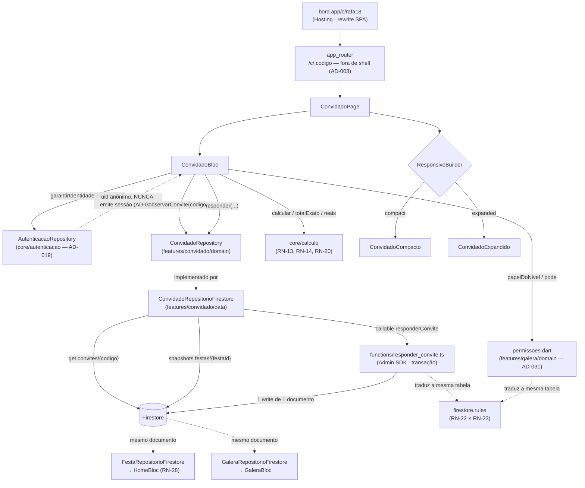
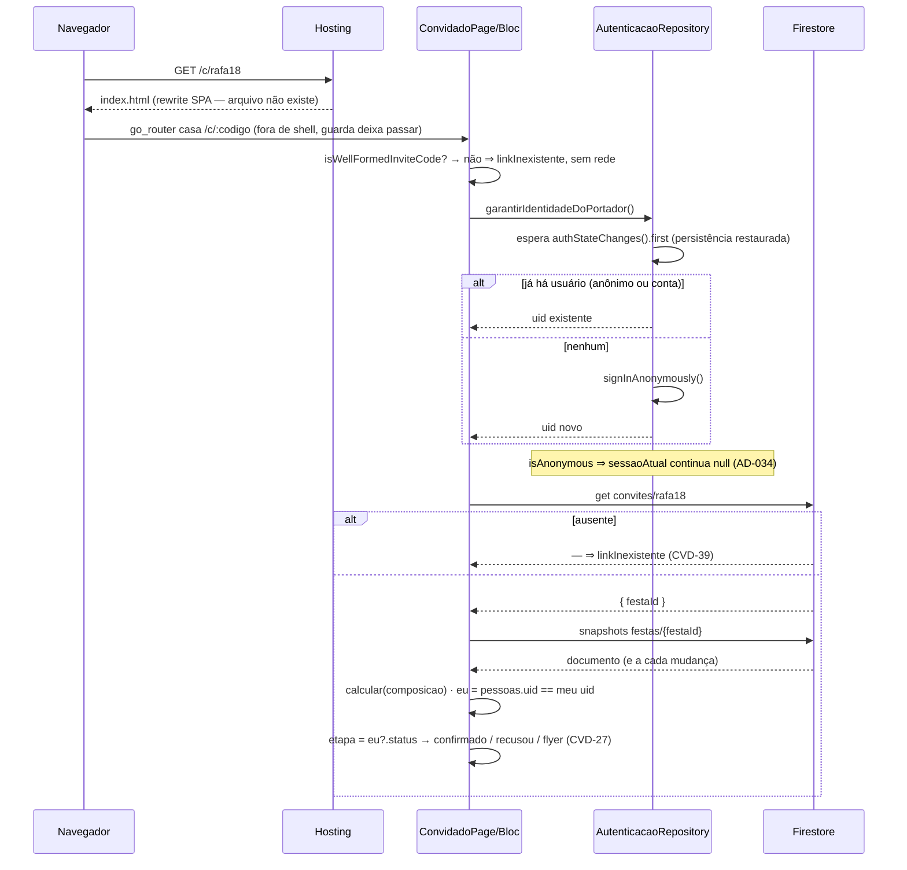
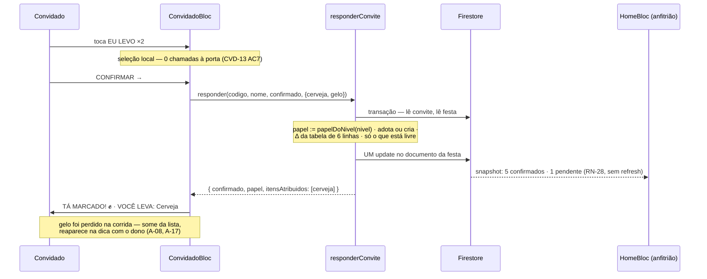

# O convidado (link público) — Design

**Spec:** `.specs/features/convidado/spec.md` (CVD-01..CVD-44)
**Context:** `.specs/features/convidado/context.md`
**Status:** Draft
**Decisões ativas herdadas:** AD-001..AD-028 · **AD-026 funda esta spec** (link perpétuo, papel lido na abertura, identidade = uid anônimo persistido no dispositivo) · **AD-016** (Firestore, Hosting e Functions entram aqui) · **AD-017** (`/c/:codigo` passa sempre) · **AD-003** (a rota já existe fora de qualquer shell) · **AD-004** (emulator-first) · **AD-019** (autenticação em `core/autenticacao/`, atrás de porta) · **AD-020** (navegação por sessão é consequência da guarda, nunca imperativa) · **AD-022** (contadores são dado) · **AD-008** (entidades em `core/calculo/dominio/`) · **AD-005** (`AppLogger`) · **AD-021** (`mocktail` só sobre SDK de terceiro) · **AD-011/AD-012** (tokens e tipografia)
**Decisões propostas e ainda não registradas que esta spec consome:** **AD-029** (`core/festas/`, de `montar`) · **AD-030** (estado de lista nas entidades de `core/`, de `lista`) · **AD-031** (dado do link em `core/festas/`, regra de RN-22 em `features/galera/domain/permissoes.dart`, de `galera`) · **AD-032** (`share_plus` atrás de `CompartilhadorDeTexto`, de `convite` — **não consumida aqui**, listada só para a numeração)
**Decisões novas propostas:** **AD-033** — a forma do dado no Firestore e a fronteira de escrita (um documento por festa, `convites/{codigo}` como índice, RSVP só pela Cloud Function). **AD-034** — a identidade do portador do link, e a regra de que **usuário anônimo do Firebase nunca vira `UsuarioLogado`**. Ver §13.
**Lições confirmadas:** `python .claude/skills/tlc-spec-driven/scripts/lessons.py list --status confirmed` → **`(no confirmed lessons)`**. Nada a aplicar por esse canal. As candidatas L-001 (rota que só existe como redirect precisa de teste que a abra) e L-003 (adaptador sem teste unitário deixa o AC sem prova) estão aplicadas em §14 e §12 por coincidirem com riscos reais desta spec.
**Decisões do usuário neste Design (2026-08-28):** forma do dado = **um documento por festa**; escrita do RSVP = **Cloud Function**, como CVD-31 AC7 manda.

---

## 1. Pré-requisito bloqueante — leia antes de planejar tasks

**Esta spec não pode entrar em Execute antes de `montar` (05), `lista` (06) e `galera` (07).** Não é ordem de conveniência: são dependências de compilação que não existem no disco (conferido em 2026-08-28 — `lib/features/{montar,lista,galera}/` têm só `PlaceholderPage`, e `lib/core/festas/` não existe).

| O que falta | Onde nasce | Quem usa aqui |
|---|---|---|
| `lib/core/festas/` — `FestaEmEdicao`, `FestaEmEdicaoRepository`, barrel | `montar` §6.1/§6.2 (**AD-029**) | É a porta que ganha o adaptador Firestore (§7.2) |
| `ResumoDeFesta.composicao` | `montar` E-3 | Faz a festa ser **um registro só** — o que permite um documento só (§2.1) |
| `ComposicaoDaFesta.copyWith` | `galera` E-3 | Toda escrita do adaptador e da serialização |
| `ComposicaoDaFesta.noCarrinho` + `DefinicaoDeItem.corredor` + `FestaEmEdicao.despesas` | `lista` E-a/E-b/E-c (**AD-030**) | Serialização: campo que existe e não é gravado é dado perdido no primeiro `salvarFesta` |
| `NivelDoLink`, `ConviteDaFesta`, `FestaEmEdicao.convite` | `galera` §6.1/§6.2 (**AD-031**) | O nível governa o que o convidado vê (CVD-28) e o papel gravado (CVD-29) |
| `features/galera/domain/permissoes.dart` — `Capacidade`, `capacidadesDe`, `papelDoNivel` | `galera` §6.3 (**AD-031**) | É a tabela que as security rules traduzem (CVD-31 AC10) |
| `GaleraRepository` + `GaleraTextos.urlDoConvite` | `galera` §7.1/§9 | A porta ganha adaptador Firestore; a URL é a **mesma** string (§9) |

**Consequência para o plano:** `tasks.md` pode ser escrito agora — ele não depende do código. O Execute começa depois do merge de `galera`. Invertida a ordem, esta spec teria de fazer nascer `core/festas/`, `permissoes.dart` e três campos de `ComposicaoDaFesta`, e quatro specs colidiriam nos mesmos arquivos.

**Esta spec não é paralelizável com nenhuma outra.** Ela reescreve a camada de dados que as quatro anteriores consomem; qualquer worktree paralelo mergearia por cima de um `FestaRepositoryEmMemoria` que mudou de vizinhança.

---

## 2. Abordagens consideradas

A `spec.md` deixou cinco decisões ao Design (`context.md` §Agent's Discretion) e o §Porte pediu **pesquisa** em três pontos. As duas primeiras subseções foram levadas ao usuário e decididas por ele; a §2.3 é a que a pesquisa mudou.

### 2.1 A forma do dado no Firestore — *decidida pelo usuário*

| # | Abordagem | Consequência |
|---|---|---|
| **A** ✅ | **Um documento por festa.** `pessoas` é array dentro dele; `papeis` é um mapa `uid → papel` mantido pela Function como índice das rules; `convites/{codigo}` é um documento de índice apontando para o `festaId` | Escrita de RSVP é **um write de um documento** ⇒ a atomicidade de CVD-19 AC1 é propriedade da forma, não disciplina. `ComposicaoDaFesta` serializa 1:1, e a **ordem** de `pessoas` — que é comportamento observável no racha (`calculo` A-14) — é a ordem do array, de graça. Rules leem `resource.data.papeis[request.auth.uid]` em O(1) |
| **B** | Pessoas em subcoleção `festas/{id}/pessoas/{uid}` | Segue a letra de CVD-31 AC7(b) ("o documento de uma pessoa"). Custa: transação obrigatória em toda escrita, campo `ordem` explícito só para reconstruir uma ordem que o array já tem, e `observarFesta` vira merge de dois snapshots — três mecanismos novos para um ganho que não existe, porque **os contadores moram no documento da festa de qualquer jeito**, então toda escrita de RSVP toca a festa com ou sem subcoleção |
| **C** | Documento da festa + coleção de itens | Não tem o que colecionar: `ItemDeLista` é **derivado** por `CalculadoraDaFesta.calcular`. O que persiste é `itensSelecionados`, `overrides`, `noCarrinho` e `quemLeva` — mapas e conjuntos da composição. Uma coleção de itens seria uma segunda fonte da lista, e a calculadora deixaria de ser a única |

**Escolhida: A.** E a consequência mais importante é que a rejeição de C **arrasta** as rules: como não existe documento de item, CVD-31 AC7(c) e AC7(d) não podem ser `match /itens/{id}` — são regras **de campo** sobre o documento da festa, escritas com `request.resource.data.diff(resource.data).affectedKeys()`. §10 as escreve assim.

**Divergência declarada — D-8** (nova, §15): CVD-31 AC7(b) diz "o documento de uma pessoa … só o documento cujo id é o uid de quem chama". Não há documento de pessoa. O **efeito observável** do AC — um portador do link não consegue escrever o RSVP de outra pessoa — continua verdadeiro e continua tendo par permitido/negado (§10, linha b): as rules negam **toda** escrita de cliente sobre `pessoas` e `papeis`, e a amarração `documento ↔ uid de quem chama` passa a ser afirmada dentro da Function, com teste próprio.

### 2.2 Quem escreve o RSVP — *decidida pelo usuário*

CVD-31 AC7(a)(b) já dizia "gravável só pela Function". A alternativa real (transação no cliente + rules validando delta de contador e `papel == papelDoNivel(nivel vigente)`) é expressável em rules e foi apresentada com o seu custo; o usuário confirmou a Function.

**O que isso traz para o repositório, e que a `spec.md` não precificou:**

| Entrada | O que é | Onde fica declarada |
|---|---|---|
| `functions/` em **Node/TypeScript** | Segunda linguagem num repo até aqui só-Dart. É onde mora a tabela de seis transições de CVD-22 e a resolução de papel de CVD-29 | **AD-033** |
| `cloud_functions` no `pubspec.yaml` | **Primeira dependência de produção nova desde o M0.** Callable, e não `onRequest`, porque callable já leva o token de auth — `onRequest` exigiria `http` mais montagem manual de `Authorization` | **AD-033** |
| `@firebase/rules-unit-testing` em `functions/` (dev) | Não existe equivalente Dart. É o que torna CVD-32 (par permitido/negado por linha) executável | **AD-033** |
| Plano **Blaze** para deploy real de Functions | Não bloqueia nada aqui: o projeto é `demo-bora` e roda em emulador (AD-004). Vira bloqueio no dia do deploy | §12 |

### 2.3 Onde a identidade do portador é persistida — *o ponto que a pesquisa mudou*

A `spec.md` (P1-2 AC5) diz que "o par `{uid anônimo, nome}` SHALL ser persistido no dispositivo, associado ao `codigo` da festa". A leitura ingênua é um pacote de key-value (`shared_preferences`) guardando os dois.

**Não é preciso, e o desenho fica melhor sem.** A auth anônima do Firebase **já** persiste o uid no dispositivo (doc oficial: a persistência padrão no navegador é `local`, e sessão anônima sobrevive a reload e a fechar a aba). Com o uid em mãos, o **nome** não precisa de armazenamento local nenhum: ele é o `nome` da `Pessoa` cujo `uid` é o meu, dentro do documento da festa. Resultado:

| Requisito | Como fecha sem pacote novo |
|---|---|
| P1-2 AC5 — o par persiste, associado ao `codigo` | O uid persiste no dispositivo (Firebase Auth); o par `{uid → nome}` persiste **na festa daquele código**. A associação ao código é exatamente o que o documento dá |
| P1-2 AC6 — reabrir não pede o nome | Mesmo uid ⇒ acho minha `Pessoa` ⇒ tag personalizada |
| P1-2 AC11 — limpar o navegador devolve pessoa nova | Limpar apaga o IndexedDB da auth ⇒ uid novo ⇒ nenhuma `Pessoa` minha ⇒ campo de nome de novo. **Custo declarado de AD-026, reproduzido de graça** |
| Edge Case — par da festa A, link da festa B | Mesmo uid, outro documento, nenhuma `Pessoa` minha lá ⇒ pede o nome. A persistência é por `{codigo, uid}` sem que nada precise ser chaveado por `{codigo, uid}` |

**O risco que a pesquisa achou, e que não pode ser ignorado:** o histórico do FlutterFire registra sessão anônima **perdida no reload no web** ([flutterfire#6785](https://github.com/firebase/flutterfire/issues/6785), fechado; [#9241](https://github.com/firebase/flutterfire/issues/9241), fechado como duplicado). A causa recorrente relatada é chamar `signInAnonymously()` **antes** de o estado persistido ter sido restaurado — o que cria um uid novo por carregamento e destruiria AD-026 inteira. Vira regra de desenho (§7.1) e task de verificação empírica (§12).

### 2.4 A adoção da Duda, e o que é preciso acrescentar para ela existir

A-05 exige adotar uma `Pessoa` **`pendente`, sem uid vinculado, de nome igual**. "Sem uid vinculado" não é representável hoje: `Pessoa` (`core/calculo/dominio/pessoa.dart`) não tem campo de uid, e o doc dela diz por quê — *"a identidade aqui é o próprio nome; identificador de verdade nasce quando o Firestore entrar"*. **O Firestore entra aqui.**

| # | Abordagem | Consequência |
|---|---|---|
| **A** ✅ | `Pessoa` ganha `final String? uid` — anulável, default `null`, entrando em `==`/`hashCode` | A frase que o próprio doc de `Pessoa` deixou escrita se cumpre. `null` = **sem dono**, que é literalmente a condição de adoção de A-05, e é o estado das cinco pessoas da fixture. Aditivo: todo construtor existente continua compilando e continua igual |
| **B** | Mapa paralelo `uidPorPessoa` no documento da festa | Segunda fonte para o mesmo fato, indexada por posição num array que cresce. Diverge no primeiro RSVP concorrente, sem teste que perceba |

**Escolhida: A.** É emenda a `core/calculo/dominio/`, pasta que a `spec.md` põe em "não pode tocar" — declarada como **E-1** em §4, com o precedente de `lista` E-b e `galera` E-3, que emendaram a mesma pasta pelo mesmo motivo (campo aditivo, zero aritmética).

### 2.5 Onde a atribuição "quem leva" persiste

`ItemDeLista.quemLeva` existe e é consumido por `contribuicoesPorPessoa` (RN-20) — mas **`lista` declarou que ele continua sem dono**: *"`ItemDeLista.quemLeva` continua sem UI que o escreva"* (`lista` §14). Como `ItemDeLista` é **derivado** pela calculadora, um valor que ninguém persiste nasce sempre `null`, e RN-20 nunca sai de zero. Esta spec é a primeira que escreve.

**Decisão: `Map<ChaveItem, String> quemLeva` em `ComposicaoDaFesta`, aplicado por `CalculadoraDaFesta._itemDe`** — exatamente a forma que `lista` E-b usou para `noCarrinho`, e pelo mesmo argumento: estado por item que precisa sobreviver a um recálculo mora na composição, junto de `overrides`. Emenda **E-2** (§4).

**O valor é o `nome`, não o uid** — porque é o que `ItemDeLista.quemLeva` já é e o que `contribuicoesPorPessoa` já consome (`somar(item.quemLeva, item.valor)`, com as chaves do mapa sendo nomes de participantes). Trocar para uid obrigaria a reescrever RN-20 e os Testes A e B de RN-16, que são casos literais do arquivo 03.

**Consequência herdada, declarada em §15 (D-9):** com dois homônimos (que A-04 permite de propósito), os dois compartilham contribuição **e** compartilham "meus itens" ao reabrir "mudar o que eu levo". Não é bug desta spec — é a identidade-por-nome de `core/calculo` (A-24) encontrando A-04. Está declarada e coberta por Edge Case; corrigir exigiria reescrever RN-16.

### 2.6 Quantos blocs — um

Um `ConvidadoBloc`. Os quatro estados de T-08 são etapas do **mesmo** fluxo sobre a **mesma** festa; dois blocs assinariam o mesmo documento duas vezes e poderiam divergir por um frame. O bloc vive **acima** do `ResponsiveBuilder`, como em `entrar`, `home`, `montar` e `galera` — é o que faz P2-1 AC3 (cruzar 900px preserva etapa, nome digitado e itens marcados) ser estrutural em vez de sorte de `State`.

---

## 3. Architecture Overview



**As três regras que o diagrama desenha:**

1. **Existe uma seta de escrita, e ela sai do servidor.** Nenhuma seta vai do cliente para o Firestore em modo de escrita — nem a do convidado, nem a da Home, nem a da Galera no que toca contador ou papel.
2. **A seta pontilhada `FS ⇢ HomeBloc` é RN-28 inteira.** Não há mecanismo de sincronia: é o mesmo documento, e o `snapshots()` do Firestore entrega a mudança. Foi para isso que AD-016 obrigou a Home a consumir `Stream` desde o M1.
3. **A tabela de RN-22 tem duas traduções e uma fonte.** `permissoes.dart` (cliente, decide o que se **vê**) e `firestore.rules` (servidor, decide o que se **escreve**) apontam para a mesma tabela; §10 cruza as duas por teste.

---

## 4. Fronteira de arquivos e as emendas

A `spec.md` fechou a fronteira antes de existir desenho e antes de AD-029/030/031. Sete arquivos fora dela são consequência mecânica das abordagens escolhidas — declarados aqui como emendas, no molde da E-1 de `entrar`, das E-1..E-5 de `montar` e das E-1..E-4 de `galera`.

| # | Arquivo | Por quê | Forma |
|---|---|---|---|
| **E-1** | `lib/core/calculo/dominio/pessoa.dart` — `final String? uid` | §2.4. A adoção de A-05 exige "sem uid vinculado", e o próprio doc de `Pessoa` prevê este momento | **Aditiva**: default `null`, entra em `==`/`hashCode` e em `copyWith`. Nenhum construtor existente muda |
| **E-2** | `lib/core/calculo/dominio/composicao_da_festa.dart` + `regras/calculadora_da_festa.dart` — `Map<ChaveItem, String> quemLeva`, aplicado em `_itemDe` | §2.5. Sem persistência, RN-20 nunca sai de zero e `ItemDeLista.quemLeva` continua código morto | **Aditiva**: default `{}`, entra em `==`/`hashCode`/`copyWith`. `_itemDe` ganha `quemLeva: composicao.quemLeva[definicao.chave]` — **atribuição, não fórmula** |
| **E-3** | `lib/core/routing/app_router.dart` — o `redirect` de `/c/:codigo` | Hoje código malformado é desviado para `Routes.erro`. **CVD-39 e A-11 proíbem**: a tela do convidado nunca cai em `/erro`, que tem chrome de app (W-04). O `redirect` sai; a validação de forma passa a ser um **estado da própria página** | O `builder` continua idêntico. `isWellFormedInviteCode` continua existindo e passa a ser consumido pelo bloc — a função não morre, muda de chamador |
| **E-4** | `lib/core/autenticacao/**` — `garantirIdentidadeDoPortador()` na porta + o filtro de anônimo no adaptador | §2.3 e **AD-034**. Já previsto pela `spec.md` ("só estender a porta com a entrada anônima") | **Aditiva** na porta. **Não aditiva** no adaptador: `FirebaseAutenticacaoRepository` passa a mapear `user.isAnonymous == true` para sessão **`null`** — mudança de comportamento, coberta por teste próprio (§7.1) |
| **E-5** | `lib/core/festas/dados/**` (novo) | O adaptador Firestore de `FestaEmEdicaoRepository`, que é porta de `core/` (AD-029). Pô-lo numa feature faria `core/` depender de feature | Pasta nova ao lado de `dominio/`, com o mesmo desenho de `core/autenticacao/dados/` |
| **E-6** | `pubspec.yaml` — `cloud_functions` | §2.2. Primeira dependência **de produção** nova desde o M0 | Uma linha. Registrada em **AD-033** |
| **E-7** | `test/support/app_de_teste.dart` | `abrirApp` precisa aceitar a porta do convidado para os testes de rota montarem a tela | Parâmetro **opcional com default**, como o `festas:` da spec 04 e o `galera:` da spec 07 |

**Continua intocado**, e é o que protege a baseline: `lib/core/design_system/**`, `lib/core/calculo/regras/**` (exceto a linha de `_itemDe` da E-2), `lib/core/calculo/formatacao/**`, `lib/features/{entrar,home,galera,montar,lista,convite,custos}/presentation/**`, `lib/features/{entrar,home,galera,montar,lista,convite,custos}/domain/**` e **todo** teste existente. Sob `features/{home,galera}/data/` só se **acrescenta** arquivo; `FestaRepositoryEmMemoria` não é editada nem apagada — ela continua sendo a implementação que a suíte de widget usa sem emulador (CVD-33 AC3).

**Arquivos novos na raiz:** `firestore.rules`, `firestore.indexes.json`, `functions/` e as chaves `hosting`/`firestore`/`functions` de `firebase.json`.

---

## 5. Code Reuse Analysis

### 5.1 De `core/calculo` — consumido inteiro, nada reimplementado

| O que | Onde entra | Requisito |
|---|---|---|
| `CalculadoraDaFesta.calcular(composicao)` | `ConviteAberto` deriva dele **toda** a lista: `todosOsItens`, `porCabeca`, `totalDosItens` | CVD-04, CVD-13, CVD-17 |
| `ResultadoDoCalculo.porCabeca` | O `~R$ X` da faixa amarela do flyer — a estimativa por **pessoas**, nunca a cota por adultos (A-15) | CVD-04 AC8 |
| `totalExato(itens)` | O `VOCÊ LEVA R$ {soma}` do rodapé, e o `R$ X — desconta da sua cota` da tela Confirmado | CVD-13 AC5, CVD-15 |
| `MoneyFormatter.reais` | **Toda** string de dinheiro desta tela | RN-13, CVD-04, CVD-13 |
| `contribuicoesPorPessoa` / `calcularSaldos` | Não são chamados pela feature — são o que o **teste** de CVD-17 usa para provar que o item assumido virou contribuição | CVD-17 AC12 |
| `ChaveItem.chave` / `porChave`, `PapelNaFesta.chave`, `StatusDePresenca.chave`, `StatusDaFesta.chave`, `Dieta.chave` | A serialização inteira. **Nenhuma chave nova é inventada** | CVD-33 AC4 |
| `Pessoa`, `Festa`, `ComposicaoDaFesta`, `ItemDeLista` | Entidades; a feature não define nenhuma equivalente | AD-008 |

### 5.2 De `core/festas` e `features/galera` — o que AD-029 e AD-031 entregam

| O que | Uso aqui |
|---|---|
| `FestaEmEdicao`, `FestaEmEdicaoRepository` | A porta que ganha adaptador Firestore (§7.2). A assinatura **não muda** |
| `ConviteDaFesta { codigo, nivel }`, `NivelDoLink.resolver` | `resolver` é literalmente CVD-29 AC5 (ausente/desconhecido → `soVer`). **Não se reescreve o default aqui** |
| `papelDoNivel(NivelDoLink)` | CVD-29 AC3, do lado do cliente. Do lado do servidor a mesma tabela vira rules (§10) e constante da Function (§7.5) |
| `pode(papel, Capacidade.marcarOQueLeva)` | CVD-28 AC1/AC2 — é o que decide se a etapa de escolha existe na árvore |
| `GaleraTextos.urlDoConvite(codigo)` | A linha `🔗 bora.app/c/rafa18 · abre sem conta`. **A mesma** string que a Galera exibe e copia; montar `bora.app/c/$codigo` aqui criaria a segunda fonte do host que `galera` §6.2 evitou de propósito |

> `urlDoConvite` mora em `features/galera/presentation/`. Consumi-la de `features/convidado/` é acoplamento feature↔feature — o mesmo que `permissoes.dart` já introduz e que a **AD-031 sancionou**, registrando os dois como candidatos à promoção para `core/` no M2. Esta spec **não** promove: promover mexeria em `features/galera/presentation/`, que CVD-33 AC2 proíbe aparecer no diff. Fica em §15.

### 5.3 De `core/design_system` — composto, nunca estendido

| Componente | Onde |
|---|---|
| `BoraRotatedTag` | A tag amarela rotacionada do flyer (`{NOME}, TE CHAMARAM PRO ROLÊ`) |
| `BoraSurface` | O flyer escuro (sombra 8px vermelha), a faixa amarela, os cartões dos estados de erro |
| `BoraAvatar` | A pilha de avatares com `{n} já confirmaram` |
| `BoraPrimaryButton` / `BoraSecondaryButton` | `BORA! ✊` / `NÃO VOU 😔`, `CONFIRMAR →`, `TENTAR DE NOVO →` |
| `BoraListCard` | Cada item da lista de escolha, com o botão `EU LEVO` ⇄ `VOCÊ LEVA ✓` |
| `BoraFooterBar` | O rodapé `VOCÊ LEVA R$ {soma}` + `CONFIRMAR →` (compacto) |
| `BoraDashedNote` | A dica `🥩 {NOME} já leva {itens}` |
| `BoraTextField` | O campo único `COMO TE CHAMAM?` |
| `BoraBottomSheet` | O pedido de nome em compacto (modal centrado em expandido) |
| `BoraToast` + `BoraToastTexts` | `SALVO NA AGENDA 📅` — o **único** toast desta feature (RN-29) |
| `BoraPressSink` | Herdado por todos os CTAs: `translate(2px,2px)` e sombra 4px→2px |

**Nada é estendido e nada é criado no design system** — a spec 01 está fora da fronteira. Onde falta componente (o cartão de estado standalone dos erros), a feature **compõe** `BoraSurface` + tokens, sem literal de cor ou fonte (§14).

### 5.4 Padrões de código a repetir

| Padrão | De onde | Por quê |
|---|---|---|
| Bloc acima do `ResponsiveBuilder` | `entrar`, `home`, `montar`, `galera` | P2-1 AC3: cruzar 900px preserva o estado |
| `Stream.multi` no repositório em memória, não `async*` | `FestaRepositoryEmMemoria` | Fecha a janela em que uma emissão entre a entrega inicial e a assinatura se perde — **exatamente** o bug que faria o contador ficar em 4/2 |
| Copy literal num arquivo só (`convidado_textos.dart`) | `home_textos.dart`, `entrar_textos.dart`, `galera_textos.dart` | §9 |
| `==`/`hashCode` à mão | `Pessoa`, `UsuarioLogado`, `ResumoDeFesta` | `package:meta` é transitiva; importá-la derruba `flutter analyze` |
| Varredura de arquitetura nomeando o infrator | `test/architecture/calculo_isolation_test.dart` | §14 |
| Teste de rota que **abre** a rota e afirma o destino | AD-014; candidata **L-001** | §14, e é o que cobre a E-3 |

---

## 6. Data Models

### 6.1 O documento da festa — `festas/{festaId}`

```jsonc
{
  // identidade — Festa (core/calculo/dominio)
  "nome": "CHURRAS DO RAFA 🔥",
  "data": "SÁB · 18 JUL",        // rótulo literal (calculo A-23), não DateTime
  "hora": "14H",
  "local": "Laje do Rafa — Vila Madalena",
  "duracaoHoras": 4,
  "status": "chegando",           // StatusDaFesta.chave

  // composição — ComposicaoDaFesta
  "contagem": { "homens": 3, "mulheres": 3, "criancas": 1 },
  "itensSelecionados": ["bovina", "frango", "pao_de_alho", "refrigerante",
                        "agua", "cerveja", "cachaca"],          // ChaveItem.chave
  "overrides":  { "cerveja": { "quantidade": 20, "preco": null } },
  "noCarrinho": ["gelo"],                                        // lista E-b
  "quemLeva":   { "bovina": "Rafa", "pao_de_alho": "Rafa" },     // E-2 — chave → NOME
  "pessoas": [
    { "nome": "Rafa", "papel": "anfitriao", "status": "confirmado",
      "dieta": "tudo", "bebe": true,  "voce": true,  "uid": "AbC…" },
    { "nome": "Duda", "papel": "convidado", "status": "pendente",
      "dieta": null,  "bebe": null,  "voce": false, "uid": null }   // adotável (A-05)
  ],
  "despesas": [ /* lista E-c */ ],

  // convite — ConviteDaFesta (galera §6.2 / AD-031)
  "convite": { "codigo": "rafa18", "nivel": "editarlista" },

  // contadores — dado, nunca derivação (AD-022)
  "confirmados": 4,
  "pendentes": 2,

  // campos que só a camada de dados conhece — nenhum entra no domínio
  "anfitriaoUid": "XyZ…",                    // dono, para as rules e para a query da Home
  "papeis": { "AbC…": "anfitriao", "QwE…": "convidado" }   // índice O(1) das rules
}
```

**Três campos que não existem no domínio, e por que cada um é obrigatório aqui:**

| Campo | Por que existe | Quem escreve | Como não diverge |
|---|---|---|---|
| `anfitriaoUid` | `FestaRepository.observarFestas()` é "as festas **do usuário**". Sem ele, ou a query não filtra, ou `allow list` tem de liberar a coleção inteira | O adaptador, em `criarFesta` — uma vez, nunca depois | Rules: imutável (`request.resource.data.anfitriaoUid == resource.data.anfitriaoUid`) |
| `papeis` | Rules **não sabem procurar dentro de array**: não há `filter`/`map`, então "qual é o meu papel" seria impossível com `pessoas` sozinho | **Só** a Function, no mesmo write das `pessoas` | Invariante afirmado por teste: as chaves de `papeis` são exatamente os `uid` não-nulos de `pessoas`, e cada valor é o `papel` daquela pessoa |
| `convites/{codigo}` | §6.2 | **Só** a Function | §6.2 |

> **Nenhum dos três entra em `FestaEmEdicao`.** São detalhe do adaptador — o mesmo critério que manteve `ResumoDeFesta.id` fora de `Festa`. O domínio serializa; a camada de dados acrescenta.

### 6.2 O índice do convite — `convites/{codigo}`

```jsonc
// convites/rafa18
{ "festaId": "9dK…" }
```

Um documento, um campo. Três coisas que ele resolve de uma vez:

1. **Busca O(1) por código**, sem query e sem índice composto — o convidado faz um `get` por id, que é a leitura mais barata e a mais fácil de autorizar.
2. **Unicidade do código** vira unicidade de id de documento: a Function cria com `create` e falha se já existe. Não há "gerar e torcer".
3. **`festaId ≠ codigo`**, que é *forçado* por `galera`: uma festa nasce em `montar` com `ConviteDaFesta.vazio` (código `''`) e só depois ganha código — e id de documento no Firestore é imutável. Sem o índice, o código teria de virar uma query em `convite.codigo`.

**Quem gera o código:** uma Function de gatilho `onDocumentCreated('festas/{festaId}')` que cunha o código, grava `convites/{codigo}` e preenche `festas/{festaId}.convite.codigo` (CVD-34 AC5, `galera` A-03 — "a Galera **lê**, nunca gera"). `montar` não muda; a Galera vê o código aparecer pelo stream, e o estado de "festa sem código ainda" que `galera` §14 já declarou passa a durar um instante em vez de para sempre. A festa da fixture entra semeada com `rafa18` (CVD-34 AC5).

### 6.3 As emendas de domínio — E-1 e E-2

```dart
// core/calculo/dominio/pessoa.dart — E-1
class Pessoa {
  const Pessoa({
    required this.nome, required this.papel, required this.status,
    this.dieta, this.bebe, this.voce = false,
    this.uid,                       // novo
  });

  /// O dono desta pessoa — o uid de quem respondeu pelo link (AD-026).
  ///
  /// `null` = **sem dono**, que é a condição de adoção de A-05: uma pessoa
  /// `pendente` e sem uid pode ser assumida por quem chegar com o mesmo nome.
  /// As cinco pessoas de RN-30 nascem assim.
  final String? uid;
}

// core/calculo/dominio/composicao_da_festa.dart — E-2
class ComposicaoDaFesta {
  const ComposicaoDaFesta({
    required this.contagem, required this.duracaoHoras,
    this.pessoas = const [], this.itensSelecionados = const {},
    this.overrides = const {}, this.noCarrinho = const {},
    this.quemLeva = const {},      // novo — default vazio, aditivo
  });

  /// Quem se ofereceu para levar cada item (RN-20). O valor é o **nome**, que
  /// é o que `ItemDeLista.quemLeva` e `contribuicoesPorPessoa` já consomem.
  final Map<ChaveItem, String> quemLeva;
}
```

`CalculadoraDaFesta._itemDe` passa a preencher `quemLeva: composicao.quemLeva[definicao.chave]`. É a única mudança em `calculadora_da_festa.dart`, é atribuição e não aritmética, e é o que faz `contribuicoesPorPessoa` deixar de somar sempre zero.

### 6.4 `ConviteAberto` — o modelo de leitura, `features/convidado/domain/`

```dart
/// Tudo o que a tela do convidado precisa, já resolvido. Nasce do documento
/// da festa mais o uid do portador — a feature não recalcula nada.
class ConviteAberto {
  const ConviteAberto({
    required this.codigo,
    required this.festa,
    required this.composicao,
    required this.calculo,
    required this.confirmados,
    required this.nivel,
    required this.eu,
  });

  final String codigo;
  final Festa festa;
  final ComposicaoDaFesta composicao;
  final ResultadoDoCalculo calculo;   // CalculadoraDaFesta.calcular(composicao)
  final int confirmados;              // dado da festa (AD-022), nunca derivado
  final NivelDoLink nivel;

  /// A minha `Pessoa`, achada pelo uid — `null` se ainda não respondi.
  final Pessoa? eu;

  /// O papel que a **abertura** concede: governa o que eu vejo (CVD-28).
  /// O papel **gravado** é congelado em `eu.papel` e vence este (CVD-29 AC4).
  PapelNaFesta get papelVisivel => eu?.papel ?? papelDoNivel(nivel);

  bool get podeEscolherItens =>
      pode(papelVisivel, Capacidade.marcarOQueLeva);

  /// Os itens **sem dono** — a lista de escolha (UC-09 passo 1, A-17).
  List<ItemDeLista> get itensSemDono =>
      calculo.todosOsItens.where((i) => i.quemLeva == null).toList();

  /// Os itens **com dono**, agrupados por dono, na ordem da lista — a dica
  /// (A-17). Disjunto de [itensSemDono] por construção: é o mesmo `where`,
  /// negado. É isso que resolve D-5 da `spec.md`.
  Map<String, List<ItemDeLista>> get itensPorDono => ...;

  /// Os meus itens, para reabrir a escolha com eles marcados (UC-09 A2).
  List<ItemDeLista> get meusItens => ...;   // quemLeva == eu?.nome

  /// O nome do anfitrião — quem tem `PapelNaFesta.anfitriao`. Entra em
  /// "✅ O {ANFITRIAO} já sabe que você vai." e em "Avisamos o {ANFITRIAO}…".
  String? get anfitriao => ...;

  bool get passada => festa.status == StatusDaFesta.passada;
}
```

**Por que carrega o `ResultadoDoCalculo` pronto e não a composição solta:** o flyer, a lista de escolha e o rodapé leem os **mesmos** itens calculados. Recalcular por widget faria três `calcular` por frame, e faria a lista de escolha e a dica poderem discordar sobre quem tem dono — que é exatamente a interseção que A-17 proíbe.

### 6.5 `EtapaDoConvidado` e `ConvidadoState` — `presentation/bloc/`

```dart
enum EtapaDoConvidado {
  carregando,     // resolvendo identidade e lendo o convite
  flyer,          // T-08 · Convite
  pedindoNome,    // A-01 — sobreposta ao flyer, não uma tela nova
  escolhendo,     // T-08 · Escolher o que leva
  confirmado,     // T-08 · Confirmado
  recusou,        // T-08 · Não vou
  linkInexistente,// A-11(a) — CVD-39
  festaPassada,   // A-12 — CVD-40 (só quando não há resposta registrada)
  falhaDeLeitura, // A-11(c) — CVD-43
}

class ConvidadoState {
  final EtapaDoConvidado etapa;
  final ConviteAberto? convite;
  final RespostaPretendida? pretendida;   // qual CTA abriu o pedido de nome
  final String nomeDigitado;              // preservado ao cruzar 900px
  final Set<ChaveItem> selecionados;      // **local** até CONFIRMAR (A-07)
  final bool enviando;
  final bool falhouAEscrita;              // CVD-41 — com `selecionados` intactos
  final int salvamentosNaAgenda;          // gatilho do toast (padrão de galera §8.2)
}
```

**`selecionados` mora no bloc e não no widget** — é o que faz P2-1 AC3 (cruzar 900px preserva os itens marcados) e CVD-41 AC4 (retry preserva a seleção) serem estruturais. **`falhouAEscrita` é um campo separado de `etapa`** de propósito: no erro de escrita a etapa continua `escolhendo`, porque o requisito é *"permanecer na tela de escolha com a seleção intacta"* — um estado `falhaDeEscrita` faria a tela sair de lá.

### 6.6 `ResultadoDoRsvp` — o que a Function devolve

```dart
class ResultadoDoRsvp {
  final StatusDePresenca status;       // confirmado | recusou
  final String nome;                   // o `trim`, como gravado
  final PapelNaFesta papel;            // resolvido no servidor (A-10)
  final List<ChaveItem> itensAtribuidos;  // **só** os que estavam livres (A-08)
}
```

`itensAtribuidos` é o campo que faz A-08 ser verdade sem copy nova: o bloco `VOCÊ LEVA:` lista **exatamente** ele; vazio ⇒ `nada — só a presença ✊`. O cliente **não** deduz o que foi atribuído a partir do que pediu.

---

## 7. Components

### 7.1 `AutenticacaoRepository` — a extensão da E-4, e a armadilha que ela desarma

```dart
abstract class AutenticacaoRepository {
  // … os seis membros existentes, intocados …

  /// O uid de quem está com o link na mão — **nunca uma conta** (RN-24).
  ///
  /// Se já existe usuário corrente (anônimo **ou** logado), devolve o uid
  /// dele. Só quando não existe nenhum é que entra anonimamente. Nunca troca
  /// um usuário logado por um anônimo.
  Future<String> garantirIdentidadeDoPortador();
}
```

**Duas regras no adaptador, e as duas são requisito, não estilo:**

**(a) Usuário anônimo do Firebase não é sessão.** `FirebaseAutenticacaoRepository` mapeia `user.isAnonymous == true` para **`null`** em `sessaoAtual` e em `mudancasDeSessao`. Sem isso, abrir `/c/rafa18` criaria uma sessão aos olhos de `guardaDeSessao`, o `refreshListenable` dispararia e a **AD-017 quebraria por dentro**: `/entrar` passaria a redirecionar para `/roles`, e `/roles` abriria para quem só clicou num link do zap. É **AD-034**, e o par que discrimina é montar a guarda duas vezes — com usuário anônimo e com usuário de conta —, afirmando `Routes.entrar` no primeiro e `null` no segundo.

**(b) Só entra anonimamente depois de a persistência ter sido restaurada.** É a mitigação direta do risco de §2.3:

```dart
Future<String> garantirIdentidadeDoPortador() async {
  // Espera o SDK restaurar o estado persistido antes de decidir. Chamar
  // signInAnonymously() antes disso cunha um uid novo a cada carregamento —
  // o modo de falha de flutterfire#6785 — e AD-026 deixa de valer.
  final restaurado = await _auth.authStateChanges().first;
  final atual = restaurado ?? _auth.currentUser;
  if (atual != null) return atual.uid;
  final credencial = await _auth.signInAnonymously();
  return credencial.user!.uid;
}
```

Falha aqui ⇒ `logger.logError` e `EtapaDoConvidado.falhaDeLeitura` (CVD-43 AC9) — **nunca** tela branca.

### 7.2 Os três adaptadores Firestore

Um por porta que já existe. Nenhuma assinatura muda — é literalmente o aceite de CVD-33 AC1.

| Classe | Onde | Implementa | Notas |
|---|---|---|---|
| `FestaEmEdicaoRepositorioFirestore` | `core/festas/dados/` (E-5) | `FestaEmEdicaoRepository` | `observarFesta(id)` = `doc(id).snapshots().map(_paraFestaEmEdicao)`. `criarFesta` acrescenta `anfitriaoUid`. `salvarFesta` grava **campo a campo** com `update`, nunca `set` — `set` apagaria `papeis`, `confirmados` e `anfitriaoUid`, que não pertencem ao domínio |
| `FestaRepositorioFirestore` | `features/home/data/` | `FestaRepository` | `observarFestas()` = `where('anfitriaoUid', isEqualTo: uid).snapshots()`, **reassinado quando a sessão muda** (`mudancasDeSessao`), pelo mesmo `Stream.multi` que a impl em memória usa. `confirmados`/`pendentes` vêm do documento (AD-022); `iniciais` são **derivadas** dos confirmados, como a fixture já faz |
| `GaleraRepositorioFirestore` | `features/galera/data/` | `GaleraRepository` | As quatro escritas de intenção viram `update` de campo — **é o que `galera` §7.1 previu**: *"é o que o M2 troca por field update do Firestore, um a um"*. O `read-modify-write` do adaptador em memória some, e com ele a janela de clobber que `galera` §11 registrou como risco |

**O serializador é um só**, em `core/festas/dados/festa_serializacao.dart`, com `paraMapa` e `deMapa`. Três adaptadores lendo a mesma coleção com três conversores seriam três verdades sobre o mesmo documento.

**Valor desconhecido na leitura nunca lança** (CVD-33 AC4): `PapelNaFesta.porChave` devolvendo `null` resolve para `soVe`; `NivelDoLink.resolver` resolve para `soVer`; `StatusDaFesta` desconhecido resolve para `chegando`; `ChaveItem` desconhecida é **descartada** do conjunto, com `logger.logError`. Menor privilégio para o que concede acesso, estado seguro para o resto — nunca uma exceção subindo até a UI.

### 7.3 `ConvidadoRepository` — porta, `features/convidado/domain/`

```dart
abstract class ConvidadoRepository {
  /// O convite de [codigo], agora e a cada mudança.
  ///
  /// Emite `ConviteAberto` quando resolve; lança [ConviteInexistente] quando o
  /// código não existe — que é **resposta**, não falha, e por isso é um tipo
  /// próprio e não um erro genérico (CVD-43 AC10 pede a distinção).
  Stream<ConviteAberto> observarConvite(String codigo, {required String uid});

  /// Responde ao convite. Uma chamada, uma escrita (CVD-19).
  Future<ResultadoDoRsvp> responder({
    required String codigo,
    required String nome,
    required StatusDePresenca resposta,
    required Set<ChaveItem> itens,
  });
}
```

**Não existe parâmetro `papel`.** É a forma da porta que torna CVD-29 AC3 ("o cliente SHALL não enviar papel algum") afirmável sem teste: não há por onde.

### 7.4 `ConvidadoRepositorioFirestore` — adaptador, `features/convidado/data/`

- `observarConvite`: `get` em `convites/{codigo}` → `festaId` → `snapshots()` em `festas/{festaId}` → `_paraConviteAberto(doc, uid)`, que chama `CalculadoraDaFesta.calcular` uma vez por emissão.
- `responder`: `FirebaseFunctions.instance.httpsCallable('responderConvite').call({...})`, mapeando `FirebaseFunctionsException` por `code`: `not-found` → `ConviteInexistente`, `failed-precondition` → `FestaJaPassou`, o resto → `FalhaAoResponder`.
- O código é validado **na forma** antes de qualquer ida à rede, por `isWellFormedInviteCode` (E-3): forma inválida ⇒ `ConviteInexistente` sem chamada. É o que faz CVD-39 não depender de round-trip.

### 7.5 A Cloud Function — `functions/`

Duas funções, ambas com o Admin SDK (que ignora security rules — por isso as rules podem negar tudo).

**`responderConvite`** — callable, o coração da spec. Uma transação, nesta ordem exata (leituras antes de escritas, como o Firestore exige):

```
1. exige request.auth        → sem auth, 'unauthenticated'
2. get convites/{codigo}     → ausente, 'not-found'                  [CVD-39]
3. get festas/{festaId}      → ausente, 'not-found'
4. status == 'passada'       → 'failed-precondition'                 [CVD-40, §10 linha g]
5. papel := papelDoNivel(NivelDoLink.resolver(festa.convite.nivel))  [CVD-29 AC3/AC5]
6. eu := pessoas.find(p => p.uid === auth.uid)
   se não há eu:
     adotável := pessoas.find(p => p.status === 'pendente'
                               && p.uid == null
                               && p.nome.trim().toLowerCase() === nome.trim().toLowerCase())
     eu := adotável ? vincular(adotável, auth.uid) : criar(nome, papel, auth.uid)  [CVD-10]
   se há eu: papel := eu.papel        ← CONGELADO, nunca reescrito     [CVD-29 AC4]
7. (Δconfirmados, Δpendentes) := TRANSICOES[eu.status][resposta]      [CVD-22 AC6]
   pendentes := max(0, pendentes + Δpendentes)                        [CVD-21 AC4]
8. se resposta === 'confirmado' e pode(papel, 'marcarOQueLeva'):
     libera as chaves cujo quemLeva === eu.nome e que não foram pedidas   [UC-09 A2]
     atribui as pedidas cujo quemLeva está ausente → itensAtribuidos      [A-07, A-08]
   senão: itensAtribuidos := []                                       [CVD-28 AC1]
9. papeis[auth.uid] := papel
10. UM update no documento da festa
11. devolve { status, nome, papel, itensAtribuidos }
```

A tabela do passo 7, escrita à mão e não derivada (é a de CVD-22 AC6, literal):

| de → para | Δ confirmados | Δ pendentes |
|---|---|---|
| `semResposta → confirmado` | +1 | −1 |
| `semResposta → recusou` | 0 | −1 |
| `recusou → confirmado` | +1 | 0 |
| `confirmado → recusou` | −1 | 0 |
| `confirmado → confirmado` | 0 | 0 |
| `recusou → recusou` | 0 | 0 |

> `semResposta` é o estado de quem não tem `Pessoa` **e** o de quem tem `Pessoa` `pendente` (a Duda adotada). Os dois entram por 4/2 → 5/1, que é a transição literal de RN-28 que CVD-20 cobra.

**`aoCriarFesta`** — gatilho `onDocumentCreated('festas/{festaId}')`: cunha o código, `create` em `convites/{codigo}` (retenta em colisão), `update` em `festas/{festaId}.convite.codigo`. Idempotente por checar `convite.codigo` não-vazio antes de qualquer coisa — gatilho do Firestore tem entrega **at-least-once**, e cunhar um segundo código deixaria o primeiro apontando para a mesma festa e a Galera exibindo um link que não é o que foi compartilhado.

**A transação é a unidade de ordenação (CVD-19).** Dois convidados no mesmo item: o Firestore detecta a contenção sobre o documento lido e **retenta** o segundo, que então lê o `quemLeva` já com dono e não atribui. É de onde "primeira escrita vence" (A-07) e "os dois são contados" (Edge Case) saem ao mesmo tempo, sem lock nosso.

### 7.6 `ConvidadoBloc` — `presentation/bloc/`

Eventos: `ConviteAberto` (init) · `RespostaEscolhida(confirmado|recusou)` · `NomeDigitado` · `NomeConfirmado` · `ItemAlternado` · `ConfirmacaoPedida` · `TentativaRepetida` · `EscolhaReaberta` · `SalvamentoNaAgendaPedido`.

Três responsabilidades e nada mais:

1. **Resolver a identidade uma vez** (`garantirIdentidadeDoPortador`) e assinar `observarConvite`.
2. **Decidir a etapa** a partir de `ConviteAberto` — e é aqui que CVD-27 vive: com `eu.status == confirmado` a etapa inicial é `confirmado`, com `recusou` é `recusou`, sem `eu` é `flyer`. **Nunca o flyer com CTAs para quem já respondeu.**
3. **Guardar a seleção local** e mandar `responder` uma vez.

`ItemAlternado` **não chama a porta** (CVD-13 AC7) — e o par que discrimina isso é um duplo que conta chamadas, afirmando `0` depois de N toques, e não "a tela não mudou".

### 7.7 `ConvidadoPage` e os widgets

```
presentation/
  pages/convidado_page.dart          BlocProvider + ResponsiveBuilder
  widgets/convidado_compacto.dart    T-08
  widgets/convidado_expandido.dart   W-04 — flyer centralizado, máx. 480px
  widgets/flyer_da_festa.dart        os 9 elementos de CVD-03, na ordem
  widgets/pedido_de_nome.dart        sheet (compacto) / modal (expandido)
  widgets/escolha_de_itens.dart      dica + lista + rodapé
  widgets/tela_confirmado.dart       TÁ MARCADO! ✊
  widgets/tela_que_pena.dart         😔 QUE PENA
  widgets/estado_standalone.dart     os três estados de erro (A-11, A-12, CVD-43)
  convidado_textos.dart              §9
```

**`ConvidadoExpandido` e `ConvidadoCompacto` compartilham os mesmos cinco widgets de conteúdo** — a adaptação de W-04 é envelope (largura máxima, centralização, hover), não uma segunda árvore. É o que faz P2-1 AC7 ("os quatro estados respeitam AC1..AC4") não custar quatro implementações.

**Nem um `AppShell`, nem um `Scaffold` com `AppBar`, em nenhuma das duas larguras.** O teste afirma `AppShell.chromeKey` ausente **nos dois viewports e nos quatro estados** (CVD-01 AC1, CVD-37).

### 7.8 `AgendaRepository` — porta + o que o MVP entrega (P3)

```dart
// domain/ — Dart puro
abstract class AgendaRepository {
  Future<void> salvar(EventoDeAgenda evento);   // lança em falha
}
```

- `EventoDeAgenda` e o **construtor de `.ics`** são Dart puro e testados sem plataforma — é o que CVD-44 AC1 pede ("atrás de porta própria, testável sem plataforma").
- Adaptador do MVP: download do `.ics` no web. **Em mobile não há adaptador** — a porta lança, o toast de sucesso não aparece e a falha vai para o `AppLogger`, que é exatamente o caminho de CVD-44 AC3. Declarado em §15; um plugin de calendário seria a primeira dependência de plataforma do projeto por um requisito P3.

---

## 8. Fluxos que valem um diagrama

### 8.1 A abertura — CVD-01, CVD-02, CVD-27, CVD-39



### 8.2 O RSVP — CVD-19, CVD-20, CVD-21, CVD-42



**O que o diagrama afirma e um teste tem de repetir:** a tela de sucesso é desenhada **depois** do retorno da Function (CVD-23 AC9). Escrita que falha nunca produz `TÁ MARCADO! ✊` — é o que impede a promessa "o Rafa já sabe" de ser exibida sem o Rafa saber.

### 8.3 A adoção da Duda — CVD-10, CVD-21 AC8

```
Antes: 5 pessoas · confirmados 4 · pendentes 2 · Duda{pendente, uid: null}
Duda abre o link, digita "duda", confirma
  → nome.trim().toLowerCase() == "duda" ✓ · status pendente ✓ · uid null ✓
  → ADOTA: Duda.uid = <uid>, Duda.status = confirmado
  → transição semResposta → confirmado: +1 confirmados, −1 pendentes
Depois: 5 pessoas · confirmados 5 · pendentes 1
```

E o invariante de AD-022 é afirmado **depois**: `confirmados == pessoas.where(confirmado).length` ⇒ `5 == 5`. **Sem a adoção seriam 6 pessoas e 5 confirmados** — o invariante continuaria verdadeiro e a Galera teria um duplicado, que é a deriva um nível abaixo. É por isso que o teste de CVD-10 afirma **as duas coisas**: o contador e a contagem de pessoas.

### 8.4 O nível trocado no meio da sessão — CVD-29, D-3

```
t0  nível = EDITAR LISTA · convidado abre  → vê a etapa de escolha (papelVisivel = convidado)
t1  anfitrião troca para SÓ VER
t2  convidado toca CONFIRMAR →
      servidor resolve papel do nível VIGENTE = soVe  → menor privilégio
      pode(soVe, marcarOQueLeva) = false → itensAtribuidos = []
      grava papel = SÓ VÊ, congelado
t3  anfitrião volta para CO-ANFITRIÃO
      o papel do convidado NÃO muda (CVD-29 AC4) — só quem entrar depois pega o novo
```

É a leitura de A-10 / D-3 desenhada: a **abertura** governa o que se vê, a **escrita** governa o que fica gravado, e a diferença aparece só nessa janela — onde vale o menor privilégio.

---

## 9. Copy — literal, e num arquivo só

`presentation/convidado_textos.dart`, no molde de `home_textos.dart` e `galera_textos.dart`. Tudo abaixo é literal de T-08, RN-24 ou RN-29, **exceto as sete linhas marcadas**, que são as declaradas em D-1 e D-2 da `spec.md`.

| Constante | Valor | Fonte |
|---|---|---|
| `linhaDoLink(codigo)` | `🔗 ` + `GaleraTextos.urlDoConvite(codigo)` + ` · abre sem conta` | T-08 · a URL **não** é remontada aqui (§5.2) |
| `tagGenerica` | `TE CHAMARAM PRO ROLÊ` | **D-1** — copy nossa |
| `tagPersonalizada(nome)` | `{NOME}, TE CHAMARAM PRO ROLÊ` | **D-1** — copy nossa |
| `dataEHora(festa)` | `📅 {data} · A PARTIR DAS {hora}` | T-08 |
| `localDaFesta(festa)` | `📍 {local}` | T-08 |
| `faixaDoRateio(porCabeca)` | `💸 CADA UM LEVA UMA PARTE — SAI ~{R$ X}` | T-08 · `MoneyFormatter.reais(calculo.porCabeca)` |
| `jaConfirmaram(n)` | `{n} já confirmaram` / `1 já confirmou` / `0 já confirmaram` | T-08 **derivado** (A-16) |
| `bora` / `naoVou` | `BORA! ✊` · `NÃO VOU 😔` | T-08 |
| `semBaixarNada` | `responde direto daqui — sem baixar nada` | T-08 |
| `labelDoNome` / `placeholderDoNome` | `COMO TE CHAMAM?` · `seu nome` | A-01 — o CTA repete o rótulo da ação |
| `saudacao(nome)` | `BOA, {NOME}! ✊` | T-08 (já livre de gênero) |
| `desconta` | `O que você levar desconta da sua parte no racha.` | T-08 |
| `dicaDeDono(nome, itens)` | `🥩 {NOME} já leva {itens}` — vírgula entre os primeiros, ` e ` antes do último (A-18) | T-08 |
| `euLevo` / `voceLeva` | `EU LEVO` ⇄ `VOCÊ LEVA ✓` | T-08 |
| `rodapeDoQueLeva(soma)` | `VOCÊ LEVA {R$ X}` — `MoneyFormatter.reais(totalExato(...))` | T-08 |
| `confirmar` | `CONFIRMAR →` | T-08 |
| `taMarcado` | `TÁ MARCADO! ✊` | T-08 |
| `voceLevaBloco(itens)` | `VOCÊ LEVA: {itens}` | T-08 |
| `descontaDaCota(valor)` | `{R$ X} — desconta da sua cota` | T-08 |
| `soAPresenca` | `nada — só a presença ✊` | T-08 |
| `salvarNaAgenda` | `📅 SALVAR NA AGENDA` | T-08 |
| `mudarOQueEuLevo` | `mudar o que eu levo` | T-08 |
| `notaDoAnfitriao(nome)` | `✅ O {ANFITRIAO} já sabe que você vai.` | **D-1** — copy nossa |
| `quePena` | `😔 QUE PENA` | T-08 |
| `avisamos(nome)` | `Avisamos o {ANFITRIAO} que você não vai desta vez.` | T-08 |
| `mudeiDeIdeia` | `MUDEI DE IDEIA ✊` | T-08 |
| `linkInexistenteTitulo` / `…Corpo` | `ESSE LINK NÃO EXISTE` · `confere o link com quem te chamou.` | **D-2** — copy nossa |
| `roleJaRolou` | `ESSE ROLÊ JÁ ROLOU` | **D-2** — copy nossa |
| `falhaTitulo` / `falhaCorpo` / `falhaCta` | `NÃO DEU PRA CONFIRMAR` · `sem internet? tenta de novo.` · `TENTAR DE NOVO →` | **D-2** — copy nossa |
| `tituloDaAba(festa)` | `{NOME DA FESTA} — bora` | **D-2** — copy nossa (A-25) |
| `salvoNaAgenda` | `SALVO NA AGENDA 📅` | **RN-29** — via `BoraToastTexts` |

**Não existe toast de erro.** RN-29 é lista fechada e nenhum dos textos dela serve para falha desta tela; o erro é **estado**, não toast (§11).

---

## 10. Security rules — a tradução de RN-22, linha a linha

`firestore.rules` na raiz. Duas funções auxiliares e um princípio: **a tabela de RN-22 não é reescrita** — é a mesma de `permissoes.dart`, e §14 cruza as duas por teste.

```javascript
function festa()      { return resource.data; }
function souDono()    { return request.auth.uid == resource.data.anfitriaoUid; }
function meuPapel()   { return resource.data.papeis[request.auth.uid]; }   // O(1) — §6.1
function mudou(campos){ return request.resource.data.diff(resource.data)
                               .affectedKeys().hasAny(campos); }
function passada()    { return resource.data.status == 'passada'; }
```

| # | Linha de CVD-31 AC7 | Regra | Par que a prova (CVD-32) |
|---|---|---|---|
| a | Documento da festa e contadores — **negado a todo cliente** | `mudou(['confirmados','pendentes','anfitriaoUid','convite'])` ⇒ `false`, **inclusive para o dono** (a Function usa Admin SDK e ignora rules) | anfitrião tenta `confirmados: 99` → **negado** · Function grava 5/1 → **permitido** |
| b | Pessoa — só a Function, e só a própria | `mudou(['pessoas','papeis'])` ⇒ `false` para todo cliente. A amarração `documento ↔ uid de quem chama` é afirmada **dentro** da Function (§7.5 passo 6) — ver **D-8** | convidado tenta escrever `pessoas` → **negado** · Function adota a Duda → **permitido** · Function chamada por uid X não altera a pessoa de uid Y → teste próprio |
| c | Atribuição "quem leva" — negada em SÓ VER, permitida nos outros, e só sobre o que é meu | `mudou(['quemLeva'])` exige `meuPapel() in ['convidado','coanfitriao','anfitriao']` **e** que toda chave alterada de `quemLeva` tenha valor antigo ou novo igual ao **meu nome** | SÓ VÊ tenta assumir gelo → **negado** · CONVIDADO assume gelo livre → **permitido** · CONVIDADO tenta liberar o pão de alho do Rafa → **negado** |
| d | Demais campos de item (quantidade, preço, override, carrinho) | `mudou(['overrides','itensSelecionados','noCarrinho','contagem','duracaoHoras'])` exige `meuPapel() in ['convidado','coanfitriao','anfitriao']` — RN-22 dá "ajusta a lista" ao CONVIDADO (A-19, D-7) | SÓ VÊ tenta `overrides` → **negado** · CONVIDADO ajusta quantidade → **permitido** |
| e | Despesas e linhas de acerto | `mudou(['despesas'])` exige `meuPapel() in ['coanfitriao','anfitriao']` — "cobra a galera" | CONVIDADO tenta despesa → **negado** · CO-ANFITRIÃO lança → **permitido** |
| f | Papéis de terceiros e nível do link | `mudou(['papeis'])` ⇒ `false` para todo cliente; `mudou(['convite'])` exige `souDono()` — **negado inclusive ao CO-ANFITRIÃO** (`galera` A-19) | CO-ANFITRIÃO troca o nível → **negado** · anfitrião troca → **permitido** |
| g | Festa `passada` — toda escrita negada, em todos os níveis (CVD-40) | `allow update: if !passada() && …` | qualquer papel, festa passada → **negado** · mesma escrita, festa `chegando` → **permitido** |
| — | **Leitura** (CVD-30) | `allow get: if request.auth != null` em `festas/{id}` e em `convites/{codigo}`; `allow list: if request.auth != null && request.auth.uid == resource.data.anfitriaoUid` **só** em `festas` | anônimo lê a festa pelo id → **permitido** (os três níveis incluem "vê a festa") · anônimo faz `list` em `festas` → **negado** · anônimo faz `list` em `convites` → **negado** |

**A honestidade da linha de leitura, declarada:** ler `festas/{festaId}` exige conhecer o id, que é gerado pelo Firestore e é da mesma classe de segredo que o código do convite. O modelo de ameaça de AD-026 — *"qualquer portador do código, com o papel vigente na abertura"* — já aceita exatamente isso. O que as rules **impedem** é enumerar: `list` em `festas` só passa para o dono, e `list` em `convites` não passa para ninguém.

**Como CVD-32 é executado:** `@firebase/rules-unit-testing` contra o emulador, em `functions/test/rules.spec.ts`, **um bloco por linha × três níveis**, cada bloco com `assertSucceeds` e `assertFails`. Só o caminho feliz não discrimina: uma regra `allow write: if true` passaria em metade dos casos.

---

## 11. Error Handling Strategy

| Cenário | Tratamento | O que o convidado vê |
|---|---|---|
| Código malformado (CVD-39) | `isWellFormedInviteCode` falha **antes** da rede; `logger.logError(name: 'convidado', codigo)` | `ESSE LINK NÃO EXISTE` · `confere o link com quem te chamou.` — standalone, sem CTA, **nunca** `/erro` |
| `convites/{codigo}` ausente (CVD-39) | Idem, depois de um `get` | Idem |
| Falha de leitura / Firestore fora (CVD-43 AC10) | `logger.logError`; etapa `falhaDeLeitura` | Cartão de erro standalone — **distinto** do anterior: código inexistente é **resposta**, indisponibilidade é **falha** |
| Auth anônima falha (CVD-43 AC9) | `logger.logError`; etapa `falhaDeLeitura` | Idem. **Nunca tela branca** |
| Festa `passada`, sem resposta minha (CVD-40 AC2) | Sem erro — é estado | Flyer em leitura, **sem** `BORA! ✊` e `NÃO VOU 😔`, com `ESSE ROLÊ JÁ ROLOU` |
| Festa `passada`, com resposta minha (CVD-40 AC3) | Sem erro | O estado da pessoa (Confirmado / Que pena), sem CTA de mudança |
| Escrita do RSVP falha (CVD-41) | `logger.logError`; `falhouAEscrita = true`, `etapa` **continua** `escolhendo`, `selecionados` **intactos** | `NÃO DEU PRA CONFIRMAR` · `sem internet? tenta de novo.` · `TENTAR DE NOVO →` — e **nenhuma** tela de sucesso |
| Retry bem-sucedido (CVD-41 AC5) | A Function é idempotente por uid + transição | Idêntico a uma primeira confirmação; contador **não** duplica |
| Item perdido na corrida (CVD-42) | Sem erro — é o desenho | Confirma igual; `VOCÊ LEVA:` lista só o atribuído; o perdido reaparece **na dica**, com o novo dono |
| Todos os itens perdidos (CVD-42 AC7) | Idem | `nada — só a presença ✊` |
| Agenda falha (CVD-44 AC3) | `logger.logError`; **sem** incremento, **sem** toast | Nada muda na tela |

**Regra de log de CVD-43 AC11:** toda entrada leva o `codigo` e **nunca** o nome digitado. É afirmado por um teste que dispara os cinco casos e varre o `RecordingAppLogger` procurando a string do nome — `findsNothing` sobre dado pessoal, não inspeção de olho.

---

## 12. Risks & Concerns

| Concern | Onde | Impacto | Mitigação |
|---|---|---|---|
| **Sessão anônima perdida no reload no web** ([flutterfire#6785](https://github.com/firebase/flutterfire/issues/6785), [#9241](https://github.com/firebase/flutterfire/issues/9241) — ambos fechados) | `core/autenticacao/dados/` | Uid novo a cada carregamento ⇒ **AD-026 deixa de valer**: "MUDEI DE IDEIA ✊" nunca acha a pessoa, e todo reload duplica o RSVP | §7.1(b): esperar `authStateChanges().first` antes de decidir. Mais uma **task de verificação empírica** no navegador contra o emulador — recarregar 3× e afirmar o mesmo uid. É o precedente da AD-012, que mediu em vez de supor |
| **Usuário anônimo vazando como sessão** | `core/autenticacao/`, `core/routing/` | Abrir `/c/xxx` abriria `/roles` para quem não tem conta — **AD-017 quebrada por dentro**, sem nada acusar | **AD-034** + o par que discrimina em `guarda_de_sessao_test` (anônimo → `/entrar`; conta → `null`) |
| **`set` no lugar de `update` no adaptador** | `core/festas/dados/` | `set` de um `FestaEmEdicao` apagaria `papeis`, `confirmados`, `pendentes` e `anfitriaoUid` — perda silenciosa de dado, a classe de bug que a E-3 de `galera` já combateu | `update` campo a campo, e um teste que grava a composição e afirma que os quatro campos fora do domínio **sobreviveram** |
| **`papeis` divergindo de `pessoas`** | Function + `firestore.rules` | Rules autorizariam pelo papel errado — falha de **segurança**, não de tela | Escritos no mesmo `update`; invariante afirmado depois de cada uma das seis transições: chaves de `papeis` == uids não-nulos de `pessoas`, valores iguais aos papéis |
| **Campo novo de outra spec não serializado** | `festa_serializacao.dart` | `noCarrinho`, `despesas` ou `corredor` esquecidos ⇒ apagados no primeiro `salvarFesta` | Teste **round-trip** sobre uma `FestaEmEdicao` com **todos** os campos preenchidos e diferentes do default: `deMapa(paraMapa(f)) == f`. Campo novo que ninguém serializa quebra o `==` |
| **Duas traduções da tabela de RN-22** (`permissoes.dart` e `firestore.rules`) | `features/galera/domain/`, raiz | Divergirem é autorizar no servidor o que o cliente nega, ou o contrário | §14: teste que percorre as células de `capacidadesDe` e afirma, contra o emulador, a mesma resposta nas rules — cliente e servidor cruzados, não conferidos por leitura |
| **`ItemDeLista.quemLeva` era código morto** | `core/calculo` | Um campo que nasce sempre `null` passa em qualquer teste — o padrão que o sensor do Verifier de `home` pegou três vezes, e que `lista` §11 registrou para `noCarrinho` | E-2 o liga de verdade; o teste de CVD-17 é o primeiro a exercitá-lo, via `contribuicoesPorPessoa` sobre o estado resultante |
| **Homônimos compartilham contribuição e "meus itens"** | `core/calculo` (A-24) × `convidado` (A-04) | Duas Anas somam contribuição junto e veem os itens uma da outra | Herdado, **não corrigível aqui** — corrigir é reescrever RN-16. Declarado em **D-9** (§15) e coberto por Edge Case |
| **Suíte existente passando a exigir emulador** | `test/` | CVD-33 AC3 quebrada e a baseline inteira refém de processo externo | `FestaRepositoryEmMemoria` **não é apagada**: continua sendo o que o injector registra por default e o que os testes de widget usam. O emulador só entra em `test/rules/` e `integration_test/` |
| **Adaptador declarado sem teste unitário** (candidata **L-003**) | `core/festas/dados/`, `features/{home,galera}/data/` | O AC fica sem prova e ninguém percebe | Cada adaptador tem teste contra o **emulador**, afirmando o mesmo contrato observável do duplo em memória (mesmas emissões, mesma ordem) — é literalmente o Independent Test de P1-7 |
| **Deploy de Functions exige plano Blaze** | Firebase | Bloqueia o dia do deploy, não o desenvolvimento | O projeto é `demo-bora` e roda em emulador (AD-004). Registrado em **AD-033** como pré-condição de ida ao ar, junto das ressalvas de AD-024 e AD-025 |
| **Node/TS num repo só-Dart** | `functions/` | Segunda toolchain: lint, versão, CI futuro | Confinado a `functions/`, com `package.json` próprio. `flutter analyze` e `flutter test` continuam sendo a porta de entrada do projeto; a suíte Node é comando separado, documentado no README |

---

## 13. Tech Decisions

| Decisão | Escolha | Racional |
|---|---|---|
| Forma do dado | Um documento por festa | §2.1 — atomicidade de CVD-19 vira propriedade da forma |
| Lookup por código | `convites/{codigo}` → `{festaId}` | §6.2 — O(1), unicidade por id, e sobrevive a `festaId ≠ codigo` |
| Papel para as rules | Mapa `papeis: uid → papel` | Rules não sabem procurar dentro de array |
| Dono da festa | `anfitriaoUid`, só na camada de dados | `allow list` sem ele liberaria a coleção |
| Quem escreve o RSVP | Cloud Function callable | CVD-31 AC7, confirmado pelo usuário |
| Onde a tabela de transições mora | `functions/` (TS) | É servidora. Espelhá-la em Dart criaria duas verdades que derivam |
| Identidade do portador | Uid da auth (anônima ou de conta), sem pacote de storage | §2.3 — o Firebase já persiste; o nome vem da `Pessoa` |
| Anônimo × sessão | Anônimo **nunca** é `UsuarioLogado` | **AD-034** — sem isso a AD-017 quebra |
| Adoção de pendente | Nome `trim`+`toLowerCase`, `status == pendente`, `uid == null` | A-05, literal |
| Valor de `quemLeva` | O **nome** | É o que `ItemDeLista` e RN-20 já consomem |
| Estado de erro | Etapa, não toast | RN-29 é lista fechada e não tem texto para isto |
| Falha de escrita | Campo à parte, etapa **continua** `escolhendo` | CVD-41 AC4 exige permanecer na tela com a seleção |
| Código malformado | Estado da página, não `redirect` para `/erro` | E-3 — W-04 proíbe chrome de app nesta tela |
| Título da aba | `{festa} — bora` | A-25 / D-2 |
| Agenda | Porta + `.ics` puro; adaptador web, mobile declarado em falta | §7.8 — P3 não justifica plugin de plataforma |

### AD proposta — **AD-033** (a registrar em `.specs/STATE.md` na primeira task do Execute)

> **Decision**: O dado do BORA no Firestore é **um documento por festa** (`festas/{festaId}`), com `pessoas` como array e dois campos que existem só na camada de dados: `anfitriaoUid` (dono, para a query da Home e para as rules) e `papeis` (mapa `uid → papel`, índice O(1) das rules). O código do convite tem índice próprio em `convites/{codigo} → {festaId}`, criado por Function de gatilho — `festaId` e `codigo` nunca são o mesmo valor. **Toda escrita de RSVP, contador, papel e código passa por Cloud Function** (`functions/`, Node/TypeScript, Admin SDK): as rules negam esses campos a **todo** cliente, inclusive ao anfitrião. Entram no projeto a dependência de produção `cloud_functions` e a toolchain Node confinada a `functions/`, cuja suíte (`@firebase/rules-unit-testing`) roda contra o emulador e é comando separado de `flutter test`.
> **Reason**: um documento por festa faz a atomicidade que CVD-19 AC1 exige ser propriedade da forma, não disciplina — e preserva de graça a ordem de `ComposicaoDaFesta.pessoas`, que é comportamento observável no racha. Não existe documento de item para pendurar rules (a lista é derivada pela calculadora), então CVD-31 AC7(c)(d) só é expressável como regra de campo sobre esse documento. `papeis` existe porque rules não têm `filter`/`map` e não sabem achar "meu papel" dentro de um array. A Function é o que torna o papel de A-10/D-3 inforjável e o que mantém contador e RSVP na mesma escrita (AD-022, deriva D-5).
> **Trade-off**: segunda linguagem no repositório e a primeira dependência de produção nova desde o M0; deploy real de Functions passa a exigir plano Blaze — sem efeito no MVP, que é emulator-first (AD-004), e com a mesma ressalva de exposição pública que AD-024 e AD-025 já carregam. Diverge da letra de CVD-31 AC7(b) ("o documento de uma pessoa"), preservando o efeito observável — declarado em **D-8**.
> **Scope**: `convidado` agora; `custos` (spec 10) herda o layout e as rules, e toda feature futura que persistir dado de festa.

### AD proposta — **AD-034** (a registrar em `.specs/STATE.md` na primeira task do Execute)

> **Decision**: A identidade de quem abre o link é o **uid do Firebase Auth do portador** — anônimo quando não há ninguém logado, o da própria conta quando há —, obtido por `AutenticacaoRepository.garantirIdentidadeDoPortador()`, que **só** entra anonimamente depois de o estado persistido ter sido restaurado (`authStateChanges().first`). Um usuário anônimo **nunca** é exposto como `UsuarioLogado`: `sessaoAtual` e `mudancasDeSessao` mapeiam `isAnonymous == true` para `null`. O nome do convidado **não** é guardado em armazenamento local: ele é o `nome` da `Pessoa` cujo `uid` é o do portador, dentro do documento da festa — nenhum pacote de key-value entra no projeto por causa disto.
> **Reason**: três coisas de uma vez. (a) Sem o filtro de anônimo, abrir `/c/:codigo` criaria sessão aos olhos de `guardaDeSessao` e a **AD-017 quebraria por dentro** — `/roles` abriria para quem só clicou num link. (b) Chamar `signInAnonymously()` antes da restauração é o modo de falha documentado de flutterfire#6785 e cunharia uid novo a cada reload, destruindo AD-026. (c) Com o uid persistido pelo próprio SDK, o par `{uid, nome}` por festa já é o documento — armazenamento local seria uma segunda fonte que diverge, e limpar o navegador continua produzindo pessoa nova (custo declarado de AD-026) sem nenhum código nosso.
> **Trade-off**: um anfitrião logado que abre o próprio link responde como ele mesmo, e não como convidado anônimo — coerente e declarado, mas invisível na tela. E `FirebaseAutenticacaoRepository` ganha uma regra que não é óbvia lendo o SDK; ela fica isolada num ponto só, com par permitido/negado na guarda.
> **Scope**: `core/autenticacao/`, `core/routing/` e toda feature que precise saber se há sessão.

---

## 14. Os guards — o que é afirmado por varredura

Quatro varreduras sobre `lib/features/convidado/**` e `functions/`, no molde de `test/architecture/calculo_isolation_test.dart`, **nomeando o arquivo infrator**.

| # | Guard | Requisito |
|---|---|---|
| 1 | **A fórmula não vaza.** Depois de remover comentários e literais de string, nenhum arquivo de `lib/features/convidado/**` pode conter `fold`, `reduce`, `/ adultos`, `/ pessoas`, `.round()`, `'R$ '` ou `math.` | CVD-17 AC12 — toda conta vem de `totalExato`, `porCabeca` e `MoneyFormatter.reais` |
| 2 | **Nenhum literal de cor, fonte ou sombra** em `lib/features/convidado/**` | Guarda de pureza da spec 01 |
| 3 | **A tabela de RN-22 não é redefinida.** Nenhum arquivo da feature declara mapa de `PapelNaFesta` para capacidade; a única fonte é `permissoes.dart` | CVD-31 AC10 |
| 4 | **Cliente e servidor concordam.** Para cada `(papel, capacidade)`, a resposta de `pode(...)` e a das rules contra o emulador são iguais | §12 — duas traduções, uma tabela |

E três testes de fronteira, que provam o que o diff **não** tem:

- **CVD-33 AC2** — nenhum arquivo sob `lib/features/{home,galera,montar,lista}/presentation/` ou `.../domain/` aparece no diff da spec. Afirmado por `git diff --name-only` contra a base, no próprio teste.
- **CVD-33 AC3** — `flutter test` inteiro verde **com o emulador desligado**. É o comando, não uma promessa.
- **CVD-01 / E-3** — a rota `/c/:codigo` é **aberta** e o destino afirmado, com e sem sessão, com código bem e malformado. É a candidata **L-001** aplicada: a E-3 remove um `redirect`, e rota que muda de comportamento de redirect precisa de teste que a abra.

---

## 15. Desvios e lacunas declarados

- **D-8 (nova) — "o documento de uma pessoa" não existe.** CVD-31 AC7(b) pressupõe pessoa como documento; a §2.1 a colocou como array. O efeito observável do AC (um portador não escreve o RSVP de outro) continua verdadeiro e continua com par permitido/negado; o que muda é **onde** a amarração `uid ↔ pessoa` é imposta — dentro da Function, com teste próprio, em vez de numa regra `match /pessoas/{uid}`. Decisão do usuário em 2026-08-28.
- **D-9 (nova) — homônimos compartilham contribuição e itens.** `core/calculo` identifica pessoa **pelo nome** (A-24) e A-04 permite duas pessoas com o mesmo nome de propósito. Consequência: as duas somam contribuição junto em RN-20/RN-16 e, ao reabrir "mudar o que eu levo", cada uma vê os itens da outra como seus. Não é corrigível nesta spec — `quemLeva` por uid exigiria reescrever `contribuicoesPorPessoa` e os Testes A e B de RN-16, que são casos literais do arquivo 03. Declarado, com Edge Case cobrindo.
- **`urlDoConvite` continua em `features/galera/presentation/`.** Consumi-la daqui é acoplamento feature↔feature, sancionado pela AD-031 e já registrado por ela como candidato à promoção para `core/` no M2. Esta spec **não** promove porque promover mexeria em `features/galera/presentation/`, que CVD-33 AC2 proíbe aparecer no diff. É dívida declarada, não descuido.
- **`permissoes.dart` idem** — mesma AD, mesmo motivo, mesma dívida.
- **A agenda não tem adaptador em mobile** (§7.8). A porta existe, o `.ics` é construído e testado, o web baixa; em mobile a porta lança e o caminho exercido é o de CVD-44 AC3 (sem toast, com log). CVD-44 AC2 fica verificado **pela porta**, com duplo — não pelo adaptador real em mobile. É o limite de plataforma de um requisito P3, declarado como `galera` A-07 e `convite` §14 declararam os deles.
- **Nada nesta tela usa `add_2_calendar`, `share_plus` ou `shared_preferences`.** As três foram consideradas e nenhuma é necessária: a agenda sai por `.ics`, não há compartilhamento nesta tela, e a identidade vem do Firebase (AD-034).
- **`FestaRepositorioFirestore` reassina a query a cada mudança de sessão.** Sem `rxdart`, o `switchMap` é escrito à mão sobre `Stream.multi`, no mesmo molde de `FestaRepositoryEmMemoria` — inclusive na razão: entre entregar o estado corrente e assinar as mudanças não pode haver janela, ou uma confirmação que chega enquanto a Home monta se perde e o contador fica em 4/2.
- **O convidado não tem para onde ir dentro do BORA.** Os três estados de erro são standalone e **sem CTA** de propósito (A-11): mandá-lo a `/erro` ou a `/entrar` seria oferecer chrome de app e cadastro a quem RN-24 promete o contrário.
- **O `~R$ X` do flyer não se move quando alguém confirma** (A-21, CVD-17 AC13). É correto e contra-intuitivo: pessoa nomeada não entra com cabeça — as cabeças vêm dos steppers H/M/C. Fica registrado aqui para que ninguém "conserte" adiante.

---

## 16. Mapa requisito → componente

| ID | Onde vive |
|---|---|
| CVD-01 | `app_router` (rota fora de shell) + `ConvidadoPage` · teste que abre a rota com e sem sessão (§14) |
| CVD-02 | `garantirIdentidadeDoPortador` (§7.1) + **AD-034** |
| CVD-03 | `FlyerDaFesta` + `ConvidadoTextos` (§9) |
| CVD-04 | `ConviteAberto.calculo.porCabeca` + `MoneyFormatter.reais` + `ConvidadoTextos.jaConfirmaram` |
| CVD-05 | Varredura na árvore por campo de senha/e-mail e link de loja — `findsNothing` nos quatro estados |
| CVD-06 | Ausência do banner roxo e do botão do acerto, afirmada nos quatro estados |
| CVD-07 | `PedidoDeNome` + `ConvidadoState.pretendida` (§6.5) |
| CVD-08 | `PedidoDeNome` — `trim`, teto de 24, `FilteringTextInputFormatter` sem `\n` |
| CVD-09 | `garantirIdentidadeDoPortador` + `ConviteAberto.eu` (§2.3) |
| CVD-10 | Passo 6 da Function (§7.5) + `Pessoa.uid` (E-1) · fluxo §8.3 |
| CVD-11 | Consequência de AD-026, afirmada por teste de dois uids e por limpeza de estado |
| CVD-12 | `EscolhaDeItens` + `ConviteAberto.itensPorDono` + `ConvidadoTextos.dicaDeDono` |
| CVD-13 | `ConviteAberto.itensSemDono` + `totalExato` + `ConvidadoState.selecionados` |
| CVD-14 | `ItemAlternado` não toca a porta — duplo que conta chamadas (§7.6) |
| CVD-15 | `TelaConfirmado` sobre `ResultadoDoRsvp.itensAtribuidos` (§6.6) |
| CVD-16 | `EscolhaReaberta` + `ConviteAberto.meusItens` + passo 8 da Function (libera o não pedido) |
| CVD-17 | `core/calculo` consumido (§5.1) · guard 1 (§14) · E-2 |
| CVD-18 | `ConvidadoTextos.notaDoAnfitriao` + ausência do botão do acerto |
| CVD-19 | `responderConvite` — uma transação, um `update` (§7.5) |
| CVD-20 | O mesmo documento lido por `FestaRepositorioFirestore` (§3, §8.2) |
| CVD-21 | Invariante `confirmados == pessoas.confirmadas`, afirmado depois de cada transição (§8.3) |
| CVD-22 | Tabela de seis linhas em `functions/src/transicoes.ts` — teste unitário de seis casos |
| CVD-23 | `GaleraRepositorioFirestore` sobre o mesmo documento + retorno da Function antes da tela de sucesso |
| CVD-24 | `TelaQuePena` + `ConvidadoTextos` |
| CVD-25 | Ausência de campo além do nome — `findsNothing` |
| CVD-26 | `MudeiDeIdeia` → etapa `flyer` com tag personalizada, sem `PedidoDeNome` |
| CVD-27 | Decisão de etapa no bloc a partir de `eu.status` (§7.6) |
| CVD-28 | `ConviteAberto.podeEscolherItens` via `pode(...)` — `findsNothing` na etapa de escolha em SÓ VER |
| CVD-29 | Passos 5 e 6 da Function (papel resolvido e congelado) · fluxo §8.4 |
| CVD-30 | `firestore.rules` — linha de leitura (§10) |
| CVD-31 | `firestore.rules` — linhas a..g (§10) + guard 3 (§14) |
| CVD-32 | `functions/test/rules.spec.ts` — par `assertSucceeds`/`assertFails` por linha × três níveis |
| CVD-33 | Os três adaptadores (§7.2) + os três testes de fronteira (§14) |
| CVD-34 | `festa_serializacao.dart` (chaves dos enums) + `aoCriarFesta` (§6.2) |
| CVD-35 | `firebase.json` — `hosting.rewrites` `**` → `/index.html` · `ConvidadoTextos.tituloDaAba` |
| CVD-36 | `AppLogger` em todo caminho de falha (§11) + `functions/` na raiz |
| CVD-37 | `ConvidadoExpandido` — flyer máx. 480px, sem `AppShell.chromeKey` |
| CVD-38 | Bloc acima do `ResponsiveBuilder` (§2.6) + o mesmo documento nas duas plataformas |
| CVD-39 | `isWellFormedInviteCode` no bloc + `EstadoStandalone` (E-3) |
| CVD-40 | `ConviteAberto.passada` + §10 linha g |
| CVD-41 | `ConvidadoState.falhouAEscrita` com `selecionados` intactos (§6.5) |
| CVD-42 | Passo 8 da Function + `itensAtribuidos` + `itensPorDono` (§8.2) |
| CVD-43 | §11 inteiro + o teste que varre o logger procurando o nome digitado |
| CVD-44 | `AgendaRepository` + construtor de `.ics` + `BoraToast` (§7.8) |

**44 de 44 requisitos com componente nomeado. Zero órfãos.**
