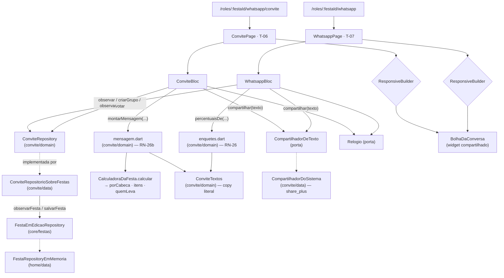
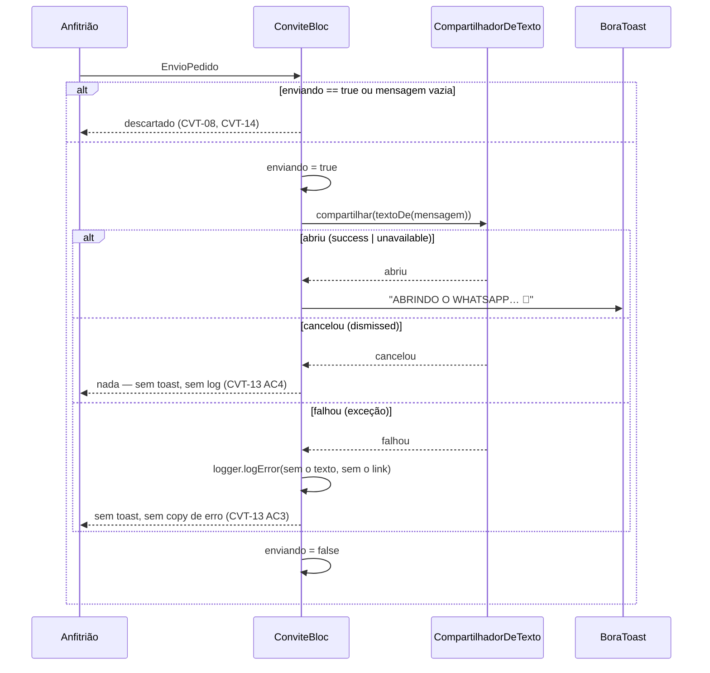

# O convite (mensagem, grupo e enquetes) — Design

**Spec:** `.specs/features/convite/spec.md` (CVT-01..CVT-37)
**Context:** `.specs/features/convite/context.md`
**Status:** Draft
**Decisões ativas herdadas:** AD-001..AD-028 · **AD-025** (grupo e enquete são estado do BORA — funda esta spec) · **AD-003** (a aba `whatsapp` já existe no shell) · **AD-016** (dado de festa em memória atrás de porta, `Stream`) · **AD-008** (entidades em `core/calculo/dominio/`) · **AD-005** (`AppLogger`) · **AD-009** (precisão: arredonda uma vez, na formatação) · **AD-011/AD-012** (tokens e tipografia) · **AD-014** (rota nova afirma o destino) · **AD-017** (guarda de sessão) · **AD-021** (`mocktail` só sobre SDK de terceiro) · **AD-022** (contadores são dado)
**Decisões propostas que esta spec consome:** **AD-029** (`core/festas/`, de `montar`) · **AD-030** (estado de lista nas entidades de `core/`, de `lista`) · **AD-031** (dado do link em `core/festas/`, regra de RN-22 em `features/galera/domain/permissoes.dart`, de `galera`)
**Decisão nova proposta:** **AD-032** — `share_plus` como canal único de saída de texto do produto, atrás da porta `CompartilhadorDeTexto`, com o mapeamento de `ShareResultStatus` fixado em um lugar só. Ver §12.
**Lições confirmadas:** `python .claude/skills/tlc-spec-driven/scripts/lessons.py list --status confirmed` → **`(no confirmed lessons)`**. Nada a aplicar por esse canal.

---

## 1. Pré-requisito bloqueante — leia antes de planejar tasks

**Esta spec não pode entrar em Execute antes de `montar` (05), `lista` (06) e `galera` (07).** Conferido no disco em 2026-08-28: `lib/features/convite/` tem hoje só o `ConvitePage` placeholder, e `lib/core/festas/` não existe.

| O que falta | Onde nasce | Por que esta spec para sem ele |
|---|---|---|
| `lib/core/festas/` — `FestaEmEdicao`, `FestaEmEdicaoRepository`, barrel | `montar` §6.1/§6.2 (**AD-029**) | É o registro onde o grupo e os votos vão morar (§2.2) |
| `FestaEmEdicao.convite` → `ConviteDaFesta.codigo` | `galera` §6.2 (**AD-031**) | **CVT-05**: o bloco LINK precisa do `rafa18`. Esta spec **lê**, nunca gera |
| `features/galera/domain/permissoes.dart` — `capacidadesDe`, `papelDoUsuario` | `galera` §6.3 | **CVT-35**: A-27 manda consumir a tabela de RN-22, não redefinir |
| `ComposicaoDaFesta.atribuicoes` → `ItemDeLista.quemLeva` | **não existe em spec nenhuma** | **CVT-04**. Ver o achado abaixo — é emenda desta spec (E-3) |

### O achado: "quem leva" não tem quem escreva, e nem quem carregue

O `context.md` §A-10 diz que as atribuições item→dono são "modeladas pela spec 06 e escritas pela 09". **A spec 06 não as modelou.** O `design.md` de `lista` §14 registra o oposto, em letras: *"`ItemDeLista.quemLeva` continua sem UI que o escreva (AD-018)"*.

E o problema é mais fundo que a falta de UI. Percorrido o caminho do dado no código real:

- `ItemDeLista.quemLeva` **existe** (`item_de_lista.dart:52`) e `contribuicoes.dart:40` já o consome para RN-20;
- `aplicarOverrides` o **preserva** (`overrides.dart:57`);
- **`CalculadoraDaFesta` nunca o preenche**, e `ComposicaoDaFesta` **não tem campo de onde ele viria**.

Logo, hoje, todo `ItemDeLista` que sai da calculadora tem `quemLeva == null`. O bloco LISTA de T-06 renderizaria **só** a linha vermelha e a linha de custo, para qualquer festa, sempre — e CVT-04 ("🥩 Carnes + pão de alho — **Rafa leva**") não teria como ser satisfeito nem com a fixture RN-30.

**Resolução:** a emenda **E-3** desta spec abre o canal (`ComposicaoDaFesta.atribuicoes`, aditivo, default vazio, preenchido por `CalculadoraDaFesta._itemDe`), na mesma forma da E-b de `lista` (`noCarrinho`). Quem **escreve** continua sendo a spec 09 (`EU LEVO`); esta spec só faz o dado poder existir e ser lido.

**Consequência para o plano:** `tasks.md` pode ser escrito agora. O Execute começa depois do merge de `galera`. Se `lista` for mergeada antes, E-3 é a única linha que pode conflitar com a E-b dela — as duas tocam `composicao_da_festa.dart` e `calculadora_da_festa.dart`, ambas de forma aditiva. Ver §11.

---

## 2. Abordagens consideradas

O `context.md` §Agent's Discretion deu ao Design liberdade sobre **a forma**, desde que o comportamento observável dos 37 critérios não mude. Cinco decisões estruturais; as três primeiras carregam a spec.

### 2.1 O invariante de UC-07 — como o preview e o texto enviado não podem divergir

É o aceite de UC-07 e o que o `context.md` manda o Design proteger: *"o texto enviado é exatamente o que o preview mostra"*. **CVT-12** afirma isso diretamente.

| # | Abordagem | Consequência |
|---|---|---|
| **A** | `String montarTexto(...)` para o canal; o widget do preview renderiza por conta própria | Duas implementações da mesma mensagem. Divergem no primeiro ajuste de copy, e **nenhum teste percebe**: o teste do texto passa, o do preview passa, e os dois discordam. Rejeitada |
| **B** ✅ | Uma função pura devolve um **modelo estruturado** — `MensagemDoConvite`, lista de `LinhaDaMensagem` tipadas. O preview **renderiza** as linhas; o canal **serializa** as mesmas linhas com `\n` | Uma fonte, duas projeções. A divergência deixa de ser possível por construção, e o guard de §13 a afirma percorrendo a árvore renderizada contra a string serializada |
| **C** | Montar a `String` e o preview exibi-la num `Text` só | O preview deixa de ser fiel: some a mini-arte escura do flyer, o vermelho da linha órfã e o sublinhado do link — que são **CVT-03, CVT-04 e CVT-05**. Rejeitada |

**Escolhida: B.** A `LinhaDaMensagem` carrega `texto` mais um `EnfaseDaLinha` (`normal`, `orfao`, `link`, `dono`, `arteTitulo`, `arteData`) — **estilo declarado como dado, resolvido para token só no widget**. Nenhuma cor entra no modelo: `presentation/` traduz `EnfaseDaLinha` → `BoraColors`, e o serializador **ignora** a ênfase inteira.

O negrito de "**Rafa leva**" e o sublinhado do link vivem na ênfase, não no texto — é o que faz a string serializada não carregar `**` nem markdown, que o WhatsApp não interpretaria.

### 2.2 Onde moram o grupo e os votos

A-03 pediu porta própria `ConviteRepository`, reativa, em memória no escopo da festa. Isso está mantido — a pergunta que sobra é **de onde ela lê e para onde escreve**.

| # | Abordagem | Consequência |
|---|---|---|
| **A** | Store privado em `features/convite/data/`, paralelo ao registro da festa | **Quebra CVT-21.** O chip precisa do "foi criado" **e** dos confirmados na mesma leitura; com duas fontes são dois streams, e combiná-los exige `rxdart` (dependência nova) ou um `StreamController` costurado à mão que pisca a contagem errada por um frame. Rejeitada |
| **B** ✅ | Porta em `features/convite/domain/`, **adaptador sobre `FestaEmEdicaoRepository`** em `features/convite/data/`; o grupo e os votos entram no registro da festa (E-2) | Um stream, uma emissão, contagem e existência sempre coerentes. CVT-21 vira consequência estrutural. É a mesma escolha que `galera` §2.1 fez, pelo mesmo motivo |
| **C** | Sem porta: os blocs falam direto com `FestaEmEdicaoRepository` | Espalha o *read-modify-write* por dois blocs e faz `presentation/` conhecer a porta de `core/`. Rejeitada pelo mesmo argumento de `galera` §2.1 C |

**Escolhida: B.** O que entra no registro da festa é **o mínimo**: o nome do grupo congelado e três votos. **O catálogo das enquetes de RN-26 — perguntas, opções e votos-base — não é dado da festa**: é constante de domínio em `features/convite/domain/`, Dart puro, testável sozinha. Pôr os votos-base no registro os faria migrar para o Firestore no M2 como se fossem dado de produção, quando A-02 os declara fixture de demo.

### 2.3 O canal — `share_plus`, e o que `ShareResultStatus` de fato significa

**Decidido pelo usuário em 2026-08-28: `share_plus`** (resolve `13.3.0` neste projeto, conferido por `flutter pub add --dry-run`). Alternativas descartadas: `url_launcher` + `wa.me` (não distingue cancelamento) e adaptador falso no molde da AD-024 (nada abriria de verdade).

**Correção factual que a escolha carrega, e que o desenho tem de absorver.** A recomendação foi feita afirmando que `success`/`dismissed`/`unavailable` dão os três estados que CVT-13 pede. Verificado na documentação depois de escolher, o mapeamento ingênuo está errado:

> `unavailable` — *"o platform não suporta identificar a ação do usuário"*. Resultado só é fornecido em **Android, iOS e macOS**. E *"qualquer chamada nova com uma pendente faz a anterior retornar `unavailable`"*.

Ou seja: **no web — metade deste produto — o retorno é sempre `unavailable`**, inclusive no caminho feliz. Mapear `unavailable → falhou` faria o toast "ABRINDO O WHATSAPP… 📲" **nunca aparecer no web** (CVT-11, CVT-32..CVT-34) e faria o `AppLogger` registrar falha em todo compartilhamento bem-sucedido de lá (CVT-36 ao contrário).

**O mapeamento correto, e o único que satisfaz os quatro critérios nas duas plataformas:**

| Retorno de `share_plus` | `ResultadoDoCompartilhamento` | Por quê |
|---|---|---|
| `success` | `abriu` | O canal confirmou a abertura — CVT-11 |
| `unavailable` | `abriu` | A chamada **completou sem exceção**: o texto foi entregue à plataforma, que só não sabe dizer o que veio depois. É o caminho feliz normal do web |
| `dismissed` | `cancelou` | Sem toast, sem log — CVT-13 AC4. Observável só onde a plataforma o reporta |
| **exceção** (`PlatformException`, `MissingPluginException`) | `falhou` | Sem toast, sem copy de erro, log sem o texto — CVT-13 AC3, CVT-36 |

**"O canal confirmou a abertura" passa a significar: a chamada retornou sem lançar.** É a única definição verificável nas duas plataformas, e mantém os quatro critérios verdadeiros. O que se perde está declarado em §14: no web, **cancelar é indistinguível de enviar** — o toast aparece de qualquer jeito. Nenhuma das três opções oferecidas evitava isso; é limite da plataforma, não do desenho.

### 2.4 Quantos blocs — dois

`ConviteBloc` (T-06) e `WhatsappBloc` (T-07). Duas rotas com ciclos de vida diferentes: T-07 é a aba, que o `indexedStack` mantém viva; T-06 é rota filha que abre e fecha. Um bloc só teria de viver num provider na rota pai e faria T-06 reconstruir estado de enquete que ela não usa.

**O que precisa sobreviver não está em nenhum dos dois** — grupo e votos moram no `ConviteRepository` (§2.2), que é exatamente o que A-03 e A-09 exigem e o que faz **CVT-20** e **CVT-27** serem verdade sem o bloc participar.

### 2.5 Os nomes das duas páginas, e a rota filha

A convenção do projeto é nome-de-página ≡ último segmento da rota (`ListaPage`↔`lista`, `GaleraPage`↔`galera`). Aplicada às duas telas, ela **inverte** o nome que hoje está no roteador:

| Tela | Rota | Página |
|---|---|---|
| **T-07** (grupo + enquetes) | `/roles/:festaId/whatsapp` | `WhatsappPage` — o `ConvitePage` placeholder de hoje é **renomeado** |
| **T-06** (a mensagem) | `/roles/:festaId/whatsapp/convite` | `ConvitePage` — o nome passa a valer para a rota que se chama `convite` |

```dart
GoRoute(
  path: 'whatsapp',
  builder: (context, state) => WhatsappPage(...),
  routes: [
    GoRoute(path: 'convite', builder: (context, state) => ConvitePage(...)),
  ],
),
```

Sub-rota dentro do mesmo `StatefulShellBranch` — é o que preserva a aba selecionada e o `indexedStack` (A-18). **Não esbarra na restrição do `go_router`** que a fundação documentou (`app_router.dart:24`): a proibição é sobre a rota **padrão** de um branch ter parâmetro, e `convite` é filha, não padrão, e não tem parâmetro. O voltar do header de T-06 é `context.pop()`.

---

## 3. Architecture Overview



**A regra que o diagrama desenha:** há **uma** função que monta a mensagem e **uma** que calcula percentual, as duas em `domain/` e as duas em Dart puro. Nenhuma seta de aritmética chega em `presentation/` — é o guard de §13. E há **uma** seta de escrita saindo da feature, para `ConviteRepository`, que resolve no mesmo registro que a Home e a calculadora leem.

---

## 4. Fronteira de arquivos e as emendas

A `spec.md` fechou a fronteira antes de haver desenho e antes de o achado de §1 aparecer. Cinco arquivos fora dela, declarados como emendas no molde da E-1 de `entrar` e das E-1..E-4 de `galera`.

| # | Arquivo | Por quê | Forma |
|---|---|---|---|
| **E-1** | `pubspec.yaml` — `share_plus: ^13.3.0` | §2.3, escolha do usuário. É a primeira dependência nova desde a fundação | Aditiva. Nenhuma versão existente muda (`--dry-run` conferido) |
| **E-2** | `lib/core/festas/dominio/festa_em_edicao.dart` (+ barrel) | §2.2. `FestaEmEdicao` ganha `grupo` e `votos` | **Aditiva**: dois campos com default (`null` e `const {}`), entrando em `==`/`hashCode`. Nenhuma assinatura muda |
| **E-3** | `lib/core/calculo/dominio/composicao_da_festa.dart` e `regras/calculadora_da_festa.dart` | O achado de §1: sem isto, `quemLeva` é sempre `null` e **CVT-04 não tem como passar**. Mesma forma da E-b de `lista` | **Aditiva**: `atribuicoes = const {}` na composição; `_itemDe` passa a preencher `quemLeva: composicao.atribuicoes[definicao.chave]`. **Nenhuma fórmula muda** — a proibição da `spec.md` sobre `core/calculo/**` é sobre aritmética de RN-xx, e é a leitura que `galera` E-3 já aplicou |
| **E-4** | `lib/core/routing/app_router.dart` + `routes.dart` | §2.5. Os `builder` de `whatsapp` montam `const ConvitePage()` e descartam o `festaId`; e a rota filha precisa existir | A rota filha, `Routes.mensagemDoConvite(festaId)`, e um parâmetro novo em `buildAppRouter` (`required ConviteRepository convite`) |
| **E-5** | `test/support/app_de_teste.dart` | `abrirApp` precisa aceitar a porta para os testes de rota montarem as telas | Parâmetro **opcional com default**, como o `festas:` da spec 04 |

**Continua intocado:** `lib/core/design_system/**`, `lib/core/calculo/regras/**` (exceto a linha aditiva de E-3), `lib/features/{home,entrar,montar,lista,galera,convidado,custos}/**` e **todo** teste existente. `lib/core/di/injector.dart` está na fronteira original ("só registro dos próprios"): registra `ConviteRepository` sobre `getIt<FestaEmEdicaoRepository>()` e o passa a `buildAppRouter`.

---

## 5. Code Reuse Analysis

### 5.1 De `core/calculo` — consumido inteiro, nada reimplementado

| O que | Onde | Uso aqui |
|---|---|---|
| `ResultadoDoCalculo.porCabeca` | `regras/calculadora_da_festa.dart:65` | **CVT-15**: é a estimativa por **pessoas** de RN-14, já pronta. A tela não divide nada |
| `MoneyFormatter.reais(num)` | `formatacao/money_formatter.dart:20` | **CVT-04/CVT-15**: RN-13 num lugar só. "💸 sai ~R$ 30 por cabeça" |
| `ItemDeLista.valor` / `.quemLeva` | `dominio/item_de_lista.dart:69/52` | A moeda da calculadora (D-1 de `lista`) e o dono. A tabela de RN-11 **não** entra |
| `Pessoa`, `StatusDePresenca` | `dominio/` | Os confirmados que viram membros (**CVT-17**) e avatares (**CVT-16**) |
| `Festa.nome/data/hora/local` | `dominio/festa.dart` | O flyer (**CVT-03**) e o nome do grupo (**CVT-18**) |

### 5.2 De `core/festas` e `features/galera` — o que a AD-031 entrega

| O que | Uso aqui |
|---|---|
| `ConviteDaFesta.codigo` | **CVT-05**, o `rafa18` do bloco LINK. Esta spec **lê**; quem gera é a 09 |
| `GaleraTextos.urlDoConvite(codigo)` | A **mesma** string que a Galera exibe e copia. Montar `bora.app/c/$codigo` aqui criaria uma segunda fonte do host |
| `capacidadesDe` / `papelDoUsuario` (`permissoes.dart`) | **CVT-35**. A tabela de RN-22 é consumida, nunca redefinida (A-27) |

### 5.3 De `core/design_system` — composto, nunca estendido

| Componente | Uso |
|---|---|
| `BoraPollOption` | **CVT-24/CVT-25/CVT-26**. Já recebe `fracao`, `percentualFormatado`, `contagemFormatada`, `meuVoto`, `onVotar` — **e DS-34 já proíbe que ele calcule**. Encaixe exato |
| `BoraSelectionChip` | Os três toggles de T-06 e os três de T-07 (**CVT-02**, **CVT-23**). Ativo = `selecionado` (fundo `ink`) |
| `BoraToast` + `BoraToastTexts` | **CVT-11/CVT-14/CVT-18/CVT-29/CVT-30**. Os quatro textos já existem literais (`abrindoWhatsapp`, `grupoCriado`, `enquetePostada`, `crieOGrupoPrimeiro`), e o "1 por vez" de RN-29 já é propriedade do componente |
| `BoraPrimaryButton` + `BoraPressSink` | Os dois CTAs. O desabilitado de **CVT-08**/**CVT-22** é `onPressed: null` — não afunda porque o sink não recebe gesto |
| `BoraAvatar` | Os avatares dos confirmados (**CVT-16**) |
| `BoraSurface` | A bolha: borda 2px, sombra dura 4px preta (**CVT-06**) |
| `BoraColors.waGreen` / `BoraShadows.hard` | O acento `#25D366` e a sombra verde do card (**A-20**) |

**Nada é estendido.** Se um componente não servir, a tela **compõe** — nunca subclassifica nem copia token (AD-011).

### 5.4 Padrões de código a repetir

- **Bloc acima do `ResponsiveBuilder`** (`home_page.dart:48`): cruzar 900px não pode destruir o bloc, senão **CVT-33** perde os blocos ativos e o voto.
- **Porta de plataforma com default `const`** (`galera` §7.3): `CompartilhadorDeTexto` e `Relogio` chegam à página por parâmetro com default; o repositório, que tem estado, vem do roteador.
- **`==`/`hashCode` à mão e igualdade profunda** (`home_state.dart`, L-011): sem isso o `emit` não descarta emissão repetida e o preview reconstrói a cada eco do stream.
- **Teste de rota que afirma o destino** (AD-014): as duas rotas novas afirmam página presente pela `pageKey`.

---

## 6. Data Models

### 6.1 `GrupoDoRole` — `core/festas/dominio/` (E-2)

```dart
/// O grupo de RN-25 — estado do BORA, nunca objeto do WhatsApp (AD-025).
///
/// Guarda **só** o que a criação congela. Os membros **não** estão aqui:
/// A-04 os define como o conjunto de confirmados **no instante da leitura**,
/// e gravá-los faria o grupo nascer desatualizado sem UI que o conserte.
class GrupoDoRole {
  const GrupoDoRole({required this.nome});

  /// O nome da festa **como gravado**, congelado na criação (A-13, D-1).
  /// Renomear a festa depois não renomeia o grupo.
  final String nome;
}
```

`FestaEmEdicao` ganha `final GrupoDoRole? grupo` (default `null` = não existe) e `final Map<ModeloDeEnquete, int> votos` (default `const {}`). **A existência do grupo é o `null`** — nenhum booleano separado que possa discordar do nome.

### 6.2 O catálogo de RN-26 — `features/convite/domain/enquetes.dart`, Dart puro

```dart
enum ModeloDeEnquete { horario, data, oQueLevar }

class ModeloDeEnqueteDefinicao {
  final String pergunta;              // 'QUE HORAS COMEÇA?'
  final List<OpcaoDeEnquete> opcoes;  // rótulo + votos-base
}

class OpcaoDeEnquete {
  final String rotulo;      // '14h'
  final int votosBase;      // 5 — fixture de demo (A-02), sem votante
}

/// RN-26, literal. Os votos-base são **fixture de demo** (A-02/D-3): eles
/// somam 8, 8 e 4 votantes, contra os 4 confirmados de RN-30 — e não existe
/// tela na spec-fonte onde essas pessoas votariam.
const Map<ModeloDeEnquete, ModeloDeEnqueteDefinicao> catalogoDeEnquetes = {...};
```

**Fica na feature e não em `core/calculo`** porque o barrel da camada declara o recorte em letras: *"RN-25, RN-26, RN-26b → `convite`"* (`calculo.dart:5`). Dart puro mesmo assim — sem `package:flutter` —, para o teste de RN-26 rodar sem árvore de widgets.

### 6.3 `ResultadoDaEnquete` — a aritmética de RN-26, num lugar só

```dart
/// `% = round(votos/total×100)` — RN-26, aplicado por opção.
///
/// **101% é resultado correto** e não se normaliza (D-7): com 5/2/1 sobre 8,
/// 62,5→63 · 25→25 · 12,5→13. UC-18 escreve "~100%" justamente por isso.
class LinhaDaEnquete {
  final String rotulo;
  final int votos;            // base + 1 se for o voto do usuário
  final int percentual;       // round(votos / total * 100)
  final double fracao;        // votos / total — para a barra do componente
  final bool meuVoto;
  String get percentualFormatado;   // '63%'
  String get contagemFormatada;     // '5 votos' / '1 voto' (plural, A-14)
}

List<LinhaDaEnquete> linhasDaEnquete(ModeloDeEnquete modelo, int? votoDoUsuario);
```

O voto do usuário é **o índice da opção**, `null` = ainda não votou. **Trocar move o +1** e tocar a já votada é no-op (**CVT-26**) — as duas propriedades caem de graça de "o estado é um índice", em vez de virarem `if` no bloc.

### 6.4 `MensagemDoConvite` — `features/convite/domain/mensagem.dart` (§2.1)

```dart
enum BlocoDaMensagem { flyer, lista, link }   // a ordem do enum É a ordem no texto

enum EnfaseDaLinha { arteTitulo, arteData, normal, dono, orfao, link, custo }

class LinhaDaMensagem {
  final String texto;
  final EnfaseDaLinha enfase;   // estilo como **dado**; cor só no widget
}

class MensagemDoConvite {
  final List<LinhaDaMensagem> linhas;
  bool get vazia => linhas.isEmpty;          // CVT-08
}

/// RN-26b. Blocos aditivos, ordem fixa FLYER → LISTA → LINK (A-15).
MensagemDoConvite montarMensagem({
  required Festa festa,
  required List<ItemDeLista> itens,
  required double porCabeca,
  required String codigo,
  required Set<BlocoDaMensagem> ativos,
});

/// A projeção de texto — a **única** (CVT-12). Ignora a ênfase.
String textoDe(MensagemDoConvite m) => m.linhas.map((l) => l.texto).join('\n');
```

**O bloco LISTA, linha a linha** (A-10, A-11, A-12):

| Linha | Formato | Quando |
|---|---|---|
| dono | `{emoji} {itens juntados por " + "} — {Nome} leva` | uma por dono, só se houver item com dono |
| órfã | `{emoji} {itens juntados por " · "} — quem leva?` | **uma só**, com todos os sem-dono, só se houver |
| custo | `💸 sai ~{MoneyFormatter.reais(porCabeca)} por cabeça` | **sempre** que o bloco está ativo, inclusive "R$ 0" |

Os **dois separadores são preservados literalmente** (D-5): `" + "` soma o que alguém assumiu, `" · "` enumera o que ninguém assumiu. Ordem das linhas de dono e dos órfãos: **ordem do repositório**, nunca reordenada (precedente `galera` A-15).

### 6.5 Os dois estados

```dart
class ConviteState {           // T-06
  final SituacaoDaTela situacao;              // carregando · pronta · falhou
  final Set<BlocoDaMensagem> ativos;          // nasce com os três (A-15)
  final MensagemDoConvite mensagem;
  final String? nomeDoGrupo;                  // sub do header só quando existe (CVT-01)
  final String horaCongelada;                 // '14:02' — lida uma vez (CVT-10)
  final bool enviando;                        // guarda de reentrância (CVT-14)
}

class WhatsappState {          // T-07
  final SituacaoDaTela situacao;
  final List<Pessoa> confirmados;             // avatares + contagem (CVT-16)
  final String? nomeDoGrupo;                  // null = botão; não-null = chip (CVT-18/19)
  final ModeloDeEnquete modelo;               // exclusivo, nasce em horario (A-15)
  final Map<ModeloDeEnquete, int> votos;      // três votos independentes (CVT-27)
  final String horaCongelada;                 // '14:05'
  final bool postando;
  List<LinhaDaEnquete> get linhas;            // derivado, nunca guardado
}
```

`linhas` é **getter derivado** de propósito: guardar as linhas calculadas abriria a porta para o estado ficar velho em relação ao voto. Igualdade profunda à mão nos dois (L-011).

---

## 7. Components

### 7.1 `ConviteRepository` — porta, `features/convite/domain/`

```dart
abstract class ConviteRepository {
  /// A festa inteira, ao vivo — é o que faz CVT-21 e CVT-28 caírem de graça.
  Stream<FestaEmEdicao> observar(String festaId);

  /// RN-25. **Idempotente** (CVT-19): com grupo já criado, não faz nada e
  /// devolve `false` — o chamador sabe que não deve reemitir o toast.
  Future<bool> criarGrupo(String festaId);

  /// RN-26. Grava o índice; trocar move, repetir é no-op (CVT-26).
  Future<void> votar(String festaId, ModeloDeEnquete modelo, int opcao);
}
```

`ConviteRepositorioSobreFestas` (`data/`): *read-modify-write* sobre `FestaEmEdicaoRepository`, usando `copyWith` — **nunca** reconstruindo `FestaEmEdicao` campo a campo, que apagaria em silêncio o `despesas` de `lista` E-c e o `convite` de `galera` E-1. É a lição literal da E-3 de `galera`.

### 7.2 `CompartilhadorDeTexto` — porta + adaptador (§2.3)

```dart
// domain/ — Dart puro
enum ResultadoDoCompartilhamento { abriu, cancelou, falhou }

abstract class CompartilhadorDeTexto {
  Future<ResultadoDoCompartilhamento> compartilhar(String texto);
}

// data/ — o único arquivo da feature que importa share_plus
class CompartilhadorDoSistema implements CompartilhadorDeTexto {
  Future<ResultadoDoCompartilhamento> compartilhar(String texto) async {
    try {
      final r = await SharePlus.instance.share(ShareParams(text: texto));
      return switch (r.status) {
        ShareResultStatus.dismissed => ResultadoDoCompartilhamento.cancelou,
        // `unavailable` é "a plataforma não sabe dizer" — no web é o caminho
        // feliz normal. Ver §2.3: mapear para `falhou` mataria o toast lá.
        _ => ResultadoDoCompartilhamento.abriu,
      };
    } on Exception {
      return ResultadoDoCompartilhamento.falhou;
    }
  }
}
```

**Sem fallback de canal, sem retry, sem fila** (A-08). O `try/catch` é `on Exception` e não `catch (_)`: `Error` é bug nosso e deve subir.

### 7.3 `Relogio` — porta, `features/convite/domain/`

```dart
abstract class Relogio { DateTime get agora; }
class RelogioDoSistema implements Relogio { DateTime get agora => DateTime.now(); }

/// `HH:mm`, 24h, sem `intl` (dependência nova por uma linha não se paga).
String horaFormatada(DateTime t);
```

Lida **uma vez**, na construção do bloc, e guardada em `horaCongelada` (**CVT-10**): não muda a cada toggle. Os testes injetam 14:02 e 14:05 e reproduzem os literais de T-06/T-07.

### 7.4 Os dois blocs

**`ConviteBloc`** — eventos `BlocoAlternado`, `EnvioPedido`, `FestaRecebida`, `ObservacaoFalhou`.
`BlocoAlternado` com o bloco já no estado desejado **não emite** (CVT-07). `EnvioPedido` com `enviando == true` é descartado no primeiro `if` (CVT-14) — e isso também evita a chamada concorrente que faria `share_plus` devolver `unavailable` para a primeira. Com `mensagem.vazia`, o CTA já está desabilitado, e o handler ainda assim não chama a porta (CVT-08, defesa em profundidade).

**`WhatsappBloc`** — `ModeloSelecionado`, `VotoDado`, `GrupoPedido`, `PostagemPedida`, `FestaRecebida`, `ObservacaoFalhou`.
`GrupoPedido` sem confirmado nenhum não chama a porta (CVT-22). `PostagemPedida` **sem grupo** emite só o toast da trava e **não toca no compartilhador** (CVT-30) — a guarda vem **antes** de montar o texto, porque CVT-30 exige que nem o texto seja montado.

Nenhum dos dois navega (AD-020 vale igual): quem chama `context.pop()` é a página.

### 7.5 As páginas e os widgets

| Widget | Papel | Critérios |
|---|---|---|
| `ConvitePage` / `WhatsappPage` | Provider + `ResponsiveBuilder`; navegação e toast | CVT-01, CVT-16, CVT-33 |
| `BolhaDaConversa` | O fundo `#E7DFCB`, a bolha branca ≤300px alinhada à direita, hora + ✓✓, legenda. **Compartilhada pelas duas telas** | CVT-06, CVT-09, CVT-10, CVT-28 |
| `LinhasDaMensagem` | Traduz `EnfaseDaLinha` → token e renderiza | CVT-03, CVT-04, CVT-05 |
| `CardDoGrupo` | Título, avatares, linha derivada, botão ⇄ chip | CVT-16..CVT-22 |
| `SeletorDeBlocos` / `SeletorDeModelos` | Os dois grupos de `BoraSelectionChip` — aditivo e exclusivo | CVT-02, CVT-07, CVT-23 |

A bolha é **um** widget para as duas telas porque CVT-06 e CVT-28 descrevem a mesma moldura; duas cópias divergiriam na primeira mudança de token.

---

## 8. Fluxos que valem um diagrama

### 8.1 O envio, e por que o toast vem depois (CVT-11, CVT-13)



**A promessa nunca aparece sem o fato:** o toast é emitido no `await`, nunca antes dele.

### 8.2 O grupo e a contagem que sobe sem o chip voltar a ser botão (CVT-19, CVT-21)

A máquina tem **dois estados e uma aresta**: `grupo == null` → `grupo != null`, sem volta. A contagem de membros **não é estado** — é `confirmados.length` lido a cada emissão. Logo:

- alguém confirma depois → nova emissão → `· 4 membros` vira `· 5 membros`, e `grupo` não foi tocado, então o chip continua chip;
- um segundo toque em CRIAR GRUPO → `criarGrupo` devolve `false` → sem toast novo, sem escrita;
- sair da aba e voltar → o `indexedStack` mantém, e mesmo um rebuild total relê do repositório (CVT-20).

Nenhuma das três propriedades precisa de código próprio: as três são consequência de "os membros são derivados, o grupo é um `null` que deixou de ser".

### 8.3 A trava sem grupo (CVT-30)

```
PostagemPedida
  └─ grupo == null ?
       ├─ sim → toast "CRIE O GRUPO PRIMEIRO ☝️" · FIM
       │        (não monta texto · não chama a porta · não escreve nada)
       └─ não → texto = textoDaEnquete(modelo, votos) → compartilhar → §8.1
```

A guarda vem **antes** da montagem porque o Independent Test da P2-3 afirma **zero chamadas** à porta — e um teste que só afirma o toast passaria com o texto sendo montado à toa.

---

## 9. Copy — literal, e num arquivo só

`features/convite/domain/convite_textos.dart`, Dart puro. **Nenhuma string de tela vive dentro de widget** — é o que torna a copy literal verificável por teste e o que impede a paráfrase (regra do CLAUDE.md).

| Constante | Valor literal | Fonte |
|---|---|---|
| `tituloMandarNoGrupo` | `MANDAR NO GRUPO` | T-06 |
| `subGrupo(nome)` | `GRUPO: {nome}` | T-06, só quando existe (CVT-01) |
| `noPacote` | `NO PACOTE` | T-06 |
| `blocoFlyer` / `blocoLista` / `blocoLink` | `FLYER` · `LISTA` · `LINK DO CONVITE` | T-06 |
| `legendaDaBolha` | `é assim que chega no grupo — mexa nos blocos acima` | T-06 |
| `ctaEnviar` | `ENVIAR NO WHATSAPP →` | T-06 (o segundo CTA fica fora — D-4) |
| `linkDoConvite` | `confirma e escolhe o que levar 👆` | T-06 |
| `quemLeva` | `quem leva?` | T-06 |
| `porCabeca(v)` | `💸 sai ~{v} por cabeça` | T-06 |
| `tituloWhatsapp` / `subWhatsapp` | `WHATSAPP` · `grupo do rolê + enquetes num toque` | T-07 |
| `criarGrupoDoRole` | `💬 CRIAR GRUPO DO ROLÊ` | T-07 |
| `botaoCriarGrupo(nome)` | `CRIAR GRUPO "{nome}"` | T-07 |
| `chipDoGrupo(nome, n)` | `✅ "{nome}" · {n} membros` / `· 1 membro` | **RN-25** (template vence T-07 — D-1, A-13) |
| `confirmadosEntram(n)` | `{n} confirmados entram no grupo` / `1 confirmado entra no grupo` | T-07, derivado (A-14) |
| `enquetesProGrupo` | `ENQUETES PRO GRUPO` | T-07 |
| `modeloHorario/Data/OQueLevar` | `HORÁRIO` · `DATA` · `O QUE LEVAR` | T-07 |
| `cabecalhoDaEnquete` | `📊 ENQUETE · você` | T-07 |
| `legendaDaEnquete` | `toque numa opção pra votar 👆` | T-07 |
| `ctaPostar` | `POSTAR ENQUETE NO GRUPO 📲` | T-07 |

Os quatro toasts **não** são redeclarados: vêm de `BoraToastTexts.{abrindoWhatsapp, grupoCriado, enquetePostada, crieOGrupoPrimeiro}`, que a spec 01 já entregou literais. Redigitá-los criaria uma segunda fonte de RN-29.

**O texto da enquete postada** (A-17): pergunta em CAIXA ALTA numa linha, depois uma linha por opção com rótulo literal e `%` atual. **Sem link, sem assinatura, sem nome do grupo.**

---

## 10. Error Handling Strategy

| Cenário | Tratamento | O que o usuário vê |
|---|---|---|
| Canal cancelado (`dismissed`) | Nada. **Não é falha** | Tela intacta, sem toast (CVT-13 AC4) |
| Canal falhou (exceção) | `logger.logError` **sem o texto e sem o link** | Sem toast, **sem copy de erro inventada**; blocos e preview intactos (CVT-13 AC3, CVT-36) |
| Postar sem grupo | Toast da trava; nenhuma chamada de porta; registro no `AppLogger` | `CRIE O GRUPO PRIMEIRO ☝️` (CVT-30, CVT-36) |
| `observar` emite erro | `SituacaoDaTela.falhou` + `logError` | Estado de erro visível, **nunca tela branca nem dado parcial**; o caminho adiante continua visível (CVT-37, precedente `galera` GAL-25) |
| Criar grupo sem confirmado | Botão desabilitado; o handler também não chama a porta | Linha `0 confirmados entram no grupo`, sem copy nova (CVT-22) |
| Duplo toque em CRIAR / ENVIAR / POSTAR | `criarGrupo` idempotente; `enviando`/`postando` descartam o segundo | Um toast por vez (CVT-14, CVT-19, A-22) |

**Por que o log nunca leva o texto:** a mensagem montada carrega o link privado da festa e os nomes da galera (CVT-36). O que vai para o `AppLogger` é o evento e o tipo do erro.

---

## 11. Risks & Concerns

| Concern | Local | Impacto | Mitigação |
|---|---|---|---|
| **`quemLeva` sem produtor** — a calculadora nunca o preenche | `calculadora_da_festa.dart`, `composicao_da_festa.dart:23` | **CVT-04 impossível de satisfazer**; o bloco LISTA renderizaria só a linha órfã, sempre | Emenda **E-3** (§1, §4). O `tasks.md` põe E-3 na **primeira** task, antes de qualquer widget |
| **Três specs emendam `festa_em_edicao.dart`** (`galera` E-1, `lista` E-c, esta E-2) | `core/festas/dominio/` | Merge conflita; pior, um *read-modify-write* que reconstrói o objeto **apaga campo alheio em silêncio** | Todas as três emendas são aditivas com default, e o adaptador (§7.1) usa **só `copyWith`**. Teste: gravar o grupo preserva `despesas` e `convite` |
| **`lista` E-b e esta E-3 tocam os mesmos dois arquivos** | `composicao_da_festa.dart`, `calculadora_da_festa.dart` | Conflito textual no merge | Aditivas e em linhas diferentes (`noCarrinho` × `atribuicoes`). Quem mergear por último resolve; nenhuma fórmula muda nas duas |
| **`share_plus` no web cai para *download*** quando não há Web Share API | `CompartilhadorDoSistema` | Navegador sem suporte baixa um arquivo em vez de compartilhar — comportamento que nenhuma tela desenha | Declarado em §14. A porta isola: trocar por `wa.me` no web é um `if` num arquivo, sem tocar bloc, widget ou teste |
| **Copy que promete efeito que não ocorre** (AD-025) | `convite_textos.dart` | "GRUPO CRIADO NO WHATSAPP ✅" descreve grupo que não existe lá | **Trade-off já aceito e registrado** (A-01, D-2). O `STATE.md` registra que o produto não vai a público com estas telas sem revisitar a AD-025 |
| **Primeira dependência nova desde a fundação** | `pubspec.yaml` | `share_plus` arrasta `url_launcher_*`, `win32`, `uuid` — 34 dependências no grafo | Conferido por `--dry-run`: nenhuma versão existente muda. Task própria, commit próprio, `flutter analyze` + suíte inteira no gate |
| **Votos-base contradizem a festa** (8 votantes × 4 confirmados) | `enquetes.dart` | Alguém "conserta" a fixture adiante e quebra os literais de RN-26 | D-3 e A-02 declaram; o doc comment do catálogo repete o porquê no código |

---

## 12. Tech Decisions

| Decisão | Escolha | Racional |
|---|---|---|
| Projeção do preview e do texto | Modelo estruturado, duas projeções (§2.1) | É o único desenho em que a divergência de CVT-12 é **impossível**, não só improvável |
| Estilo no modelo | `EnfaseDaLinha`, resolvido para token só no widget | Mantém `domain/` sem `package:flutter` e o serializador sem markdown |
| Onde moram grupo e votos | No registro da festa, atrás de `ConviteRepository` (§2.2) | Um stream ⇒ CVT-21 sem combinar streams e sem `rxdart` |
| Onde mora o catálogo de RN-26 | `features/convite/domain/`, não `core/calculo` | O barrel da camada declara o recorte: RN-25/26/26b são desta feature |
| Voto = índice da opção | `int?` por modelo | "Trocar move, repetir é no-op, nunca desvota" cai de graça |
| Hora | Porta `Relogio`, congelada na construção do bloc | CVT-10 e determinismo do teste; sem `intl` |
| `HH:mm` à mão | `padLeft` | Uma dependência por uma linha de formatação não se paga |
| Nomes das páginas | `WhatsappPage` (aba) e `ConvitePage` (rota `convite`) | Convenção nome ≡ rota, já vigente em cinco telas |

### AD proposta — **AD-032** (a registrar em `.specs/STATE.md` na primeira task do Execute)

> **Decisão:** O produto ganha **um canal único de saída de texto**: `share_plus`, atrás da porta `CompartilhadorDeTexto` (`features/convite/domain/`), com **um** adaptador (`features/convite/data/`) e **um** mapeamento de `ShareResultStatus` — `success` e `unavailable` → `abriu`; `dismissed` → `cancelou`; **exceção** → `falhou`. "O canal confirmou a abertura" significa **a chamada retornou sem lançar**, e o toast de sucesso é emitido só depois disso. Sem fallback de canal, sem retry, sem fila.
>
> **Reason:** `unavailable` **não é falha** — é "a plataforma não sabe dizer", e é o retorno normal do **web**, onde `share_plus` só reporta resultado em Android/iOS/macOS. Mapeá-lo para falha mataria o toast de RN-29 em metade das plataformas e encheria o `AppLogger` de falsas falhas. A AD-028 já prevê o mesmo canal para "COBRAR PENDENTES NO PIX 📲" e "LEMBRAR TODO MUNDO 📲" na spec 10: fixar o mapeamento uma vez impede que cada spec improvise o seu.
>
> **Trade-off:** No **web**, cancelar é indistinguível de enviar — o toast aparece nos dois casos. É limite da plataforma (nenhuma das três alternativas avaliadas o evitava), não do desenho, e está declarado em §14. E o produto passa a ter uma dependência nativa, a primeira desde a fundação.
>
> **Scope:** spec 08 `convite` agora; herdado pela spec 10 `custos` (AD-028) e por qualquer tela futura que mande texto para fora.
> **Date:** 2026-08-28 · **Status:** active

---

## 13. O guard de CVT-15 e CVT-25 — a fórmula não vaza

O CLAUDE.md é literal: *"Nunca duplique uma fórmula em componente de UI"*. Esta feature tem **duas** aritméticas — o "por cabeça" (RN-14) e o percentual da enquete (RN-26) —, e as duas moram fora de `presentation/`:

- **por cabeça**: `ResultadoDoCalculo.porCabeca`, formatado por `MoneyFormatter.reais`. A feature **não divide nada**;
- **percentual**: `linhasDaEnquete` em `features/convite/domain/`, Dart puro, porque RN-26 é domínio desta feature e não de `core/calculo` (§6.2).

**Teste de varredura**, no molde do `token_purity_guard_test.dart` do design system e do guard de `galera` GAL-15: nenhum arquivo de `lib/features/convite/presentation/**` pode conter `/`, `*`, `round(`, `toStringAsFixed` ou `%` em contexto aritmético.

**Duas propriedades que o guard precisa ter, e que a lição do DS ensinou por mutação:**

1. **teste anti-vácuo** — um caso que prova que a varredura acha alguma coisa; senão ela passa por estar vazia;
2. **normalizar o separador de path** (`\` × `/`) antes de comparar, que foi o bug real que deixou a suíte do DS vermelha só no Windows (`179bab0`).

E o guard de Dart puro se estende: `features/convite/domain/**` não importa `package:flutter`, `package:share_plus` nem `firebase` — é o que deixa RN-26 e RN-26b testáveis sem árvore de widgets.

---

## 14. Desvios e lacunas declarados

- **`unavailable` tratado como sucesso.** No web, e no Windows, **cancelar o compartilhamento produz o toast "ABRINDO O WHATSAPP… 📲"**. CVT-13 AC4 é observável no adaptador real só em Android/iOS/macOS; nas demais plataformas o critério é coberto **pela porta**, com duplo devolvendo `cancelou`. Limite da plataforma, declarado, não escondido (§2.3, AD-032).
- **`share_plus` no web sem Web Share API baixa um arquivo.** Nenhuma tela desenha isso. A porta isola a troca.
- **`contagemFormatada` da enquete** ("5 votos") aparece porque `BoraPollOption` a exige e T-07 delega ao componente do DS §5. T-07 não a escreve explicitamente — é derivação com plural correto, no precedente de A-14.
- **`ConvitePage` muda de significado.** Hoje é o placeholder da aba `whatsapp`; passa a ser T-06. Quem procurar por "a aba do WhatsApp" no git história vai achar o nome antigo.
- **A E-3 abre um canal que ninguém ainda escreve.** `ComposicaoDaFesta.atribuicoes` nasce vazio e só a spec 09 o preenche. Até lá, o bloco LISTA renderiza a linha órfã e a de custo — que é o comportamento correto de A-12, não um buraco. Os testes de CVT-04 semeiam atribuições na fixture.
- **Não implementado de propósito:** o CTA "ENVIAR E VER O LADO DO CONVIDADO →" (D-4/A-19), botão para "CONVITE COPIADO 📋" e "LISTA NO GRUPO 📲" (A-26), revestir o `FestaTabsShell` (A-24, é da spec 06), e o convidado votando (Deferred).

---

## 15. Mapa requisito → componente

| ID | Componente / arquivo | Como se prova |
|---|---|---|
| CVT-01 | `ConvitePage` + `ConviteTextos.subGrupo` | Header com voltar e título; sub presente **só** com grupo criado |
| CVT-02 | `SeletorDeBlocos` + `ConviteState.ativos` | Três `BoraSelectionChip`, os três `selecionado` na abertura |
| CVT-03 | `montarMensagem` (bloco flyer) | Duas linhas da arte + linha `SÁB · 18 JUL · 14H · LAJE DO RAFA` derivada da festa |
| CVT-04 | `montarMensagem` (bloco lista) + **E-3** | Linha de dono com `" + "`, **uma** órfã com `" · "`, linha de custo por RN-13 |
| CVT-05 | `montarMensagem` (bloco link) + `GaleraTextos.urlDoConvite` | `bora.app/c/rafa18` com `EnfaseDaLinha.link` + a frase literal |
| CVT-06 | `BolhaDaConversa` | Fundo `#E7DFCB`, `BoraSurface` 2px/4px, `maxWidth: 300`, alinhada à direita, hora + ✓✓, legenda |
| CVT-07 | `ConviteBloc.BlocoAlternado` | As 8 combinações; toggle já ativo **não emite** estado novo |
| CVT-08 | `MensagemDoConvite.vazia` + `onPressed: null` | Bolha ausente da árvore; CTA não afunda, porta com **zero** chamadas |
| CVT-09 | `BolhaDaConversa` | Texto longo: sem `TextOverflow.ellipsis`, sem scroll horizontal, altura cresce |
| CVT-10 | `Relogio` + `horaCongelada` | Relógio em 14:02 → `14:02 ✓✓`; alternar blocos não muda a hora |
| CVT-11 | `ConviteBloc.EnvioPedido` → §8.1 | Toast emitido **após** o `await`, nunca antes |
| CVT-12 | `textoDe` + guard de §13 | As linhas da árvore renderizada == as linhas da string, nas 8 combinações |
| CVT-13 | `CompartilhadorDeTexto` (duplo) | `cancelou` → nada; `falhou` → log sem o texto, sem toast, sem copy de erro |
| CVT-14 | `ConviteState.enviando` + `BoraToast` | Duplo toque: uma chamada, um toast |
| CVT-15 | `ResultadoDoCalculo.porCabeca` + guard §13 | Valor vem pronto; varredura não acha aritmética em `presentation/` |
| CVT-16 | `WhatsappPage` + `CardDoGrupo` | Header, título, avatares **só** dos confirmados, linha derivada, botão com o nome |
| CVT-17 | `ConviteRepository.criarGrupo` | Membros == confirmados; nenhum pendente, nenhum extra, nenhuma criança |
| CVT-18 | `ConviteTextos.chipDoGrupo` + `BoraToastTexts.grupoCriado` | `✅ "CHURRAS DO RAFA 🔥" · 4 membros` + toast |
| CVT-19 | `criarGrupo` idempotente (§8.2) | Segunda chamada devolve `false`: sem toast, sem alteração; botão nunca reaparece |
| CVT-20 | `ConviteRepositorioSobreFestas` | Sair da aba, navegar, voltar e rebuild: chip permanece |
| CVT-21 | Membros derivados (§8.2) | Emissão nova com 5 confirmados → `· 5 membros`, chip continua chip |
| CVT-22 | `CardDoGrupo` + guarda no handler | `0 confirmados entram no grupo`, sem avatares, botão inerte |
| CVT-23 | `SeletorDeModelos` | Três chips **exclusivos**, `horario` ativo na abertura |
| CVT-24 | `catalogoDeEnquetes` + `linhasDaEnquete` | Os três modelos com os literais de RN-26 e 63/25/13 · 75/25 · 75/25 |
| CVT-25 | `linhasDaEnquete` | Votar em 14h → 6/2/1 → **67/22/11**; soma exibida 100 ou 101 (D-7) |
| CVT-26 | Voto como índice | Trocar move o +1; tocar a votada é no-op; total sobe **1** sobre a base |
| CVT-27 | `FestaEmEdicao.votos` (três independentes) | Votar em HORÁRIO, ir a DATA, votar, voltar: os dois preservados |
| CVT-28 | `BolhaDaConversa` + `BoraPollOption` | `📊 ENQUETE · você`, pergunta, opções, `14:05 ✓✓`, legenda; emissão remota preserva modelo e voto |
| CVT-29 | `WhatsappBloc.PostagemPedida` | String entregue: pergunta em caixa alta + uma linha por opção com `%`; sem link, sem assinatura |
| CVT-30 | Guarda **antes** da montagem (§8.3) | Toast da trava + **zero** chamadas à porta |
| CVT-31 | Mesmo contrato de CVT-13 | Falha e cancelamento ao postar: voto e modelo intactos |
| CVT-32 | `ResponsiveBuilder` + `maxWidth` | ≥900px: coluna ≤560px, bolha ≤300px |
| CVT-33 | Layout expandido/compacto | Sem rodapé fixo no expandido; volta abaixo de 900; sem overflow; título W-R5 |
| CVT-34 | Estado no repositório | Mesmo grupo e mesmo voto nas duas larguras (W-R1) |
| CVT-35 | `permissoes.dart` (consumido) | ANFITRIÃO/CO-ANFITRIÃO alcançam; CONVIDADO/SÓ VÊ não |
| CVT-36 | `AppLogger` (AD-005) | Falha de canal, de repositório e trava logadas **sem** texto e **sem** link; cancelamento **não** loga |
| CVT-37 | `SituacaoDaTela.falhou` + rotas | Estado de erro visível; as duas rotas renderizam abertas direto |

**Cobertura: 37 de 37, zero órfãos.** Nenhum requisito depende de componente que este design não nomeie.
