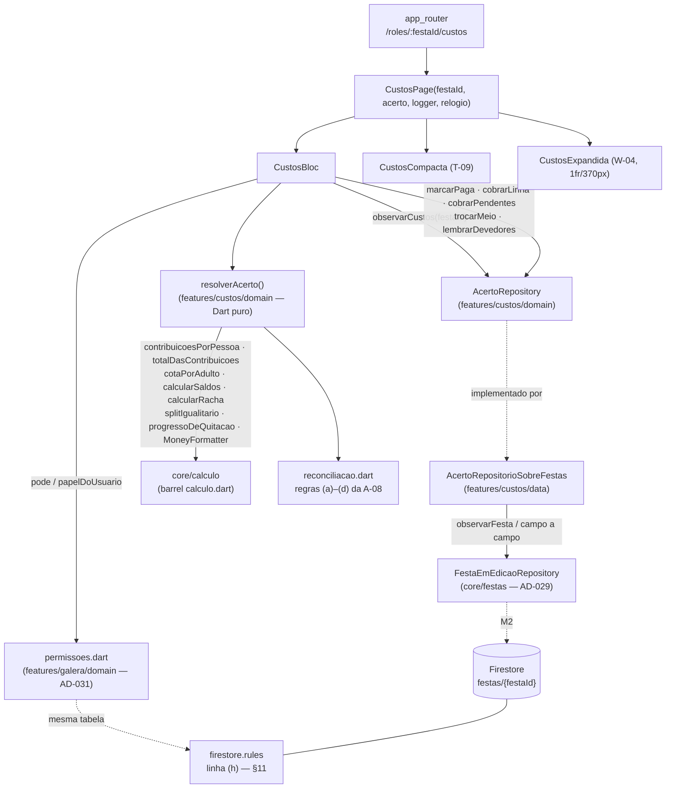
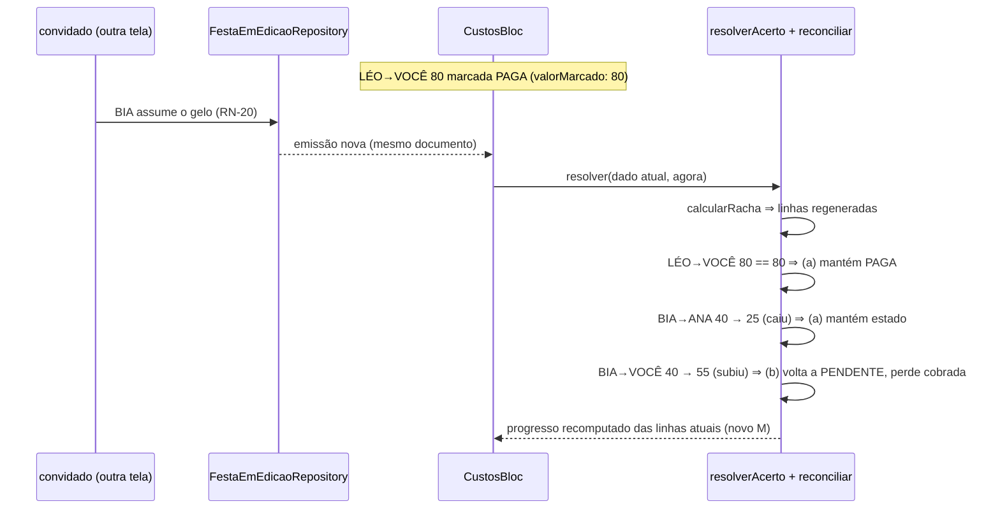
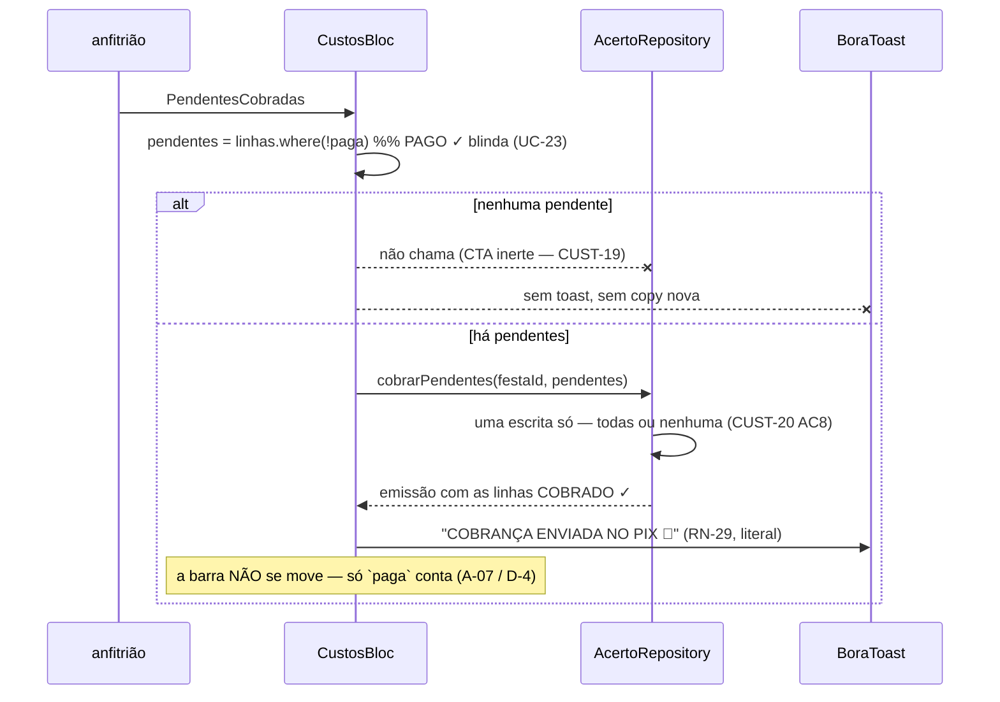

# Custos & acerto — Design

**Spec**: `.specs/features/custos/spec.md` · **Context**: `.specs/features/custos/context.md`
**Status**: Draft
**Requisitos cobertos**: CUST-01..CUST-37 (§16)

**Decisões ativas herdadas:** AD-001..AD-028 · **AD-027 e AD-028 fundam a spec** · **AD-029** (`core/festas`, a porta de escrita da festa) · **AD-030** (estado de festa mora nas entidades de `core/`, nunca na feature) · **AD-031** (`permissoes.dart` é a única tradução cliente de RN-22) · **AD-033** (um documento por festa; escrita de `pessoas`/`papeis`/contadores só pela Function) · **AD-009** (dinheiro arredonda uma vez, na formatação) · **AD-008** (entidades de cálculo em `core/calculo/dominio/`) · **AD-003** (a aba já existe em `/roles/:festaId/custos`) · **AD-026** (o acerto não expira) · **AD-005** (`AppLogger`) · **AD-011/AD-012** (tokens e tipografia) · **AD-021** (`mocktail` só sobre SDK de terceiro)

**Decisões novas propostas:** **AD-035** — o estado do acerto (meio de pagamento + marcação por par, com o valor no instante da marcação) mora em `core/festas`, é **derivado na leitura** e escrito por caminho de campo; e `nomes` entra no documento como quarto campo só-de-dados, para as rules saberem quem é o devedor. **AD-036** — o momento da festa é dado (`fimPrevisto`) lido contra um **relógio injetado**, e é ele — nunca um controle na tela — que escolhe a face de T-09. Ver §13.

---

## 1. Pré-requisito bloqueante — leia antes de planejar tasks

Esta é a **última spec do roadmap** e a que mais consome: ela não constrói dado nenhum, ela mostra o que cinco specs anteriores produziram. Antes da primeira task de Execute, tudo abaixo tem de estar **mergeado e verde**:

| Precisa existir | Vem de | Sem isso |
|---|---|---|
| `core/festas/` — `FestaEmEdicao`, `FestaEmEdicaoRepository`, barrel `festas.dart` | `montar` §6.1/§6.2 (**AD-029**) | Não há porta para ler nem para gravar a festa |
| `FestaEmEdicao.despesas` (E-c) | `lista` §6.3 (**AD-030**) | A face CUSTOS não tem o que listar, e o Teste B não existe |
| `ComposicaoDaFesta.quemLeva` (E-2) + `_itemDe` preenchendo `ItemDeLista.quemLeva` | `convidado` §6.3 | `contribuicoesPorPessoa` soma zero para todo mundo, e o Teste A não existe |
| `permissoes.dart` — `Capacidade`, `capacidadesDe`, `pode`, `papelDoUsuario` | `galera` §6.3 (**AD-031**) | CUST-25/CUST-26 viram tabela copiada, que é exatamente o que a AD-031 proíbe |
| `FestaEmEdicaoRepositorioFirestore` + `firestore.rules` + a Function que escreve `pessoas`/`papeis` | `convidado` §7.2/§7.5/§10 (**AD-033**) | Não há metade servidora para recusar escrita, e CUST-10/CUST-21/CUST-24/CUST-26 ficam pela metade |

**Esta spec não é paralelizável com nenhuma outra**, pelo mesmo motivo que `convidado` declarou: ela toca `core/festas/dominio/`, `firestore.rules` e `functions/`, que são território recém-escrito da spec 09.

**Duas emendas foram confirmadas com o usuário antes deste design** (§2.1 e §2.2) e alargam a fronteira de arquivos da `spec.md` — ver §4.

---

## 2. Abordagens consideradas

### 2.1 O momento da festa, sem data real — *confirmada pelo usuário*

**O bloqueio:** a A-02 manda a face ACERTO valer por `status == passada` **ou** pelo fim previsto (`início + duração`). Mas `Festa.data` e `Festa.hora` são **rótulos literais** (`SÁB · 18 JUL`, `14H`), não `DateTime` — está escrito no doc da entidade (`core/calculo/dominio/festa.dart:5`, A-23 de `calculo`) — e o `rascunhoInicial` de `montar` grava `hora: ''` (`montar` §6.5). **Não existe instante real em lugar nenhum do projeto.**

| # | Abordagem | Custo | Consequência |
|---|---|---|---|
| **A** ✅ | **`FestaEmEdicao` ganha `DateTime? fimPrevisto`** (aditivo, default `null`), e a face lê contra um relógio injetado | Uma emenda em `core/festas/dominio/` + serialização | A-02 fica implementada **inteira** e testável hoje; enquanto nenhuma tela preencher o campo, o critério degrada para o status. Lacuna declarada em §15 |
| B | Só `status == passada` | Zero | Diverge da A-02 e a face ACERTO fica alcançável **só** pelas festas que já nascem passadas na fixture — nenhuma tela produz a transição (UC-24 é de `home`) |
| C | Interpretar `SÁB · 18 JUL` + `14H` | Médio | Exige inventar ano e fuso, que a spec-fonte não dá, e quebra no texto livre que `montar` deixa o usuário digitar (`montar` §11) |

**Escolhida: A**, confirmada pelo usuário. `fimPrevisto` é fato sobre a festa que a calculadora não consome — que é literalmente o critério que a **AD-030** deu para decidir entre `ComposicaoDaFesta` e `FestaEmEdicao`. `core/calculo` **não é tocada** (fronteira da `spec.md` preservada).

### 2.2 Onde vive o estado do acerto — *confirmada pelo usuário*

| # | Abordagem | Custo | Consequência |
|---|---|---|---|
| **A** ✅ | **`AcertoDaFesta` como campo de `FestaEmEdicao`** (`core/festas/dominio/`) + porta `AcertoRepository` na feature com escritas **por intenção** | Uma emenda em `core/festas` + um adaptador | É a forma literal da `galera` (`ConviteDaFesta` em `core/` + `GaleraRepositorioSobreFestas` na feature) e o que a AD-030 manda para `custos` por nome. Ganha o adaptador Firestore do M2 sem escrever um segundo |
| B | Tudo na feature, com subcoleção `festas/{id}/acerto` | Médio | Segunda fonte de verdade sobre a mesma festa, segundo adaptador, segunda regra de leitura, e o realtime de W-R1 passa a depender de dois streams casados |

**Escolhida: A**, confirmada pelo usuário. **A `LinhaDeAcerto` de `core/calculo` não muda** — é a A-19 literal: `cobrada` não entra na camada de cálculo, e a marcação vive aqui.

### 2.3 Derivar o acerto na leitura, ou gravar no recálculo

A A-08 manda o acerto ser **sempre derivado**. Isso ainda deixa duas implementações possíveis: reconciliar **na leitura** (a cada projeção) ou **na escrita** (a cada despesa nova, reescrever as marcações).

**Escolhida: reconciliar na leitura.** Reconciliar na escrita significa reagir a mudanças que chegam de outra feature (`convidado` grava "EU LEVO"; `lista` grava um pedido) — uma escrita reflexa que ninguém pediu, disparada por quem estiver com a tela aberta, e portanto dependente de haver alguém olhando. Na leitura, a mesma entrada dá sempre a mesma saída (CUST-27), não há corrida, e a regra fica em função pura de Dart, testável sem porta e sem widget. **Poda de par órfão (regra (c)) acontece na próxima escrita** — nunca numa escrita própria. O que o registro órfão custa enquanto vive: alguns bytes no documento, e **zero** efeito de tela, porque a projeção só olha os pares que `calcularRacha` devolveu.

**O que isso obriga:** a marcação tem de guardar o **valor no instante em que foi feita**. Sem esse número, a regra (b) — *"par cujo valor aumentou volta a PENDENTE"* — é **inexprimível**: não há como saber que aumentou sem uma linha de base. É o campo `valorMarcado` de §6.3, e é a razão de a porta receber `valor` em toda escrita de marcação.

### 2.4 A metade servidora da permissão do devedor

CUST-10 e CUST-26 exigem que a recusa exista **também no servidor**. Anfitrião e co-anfitrião as rules já sabem resolver (`meuPapel()`, sobre o mapa `papeis` de AD-033). O devedor, não: as rules teriam de saber **o nome** de quem está chamando, e o documento só guarda `uid → papel`.

| # | Abordagem | Consequência |
|---|---|---|
| **A** ✅ | **`nomes` (uid → nome) entra como quarto campo só-de-dados**, escrito pela mesma Function e no mesmo write de `pessoas`/`papeis`; rules ganham `meuNome()` | Uma linha na Function e uma no invariante que ela já afirma. É **o mesmo argumento** que criou `papeis`: *"rules não sabem procurar dentro de array"* (`convidado` §6.1) |
| B | Toda escrita de acerto passa por Cloud Function | Um endpoint Node novo para um *toggle* de booleano, com latência e ciclo de vida próprios |
| C | Só anfitrião/co-anfitrião escrevem no servidor | Contraria a A-05, que dá a marcação ao devedor por decisão explícita |

**Escolhida: A.** E ela decide a forma do dado: as marcações são um mapa **aninhado por devedor** — `marcacoes[de][para]` —, porque é a única forma em que "o diff só tocou linhas minhas" vira uma expressão que as rules sabem escrever (`affectedKeys().hasOnly([meuNome()])`). Mapa plano com chave `"LÉO→VOCÊ"` obrigaria a enumerar todos os credores possíveis dentro da regra. **A forma do documento saiu da regra de segurança, não do gosto** — está registrado aqui porque não é óbvio lendo o código.

### 2.5 Quantos blocs — um

`CustosBloc`. As duas faces leem **o mesmo dado** (A-01) e as cinco superfícies de escrita mutam o mesmo agregado; dois blocs criariam duas verdades sobre o mesmo acerto e um problema de sincronia que hoje não existe. O bloc vive **acima** do `ResponsiveBuilder`, como em `home` e `entrar`: cruzar 900px não pode destruir o bloc e reassinar a porta (é o que preserva estado no colapso, CUST-31 AC2).

---

## 3. Architecture Overview



Três coisas que o diagrama afirma:

1. **Nenhuma seta de aritmética sai da feature.** Toda linha que produz número passa por `resolverAcerto`, e `resolverAcerto` só orquestra `core/calculo`. É o que o guard de §14 policia por varredura.
2. **A projeção é uma função pura, fora do bloc.** `resolverAcerto` recebe o dado e o instante, e devolve o modelo de leitura — sem Flutter, sem porta, sem `DateTime.now()`. Os Testes A e B de RN-16 são afirmáveis nela **antes** de existir tela.
3. **Cliente e servidor apontam para a mesma tabela.** `permissoes.dart` decide o que se **vê**; `firestore.rules` decide o que se **escreve**. Nenhum dos dois reescreve RN-22.

---

## 4. Fronteira de arquivos e as emendas

A `spec.md` fechou a fronteira supondo que tudo caberia em `lib/features/custos/**`. Duas decisões confirmadas com o usuário (§2.1, §2.2) e a metade servidora (§2.4) a alargam. Cada emenda, com a razão e o tipo de mudança:

| # | Arquivo/pasta | Por quê | Tipo |
|---|---|---|---|
| **E-1** | `lib/core/festas/dominio/` — `AcertoDaFesta`, `MeioDePagamento`, `ParDeAcerto`, `MarcacaoDeLinha` + campo `acerto` em `FestaEmEdicao` | §2.2 e **AD-030** (*"estado de festa mora nas entidades de `core/`"*, com `custos` nomeada no escopo) | **Aditiva**: campo novo com default `AcertoDaFesta.vazio`, entrando em `==`/`hashCode` |
| **E-2** | `lib/core/festas/dominio/festa_em_edicao.dart` — campo `DateTime? fimPrevisto` | §2.1 | **Aditiva**: default `null` |
| **E-3** | `lib/core/festas/dados/festa_serializacao.dart` (ou o ponto que a spec 09 criou) | Campo que existe e não é serializado é dado perdido no primeiro `salvarFesta` — o risco que `convidado` §12 já registrou | **Aditiva**: dois campos a mais no round-trip, cobertos pelo teste round-trip existente |
| **E-4** | `firestore.rules` | A `spec.md` já autoriza *acrescentar*; mas a linha (g) da spec 09 (**"festa `passada` ⇒ toda escrita negada"**) precisa de **exceção**, e isso é alteração — ver §11 | **Aditiva** (linha `h`) + **uma alteração** em (g) |
| **E-5** | `functions/` — a Function que escreve `pessoas`/`papeis` passa a escrever `nomes` no mesmo write; e o invariante que ela já afirma cobre o terceiro mapa | §2.4. Sem `meuNome()`, CUST-10/CUST-26 não têm metade servidora | **Aditiva**: um campo no mesmo `update`, um `expect` a mais |
| **E-6** | `lib/core/routing/app_router.dart` | O `builder` de `custos` monta `const CustosPage()` e **descarta o `festaId`** (`app_router.dart:147`). Sem tocar aqui a tela não sabe que festa mostrar. Precedente direto: E-4 de `montar`, E-2 de `galera`, E-4 de `convite` | Um parâmetro em `buildAppRouter` (`required AcertoRepository acerto`) e um `builder` que lê `state.pathParameters` |
| **E-7** | `test/support/app_de_teste.dart` | `abrirApp` precisa aceitar a porta de custos para os testes de rota montarem a tela | **Aditiva**: parâmetro opcional com default, como o `festas:` da spec 04 |

**Continua intocado**, e é o que protege a baseline: **`lib/core/calculo/**` inteiro** (A-09 e A-19 — a camada está fechada, e é a promessa central desta spec), `lib/core/design_system/**`, `lib/features/{entrar,home,montar,lista,galera,convite,convidado}/**` e **todo teste existente**. Em `test/fixtures/` só se **acrescenta** (as fixtures dos Testes A e B).

---

## 5. Code Reuse Analysis

### 5.1 De `core/calculo` — consumido inteiro, nada reimplementado

Tudo pelo barrel `package:bora/core/calculo/calculo.dart` (CUST-07 AC2). Nenhum import de arquivo interno.

| O quê | Papel aqui |
|---|---|
| `contribuicoesPorPessoa({participantes, itens, despesas})` | Quanto cada um colocou (RN-20). Garante que **todo participante aparece**, com `0.0` — é o que faz LÉO e BIA existirem como devedores nos Testes A e B |
| `totalDasContribuicoes(contribuicoes)` | **O "TOTAL DA FESTA" do card-herói.** É a soma exata do que a galera colocou — 200+120+0+0 = 320 no Teste A, 380 no Teste B. **Não é** a estimativa da lista de T-03 (§6.6) |
| `cotaPorAdulto({total, adultos})` | A cota justa (RN-14), sempre por **adultos** — CUST-15 |
| `calcularSaldos({contribuicoes, total, adultos})` | Os saldos e, por `SaldoDePessoa.situacao`, as tags RECEBE/PAGA/NO ZERO (RN-15) |
| `calcularRacha(saldos)` | As linhas, **na ordem em que devolve** (A-18, CUST-05) |
| `splitIgualitario({despesa, adultos})` | A sublinha "split R$ X × N" (RN-17, CUST-04) |
| `progressoDeQuitacao(linhas)` | A barra e o label "N de M quitados · R$ X de R$ Y" (RN-18) |
| `MoneyFormatter.reais(v)` | **Toda** string de dinheiro (RN-13). Único autorizado a escrever `R$` |
| `ehZeroNaTolerancia(v)` | A tolerância de 1 centavo, na comparação da regra (b) — §7.3 |
| `SituacaoDeSaldo`, `LinhaDeAcerto`, `ProgressoDeQuitacao`, `SplitDeDespesa`, `Despesa`, `Pessoa`, `PapelNaFesta`, `StatusDaFesta`, `StatusDePresenca` | Vocabulário — nenhum tipo espelho nasce aqui |

### 5.2 De `core/festas` e `features/galera` — o que AD-029/AD-030/AD-031 entregam

| O quê | De onde | Como é usado |
|---|---|---|
| `FestaEmEdicaoRepository.observarFesta(id)` / `salvarFesta(id, festa)` | `core/festas` (AD-029) | O adaptador de §7.2 fala **só** com esta porta |
| `FestaEmEdicao.despesas` | `lista` E-c (AD-030) | A seção "DESPESAS · QUEM ADIANTOU" |
| `ComposicaoDaFesta.quemLeva` / `ItemDeLista.quemLeva` | `convidado` E-2 | A contribuição de RN-20 e a sublinha "levou R$ X · itens" |
| `Capacidade`, `pode(papel, capacidade)`, `papelDoUsuario(pessoas)` | `galera` (AD-031) | **A tabela de RN-22 não é reescrita** — §7.6 |

### 5.3 De `core/design_system` — composto, nunca estendido

| Componente | Onde |
|---|---|
| `BoraHeroCard(label, valorFormatado, sublinha)` | Card-herói escuro das duas faces e do rail (CUST-02, CUST-11) |
| `BoraProgressBar(fracao, sobreCardEscuro)` | A barra verde de RN-18 (CUST-03) — **só renderizada quando há linha** (§6.6) |
| `BoraSegmentedControl(opcoes, indiceAtivo, onSelecionar)` | "MEIO DE PAGAMENTO" (CUST-22) |
| `BoraStatusTag(BoraStatus.recebe/paga/noZero)` | As tags de RN-15 — **os três já existem no enum**, com as cores de §5 do arquivo 02 (CUST-13) |
| `BoraListCard` / `BoraListRow(emoji, titulo, sublinha, valor)` | "DESPESAS · QUEM ADIANTOU" (CUST-04) |
| `BoraAvatar(nome)` | "QUEM LEVOU O QUÊ" — mesma cor por nome que a Galera usa (A-22) |
| `BoraPrimaryButton` / `BoraSecondaryButton` / `BoraPressSink` | Os CTAs e o "MARCAR PAGO" ⇄ "PAGO ✓" / "COBRAR NO PIX" ⇄ "COBRADO ✓" |
| `BoraFooterBar(label, valorFormatado, sublinha, cta)` | O rodapé-CTA do compacto (W-R3, CUST-31 AC2) |
| `BoraDashedNote` | A dica "💡 Quem levou coisa paga menos…" (CUST-12) |
| `BoraToast.mostrar` + `BoraToastTexts.cobrancaEnviada` / `.lembreteMandado` | RN-29, literais, 2200 ms, 1 por vez (CUST-17, CUST-36) |
| `BoraSurface` | As seções |

**Nenhum componente novo no design system** — a fronteira proíbe, e T-09 não pede forma que não exista.

### 5.4 Padrões de código a repetir

| Padrão | De onde | Por quê |
|---|---|---|
| Página recebe porta e logger **pelo roteador**, não resolve `getIt` | `HomePage`, `EntrarPage` | Teste de rota não configura DI para montar tela |
| Bloc acima do `ResponsiveBuilder` | `home_page.dart:47` | Cruzar 900px não pode reassinar a porta (CUST-31 AC2) |
| `Stream.multi` no repositório em memória | `FestaRepositoryEmMemoria` (`convidado` §5.4) | Fecha a janela entre a entrega inicial e a assinatura |
| Escrita lê o registro **no instante da chamada** (`await observarFesta(id).first`), nunca um snapshot do bloc | `galera` §7.2 | Evita gravar por cima do que outra aba escreveu no meio |
| Idempotência afirmada com duplo que **conta gravações** | `galera` GAL-28 | "A tela não mudou" não discrimina (CUST-19) |
| Copy literal num arquivo só (`CustosTextos`) | `HomeTextos`, `EntrarTextos` | Compacto e expandido não podem discordar de uma vírgula |
| Falha ⇒ sem toast de sucesso, log no `AppLogger`, ação repetível | `galera` A-07, `convidado` A-13 | CUST-20, CUST-37 |

---

## 6. Data Models

### 6.1 `MeioDePagamento` — novo, `core/festas/dominio/`

```dart
/// O meio de pagamento do acerto — RN-19. **Etiqueta, nunca execução** (AD-028).
enum MeioDePagamento {
  pix('pix'),
  cartao('cartao'),
  dinheiro('dinheiro');

  const MeioDePagamento(this.chave);
  final String chave;

  /// Default PIX, e **PIX também para valor desconhecido ou ausente**
  /// (CUST-22 AC3) — a tela nunca falha por dado velho.
  static MeioDePagamento deChave(String? chave) =>
      values.firstWhere((m) => m.chave == chave, orElse: () => pix);
}
```

Os rótulos **PIX / CARTÃO / DINHEIRO** são copy e moram em `CustosTextos` (§10), não no enum — o enum é dado, a copy é da tela. É a mesma separação dado/regra da AD-031.

### 6.2 `ParDeAcerto` — novo, `core/festas/dominio/`

```dart
/// O endereço estável de uma linha: **quem paga e quem recebe**, por nome.
///
/// Chave por par, e não por posição nem por id de linha, porque `calcularRacha`
/// **regenera** as linhas a cada recálculo (A-08). Nome como identidade é o
/// contrato que `core/calculo` já entrega (A-22).
class ParDeAcerto {
  const ParDeAcerto(this.de, this.para);
  final String de;
  final String para;
  // == e hashCode por conteúdo, escritos à mão (mesmo motivo de ResumoDeFesta).
}
```

### 6.3 `MarcacaoDeLinha` — novo, `core/festas/dominio/`

```dart
class MarcacaoDeLinha {
  const MarcacaoDeLinha({
    required this.paga,
    required this.cobrada,
    required this.valorMarcado,
  });

  /// Quitação de RN-18 — **a única que alimenta a barra verde** (A-07 / D-4).
  final bool paga;

  /// Registro de que o aviso saiu. **Não** enche a barra, e **não** desfaz
  /// (A-06) — a única volta é o desfazer do pago, que apaga a marcação inteira.
  final bool cobrada;

  /// O valor da linha **no instante da marcação**.
  ///
  /// Sem este número a regra (b) da A-08 é inexprimível: "o valor aumentou" não
  /// tem contra o quê ser comparado. É o que permite reconciliar na leitura
  /// (§2.3) em vez de reescrever marcação a cada despesa nova.
  final double valorMarcado;
}
```

### 6.4 `AcertoDaFesta` — novo, `core/festas/dominio/` (E-1)

```dart
class AcertoDaFesta {
  const AcertoDaFesta({
    this.meio = MeioDePagamento.pix,
    this.marcacoes = const {},
  });

  static const AcertoDaFesta vazio = AcertoDaFesta();

  /// **Global por festa** (A-11), persistido, default PIX. Uma escolha etiqueta
  /// todas as linhas — T-09 desenha um bloco só.
  final MeioDePagamento meio;

  /// O que já foi quitado e cobrado, por par. Ausente = PENDENTE (regra (d)).
  final Map<ParDeAcerto, MarcacaoDeLinha> marcacoes;
}

// core/festas/dominio/festa_em_edicao.dart — E-1 e E-2
class FestaEmEdicao {
  const FestaEmEdicao({
    required this.festa,
    required this.composicao,
    this.despesas = const [],            // lista, E-c
    this.acerto = AcertoDaFesta.vazio,   // novo — E-1, aditivo
    this.fimPrevisto,                    // novo — E-2, aditivo
  });

  final AcertoDaFesta acerto;

  /// Quando a festa termina, de verdade (A-02 / AD-036).
  ///
  /// `null` = desconhecido, e é o que toda festa criada hoje traz: `Festa.data`
  /// e `Festa.hora` são **rótulos** (A-23 de `calculo`), não instantes. Com
  /// `null`, a face é decidida só pelo `status` — ver §15.
  final DateTime? fimPrevisto;
}
```

Os dois entram em `==`/`hashCode` e no round-trip de serialização (E-3): campo que existe e não é gravado é dado perdido no primeiro `salvarFesta`, e o teste round-trip da spec 09 é quem morde.

### 6.5 O documento — `festas/{festaId}`, o que esta spec acrescenta

```jsonc
{
  // … tudo o que convidado §6.1 já definiu …
  "fimPrevisto": "2026-07-18T18:00:00Z",        // E-2 — Timestamp; null enquanto ninguém preencher
  "acerto": {
    "meio": "pix",
    "marcacoes": {                               // aninhado por DEVEDOR — §2.4
      "LÉO": { "VOCÊ": { "paga": true,  "cobrada": false, "valorMarcado": 80 } },
      "BIA": { "VOCÊ": { "paga": false, "cobrada": true,  "valorMarcado": 40 },
               "ANA":  { "paga": false, "cobrada": true,  "valorMarcado": 40 } }
    }
  },
  "nomes": { "AbC…": "Rafa", "QwE…": "Duda" }    // E-5 — quarto campo só-de-dados
}
```

**Por que aninhado por devedor, e não `"LÉO→VOCÊ"`:** é o que torna *"o diff só tocou linhas minhas"* uma expressão que as rules sabem escrever — `affectedKeys().hasOnly([meuNome()])`. Com chave plana, a regra teria de enumerar todos os credores possíveis. **A forma do dado saiu da regra de segurança** (§2.4).

**Por que `nomes`:** exatamente o argumento que criou `papeis` — rules não sabem procurar dentro de array, então `pessoas[i].uid == request.auth.uid` é inexprimível. Escrito pela **mesma Function, no mesmo write**, com o mesmo invariante (E-5).

**Escrita por caminho de campo, nunca pelo mapa inteiro** — `FieldPath(['acerto','marcacoes', de, para, 'paga'])`. Verificado contra o SDK instalado (`cloud_firestore ^6.8.0` → `cloud_firestore_platform_interface/lib/src/field_path.dart:17`): o construtor `FieldPath(List<String>)` toma os segmentos **literalmente**, sem partir por `.` — só `FieldPath.fromString` parte. É o que dispensa qualquer escape de nome com ponto ou acento, e o que dá a convergência de CUST-30 sem lock.

### 6.6 `CustosDaFesta` — modelo de leitura, `features/custos/domain/`

O que a porta entrega ao bloc: o dado bruto da festa, sem nada resolvido.

```dart
class CustosDaFesta {
  const CustosDaFesta({
    required this.festa,        // status, duracaoHoras, fimPrevisto
    required this.pessoas,      // nomes, papéis, status de presença, marca `voce`
    required this.adultos,      // ContagemDePessoas.adultos — RN-01
    required this.itens,        // ItemDeLista com quemLeva preenchido — RN-20
    required this.despesas,     // FestaEmEdicao.despesas — E-c
    required this.acerto,       // AcertoDaFesta
  });
}
```

### 6.7 `AcertoResolvido` — a projeção, `features/custos/domain/`

O que `resolverAcerto` devolve. **Tudo já resolvido**: a tela recebe número e string prontos e só pinta.

```dart
class AcertoResolvido {
  final FaceDosCustos face;               // custos | acerto — §7.4
  final String totalFormatado;            // MoneyFormatter sobre totalDasContribuicoes
  final String cotaFormatada;             // MoneyFormatter sobre cotaPorAdulto
  final int adultos;                      // o N de "entre 4 adultos, criança de fora"
  final List<SplitDeDespesa> despesas;    // RN-17
  final List<PessoaNoAcerto> pessoas;     // saldo + tag + "levou R$ X · itens" (A-16)
  final List<LinhaResolvida> linhas;      // na ordem de calcularRacha — A-18
  final ProgressoDeQuitacao? progresso;   // null quando não há linha — ver abaixo
  final MeioDePagamento meio;
}

class LinhaResolvida {
  final LinhaDeAcerto linha;   // de, para, valor, paga (já reconciliada)
  final bool cobrada;
  ParDeAcerto get par => ParDeAcerto(linha.de, linha.para);
}
```

**`progresso` é `null` quando não há linha, e é assim que a A-09 fecha a premissa A-16 de `calculo` sem tocar naquela camada.** `progressoDeQuitacao` continua devolvendo `fracao = 1.0` com zero linhas, e continua certa no vocabulário dela ("nada pendente") — só que **esta feature nunca a chama nesse caso**. A barra não é omitida por um `if` na tela: ela não tem o que renderizar, por tipo. Um `if` em widget seria removível sem quebrar teste de domínio; um `null` no modelo não é.

**`totalFormatado` vem de `totalDasContribuicoes`, não da lista.** É a leitura que os dois testes literais fixam: Teste A = 200+120+0+0 = **320**; Teste B = 200+120+60+0 = **380**. O "≈ R$ X / cabeça" de T-03 e o total da lista de RN-30 (R$ 211) são outro número, de outra tela, e **não aparecem aqui** (CUST-15).

### 6.8 `CustosState` — `presentation/bloc/`

```dart
enum EtapaDeCustos { carregando, pronto, falhou }

class CustosState {
  final EtapaDeCustos etapa;
  final AcertoResolvido? acerto;
  final PapelNaFesta papel;        // de papelDoUsuario(pessoas) — AD-031
  final String meuNome;            // a Pessoa com `voce == true`
  final Set<Capacidade> capacidades;
}
```

Nenhum booleano de "pode marcar" congelado no estado: a disponibilidade de cada controle é perguntada a `permissoes.dart` no ponto de uso (§7.6), para não existirem duas cópias da tabela — uma no `permissoes.dart` e outra no estado.

---

## 7. Components

### 7.1 `AcertoRepository` — porta, `features/custos/domain/`

```dart
abstract class AcertoRepository {
  Stream<CustosDaFesta?> observarCustos(String festaId);

  /// Marca ou desmarca. `paga: false` **apaga a marcação inteira**, e com ela o
  /// registro de cobrança — é o desfazer literal de UC-22 A1 (CUST-08 AC2).
  Future<void> marcarPaga(String festaId, ParDeAcerto par,
      {required bool paga, required double valor});

  /// PENDENTE → COBRADO ✓, irreversível (A-06). Não toca `paga`.
  Future<void> cobrarLinha(String festaId, ParDeAcerto par,
      {required double valor});

  /// Cobrança em massa — **uma escrita só** (CUST-17, CUST-20 AC8).
  Future<void> cobrarPendentes(String festaId, List<LinhaResolvida> pendentes);

  Future<void> trocarMeio(String festaId, MeioDePagamento meio);

  /// Só avisa: **nenhum estado muda** (A-15, CUST-36 AC1).
  Future<void> lembrarDevedores(String festaId, List<String> devedores);
}
```

**Cinco escritas com intenção, não um `salvar(acerto)`** — é a forma da `galera` §7.1, e é o que torna afirmável **pela porta**:

- que "LEMBRAR TODO MUNDO" não muda estado — não existe método que o faça;
- que a cobrança em massa é **uma** chamada, e portanto **uma** escrita (atômica por construção, não por cuidado);
- que "apenas os devedores pendentes" é verificável: `lembrarDevedores` recebe a lista, e o duplo afirma exatamente quem entrou nela. Um método sem argumento tornaria CUST-36 AC1 inafirmável.

Sem `dispose()`: o dono do ciclo de vida do store é a porta de leitura já registrada com `dispose` no injector (mesmo argumento de `GaleraRepository`).

### 7.2 `AcertoRepositorioSobreFestas` — adaptador, `features/custos/data/`

- **Reusa**: `FestaEmEdicaoRepository` (AD-029). Não conhece Firestore.
- `observarCustos` = `observarFesta(id).map(...)` — conversão de `FestaEmEdicao?` em `CustosDaFesta?`.
- Cada escrita **lê o registro corrente no instante da chamada** (`await observarFesta(id).first`), aplica a mudança e chama `salvarFesta` — a regra anti-clobber da `galera` §7.2.
- **Poda (regra (c))**: toda escrita aproveita para remover marcações cujo par não está mais nas linhas atuais. É a única hora em que órfão morre (§2.3).
- **Idempotência (CUST-19)**: valor igual ⇒ **nenhuma** chamada a `salvarFesta`. `cobrarPendentes` com lista vazia não escreve e não emite sucesso. Afirmado com duplo que **conta gravações**.
- **No M2** (adaptador Firestore de `core/festas/dados/`) cada escrita vira `update` com `FieldPath` (§6.5): dois devedores diferentes nunca colidem, e "PAGO ✓ não apaga COBRADO ✓" cai fora, porque `paga` e `cobrada` são caminhos distintos (CUST-30).

### 7.3 `reconciliacao.dart` — `features/custos/domain/`, Dart puro

As quatro regras da A-08, numa função sem Flutter e sem porta:

```dart
List<LinhaResolvida> reconciliar({
  required List<LinhaDeAcerto> linhas,               // de calcularRacha, na ordem
  required Map<ParDeAcerto, MarcacaoDeLinha> marcacoes,
});

/// A **única** subtração autorizada em `lib/features/custos/` (§14).
bool valorAumentou(double marcado, double atual) =>
    atual > marcado && !ehZeroNaTolerancia(atual - marcado);
```

| Regra | Condição | Resultado |
|---|---|---|
| (a) | par existe e `!valorAumentou` | mantém `paga` e `cobrada` |
| (b) | par existe e `valorAumentou` | **PENDENTE**, e perde `cobrada` |
| (c) | marcação sem linha correspondente | não é projetada (e morre na próxima escrita) |
| (d) | linha sem marcação | nasce **PENDENTE** |

A tolerância de 1 centavo entra pela porta certa: `ehZeroNaTolerancia` é de `core/calculo` (RN-16), não um `0.01` escrito aqui.

### 7.4 `faceDaFesta` e o relógio — `features/custos/domain/`

```dart
enum FaceDosCustos { custos, acerto }

/// A face é o **momento** (A-01, A-02): sem segmented, sem segunda rota.
FaceDosCustos faceDaFesta({
  required StatusDaFesta status,
  required DateTime? fimPrevisto,
  required DateTime agora,
}) =>
    status == StatusDaFesta.passada ||
            (fimPrevisto != null && !agora.isBefore(fimPrevisto))
        ? FaceDosCustos.acerto
        : FaceDosCustos.custos;

typedef Relogio = DateTime Function();
```

O relógio é **injetado** e lido a cada projeção — nunca `DateTime.now()` dentro de widget. É o que torna a fronteira testável sem esperar, e o que faz o Edge Case *"a festa cruza o fim previsto com a tela aberta"* valer na próxima renderização sem timer nenhum.

### 7.5 `resolverAcerto` — `features/custos/domain/`, Dart puro

A projeção inteira, em função pura. Recebe `CustosDaFesta` + `agora`, devolve `AcertoResolvido`. Ordem fixa:

1. `participantes` = nomes das `Pessoa` na ordem da festa → `contribuicoesPorPessoa(participantes:, itens:, despesas:)`
2. `total` = `totalDasContribuicoes(contribuicoes)` → `cotaPorAdulto(total:, adultos:)`
3. `calcularSaldos(...)` → tags de RN-15 por `SaldoDePessoa.situacao`
4. `calcularRacha(saldos)` → `reconciliar(linhas, acerto.marcacoes)`
5. `progresso` = `linhas.isEmpty ? null : progressoDeQuitacao(linhas)`
6. `splitIgualitario` por despesa; formatação por `MoneyFormatter` no fim, **uma vez** (AD-009)

**Os Testes A e B são afirmáveis aqui, sem montar widget** — e depois de novo na tela. É o que separa "a função calcula certo" de "a tela mostra o que a função calculou".

### 7.6 As permissões — consumidas, nunca reescritas

```dart
bool podeCobrar(PapelNaFesta papel)   => pode(papel, Capacidade.cobrarAGalera);
bool podeTrocarMeio(PapelNaFesta p)   => pode(p, Capacidade.cobrarAGalera);   // A-12
bool podeMarcar(PapelNaFesta papel, LinhaResolvida l, String meuNome) =>
    l.linha.de == meuNome || pode(papel, Capacidade.cobrarAGalera);           // A-05
```

Três funções de uma linha em `features/custos/domain/permissoes_do_acerto.dart`, **todas sobre `pode`** — nenhuma reimplementa a tabela (AD-031). O credor (`para`) não marca: não há caminho que o permita. A leitura não é filtrada por papel nenhum: **todo participante confirmado vê a tela inteira** (CUST-25 / A-04).

### 7.7 `CustosBloc` — `presentation/bloc/`

- **Depende de**: `AcertoRepository`, `AppLogger`, `Relogio`.
- **Eventos**: `CustosIniciado(festaId)` · `CustosRecebidos(CustosDaFesta?)` (interno) · `PagamentoAlternado(ParDeAcerto)` · `LinhaCobrada(ParDeAcerto)` · `PendentesCobradas` · `MeioSelecionado(MeioDePagamento)` · `TodosLembrados` · `LeituraFalhou(Object, StackTrace)` (interno).
- Toda mutação é **otimista zero**: o bloc chama a porta e **espera a emissão do stream**. Sem estado espelhado, sem reconciliação de eco — a mesma escolha que `lista` §8.2 fez, e o que faz W-R1 valer de graça.
- **Sucesso emite um sinal de toast de uso único**; falha emite `falha` e **nenhum** sinal (CUST-20, CUST-37).

### 7.8 `CustosPage` e os widgets — `presentation/`

```dart
CustosPage({required String festaId, required AcertoRepository acerto,
            required AppLogger logger, Relogio relogio = DateTime.now})
static const Key pageKey = Key('custos');
```

| Widget | Papel |
|---|---|
| `custos_compacta.dart` | T-09: header, herói, seções na ordem da face, `BoraFooterBar` com o CTA |
| `custos_expandida.dart` | W-04: grid `1fr / 370px`; esquerda rola, rail **sticky** com herói + barra + CTA (W-R2) |
| `face_custos.dart` / `face_acerto.dart` | As duas faces — **mutuamente exclusivas**, uma nunca monta a outra (CUST-01, CUST-11) |
| `secao_de_despesas.dart` | "DESPESAS · QUEM ADIANTOU" sobre `BoraListCard` |
| `secao_quem_levou.dart` | "QUEM LEVOU O QUÊ": avatar, nome, "levou R$ X · itens", tag de RN-15 |
| `secao_quem_paga_quem.dart` + `linha_de_acerto_tile.dart` | As linhas, na ordem recebida, com etiqueta do meio e o botão da face |
| `seletor_de_meio.dart` | "MEIO DE PAGAMENTO" (só na face CUSTOS) |
| `acerto_vazio.dart` | O estado vazio de CUST-33: herói, cota e dica — e mais nada |
| `faixa_de_falha.dart` | O estado `falhou`, no molde de `home` |

**Os dois layouts compartilham as seções.** Só o esqueleto difere — é o que impede compacto e expandido de discordarem de um literal, e o que faz CUST-31 AC5 ("mesmo estado nos dois") ser estrutural.

---

## 8. Fluxos que valem um diagrama

### 8.1 Despesa nova depois do acerto começado — CUST-27, CUST-28 (A-08)



Três coisas que este fluxo fixa e que um teste tem de morder:

- **nada é congelado** — a contribuição de RN-20 aparece imediatamente, que é a razão de RN-20 existir;
- **valor menor mantém a marcação** — o combinado já foi coberto com folga, e o app não movimenta dinheiro (A-08);
- **o progresso é recomputado, nunca acumulado** — um contador incrementado sobreviveria ao recálculo mentindo, e o label "N de M" tem de refletir o **novo M** (CUST-28 AC5).

### 8.2 Cobrar pendentes — CUST-17, CUST-18, CUST-19



### 8.3 Dois marcando a mesma linha — CUST-30

Dois caminhos de campo distintos (`…paga` e `…cobrada`) sobre chaves distintas do mapa aninhado: a escrita de um **não passa por cima** da do outro, e o estado final é o mesmo nas duas telas independentemente da ordem. Na exibição, **PAGO ✓ prevalece** sobre COBRADO ✓ — é a regra de apresentação, não de dado: as duas flags coexistem no documento.

---

## 9. Copy — literal, e num arquivo só

`lib/features/custos/presentation/custos_textos.dart`. Nada de literal solto em widget.

| Constante | Valor | Origem |
|---|---|---|
| `headerCustos` | `CUSTOS DA FESTA` | T-09 + **D-5** (o "(feature 6d)" é artefato de protótipo, descartado) |
| `headerAcerto` | `ACERTO DO ROLÊ` | T-09, literal |
| `labelTotal` | `TOTAL DA FESTA` | T-09 |
| `cotaPorAdultoDe(x)` | `cota justa {x} / adulto` | T-09, face custos (**D-6**) |
| `cotaEntreAdultosDe(x, n)` | `cota justa {x} — entre {n} adultos, criança de fora` | T-09, face acerto (**D-6**) |
| `dica` | `💡 Quem levou coisa paga menos — é isso que evita a treta.` | T-09, literal |
| `secaoDespesas` | `DESPESAS · QUEM ADIANTOU` | T-09 |
| `secaoQuemLevou` | `QUEM LEVOU O QUÊ` | T-09 |
| `secaoQuemPagaQuem` | `QUEM PAGA QUEM` | T-09 |
| `secaoMeioDePagamento` | `MEIO DE PAGAMENTO` | T-09 |
| `opcoesDoMeio` | `['PIX', 'CARTÃO', 'DINHEIRO']` | RN-19 |
| `marcarPago` / `pago` | `MARCAR PAGO` / `PAGO ✓` | T-09 |
| `cobrarNoPix` / `cobrado` | `COBRAR NO PIX` / `COBRADO ✓` | T-09 |
| `cobrarPendentes` | `COBRAR PENDENTES NO PIX 📲` | T-09 |
| `lembrarTodoMundo` | `LEMBRAR TODO MUNDO 📲` | T-09 |
| `quitadosDe(n, m, x, y)` | `{n} de {m} quitados · R$ {x} de R$ {y}` | **RN-18, literal** |
| `levouDe(x, itens)` | `levou {x} · {itens}` | T-09 + A-16 |
| `splitDe(quem, x, n)` | `{quem} pagou · split {x} × {n}` | T-09 + RN-17 |
| `emojiDaDespesa` | `💸` | **SPEC_PRECISION_GAP** — §15 |
| toasts | `BoraToastTexts.cobrancaEnviada` · `.lembreteMandado` | RN-29 — **importados**, nunca redigitados |

**Os rótulos "NO PIX" não variam com o segmented** (A-13): trocar para CARTÃO muda a **etiqueta das linhas** e nada mais. Derivar o rótulo do botão exigiria inventar "COBRAR NO CARTÃO 📲", que não existe em lugar nenhum da spec-fonte.

**A junção de "levou R$ X · itens"** (A-16) — vírgula entre os primeiros, `" e "` antes do último, um item só sem junção — é a **mesma regra** que `convidado` A-18 fixou, reimplementada aqui porque importar de outra feature é acoplamento que a AD-019 evita. As duas saem do mesmo literal e cada uma tem teste próprio; a promoção para `core/` é candidata do M2, registrada em §12.

---

## 10. Error Handling Strategy

| Cenário | Tratamento | O que o usuário vê |
|---|---|---|
| Leitura da festa falha (CUST-20, Edge Case) | `logger.logError`; etapa `falhou` | Faixa de falha + repetir. **Nunca** herói com R$ 0 se passando por dado verdadeiro |
| Festa não existe / stream emite `null` | Etapa `falhou`, mesmo caminho | Idem |
| Gravação de quitação falha | Nenhum estado muda (não há otimismo), `logger.logError` com `festaId` e o par | Nada muda, **sem toast de sucesso**, ação repetível |
| Cobrança individual ou em massa falha | Idem; a escrita é uma só, então **nenhuma** linha fica cobrada | Idem (CUST-20 AC7, AC8) |
| Lembrete falha | Idem | Sem toast, log presente (CUST-37) |
| Troca de meio falha | Idem; o segmented volta ao valor persistido na próxima emissão | Idem |
| Escrita recusada por papel (servidor) | `logger.logError` com papel e ação | O controle já estava indisponível na UI; a recusa é a segunda metade (CUST-26) |
| Meio persistido desconhecido | `MeioDePagamento.deChave` cai em **PIX**, sem erro | PIX ativo (CUST-22 AC3) |
| Zero linhas | `progresso == null` | Sem barra, sem "QUEM PAGA QUEM", sem CTA de cobrança (CUST-33, CUST-34) |

**Sem sucesso, sem toast** — o precedente de `galera` A-07 e `convidado` A-13, agora com dois requisitos que o cobram por escrito.

---

## 11. Security rules — o que esta spec acrescenta e a linha que ela precisa mudar

Sobre o `firestore.rules` que a spec 09 deixa pronto (§10 de lá). Uma função nova e uma linha nova:

```javascript
function meuNome()     { return resource.data.nomes[request.auth.uid]; }        // E-5
function soAcerto()    { return request.resource.data.diff(resource.data)
                                .affectedKeys().hasOnly(['acerto']); }
function paresTocados(){ return request.resource.data.acerto.marcacoes
                                .diff(resource.data.acerto.marcacoes).affectedKeys(); }
```

| # | Linha | Regra | Par que a prova |
|---|---|---|---|
| **h** | Acerto — meio de pagamento e marcações | `mudou(['acerto'])` passa se **(i)** `meuPapel() in ['host','cohost']` (cobra a galera, RN-22) **ou** **(ii)** `soAcerto() && paresTocados().hasOnly([meuNome()])` — o devedor mexe **só nas linhas em que ele é o `de`** | SÓ VÊ tenta marcar → **negado** · CONVIDADO marca a própria linha → **permitido** · CONVIDADO marca a linha da BIA → **negado** · CONVIDADO troca `acerto.meio` → **negado** (o diff toca `meio`, e (ii) exige só marcações) · CO-ANFITRIÃO cobra pendentes → **permitido** |
| **g′** | **Alteração** da linha (g) da spec 09 | `allow update: if (!passada() \|\| soAcerto()) && …` | festa `passada`, marcar pago → **permitido** (CUST-35) · festa `passada`, mudar `overrides` → **negado** (como antes) |

**A linha (g) tem de mudar, e isso é o achado de segurança desta spec.** Como está escrita na spec 09, *"festa `passada` ⇒ toda escrita negada, em todos os níveis"* — e **o acerto acontece depois da festa**. Sem a exceção, o marco M3 inteiro é negado pelo servidor na única situação em que ele importa, e nenhum teste de widget pegaria (a suíte de widget não roda contra o emulador). A exceção é mínima e nominal: `soAcerto()`, e nada mais.

**Resíduo declarado:** a via (ii) autoriza o devedor a escrever a marcação **inteira** da própria linha, incluindo `cobrada`. O cliente só oferece `paga`; o abuso possível é alguém apagar o registro de um aviso dirigido a si mesmo — efeito cosmético, sem consequência sobre a barra (que só conta `paga`) nem sobre o valor devido. Fechar exigiria comparar campo a campo dentro do mapa aninhado, o que as rules não expressam sem enumerar cada credor. **Aceito e declarado**, no molde da honestidade da linha de leitura de `convidado` §10.

**Como é executado:** `@firebase/rules-unit-testing` contra o emulador, um bloco por par acima, com `assertSucceeds` e `assertFails`. Só o caminho feliz não discrimina.

---

## 12. Risks & Concerns

| Concern | Onde | Impacto | Mitigação |
|---|---|---|---|
| **A linha (g) das rules nega escrita em festa `passada`** | `firestore.rules` (spec 09 §10, linha g) | O acerto — que é **pós-festa** — seria negado pelo servidor no M3 inteiro; invisível para a suíte de widget | Emenda **g′** (§11), com par permitido/negado contra o emulador. Registrado aqui como achado, não como detalhe |
| **As rules da spec 09 comparam papel com `'anfitriao'`/`'coanfitriao'`**, mas `PapelNaFesta.chave` é `'host'`/`'cohost'` (`papel_na_festa.dart:6`) | `firestore.rules` §10 (linhas c, d, e, f) | Toda regra de papel autorizaria **ninguém** — o mapa `papeis` nunca conterá aquelas strings | A linha (h) usa as chaves reais. E o teste cruzado que `convidado` §14 já prevê (percorrer `capacidadesDe` contra as rules) é quem morde as outras — **esta spec não conserta a linha de outra**, mas registra o achado para a task de `convidado` |
| **Duas implementações da junção "a, b e c"** (A-16 aqui, A-18 em `convidado`) | `custos_textos.dart` e a spec 09 | Divergirem faria duas telas descreverem a mesma contribuição de formas diferentes | Cada uma sai do mesmo literal e tem teste próprio, com os mesmos três casos (1, 2, N itens). Candidata a `core/` no M2 — junto com as promoções que AD-029 e AD-031 já preveem |
| **`Despesa` não tem emoji, e T-09 desenha um** | `core/calculo/dominio/despesa.dart` | `BoraListRow` exige emoji; inventar um por despesa seria copy nossa | `emojiDaDespesa = '💸'` — **o mesmo** que RN-28/T-02 já usam para o acerto —, num lugar só, declarado em §15 |
| **Despesa de quem não está nomeado some do total** | `contribuicoesPorPessoa` ignora nome fora de `participantes` | Uma despesa lançada em nome de não-participante não entra em "TOTAL DA FESTA" | Estrutural na camada, e sem consequência prática hoje: as três origens da AD-027 lançam sempre em nome de gente nomeada. Declarado em §15, na mesma família da D-3 |
| **`fimPrevisto` que ninguém preenche** | `core/festas` (E-2) | A metade "relógio" da A-02 fica inerte em produção | Declarado em §15. A regra é implementada e testada inteira; o critério degrada para `status`, que é exatamente a abordagem **B** da §2.1 como piso, nunca abaixo dele |
| **Marcação órfã acumulando no documento** | `AcertoDaFesta.marcacoes` | Documento crescendo com pares que não existem mais | Poda na próxima escrita (§7.2). Sem efeito de tela em momento nenhum, porque a projeção só olha os pares que `calcularRacha` devolveu |
| **`salvarFesta` campo a campo continua sendo `read-modify-write` no M1** | `AcertoRepositorioSobreFestas` | Duas abas escrevendo no mesmo instante podem se sobrepor até o adaptador Firestore chegar | A leitura acontece **no instante da chamada** (regra da `galera`), estreitando a janela ao turno do event loop; a convergência definitiva de CUST-30 vem do `FieldPath` do M2, e é lá que o teste de concorrência real roda |

---

## 13. Tech Decisions

| Decisão | Escolha | Racional |
|---|---|---|
| Onde vive o estado do acerto | `AcertoDaFesta` em `core/festas` + porta de intenção na feature | §2.2 — forma da `galera`, mandato da AD-030. **Vira AD-035** |
| Como a reentrância é resolvida | Marcação por par, com `valorMarcado`; reconciliação **na leitura** | §2.3 — sem o valor de base a regra (b) é inexprimível. **Entra na AD-035** |
| Forma do mapa de marcações | Aninhado `de → para` | §2.4 — é o que as rules sabem autorizar. **Entra na AD-035** |
| Como o servidor sabe quem é o devedor | `nomes` (uid → nome), escrito pela mesma Function | §2.4 — mesmo argumento que criou `papeis`. **Entra na AD-035** |
| O que decide a face de T-09 | O momento: `status` **ou** `fimPrevisto`, contra relógio injetado | §2.1 — A-01/A-02, sem controle novo. **Vira AD-036** |
| Quantos blocs | Um | §2.5 |
| Como a barra some no estado vazio | `progresso == null` no modelo, não `if` no widget | §6.7 — fecha a premissa A-16 de `calculo` por tipo, sem tocar naquela camada |
| Onde os Testes A e B são afirmados | **Duas vezes**: em `resolverAcerto` (domínio) e na árvore renderizada | §7.5 — separar "calculou certo" de "mostrou o que calculou" |

### AD proposta — **AD-035** (a registrar em `.specs/STATE.md` na primeira task do Execute)

> **Decision**: O estado do acerto de uma festa — meio de pagamento (RN-19) e a marcação de cada linha — mora em `AcertoDaFesta`, campo de `FestaEmEdicao` em `lib/core/festas/dominio/`, e **nunca** em `core/calculo` nem em bloc/widget. A marcação é chaveada pelo **par `(de, para)`**, guarda `paga`, `cobrada` e o **valor no instante da marcação**, e é **derivada na leitura**: a cada projeção, par cujo valor não aumentou mantém o estado, par cujo valor aumentou volta a PENDENTE, par ausente do resultado não é projetado (e é podado na próxima escrita) e par novo nasce PENDENTE. No documento, o mapa é **aninhado por devedor** (`acerto.marcacoes[de][para]`) e a escrita é **por caminho de campo** (`FieldPath`), nunca pelo mapa inteiro; o documento ganha `nomes` (uid → nome) como quarto campo só-de-dados, escrito pela mesma Function e no mesmo write de `pessoas`/`papeis`.
> **Reason**: RN-16 **regenera** as linhas a cada recálculo, então qualquer marcação presa a posição ou a identidade de linha morre na primeira despesa nova — e RN-20 existe justamente para produzir despesa nova. Chave por par sobrevive à regeneração; o valor de base é o que torna "o valor aumentou" exprimível; derivar na leitura mantém o recálculo idempotente (CUST-27) e evita escrita reflexa disparada por quem estiver com a tela aberta. O aninhamento por devedor e o `nomes` não são gosto: são a única forma em que "esta escrita só toca linhas minhas" vira expressão que as security rules sabem avaliar — o mesmo argumento que criou `papeis` na AD-033.
> **Trade-off**: `FestaEmEdicao` cresce mais uma vez, e o documento da festa ganha um quarto campo que o domínio não conhece. Marcação órfã sobrevive até a próxima escrita. E as rules autorizam o devedor a escrever a marcação inteira da própria linha, inclusive `cobrada` — resíduo cosmético, declarado.
> **Scope**: spec 10 `custos`; e toda decisão futura sobre onde mora estado de acerto ou de cobrança.
> **Date**: 2026-08-28 · **Status**: proposta (entra no `STATE.md` na T1 do Execute)

### AD proposta — **AD-036** (a registrar em `.specs/STATE.md` na primeira task do Execute)

> **Decision**: O momento da festa é **dado**: `FestaEmEdicao.fimPrevisto` (`DateTime?`, default `null`), lido contra um **relógio injetado** (`typedef Relogio = DateTime Function()`), nunca `DateTime.now()` dentro de widget. A face de T-09 é escolhida por ele — ACERTO DO ROLÊ quando `status == passada` **ou** quando o instante atual alcançou `fimPrevisto`; CUSTOS DA FESTA no resto —, e **não** por segmented, botão ou segunda rota. Enquanto `fimPrevisto` for `null`, o critério degrada para o `status`.
> **Reason**: A-01 e A-02. `Festa.data` e `Festa.hora` são rótulos literais por decisão de `calculo` (A-23), então não existe instante no projeto — e a própria entidade documenta que *"quem precisar de data real troca o tipo na sua spec"*. Um segmented de face exigiria dois rótulos que a spec-fonte não escreve, num produto de copy literal; uma segunda rota contrariaria a AD-003. O relógio injetado é o que torna a fronteira testável sem esperar a festa acabar.
> **Trade-off**: nenhuma tela preenche `fimPrevisto` hoje, então na prática a face ACERTO depende do `status` até que alguma spec o faça — lacuna declarada, não escondida. E o campo é a segunda vez que a ausência de data real do produto é contornada em vez de resolvida; resolvê-la é redesenhar `Festa`, com date picker que nenhuma tela de `04`/`06` desenha.
> **Scope**: spec 10 `custos`; e a spec que vier a ganhar "ROLÊ SALVO ✊" (UC-24), que passa a preencher o campo em vez de complicar o critério.
> **Date**: 2026-08-28 · **Status**: proposta (entra no `STATE.md` na T1 do Execute)

**Numeração:** `montar` reserva **AD-029**, `lista` **AD-030**, `galera` **AD-031**, `convite` **AD-032** e `convidado` **AD-033/AD-034**, nenhuma registrada ainda. Estas são **AD-035** e **AD-036** e só são gravadas depois daquelas; se a ordem inverter, renumera-se **aqui**, nunca lá.

---

## 14. O guard de CUST-07 — a fórmula não vaza

Varredura sobre `lib/features/custos/**`, no molde de `test/architecture/calculo_isolation_test.dart`, **nomeando o arquivo infrator**. Depois de remover comentários e literais de string, nenhum arquivo pode conter:

| # | Proibido | Por quê |
|---|---|---|
| 1 | o literal `R$` (em string, **sem** stripping) | RN-13 é da camada; `MoneyFormatter` é o único que escreve `R$` |
| 2 | `.round(` `.floor(` `.ceil(` `.truncate(` `.roundToDouble(` `.toStringAsFixed(` | AD-009: dinheiro arredonda **uma vez**, na formatação |
| 3 | os operadores `*` `/` `%` | Cota, split, saldo, parcela e fração vêm prontos |
| 4 | `.fold(` `.reduce(` `.sum` | Somar é `totalDasContribuicoes`, nunca um laço daqui |
| 5 | `0.01` ou qualquer tolerância escrita à mão | A tolerância de RN-16 é `ehZeroNaTolerancia` |
| 6 | `DateTime.now()` fora do default de parâmetro de `CustosPage` | O relógio é injetado (AD-036) |
| 7 | import de arquivo interno de `core/calculo/` ou de `core/festas/` | Os barrels são as únicas portas (CUST-07 AC2) |
| — | **Exceção única e nomeada**: `-` em `reconciliacao.dart`, dentro de `valorAumentou` | É comparação com tolerância, não aritmética de dinheiro exibido. Fica em **uma** função, com teste próprio, e a varredura afirma que **só** ela existe |

Cada regra tem teste contra um **trecho sintético infrator** — varredura verde contra código limpo não prova que morde (a lição que T24 de `montar` registrou).

**Mais três testes comportamentais**, porque varredura não pega formatador escrito à mão com outro nome:

1. O total exibido é comparado com **`MoneyFormatter.reais(totalDasContribuicoes(...))`** — o token, nunca o literal `'R$ 380'`. Formatador próprio que arredondasse diferente morre aqui.
2. A fração passada a `BoraProgressBar` é comparada com **`progressoDeQuitacao(linhas).fracao`**, não com `0.5`.
3. As três linhas de "QUEM PAGA QUEM" são comparadas com a saída de **`calcularRacha`**, na ordem, elemento a elemento — uma tela que reordenasse "para ficar bonito" passaria em todas as regras acima e morre aqui (A-18).

---

## 15. Desvios e lacunas declarados

| # | O quê | Estado |
|---|---|---|
| **L-1** | **`fimPrevisto` nasce sem quem o preencha.** Nenhuma tela do produto coleta data/hora reais (`Festa.data` é rótulo, A-23; `montar` grava `hora: ''`). Até que alguma spec o faça, a face ACERTO depende do `status` | **Lacuna declarada.** A regra da A-02 é implementada e testada inteira; o piso é a abordagem B da §2.1, nunca menos |
| **L-2** | **O lembrete não alcança ninguém.** A-15 manda "LEMBRAR TODO MUNDO 📲" **não mudar estado**, e A-14 diz que o canal é a escrita realtime — sem estado, não há escrita, e o devedor não vê nada | **Divergência declarada.** O efeito observável é o toast canônico e o registro dos destinatários no `AppLogger`; a lista de pendentes é afirmável pela forma da porta (§7.1). Inventar `lembradoEm` seria estado e copy que a spec-fonte não tem |
| **L-3** | **SPEC_PRECISION_GAP — o emoji da despesa.** T-09 lista "(emoji, descrição, …)" e `Despesa` não carrega emoji nenhum | `💸`, o mesmo de "💸 VER O ACERTO DA FESTA →" (RN-28/T-02), num lugar só. Não é emoji inventado: é reuso do que o produto já usa para o acerto |
| **L-4** | **Despesa de quem não está nomeado não entra no total** (§12) | Declarado, na mesma família da D-3. Sem consequência prática: as três origens da AD-027 lançam sempre em nome de gente nomeada |
| **L-5** | **As chaves de papel nas rules da spec 09 não são as de `PapelNaFesta.chave`** (§12) | Registrado como achado para a task de `convidado`. A linha (h) desta spec usa as chaves reais |
| **L-6** | **Sem conferência visual de T-09.** O mesmo obstáculo de captura a 390×820 que deixou T-02 e T-03 sem conferir | Não bloqueia: as duas faces são verificadas por teste de widget nas duas viewports |
| **L-7** | **AD-024 e AD-028 continuam valendo.** A tela afirma "PEDIDO A CAMINHO!" sem pedido, e "COBRADO ✓" sem cobrança financeira | Fora do escopo desta spec mudar; a ressalva de exposição pública das ADs continua de pé |

---

## 16. Mapa requisito → componente

| Requisito | Onde vive | Como é afirmado |
|---|---|---|
| CUST-01 | `faceDaFesta` + `face_custos.dart` | Festa `chegando` ⇒ header "CUSTOS DA FESTA"; `face_acerto` **ausente** da árvore |
| CUST-02 | `resolverAcerto` + `BoraHeroCard` | Label, `totalFormatado`, `cotaPorAdultoDe` — contra `MoneyFormatter`, não literal |
| CUST-03 | `progresso` + `BoraProgressBar` | Fração contra `progressoDeQuitacao(...).fracao`; label literal de RN-18 |
| CUST-04 | `secao_de_despesas.dart` + `splitIgualitario` | Uma linha por `Despesa`, com a sublinha do split |
| CUST-05 | `secao_quem_paga_quem.dart` | Linhas comparadas com `calcularRacha`, **na ordem**, elemento a elemento |
| CUST-06 | fixture do **Teste B** | R$ 380 · R$ 95 · LÉO→RAFA 35 · BIA→RAFA 70 · BIA→ANA 25 — no domínio e na árvore |
| CUST-07 | guard §14 | 7 regras de varredura + 3 testes comportamentais, cada uma contra trecho infrator |
| CUST-08 | `marcarPaga` + `linha_de_acerto_tile.dart` | Marcar, desmarcar, e a marcação apagada junto com `cobrada` |
| CUST-09 | `progressoDeQuitacao` recomputado | "1 de 3 quitados · R$ 35 de R$ 130" → 100% → volta |
| CUST-10 | `podeMarcar` + rules (h) | Cinco papéis na UI **e** par permitido/negado contra o emulador |
| CUST-11 | `face_acerto.dart` | Header, herói e a cota literal "entre {n} adultos, criança de fora" |
| CUST-12 | `CustosTextos.dica` + `BoraDashedNote` | Literal |
| CUST-13 | `secao_quem_levou.dart` + `BoraStatusTag` | Tags por `SaldoDePessoa.situacao`; sublinha por A-16 |
| CUST-14 | fixture do **Teste A** | R$ 320 · R$ 80 · quatro tags · três linhas na ordem; soma paga = soma recebida |
| CUST-15 | `cotaPorAdulto` | Divisor é `adultos`; teste afirma que `pessoas` **não** é usado |
| CUST-16 | `cobrarLinha` | PENDENTE → COBRADO ✓; segundo toque **não** desfaz |
| CUST-17 | `cobrarPendentes` | Uma chamada, uma escrita; toast literal; duplo conta gravações |
| CUST-18 | `reconciliar` + `cobrarPendentes` | Linha paga não entra na lista de pendentes; barra não anda com cobrança |
| CUST-19 | `cobrarPendentes` com lista vazia | Zero gravações, zero toast |
| CUST-20 | porta que falha + `AppLogger` | Sem toast, sem mudança, log presente; falha no meio ⇒ nenhuma cobrada |
| CUST-21 | `podeCobrar` + rules (h) | UI e servidor |
| CUST-22 | `seletor_de_meio.dart` + `deChave` | PIX default; chave desconhecida cai em PIX |
| CUST-23 | etiqueta das linhas + `CustosTextos` | Etiqueta muda; rótulos "NO PIX" **inalterados** |
| CUST-24 | `podeTrocarMeio` + rules (h) | UI e servidor |
| CUST-25 | `CustosPage` | Os quatro papéis renderizam a tela inteira |
| CUST-26 | `permissoes_do_acerto.dart` + rules (h) | Teste parametrizado pelos quatro papéis + "convidado que é o devedor" |
| CUST-27 | `resolverAcerto` | Recalcular N vezes a mesma entrada dá o mesmo acerto |
| CUST-28 | `reconciliacao.dart` | As quatro regras, uma a uma, com o progresso recomputado |
| CUST-29 | `CustosBloc` sobre o stream | Emissão nova sem remontar; scroll preservado |
| CUST-30 | `FieldPath` + regra de exibição | PAGO ✓ não apaga COBRADO ✓; ordem indiferente |
| CUST-31 | `custos_expandida.dart` | Grid `1fr / 370px`, rail sticky, colapso a 900px sem perder estado |
| CUST-32 | `BoraApp.titulo` + teste de largura | Sem scroll horizontal; título já literal de W-R5 (FUND-10) |
| CUST-33 | `acerto_vazio.dart` + `progresso == null` | R$ 0, sem barra, sem seções; `adultos == 0` ⇒ R$ 0, nunca `NaN` |
| CUST-34 | `linhas.isEmpty` com total > 0 | Tags NO ZERO; "QUEM PAGA QUEM", barra e CTA omitidos |
| CUST-35 | rules **g′** | Festa `passada`: marcar pago **permitido**; `overrides` **negado** |
| CUST-36 | `lembrarDevedores` | Destinatários = só pendentes; nenhum estado muda; toast canônico |
| CUST-37 | porta que falha | Sem toast, log presente |

**Cobertura: 37/37.** Nenhum requisito sem componente, nenhum componente sem requisito.
