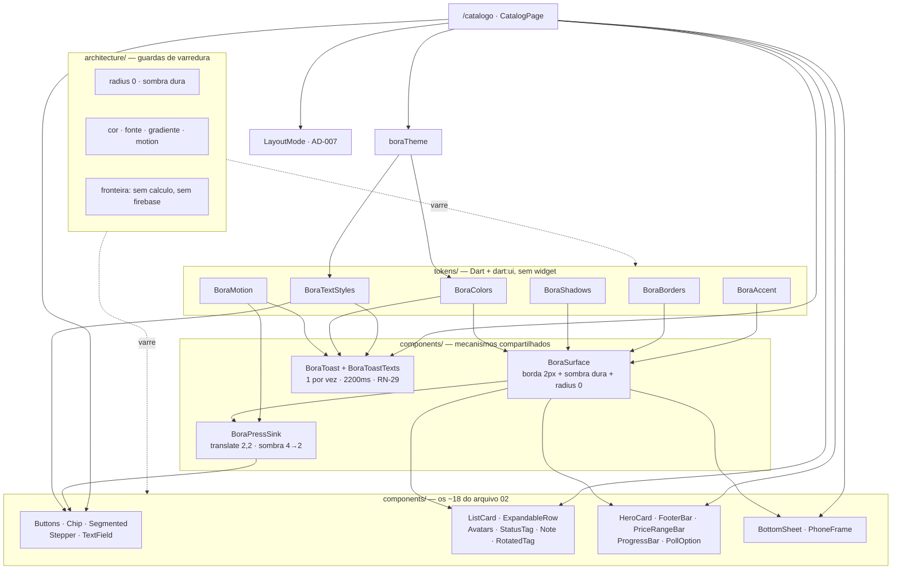

# Design System "Convite" — Design

**Spec**: `.specs/features/design-system/spec.md`
**Status**: Draft
**Data**: 2026-08-20
**Worktree**: `feature/design-system` — baseline `flutter test` 92 ✅ · `flutter analyze` limpo ✅

> Escopo: DS-01..DS-35. Diferente da fundação, quase nada aqui é herdado pelas outras specs como *arquitetura* — o que é herdado é **vocabulário**: o nome de cada token e de cada componente vira a língua das oito specs de tela. Por isso as poucas decisões estruturais (como o token é exposto, quem aplica o tema, onde mora o catálogo) viram AD.

---

## Restrições herdadas

| Fonte | Restrição que este design obedece |
|---|---|
| **AD-002** | Zero codegen. Nenhum `build_runner`, nenhum pacote novo — o catálogo é rota interna, as fontes são arquivos no repositório |
| **AD-003** | O mapa de rotas é canônico; `/catalogo` entra como **uma** rota nova, fora de qualquer shell, sem tocar nas existentes |
| **AD-005** | `AppLogger` é para bloc e erro global. Nenhum componente do design system registra evento |
| **AD-007** | O breakpoint de W-R3 mora em `core/responsive/` (`kCompactBreakpoint = 900.0`). Esta spec **consome** `LayoutMode`; não o redeclara nem o reexporta |
| `CLAUDE.md` | radius 0 · sombra dura · sem gradiente · só Archivo/Archivo Black · nada abaixo de 9px · CAIXA ALTA em título/label/botão/toast · press que afunda · toast 2200ms · **nunca duplique uma fórmula em componente de UI** |
| `.specs/init-spec/02-design-system.md` | A spec-fonte inteira, §1 a §8 — os valores são literais, não sugestões |
| RN-29 | Os 11 textos canônicos de toast, caractere por caractere |
| Lessons | `python3 .claude/skills/tlc-spec-driven/scripts/lessons.py list --status confirmed` → *(no confirmed lessons)* — conjunto confirmado vazio; nenhum candidate foi carregado como guidance |

---

## Pesquisa — Knowledge Verification Chain

Uma única questão técnica precisava de resposta antes de qualquer decisão: **como o peso da fonte variável chega ao texto.** A instrução de partida trazia um "fato já verificado" que contradiz o SDK instalado; a cadeia foi percorrida na ordem e o resultado está registrado aqui e na §"Contradição resolvida" do `spec.md`.

| Passo | O que foi feito | Resultado |
|---|---|---|
| 1 · Codebase | Inspeção do SDK instalado: `flutter --version` e leitura de `engine/src/flutter/lib/ui/text.dart` | **Flutter 3.47.0 · Dart 3.13.0.** Doc da classe `FontWeight`, linha 60: *"[FontWeight] will set the value of the `wght` axis (producing the same results as explicitly setting that attribute using [FontVariation.weight])"* |
| 1b · Artefato | Leitura das tabelas `fvar`/`name` dos dois `.ttf` entregues | Variável: eixos `wght` **100–900** (instância padrão **600**) e `wdth` 62–125 (padrão 100); família tipográfica `Archivo`. Estático: família `Archivo Black`, subfamília `Regular`, **sem `fvar`** |
| 2 · Docs do projeto | `CLAUDE.md`, `.specs/init-spec/02-design-system.md` §2 | "Archivo Black (display) e Archivo 400–800 (UI). Nenhuma outra." |
| 3 · Context7 MCP | **Indisponível nesta sessão** (nenhum MCP configurado — mesma condição declarada no `tasks.md` da fundação) | Pulado, declarado |
| 4 · Web | [docs.flutter.dev/release/breaking-changes/font-weight-variation](https://docs.flutter.dev/release/breaking-changes/font-weight-variation) | *"FontWeight also controls the weight attribute of variable fonts"* — landed `3.39.0-0.0.pre`, **stable 3.41**. Orientação: *aplicações devem evitar `FontVariation` para `wght` e declarar `FontWeight`* |
| 1c · Medição | Sonda descartável rodada no worktree (`flutter test` num arquivo temporário na raiz, removido em seguida; `git status` limpo) | Com `FontLoader`: `w400` = 383.68px, `w800` = 401.44px, `w900` = 416.68px para a mesma string a 40px ⇒ **o eixo responde**. `FontWeight.w800` e `FontVariation('wght', 800)` deram **401.4395751953125** nos dois ⇒ **mesmo mecanismo**. Sem `FontLoader`, todas as larguras deram 600.0 (fonte de teste) ⇒ **`flutter test` não carrega a fonte do `pubspec`** |
| 1d · Bundling | Mesma sonda: `rootBundle.load('assets/fonts/Archivo[wdth,wght].ttf')` | Carregou 658.596 bytes. **Colchete e vírgula no nome do asset não são problema**; `flutter analyze` e os 92 testes continuaram verdes com a seção `fonts:` declarada |

**Nada foi assumido.** O que não pôde ser verificado está declarado como tal: nenhuma verificação visual (mobile/web) foi feita, porque não há device nem navegador neste ambiente — o passo **M** fica com o usuário, como na fundação.

---

## Exploração de abordagens

Duas bifurcações valiam decisão explícita; as demais escolhas são consequência delas.

**Bifurcação 1 — como o token é exposto**

| Abordagem | Trade-off | Veredito |
|---|---|---|
| **A · Constantes Dart puras como fonte da verdade + `ThemeData` derivado** | Token é afirmável em teste unitário sem montar `MaterialApp`; a guarda "nenhuma cor fora do token" vira varredura simples porque existe **um** arquivo de cor; o `ThemeData` existe só para impedir que o default do Material (azul, Roboto, canto 4px) vaze. Custo: dois lugares para olhar. | ✅ **Escolhida** |
| B · Só `ThemeData` | Idiomático em Flutter e o `Theme.of(context)` fica disponível em toda árvore. Mas `ThemeData` **não tem slot** para sombra dura, borda de 2px, `letter-spacing` negativo por papel ou rotação de tag — metade do arquivo 02 ficaria fora do tema, em constantes soltas de qualquer jeito. E todo teste de token passaria a exigir `pumpWidget`. | Rejeitada |
| C · `ThemeExtension<BoraTokens>` | Junta os dois mundos com API oficial. Custo real: cada token vira campo de instância + `copyWith` + `lerp` (obrigatórios na interface) para um sistema que **não interpola nada** (§6 proíbe transição de cor além dos 150ms de estado) e que tem **um** tema só, sem dark mode. É abstração para caso único — o que `coding-principles` manda recusar. | Rejeitada |

**Bifurcação 2 — como o catálogo existe**

| Abordagem | Trade-off | Veredito |
|---|---|---|
| **A · Rota interna `/catalogo` em `app_router.dart`** | Zero dependência nova (AD-002), roda igual em mobile e web pelo mesmo binário, e a rota ganha teste no estilo que a fundação já tem. Custo: a página vai no bundle de produção. | ✅ **Escolhida — decisão D2 do usuário** |
| B · `widgetbook` / `storybook_flutter` | Ferramenta pronta e rica. Custo: pacote novo (contraria AD-002 na prática), segundo entrypoint para manter, e a conferência deixaria de rodar no app real. | Rejeitada |
| C · Golden images como conferência | Automatiza o "parece igual". Custo: exige carregar fonte em todo teste, e a rasterização varia por plataforma — golden vira teste que quebra por motivo errado. Além disso **discrimina pior**: um golden que falha diz "mudou um pixel", enquanto `expect(borda.width, 2.0)` diz *qual valor da spec* foi violado. | Rejeitada (ver Risks R-1) |

---

## Architecture Overview

Três camadas, com uma direção de dependência única e sem volta: **tokens → mecanismos → componentes**, e o catálogo consumindo tudo por cima. Nada aponta para fora de `core/design_system/`, exceto `LayoutMode` (AD-007) e `flutter/`.



**Princípio de testabilidade que atravessa o design:** todo critério de aceite é afirmado **na árvore renderizada** (`BoxDecoration.border.top.width`, `BoxShadow.blurRadius`, `Transform` do press, texto do toast depois de N ms) ou **no objeto de token** (`fontSize`, `letterSpacing`). Nenhum depende de fonte carregada, de rasterização ou de imagem de referência — exceto os dois testes de métrica de DS-03, que carregam a fonte com `FontLoader` local.

---

## Code Reuse Analysis

### O que já existe e é reusado

| Recurso | Local | Como usamos |
|---|---|---|
| `LayoutMode` · `layoutModeForWidth` · `ResponsiveBuilder` | `lib/core/responsive/` | O catálogo escolhe layout compacto/expandido por aqui. **AD-007**: não redeclaramos `900.0` nem reexportamos |
| `Routes` · `buildAppRouter` | `lib/core/routing/` | `/catalogo` entra como mais uma `GoRoute` fora de shell, ao lado de `/entrar` e `/erro`. Uma constante em `Routes`, uma entrada na tabela |
| `AppShell.chromeKey` | `lib/core/routing/app_shell.dart` | Chave já existente que o teste do catálogo usa para afirmar a **ausência** do chrome — mesma técnica de FUND-08 |
| Estilo de teste de rota | `test/core/routing/app_router_publico_test.dart` | O helper `_abrir(tester, location)` + `find.byKey(...)` + `expect(tester.takeException(), isNull)` é copiado tal e qual |
| Técnica de varredura de import | `test/architecture/calculo_isolation_test.dart` | As três guardas de DS-05/07/09/34 são a mesma mecânica: `Directory.listSync(recursive: true)`, regex, mensagem que **nomeia o arquivo infrator**, e a asserção anti-vácuo de que varreu ≥1 arquivo (risco R-5 da fundação) |
| Precedente de copy em PT-BR | `BoraApp.titulo`, `PlaceholderPage({titulo})` | Justifica A-12: classe em inglês, parâmetro de copy em PT-BR |
| `FontLoader` | `package:flutter_test` | Carrega a fonte só nos dois testes de métrica; nada de config global |

### O que **não** vamos escrever

- Nenhum pacote novo (`google_fonts`, `widgetbook`, `flutter_svg`): as fontes são arquivos, o catálogo é rota, os ícones são emoji (§7).
- Nenhum `ThemeExtension`, nenhum `copyWith`/`lerp` de token: não há segundo tema nem interpolação.
- Nenhum utilitário de cor (clarear/escurecer/opacidade): §1 é uma tabela fechada; derivar cor em runtime é exatamente o que a guarda de DS-09 proíbe.

### Integration points

| Sistema | Como conecta |
|---|---|
| `lib/core/routing/{routes,app_router}.dart` | +1 constante, +1 `GoRoute`. Único ponto de contato com código de outra spec |
| `pubspec.yaml` | +`assets:` e +`fonts:` dentro do bloco `flutter:` já existente. Nenhuma dependência tocada, nenhuma entrada reordenada |
| `lib/app.dart` | **Não tocado.** `boraTheme()` fica pronto e testado; quem o pluga é a spec 03 (ver AD proposto DS-3 no fim deste documento) |
| `lib/core/calculo/` | **Nenhum contato.** Guarda de import policia (DS-34) |

---

## Estrutura de diretórios

```
assets/
  fonts/
    Archivo[wdth,wght].ttf        # variável: wght 100–900, wdth 62–125
    ArchivoBlack-Regular.ttf      # estático, família própria
    OFL.txt                       # a licença viaja junto com as fontes

lib/core/design_system/
  design_system.dart              # barrel público — as telas importam só isto
  tokens/
    bora_colors.dart              # §1 + cores derivadas (A-15) — ÚNICO arquivo com literal de cor
    bora_text_styles.dart         # §2 — ÚNICO arquivo com literal de fontFamily
    bora_shadows.dart             # §4 — sombras duras + a única suave (frame)
    bora_borders.dart             # §3 — bordas, radius zero, tracejados, opacidade de desabilitado
    bora_spacing.dart             # paddings recorrentes de §5
    bora_motion.dart              # §6 — durações e curva
    bora_accent.dart              # enum BoraAccent + significado fixo (DS-08)
    bora_theme.dart               # boraTheme() — derivado, não fonte
  components/
    bora_surface.dart             # mecanismo: borda 2px + sombra dura + radius 0
    bora_press_sink.dart          # mecanismo: translate(2,2) + sombra 4→2
    bora_toast.dart               # mecanismo: 1 por vez, 2200ms
    bora_toast_texts.dart         # os 11 literais de RN-29
    bora_primary_button.dart
    bora_secondary_button.dart
    bora_selection_chip.dart
    bora_segmented_control.dart
    bora_stepper.dart
    bora_text_field.dart
    bora_list_card.dart
    bora_expandable_row.dart      # BoraExpandableGroup + BoraExpandableRow
    bora_avatar.dart              # BoraAvatar + BoraStackedAvatars (exceção: círculo)
    bora_status_tag.dart
    bora_dashed_note.dart         # BoraDashedNote + BoraEmptySlot
    bora_rotated_tag.dart
    bora_hero_card.dart
    bora_footer_bar.dart
    bora_price_range_bar.dart
    bora_progress_bar.dart
    bora_poll_option.dart
    bora_bottom_sheet.dart
    bora_phone_frame.dart         # exceção: radius 38 + a única sombra com blur
  catalog/
    catalog_page.dart             # /catalogo
    catalog_sections.dart         # registro das seções — a lista que o teste de completude lê

test/core/design_system/
  tokens/*_test.dart
  components/*_test.dart
  catalog/*_test.dart
  architecture/
    shape_and_shadow_guard_test.dart      # DS-05, DS-07
    token_purity_guard_test.dart          # DS-09, DS-10
    design_system_boundary_test.dart      # DS-34
  support/
    font_loading.dart                     # helper de FontLoader p/ os testes de métrica
    pump_component.dart                   # helper que monta 1 componente com boraTheme
test/core/routing/
  app_router_catalogo_test.dart           # DS-33 — rota com destino afirmado
```

**Por que `components/` e não `componentes/`:** `CLAUDE.md` reserva PT-BR para **domínio** (`Festa`, `Pessoa`, `calcularRacha`); widget e infra são inglês, e o código existente confirma (`core/routing/`, `core/observability/`, `AppRouter`, `PlaceholderPage`). O que fica em PT-BR é a **copy** e os parâmetros que a carregam (`titulo`, `rotulo`), seguindo `BoraApp.titulo` (A-12). A URL `/catalogo` fica em PT-BR porque é a que o usuário pediu, e porque a tabela de rotas existente já é PT-BR (`/roles`, `/roles/novo`).

---

## Components

### Camada de tokens

#### `BoraColors`

- **Purpose**: os 17 tokens de §1 mais as cores derivadas de §3/§4/§5. É o **único** arquivo do projeto autorizado a conter um literal de cor.
- **Location**: `lib/core/design_system/tokens/bora_colors.dart`
- **Interfaces** (valores ARGB já convertidos — o worker não precisa recalcular alfa):

| Token | Dart | Origem |
|---|---|---|
| `paper` | `Color(0xFFF4EFE3)` | §1 |
| `paper2` | `Color(0xFFEFECE5)` | §1 |
| `ink` | `Color(0xFF141414)` | §1 |
| `cream` | `Color(0xFFF4EFE3)` | §1 (mesmo valor de `paper`, papel diferente — os dois existem) |
| `primary` | `Color(0xFFFF4D2E)` | §1 |
| `yellow` | `Color(0xFFFFD23F)` | §1 |
| `purple` | `Color(0xFF6C4BF5)` | §1 |
| `green` | `Color(0xFF0B6B3A)` | §1 |
| `waGreen` | `Color(0xFF25D366)` | §1 |
| `waBubble` | `Color(0xFFE7DFCB)` | §1 |
| `waConfirm` | `Color(0xFFDCF8C6)` | §1 |
| `white` | `Color(0xFFFFFFFF)` | §1 |
| `text2` | `Color(0xFF6B6B6B)` | §1 |
| `text3` | `Color(0xFF9B9B9B)` | §1 |
| `textBody` | `Color(0xFF3A3A3A)` | §1 |
| `divider` | `Color(0x18141414)` | §1 (`#14141418` é RGBA; o alfa `18` vira o primeiro byte) |
| `divider2` | `Color(0x22141414)` | §1 (`#14141422`) |
| `sheetScrim` | `Color(0x73140A32)` | §5 bottom sheet, `rgba(20,10,50,.45)` — repare: **não** é `ink`, é um preto-arroxeado |
| `pollFill` | `Color(0x2E25D366)` | §5 enquete, `rgba(37,211,102,.18)` |
| `creamQuarter` | `Color(0x40F4EFE3)` | §5 segmented sobre card escuro, "cream/25%" |
| `frameBorder` | `Color(0x40000000)` | §5 frame, `rgba(0,0,0,.25)` |
| `frameShadow` | `Color(0x59140A32)` | §4 frame, `rgba(20,10,50,.35)` |
| `avatarPairs` | mapa `nome → (fundo, texto)` | §1: Rafa `#FF4D2E`/`#FFFFFF` · Ana `#FFD23F`/`#141414` · Léo `#6C4BF5`/`#FFFFFF` · Bia `#0B6B3A`/`#FFFFFF` · Duda `#141414`/`#F4EFE3` |
| `avatarPairFor(String nome)` | função | Tabela primeiro; nome desconhecido ⇒ `avatarPairs[soma dos code units % 5]` (A-05) |

- **Dependencies**: `dart:ui` (`Color`). Nenhum widget.
- **Reuses**: —

#### `BoraTextStyles`

- **Purpose**: um `TextStyle` por papel de §2. **Único** arquivo com literal de `fontFamily`.
- **Location**: `lib/core/design_system/tokens/bora_text_styles.dart`
- **Interfaces** — a tabela abaixo é o contrato; a coluna "faixa de §2" é o que o teste afirma:

| Token | Família | size | weight | ls | height | cor | Faixa de §2 |
|---|---|---|---|---|---|---|---|
| `logoHero` | Archivo Black | 64 | w400 | −2.0 | 0.92 | — | 64 fixo |
| `tituloTela` | Archivo Black | 22 | w400 | −0.5 | — | `ink` | 22–24 |
| `tituloCard` | Archivo Black | 26 | w400 | −0.5 | — | `ink` | 26–40 / −0.5 a −1.5 |
| `tituloCardGrande` | Archivo Black | 40 | w400 | −1.5 | — | `ink` | 26–40 |
| `valorHeroi` | Archivo Black | 40 | w400 | −1.5 | — | `cream` | 40–42 |
| `valorRodape` | Archivo Black | 24 | w400 | −1.0 | — | `ink` | 24–26 |
| `tituloSheet` | Archivo Black | 22 | w400 | −0.5 | — | `ink` | §5 bottom sheet: 22 |
| `labelSecao` | Archivo | 11.5 | w800 | 1.2 | — | `text2` | 11.5 fixo |
| `botao` | Archivo | 12 | w800 | 0.5 | — | herda | 12–16 / 0.5–1 |
| `botaoGrande` | Archivo | 16 | w800 | 1.0 | — | herda | 12–16 |
| `linhaLista` | Archivo | 14 | w800 | — | — | `ink` | 14 fixo (serve também ao valor à direita, §5) |
| `sublinhaLista` | Archivo | 11.5 | w600 | — | — | `text2` | 11.5–12 |
| `corpo` | Archivo | 15 | w500 | — | 1.5 | `textBody` | 12–15 / 500–600 / 1.4–1.5 |
| `dica` | Archivo | 12 | w600 | — | 1.4 | `text2` | idem (§3: dica é 600/12) |
| `microTag` | Archivo | 9 | w800 | 0.5 | — | herda | **9**–10.5 (piso de §8 vence os 8.5 de §2 — A-02); serve à tag de status |
| `chip` | Archivo | 13 | w800 | — | — | herda | §5 chip: 800/13 |
| `input` | Archivo | 15 | w600 | — | — | `ink` | §5 inputs: 600/15 |
| `stepperValor` | Archivo | 17 | w800 | — | — | `ink` | §5 stepper: 800/17 |
| `toast` | Archivo | 13 | w800 | 0.5 | — | `cream` | §5 toast: 800/13 |
| `rodapeLabel` | Archivo | 11 | w800 | 1.0 | — | `text2` | §5 rodapé |
| `rodapeSublinha` | Archivo | 12.5 | w700 | — | — | `primary` | §5 rodapé |
| `heroiLabel` | Archivo | 12 | w800 | 1.0 | — | `yellow` | §5 card-herói |
| `heroiSublinha` | Archivo | 13 | w700 | — | — | `primary` | §5 card-herói |
| `extremosFaixa` | Archivo | 10 | w700 | — | — | `text3` | §5 barra de faixa |

- Expõe também `static const List<TextStyle> todos` — a lista que os testes de DS-04 percorrem (piso 9px, família válida, peso não-nulo). **Um estilo novo que não entre nessa lista escapa da verificação**: a lista é parte do contrato, não conveniência.
- **Dependencies**: `dart:ui`/`painting` (`TextStyle`), `BoraColors`.

#### `BoraShadows` · `BoraBorders` · `BoraSpacing` · `BoraMotion` · `BoraAccent`

- **`BoraShadows`**: `hard(Color acento, double d)` ⇒ `BoxShadow(color: acento, offset: Offset(d, d), blurRadius: 0, spreadRadius: 0)`; constantes nomeadas para os usos de §4 (`ctaCurta` 4 · `loginGrande` 5 · `cardLink` 5 · `cardGrupo` 5 · `cardBranco` 6 e 8 · `cardHeroi` 6 · `flyer` 8 · `bolhaWa` 4) e `frame` — a **única** com `blurRadius: 50, spreadRadius: -20, offset: Offset(0, 20)`, cor `frameShadow`.
- **`BoraBorders`**: `raio = BorderRadius.zero`; `solida(Color cor)` ⇒ `Border.all(color: cor, width: 2)`; `padraoInk`; `frame` = 1px `frameBorder`; descritores de tracejado `dicaTracejada` (2px `ink`) e `slotTracejado` (2px `text3`); `opacidadeDesabilitado = 0.7` (A-07).
- **`BoraSpacing`**: os paddings literais de §5 (`botao` 15/16 · `chip` 10×14 · `linhaLista` 12–13×14–16 · `cardHeroi` 20–22 · `rodape` 14–16/24/30 · `sheet` 22/24/30 · `tag` 4–6×7–9 · `toast` 12×20 · `input` 15×16).
- **`BoraMotion`**: `estado = 150ms` · `toastIn = 300ms` · `progresso = 300ms` · `toastVida = 2200ms` · `curva = Curves.ease` (A-04) · `toastSubida = 14.0`.
- **`BoraAccent`**: `enum { primary, purple, waGreen, green, yellow, ink }` com `Color get cor` e um doc comment fixando o significado de cada um (DS-08). Componentes recebem `BoraAccent`, nunca `Color`.

#### `boraTheme()`

- **Purpose**: impedir que o default do Material (azul, Roboto, canto 4px) apareça em qualquer widget Material que os componentes usem por dentro.
- **Location**: `lib/core/design_system/tokens/bora_theme.dart`
- **Interfaces**: `ThemeData boraTheme()` — `scaffoldBackgroundColor: BoraColors.paper`, `canvasColor: BoraColors.paper`, `fontFamily: 'Archivo'`, `textTheme` mapeando os tokens, `colorScheme` derivado dos tokens, `splashFactory: NoSplash.splashFactory` (§8 não tem ripple), `visualDensity` padrão.
- **Regra**: nenhum valor literal aqui — cada campo lê de `BoraColors`/`BoraTextStyles`. A guarda de DS-09 policia.
- **Nota de escopo**: **não é aplicado ao app.** `lib/app.dart` está fora da fronteira desta spec; o catálogo aplica em si mesmo e a spec 03 pluga (A-16).

---

### Camada de mecanismos

#### `BoraSurface`

- **Purpose**: "radius 0 + borda 2px + sombra dura" existindo **uma vez**, para que 18 componentes não errem cada um do seu jeito.
- **Location**: `lib/core/design_system/components/bora_surface.dart`
- **Interfaces**:
  - `BoraSurface({Color fundo = BoraColors.white, Color corDaBorda = BoraColors.ink, double larguraDaBorda = 2, BoraAccent? acento, double deslocamentoDaSombra = 4, EdgeInsets? padding, required Widget child})`
  - Renderiza `DecoratedBox(decoration: BoxDecoration(color:…, border: Border.all(width: 2), borderRadius: BorderRadius.zero, boxShadow: acento == null ? null : [BoraShadows.hard(acento.cor, deslocamentoDaSombra)]))`.
- **Verificação**: teste lê `BoxDecoration` da árvore e afirma `borderRadius == BorderRadius.zero`, `border.top.width == 2.0`, `border.top.color == BoraColors.ink`, `boxShadow.single.blurRadius == 0`, `boxShadow.single.offset == Offset(4,4)`.

#### `BoraPressSink`

- **Purpose**: o afundamento obrigatório de §4, compartilhado por todo CTA.
- **Location**: `lib/core/design_system/components/bora_press_sink.dart`
- **Interfaces**:
  - `BoraPressSink({required BoraAccent acento, double deslocamento = 4, VoidCallback? onPressed, required Widget child})`
  - Estado interno `_afundado = _pressionado || _sobHover`.
  - Renderiza `AnimatedContainer(duration: BoraMotion.estado, curve: BoraMotion.curva, transform: Matrix4.translationValues(afundado ? 2 : 0, afundado ? 2 : 0, 0), decoration: …boxShadow: [hard(acento, afundado ? 2 : 4)])`, dentro de `MouseRegion` (hover) + `GestureDetector` (`onTapDown`/`onTapUp`/`onTapCancel`/`onTap`).
  - `onPressed == null` ⇒ envolve em `Opacity(0.7)` e **não** reage.
- **Por que um widget e não um mixin**: mixin obrigaria cada botão a repetir a árvore; o widget faz o afundamento ser a **mesma** implementação, e o teste de DS-11 vale para todos por construção.
- **Verificação**: `tester.startGesture` sobre o botão ⇒ ler `Transform`/`Matrix4` (translação `(2,2)`) e `BoxShadow.offset == Offset(2,2)`; soltar ⇒ voltar a `(0,0)` e `(4,4)`.

#### `BoraToast` · `BoraToastTexts`

- **Purpose**: RN-29 — 1 por vez, 2200ms, some sozinho, textos literais.
- **Location**: `lib/core/design_system/components/bora_toast.dart`, `…/bora_toast_texts.dart`
- **Interfaces**:
  - `abstract final class BoraToast { static void mostrar(BuildContext context, {required String texto, BoraAccent acento = BoraAccent.primary}); static void esconder(); static const Key toastKey = Key('bora-toast'); }`
  - `abstract final class BoraToastTexts` — 11 constantes com os literais de RN-29 (`linkCopiado`, `roleSalvo`, `conviteCopiado`, `listaNoGrupo`, `abrindoWhatsapp`, `salvoNaAgenda`, `lembreteMandado`, `cobrancaEnviada`, `grupoCriado`, `enquetePostada`, `crieOGrupoPrimeiro`) e `static const List<String> todos` para o teste percorrer.
- **Mecânica de instância única** (o ponto delicado):

```
mostrar(context, texto):
  1. _cancelar()                       # remove a entry anterior e cancela o Timer anterior
  2. overlay = Overlay.maybeOf(context)
     se overlay == null → retorna em silêncio        (edge case: Overlay desmontado)
  3. _entry = OverlayEntry(builder: …)  # Positioned(bottom: 112) + fade/slide 14px em 300ms
  4. overlay.insert(_entry!)
  5. _timer = Timer(BoraMotion.toastVida, _cancelar)

_cancelar():
  _timer?.cancel(); _timer = null
  se _entry != null && _entry!.mounted → _entry!.remove()
  _entry = null
```

  - O par `_entry`/`_timer` é **estático**: "1 por vez" é uma propriedade do app inteiro, não de uma subárvore. A checagem `mounted` antes de `remove()` é o que impede vazamento entre testes (risco R-8).
  - A entrada usa `AnimationController` próprio da entry; a saída é remoção seca (§6 não descreve animação de saída, e §8 proíbe inventar motion).
- **Verificação**: `pump(2199ms)` ⇒ presente; `pump(2ms)` ⇒ ausente. Dois `mostrar` seguidos ⇒ `find.byKey(BoraToast.toastKey)` acha **um** e o texto é o do segundo. `mostrar` com `Overlay` ausente ⇒ `expect(() => …, returnsNormally)`.

---

### Camada de componentes — contratos que importam

Só os pontos onde um worker erraria; o resto é tradução direta de §5.

| Componente | Assinatura essencial | O que o teste afirma além do estilo |
|---|---|---|
| `BoraPrimaryButton` | `({required String rotulo, VoidCallback? onPressed, BoraAccent acento = primary, bool larguraTotal = false})` | `rotulo` sai em CAIXA ALTA (DS-32); `larguraTotal` ⇒ ocupa a largura do pai |
| `BoraSecondaryButton` | `({required String rotulo, VoidCallback? onPressed, bool fundoBranco = false})` | hover ganha fundo `paper` **ou** sombra dura, nunca radius |
| `BoraSelectionChip` | `({required String rotulo, required String emoji, required bool selecionado, VoidCallback? onTap})` | troca de estado em 150ms; emoji **à esquerda** |
| `BoraSegmentedControl` | `({required List<String> opcoes, required int indiceAtivo, required ValueChanged<int> onSelecionar, bool sobreCardEscuro = false})` | exatamente 1 ativo; `opcoes.length - 1` divisores; 1 opção ⇒ 0 divisores |
| `BoraStepper` | `({required int valor, VoidCallback? onDecrementar, VoidCallback? onIncrementar})` | **sem aritmética**: os callbacks não têm payload e o valor exibido é sempre a prop; alvo de toque ≥44 medido com `tester.getSize` |
| `BoraTextField` | `({required TextEditingController controller, required String placeholder, FocusNode? focusNode})` | borda `ink` → `primary` no foco; placeholder **não** transformado (A-06) |
| `BoraListCard` | `({required List<BoraListRow> linhas})` + `BoraListRow({emoji, titulo, sublinha, valor, onTap})` | `linhas.length - 1` divisores de 2px `divider` |
| `BoraExpandableGroup` / `BoraExpandableRow` | grupo guarda `int? abertaEm`; a linha é controlada | abrir B fecha A; tocar a aberta fecha; começa sem nenhuma aberta; caret `▾`/`▴` literais |
| `BoraAvatar` / `BoraStackedAvatars` | `({required String nome, double tamanho = 34})` / `({required List<String> nomes, int extras = 0, double sobreposicao = -8})` | **exceção de forma**: `shape: BoxShape.circle`; inicial = 1ª letra em CAIXA ALTA (A-13); `extras == 0` ⇒ sem slot `+N` |
| `BoraStatusTag` | `({required BoraStatus status})` com `enum BoraStatus { recebe, paga, noZero, anfitriao, coAnfitriao, convidado, soVe }` | cada valor mapeia ao par fundo/texto de §5; rótulo em CAIXA ALTA |
| `BoraDashedNote` / `BoraEmptySlot` | `({required String emoji, required String texto})` / `({required Widget child})` | tracejado desenhado por `CustomPainter` (Flutter não tem `BorderStyle.dashed`) — o teste afirma o painter e a cor, não o pixel |
| `BoraRotatedTag` | `({required String texto, BoraAccent acento = primary, bool aEsquerda = true})` | rotação `-2°`/`+3°` em **radianos** (`-2 * pi / 180`); vaza o topo em `-13` |
| `BoraHeroCard` | `({required String label, required String valorFormatado, required String sublinha})` | `valorFormatado` é **`String`** — o componente não formata (DS-34) |
| `BoraFooterBar` | `({required String label, required String valorFormatado, required String sublinha, required Widget cta})` | idem; `border-top` de 2px e não borda inteira |
| `BoraPriceRangeBar` | `({required double fracao, required String rotuloMin, required String rotuloMax})` | `fracao` chega pronta (RN-11 é de `calculo`); clampa `<0`, `>1` e não-finito |
| `BoraProgressBar` | `({required double fracao, bool sobreCardEscuro = true})` | anima largura em 300ms; mesmo clamp |
| `BoraPollOption` | `({required String texto, required double fracao, required String percentualFormatado, required String contagemFormatada, required bool meuVoto, VoidCallback? onVotar})` | borda `waGreen` quando `meuVoto`; radio circular de 15px (**exceção de forma**, como o avatar) |
| `BoraBottomSheet` | `static Future<T?> mostrar<T>(BuildContext, {required String titulo, required WidgetBuilder conteudo})` | scrim `sheetScrim` (**não** `ink`); ✕ de 32×32 com borda 2px |
| `BoraPhoneFrame` | `({required Widget header, required Widget conteudo, required Widget rodape})` | 390×820; radius **38** e sombra com blur — as duas exceções, ambas na allowlist das guardas |

---

### Camada de guardas (arquitetura)

Três testes de varredura, todos na mecânica de `test/architecture/calculo_isolation_test.dart`: percorrem `lib/`, aplicam regex, falham **nomeando o arquivo infrator**, e afirmam que varreram ≥1 arquivo.

| Guarda | Regra | Allowlist | Requisito |
|---|---|---|---|
| `shape_and_shadow_guard_test.dart` | Proíbe `BorderRadius.circular`, `BorderRadius.all`, `RoundedRectangleBorder`, `StadiumBorder`, `CircleBorder`; proíbe `blurRadius:` com valor ≠ 0. `BorderRadius.zero` é permitido | `bora_phone_frame.dart` (radius 38 + sombra suave), `bora_avatar.dart` e `bora_poll_option.dart` (`BoxShape.circle`) | DS-05, DS-07 |
| `token_purity_guard_test.dart` | Proíbe `Color(0x…`/`Colors.` fora de `bora_colors.dart` (tolerando `Colors.transparent`); `fontFamily:` fora de `bora_text_styles.dart`; `Gradient`, `InkWell`, `InkResponse`, `Curves.elastic*`, `Curves.bounce*`, `FontVariation` em **qualquer** lugar de `lib/` | — | DS-09, DS-10, DS-03 |
| `design_system_boundary_test.dart` | Nenhum arquivo de `lib/core/design_system/` importa `core/calculo/`, `package:firebase…`, `cloud_firestore` ou `package:flutter_bloc` | — | DS-34 |

**Por que as guardas vêm cedo (fase 2) e não no fim:** elas são um portão vivo para as fases 3–7 — um worker que digitar `BorderRadius.circular(8)` na fase 5 descobre no gate da própria task, não numa revisão final. O preço é que na fase 2 elas varrem pouco; a asserção "varreu ≥1 arquivo" impede o falso-verde, e os tokens da fase 1 já lhes dão substrato.

---

### Catálogo

- **`CatalogPage`** (`lib/core/design_system/catalog/catalog_page.dart`): `Theme(data: boraTheme(), child: …)` envolvendo um `ResponsiveBuilder` que escolhe entre uma coluna rolável (compacto) e a mesma coluna com largura máxima e duas colunas de seções (expandido). Chave `Key('catalogo')`.
- **`catalog_sections.dart`**: `const List<BoraCatalogSection> secoes` — cada seção tem `titulo`, `referencia` (o trecho do arquivo 02, ex. `'§5 · Stepper'`) e `builder`. É essa lista que o teste de completude lê. O **registro é parte da task de cada componente** (uma linha), então nenhum componente chega ao fim sem lugar no catálogo.
- **Rota**: `Routes.catalogo = '/catalogo'` + uma `GoRoute` de topo em `buildAppRouter`, irmã de `/entrar` e `/erro` — **fora de qualquer shell**, porque o catálogo não é tela de produto e o chrome do app é placeholder da fundação.
- **Teste de rota** (`test/core/routing/app_router_catalogo_test.dart`), no formato exato dos testes existentes e atendendo ao aviso da validação da fundação (*rota alcançável precisa de destino afirmado*): abre `/catalogo`, afirma `find.byKey(Key('catalogo'))` presente, `AppShell.chromeKey` ausente, `RouteErrorPage.pageKey` ausente e `tester.takeException()` nulo.

---

## Data Models

Nenhum. O design system não tem entidade nem estado persistido — os únicos "modelos" são enums de apresentação (`BoraAccent`, `BoraStatus`) e o registro de seções do catálogo, todos declarados acima. As entidades de domínio (`Festa`, `Pessoa`, `ItemDeLista`, `Despesa`) pertencem à spec 02 `calculo`, e esta spec não as conhece nem as importa.

---

## Error Handling Strategy

| Cenário | Tratamento | Impacto no usuário |
|---|---|---|
| Fração fora de `[0,1]` na barra de faixa/progresso | `clamp(0, 1)`; não finito ⇒ `0.0` | Marcador no extremo, nunca exceção nem barra fora do trilho |
| Nome de pessoa fora da tabela de avatares | Par determinístico entre os cinco existentes | Cor estável por pessoa; nunca cor fora do token |
| Toast disparado sobre `Overlay` desmontado | `Overlay.maybeOf` devolve `null` ⇒ retorna em silêncio | Nada acontece (o toast é feedback, não conteúdo) |
| Segundo toast durante o primeiro | Remove a entry anterior e cancela o timer anterior antes de inserir | Um toast só, com o texto mais recente |
| CTA desabilitado | `Opacity(0.7)` e nenhum callback | Botão visivelmente inerte; sem afundar |
| Rótulo vazio em botão/chip/tag | `''.toUpperCase()` ⇒ `''` | Renderiza vazio, sem exceção |
| Guarda de varredura sem arquivo para varrer | **Falha** por varredura vazia | Erro de desenvolvimento, ruidoso por design (risco R-5 da fundação) |
| Fonte ausente do bundle | Teste de asset de DS-02 falha | Erro de build/teste, em vez de fallback silencioso para a fonte do sistema |

---

## Risks & Concerns

| # | Concern | Local | Impacto | Mitigação |
|---|---|---|---|---|
| R-1 | **`flutter test` não carrega as fontes do `pubspec`** — verificado na doc do SDK (`packages/flutter_test/lib/src/matchers.dart:535`) e empiricamente (sem `FontLoader` toda largura deu 600.0, a fonte de teste) | toda a suíte | Qualquer teste que meça texto ou compare pixel mediria a fonte errada | A asserção padrão é de **propriedade**, não de pixel; golden fica fora de escopo; os dois testes de métrica de DS-03 carregam a fonte com `FontLoader` num helper local (`test/core/design_system/support/font_loading.dart`), sem config global de teste |
| R-2 | A fonte variável tem **instância padrão `wght` 600** (lido do `fvar`) — texto sem peso explícito poderia sair SemiBold | `bora_text_styles.dart` | Toda a tipografia meio-negrito sem ninguém notar | Empiricamente o Flutter aplica w400 quando o estilo não declara peso; mesmo assim **todo token declara `fontWeight`**, e o teste de DS-04 falha se algum `TextStyle` de `todos` tiver `fontWeight == null` |
| R-3 | **A premissa de partida está desatualizada**: a instrução dizia que a variável não responde a `fontWeight` e que seria preciso `FontVariation('wght', N)`. Verdade até o Flutter 3.40; **falso** no 3.47 instalado | `bora_text_styles.dart` | Worker escreveria `fontVariations` em todo estilo — código morto que a doc oficial recomenda evitar, e que mascararia erro de peso | Proibição explícita de `FontVariation` na guarda `token_purity_guard_test.dart` + teste de equivalência de DS-03 provando que os dois caminhos dão a **mesma** largura. Se o SDK do projeto um dia recuar para <3.41, o teste de equivalência é o que avisa |
| R-4 | Guardas de varredura passam vacuamente se rodarem sem alvo | `test/core/design_system/architecture/` | Falso-verde exatamente onde a spec confia mais | Cada guarda afirma que varreu **≥1 arquivo** (mesma técnica do risco R-5 da fundação) e as fases 1–2 garantem substrato |
| R-5 | `Routes` e `app_router.dart` são compartilhados com as specs 03–10 e com o merge da spec `calculo` | `lib/core/routing/` | Conflito de merge | **Uma** constante e **uma** `GoRoute`, ambas ao fim das listas existentes; nenhuma entrada existente é tocada ou reordenada. Mesma disciplina no `pubspec.yaml` (só `assets:` e `fonts:`) |
| R-6 | O nome `Archivo[wdth,wght].ttf` tem colchete e vírgula | `pubspec.yaml`, `assets/fonts/` | Asset poderia não resolver em algum alvo | **Verificado**: carrega pelo `rootBundle` e não quebra `analyze`/`test`. Não foi possível verificar build de iOS/Android/web reais (sem device — passo **M**). Fallback documentado: renomear para `Archivo-Variable.ttf` é seguro pela OFL (o Reserved Font Name protege o **nome da família**, não o do arquivo) |
| R-7 | O catálogo entra no bundle de produção | `lib/core/design_system/catalog/` | Rota interna acessível em `bora.app/catalogo` | Aceito por decisão D2 (A-14). É página sem dado e sem escrita. Esconder atrás de `kDebugMode` é uma linha, registrada e **não** implementada (nada além do pedido) |
| R-8 | `BoraToast` guarda `OverlayEntry` **estático** | `bora_toast.dart` | Entry órfã vazando entre testes ⇒ exceção em teste seguinte | `_cancelar()` checa `_entry!.mounted` antes de remover e sempre cancela o timer; a substituição é a mesma rotina do auto-dismiss |
| R-9 | Componente tentado a formatar `R$` ou calcular a fração do marcador | `bora_hero_card.dart`, `bora_footer_bar.dart`, `bora_price_range_bar.dart` | Fórmula duplicada na UI — a violação que o `CLAUDE.md` chama de quebra de produto | API só aceita `String` já formatada e `double` já calculado + guarda de import de DS-34. **Nenhum arquivo desta spec pode importar `core/calculo/`** |
| R-10 | Flutter não tem `BorderStyle.dashed` | `bora_dashed_note.dart` | Worker improvisaria com imagem, pacote novo ou borda sólida | O tracejado é `CustomPainter` próprio (~30 linhas). O teste afirma o painter e as cores, **não** o pixel |
| R-11 | Nenhuma verificação visual possível neste ambiente (sem device, sem navegador) | `/catalogo` | O "parece o protótipo?" fica sem resposta automatizada | Declarado como passo **M** do usuário, exatamente como a fundação fez com `flutter run`. O catálogo existe justamente para tornar esse passo barato |
| R-12 | `lib/app.dart` está fora da fronteira, então o tema não é aplicado ao app | `boraTheme()` | Tema pronto mas inerte até a spec 03 | Declarado em A-16 e no AD proposto **DS-3**; o catálogo aplica o tema em si mesmo, o que mantém `boraTheme()` verificado de ponta a ponta |

---

## Cobertura: requisito → componente → verificação

**A** = automatizado · **M** = manual (usuário).

| Req | Componente | Verificação | Tipo |
|---|---|---|---|
| DS-01 | `bora_colors.dart` | teste compara cada token com o hex/ARGB literal de §1 + derivadas de A-15 | A |
| DS-02 | `assets/fonts/`, `pubspec.yaml` | `rootBundle.load` dos dois `.ttf`; presença de `OFL.txt`; famílias declaradas | A |
| DS-03 | `bora_text_styles.dart` + helper de `FontLoader` | largura(w400) ≠ largura(w800); largura(w800) == largura(`FontVariation('wght',800)`); ausência de `FontVariation` em `lib/` | A |
| DS-04 | `bora_text_styles.dart` | percorre `BoraTextStyles.todos`: família ∈ {Archivo, Archivo Black}, `fontSize ≥ 9`, dentro da faixa de §2, `fontWeight != null`, Archivo Black sempre w400 | A |
| DS-05 | `bora_borders.dart` + guarda de forma | radius zero nos tokens; varredura falha em `circular`/`all`/`RoundedRectangleBorder`; allowlist frame/avatar/enquete | A |
| DS-06 | `bora_borders.dart` | bordas sólida 2px `ink`, tracejada `ink`, tracejada `text3` + `opacity .7` | A |
| DS-07 | `bora_shadows.dart` + guarda | `blurRadius == 0` e `offset` da tabela §4 em cada sombra dura; a do frame é a única com blur | A |
| DS-08 | `bora_accent.dart` | enum fechado, cada valor mapeado ao token certo; componentes tipados por `BoraAccent` | A |
| DS-09 | guarda `token_purity_guard_test.dart` | injeta violação ⇒ falha nomeando o arquivo; remove ⇒ passa | A |
| DS-10 | `bora_motion.dart` | 150/300/300/2200ms + `Curves.ease`; varredura proíbe curva de mola/bounce | A |
| DS-11 | `bora_press_sink.dart` | gesto: translação `(2,2)` e sombra `(2,2)`; solta ⇒ `(0,0)` e `(4,4)`; hover idem; desabilitado não afunda | A |
| DS-12 | `bora_toast.dart`, `bora_toast_texts.dart` | 2199ms presente / 2201ms ausente; dois seguidos ⇒ um só, texto do segundo; 11 literais de RN-29 caractere a caractere; `Overlay` ausente ⇒ não lança | A |
| DS-13 | `bora_surface.dart` | `BoxDecoration` da árvore: radius zero, borda 2px `ink`, uma sombra `blurRadius 0` `offset (4,4)` | A |
| DS-14 | botões | fundo/texto/borda/padding/sombra + CAIXA ALTA + `larguraTotal` | A |
| DS-15 | `bora_selection_chip.dart` | par selecionado/não selecionado + 150ms + emoji à esquerda | A |
| DS-16 | `bora_segmented_control.dart` | 1 ativo; `n-1` divisores de 2px `divider2`; variante escura com `creamQuarter` | A |
| DS-17 | `bora_stepper.dart` | 34×34 visual; `tester.getSize` do alvo ≥44; callbacks sem payload e valor sempre da prop | A |
| DS-18 | `bora_text_field.dart` | borda `ink` → `primary` no foco; radius zero; 600/15 | A |
| DS-19 | `bora_list_card.dart` | fundo branco, borda 2px, `n-1` divisores de 2px `divider`, emoji e valor | A |
| DS-20 | `bora_expandable_row.dart` | abrir B fecha A; retoque fecha; começa fechado; caret `▾`/`▴` | A |
| DS-21 | `bora_avatar.dart` | círculo + borda 2px + inicial; sobreposição negativa; `+0` sem slot; 5 pares fixos + fallback determinístico (mesmo nome ⇒ mesma cor) | A |
| DS-22 | `bora_status_tag.dart` | 7 significados × par de cores + CAIXA ALTA | A |
| DS-23 | `bora_dashed_note.dart` | painter tracejado, fundo branco, `dica` 600/12 `text2`; slot com `text3` e `opacity .7` | A |
| DS-24 | `bora_rotated_tag.dart` | ângulo em radianos `-2°`/`+3°`; deslocamento de `-13` | A |
| DS-25 | `bora_hero_card.dart` | fundo `ink`, sombra `(6,6)` `primary`, label `yellow`, valor `cream` AB 40, sublinha `primary`; valor é `String` | A |
| DS-26 | `bora_footer_bar.dart` | fundo `paper`, borda **só no topo** 2px, bloco SAI POR + CTA; valor é `String` | A |
| DS-27 | `bora_price_range_bar.dart` | trilho 8px `paper2` borda 2px; marcador 8×12 `primary`; posição = fração recebida; clamp de `<0`/`>1`/`NaN`/`∞` | A |
| DS-28 | `bora_progress_bar.dart` | 12px, borda 2px `cream`, `waGreen`, largura em 300ms, mesmo clamp | A |
| DS-29 | `bora_poll_option.dart` | borda `ink`/`waGreen`; preenchimento `pollFill`; radio 15px; % e contagem já formatadas | A |
| DS-30 | `bora_bottom_sheet.dart` | scrim `sheetScrim`; painel `paper` com borda no topo; título AB 22; ✕ 32×32 borda 2px | A |
| DS-31 | `bora_phone_frame.dart` | 390×820, radius 38, borda 1px `frameBorder`, única sombra com blur, conteúdo rolando entre header e rodapé fixos | A |
| DS-32 | componentes de copy | rótulo minúsculo entra, CAIXA ALTA sai (botão, chip, tag, toast, títulos) | A |
| DS-33 | `catalog_page.dart`, `Routes.catalogo` | rota abre e afirma o destino + ausência do chrome; completude por seção; compacto e expandido; barrel exporta tudo | A |
| DS-33 | idem | conferência a olho contra o arquivo 02, mobile e web | **M** |
| DS-34 | guarda `design_system_boundary_test.dart` | injeta `import '../calculo/calculo.dart'` ⇒ falha nomeando; remove ⇒ passa | A |
| DS-35 | `bora_theme.dart` | `ThemeData` com `paper`/`ink`/Archivo, sem literal próprio, sem splash | A |

---

## Tech Decisions

| Decisão | Escolha | Rationale |
|---|---|---|
| Exposição do token | Constantes Dart puras (fonte da verdade) + `ThemeData` derivado | Token afirmável sem `MaterialApp`; `ThemeData` não tem slot para sombra dura, borda 2px nem `ls` negativo; `ThemeExtension` seria `copyWith`/`lerp` para um sistema de tema único que não interpola |
| Peso da fonte variável | `TextStyle.fontWeight`; `FontVariation` **proibida** em `lib/` | Flutter 3.47 (≥3.41) aplica o eixo `wght` a partir do `FontWeight`; a doc oficial recomenda evitar `FontVariation` para `wght`; medição local provou equivalência exata |
| Fontes | Bundladas em `assets/fonts/` com a `OFL.txt` ao lado | D1 do usuário; elimina rede em runtime e a dependência `google_fonts`; a OFL exige a licença junto |
| Press-sink | Um widget `BoraPressSink` (não mixin, não `copyWith` de estilo) | Uma implementação, um teste, e todo CTA herda o comportamento por construção |
| Hover além do press | `MouseRegion` afunda igual | §4 diz "Hover/press de CTA (**obrigatório**)"; no web o hover existe e o protótipo o previa |
| Toast | `OverlayEntry` + `Timer` **estáticos**, com substituição destrutiva | "1 por vez" é propriedade do app inteiro; a substituição e o auto-dismiss compartilham a mesma rotina, então não há caminho em que dois coexistam |
| Sem ripple | `NoSplash.splashFactory` no tema + `InkWell` proibido pela guarda | §8 não tem efeito de tinta; o feedback do sistema é o afundamento |
| Tracejado | `CustomPainter` próprio | Flutter não tem `BorderStyle.dashed`; a alternativa (pacote ou imagem) violaria AD-002/§8 |
| Catálogo | Rota interna `/catalogo` fora de shell | D2 do usuário; zero dependência; roda no app real em mobile e web |
| Registro no catálogo | Uma linha em `catalog_sections.dart` dentro da task de cada componente | Impede que um componente exista sem lugar de conferência, sem transformar o catálogo numa task gigante no fim |
| Verificação | Asserção de propriedade; **sem golden** | Discrimina melhor (nomeia o valor da spec violado) e não depende de fonte carregada nem de rasterização por plataforma |
| Guardas de estilo | Varredura de fonte no estilo de `calculo_isolation_test.dart` | Foi a técnica que a fundação instalou para "convenção policiada por teste"; §8 é uma lista de proibições e proibição sem sensor é decoração |
| Idioma | Classe/arquivo/pasta em inglês; parâmetro e constante de copy em PT-BR | `CLAUDE.md` (domínio PT-BR, resto inglês) + precedente `BoraApp.titulo` |
| Prefixo `Bora` | Todas as classes públicas | Evita colisão com o Material (`ElevatedButton`, `Chip`, `Stepper`, `Divider` existem lá) e torna óbvio, na tela, o que é token e o que é framework |
| `boraTheme()` no app | **Fora de escopo** | `lib/app.dart` não pertence a esta spec; a spec 03 pluga |

**Propostos como decisão de projeto** (o orquestrador escreve no `.specs/STATE.md` após o merge — esta spec não toca o arquivo): **DS-1** exposição do token, **DS-2** mecanismo de peso da fonte, **DS-3** hand-off de `boraTheme()` para a spec 03, **DS-4** catálogo como rota interna. Texto completo no relatório de encerramento do planejamento.

---

## Herança para as próximas specs

- **Spec 02 `calculo`** (paralela): nenhuma dependência nos dois sentidos. Ela formata `R$` (RN-13) e calcula a fração de RN-11; esta camada só recebe `String` e `double` prontos.
- **Spec 03 `entrar`**: pluga `boraTheme()` no `BoraApp`, e é a primeira a consumir `BoraPrimaryButton`, `BoraTextField` e `logoHero`. Herda também a decisão de revestir `PlaceholderPage`/`AppShell` — que esta spec devolveu por depender de layout de tela.
- **Specs 04–10**: importam só `package:bora/core/design_system/design_system.dart`. A regra "máx. 2 acentos por tela" é critério de aceite delas, sobre o `enum BoraAccent` fechado que nasce aqui.
