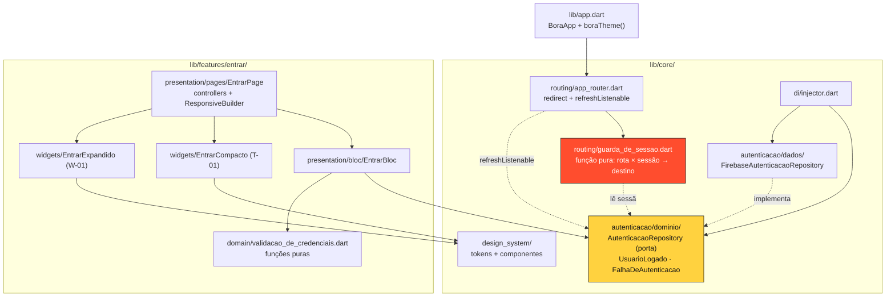

# Entrar — Design

**Spec**: `.specs/features/entrar/spec.md`
**Context**: `.specs/features/entrar/context.md`
**Status**: **Approved** (2026-08-25) — AD-019 e AD-020 gravadas no `STATE.md`; Tasks em `.specs/features/entrar/tasks.md`
**Decisões ativas conferidas**: AD-001..AD-018 (`.specs/STATE.md`). Nenhuma é superada por este design; três são estendidas (AD-002, AD-003, AD-013) e duas nasceram dele e **já estão gravadas**: AD-019 (casa da autenticação) e AD-020 (navegação por guarda).
**Lições confirmadas carregadas**: nenhuma no store (`lessons.py list --status confirmed` → vazio). As candidatas L-001, L-002 e L-008 informaram a §Estratégia de teste, mas **como raciocínio próprio**, não como guidance carregada.

---

## A ideia central

Três caminhos de login (e-mail/senha, Google, cadastro) e **nenhum deles navega**. Todos fazem a mesma coisa: pedir ao repositório que autentique. Quando a autenticação dá certo, o `Stream` de sessão emite, o `refreshListenable` do `go_router` dispara, e a guarda de AD-017 — que já precisa existir para barrar `/roles` sem sessão — leva para a Home sozinha.

Isso significa que **não existe um único `context.go('/roles')` em `lib/features/entrar/`**. O aceite "pós-login sempre cai na Home" (UC-01) deixa de ser uma linha repetida em três lugares, que poderiam divergir, e vira uma propriedade da tabela de rotas. É a decisão que organiza o resto do design.

---

## Architecture Overview



**A direção das setas é o ponto.** `core/routing` depende de `core/autenticacao/dominio` — uma porta, nunca do Firebase e nunca de um bloc. A implementação Firebase é injetada de fora. É o que permite testar a guarda inteira com um duplo, sem emulador ligado, como a AD-016 exige.

### Por que a autenticação mora em `core/`, e não em `features/entrar/`

Foi a única decisão de camada com resposta não óbvia, e ela tem três razões:

1. **`core/routing/app_router.dart` precisa ler a sessão.** Se a porta morasse em `features/entrar/domain/`, `core` importaria `features` — inversão que nenhum teste proíbe hoje, mas que todo leitor futuro lê como cheiro.
2. **`home` (spec 04) precisa de `UsuarioLogado.inicial`** para o avatar do header (HOME-01 AC2). Com a entidade dentro de `entrar`, `home` importaria de `entrar` — acoplamento feature↔feature, exatamente o que a organização feature-first existe para evitar.
3. **A AD-008 já resolveu esse caso uma vez**: as entidades compartilhadas de domínio foram para `core/calculo/dominio/`, atrás de um barrel que é a única porta de entrada. Este design repete a forma, não inventa outra.

Nome em PT-BR (`autenticacao`, `AutenticacaoRepository`) pela regra do `CLAUDE.md` — domínio em português, e `core/calculo` já é o precedente de pasta de core em PT-BR. **Isso renomeia o `AuthRepository` que o `spec.md` citou**; a spec será alinhada (ver §Ajustes à spec).

---

## Code Reuse Analysis

### Componentes existentes aproveitados

| Componente | Local | Como é usado |
|---|---|---|
| `boraTheme()` | `core/design_system/tokens/bora_theme.dart` | Aplicado no `MaterialApp.router` (ENT-01). Nenhum valor redeclarado |
| `BoraTextField` | `core/design_system/components/bora_text_field.dart` | Inputs de e-mail e senha. **Precisa de `obscureText`** — ver §Emendas de fronteira |
| `BoraPrimaryButton` | `.../bora_primary_button.dart` | CTA "COMEÇAR →" / "CRIAR CONTA →". Já tem `larguraTotal` e o afundamento de press |
| `BoraSecondaryButton` | `.../bora_secondary_button.dart` | Botão Google e "VOLTAR PRO INÍCIO" da tela de erro |
| `BoraRotatedTag` | `.../bora_rotated_tag.dart` | Tag −2° "A CONTA DO ROLÊ, RESOLVIDA". `grausAEsquerda` já é `-2` |
| `BoraSurface` | `.../bora_surface.dart` | Card branco de W-01 (`deslocamentoDaSombra: 10`, borda 2px `ink`) |
| `BoraTextStyles.logoHero` | `.../bora_text_styles.dart` | Logo 64px de T-01, direto. W-01 usa `copyWith` (ver Tech Decisions) |
| `BoraColors` / `BoraAccent` | `.../tokens/` | Ponto vermelho do logo, borda de foco, acento do CTA |
| `ResponsiveBuilder` + `LayoutMode` | `core/responsive/` | Split T-01 ⇄ W-01 na fronteira de 900 (AD-007). **Não** redeclara o breakpoint |
| `getIt` / `configureDependencies` | `core/di/injector.dart` | Registro da porta e do bloc. Container único (AD-002) |
| `AppLogger` | `core/observability/app_logger.dart` | ENT-12 — falha de auth registrada |
| `RecordingAppLogger` | `test/support/recording_app_logger.dart` | Duplo já pronto para afirmar ENT-12 |
| `pumpComponent` | `test/core/design_system/support/pump_component.dart` | Reusável para os widgets de marca/divisor |
| `carregarFontesArchivo` | `test/core/design_system/support/font_loading.dart` | Só nos testes que **medem** texto |

### Pontos de integração

| Sistema | Como conecta |
|---|---|
| `firebase_auth` 6.5.7 | Só dentro de `core/autenticacao/dados/`. Nenhuma outra camada importa o SDK |
| Emulador do Auth (porta 9099) | Já conectado pelo `AppBootstrap`/`EmulatorConfig` da fundação. Este design **não** mexe no bootstrap |
| `go_router` 17.5.0 | `redirect` no nível raiz + `refreshListenable` |
| Mapa de rotas (AD-003) | Nenhuma rota nova. A guarda só decide destino entre as que já existem |

---

## Pesquisa — o que foi verificado no código instalado

Seguindo a Knowledge Verification Chain, os três pontos abaixo saíram do **fonte dos pacotes resolvidos no `pubspec.lock`**, não de memória.

### 1. Google sign-in não precisa de pacote novo — mas exige split de plataforma

| Plataforma | Método | Evidência |
|---|---|---|
| Android / iOS | `signInWithProvider(GoogleAuthProvider())` | Implementado em `firebase_auth_platform_interface-9.0.6/lib/src/method_channel/method_channel_firebase_auth.dart:444` |
| Web | `signInWithPopup(GoogleAuthProvider())` | `firebase_auth_web-6.2.6/lib/firebase_auth_web.dart:510` |

**`firebase_auth_web` 6.2.6 não sobrescreve `signInWithProvider`** — ele cai no default do platform interface, que faz `throw UnimplementedError` (`platform_interface_firebase_auth.dart:595`). Usar `signInWithProvider` no web quebraria em runtime, silenciosamente, só no navegador.

Conclusão: **zero dependência nova** (`google_sign_in` fica fora), ao preço de um `kIsWeb` dentro do datasource.

### 2. O código de credencial errada é diferente no emulador

O doc do próprio pacote (`firebase_auth-6.5.7/lib/src/firebase_auth.dart:578-584`) diz:

> **invalid-credential**: Thrown if the email or password is incorrect. […] this replaces **user-not-found** and **wrong-password** […] **On the Firebase emulator, the code may appear as `INVALID_LOGIN_CREDENTIALS`.**

Isto importa muito aqui: a AD-016 manda desenvolver **contra o emulador**. Mapear só `invalid-credential` faria a mensagem "E-MAIL OU SENHA INCORRETOS" (ENT-09) nunca aparecer justamente no ambiente de desenvolvimento. O mapeamento cobre os dois, mais os legados.

### 3. O que **não** foi possível verificar

O código de erro do **cancelamento do fluxo Google** (ENT-14 AC3) não está documentado no pacote Dart — ele vem do SDK nativo/JS por baixo. **Não vou fabricar a lista.** O design trata cancelamento como o ramo `default` seguro (ver §Error Handling) e a task correspondente carrega a instrução de confirmar o código real contra o emulador antes de fixá-lo em teste.

---

## Components

### `UsuarioLogado`
- **Purpose**: quem está logado, no vocabulário do produto.
- **Location**: `lib/core/autenticacao/dominio/usuario_logado.dart`
- **Interfaces**: `final String id`, `final String email`, `final String? nome`, `String get inicial`
- **Dependencies**: nenhuma — Dart puro.
- **Reuses**: a forma de `Pessoa.inicial` (`core/calculo/dominio/pessoa.dart:44`), inclusive o `toUpperCase()`.
- **Nota**: `inicial` nasce aqui porque a spec 04 vai precisar dele (HOME-01 AC2), não por especulação — é requisito escrito de uma spec já aprovada. Igualdade de valor (`==`/`hashCode`) porque o `Stream` compara emissões.

### `FalhaDeAutenticacao`
- **Purpose**: o vocabulário fechado de falhas que a UI sabe tratar.
- **Location**: `lib/core/autenticacao/dominio/falha_de_autenticacao.dart`
- **Interfaces**: `enum { credencialInvalida, emailEmUso, senhaFraca, semRede, cancelada, indisponivel }`
- **Reuses**: forma de enum com `chave` de `PapelNaFesta` / `StatusDaFesta`.
- **Nota**: enum fechado, não `String`. É o que impede a UI de fazer `if (e.code == '...')` e o que torna o teste de erro uma tabela, não uma cadeia de `if`.

### `AutenticacaoRepository` (porta)
- **Purpose**: o contrato de sessão e de autenticação, sem Firebase.
- **Location**: `lib/core/autenticacao/dominio/autenticacao_repository.dart`
- **Interfaces**:
  - `UsuarioLogado? get sessaoAtual` — snapshot **síncrono**; é o que o `redirect` pode consultar (o `redirect` do `go_router` não é assíncrono na prática de guarda)
  - `Stream<UsuarioLogado?> get mudancasDeSessao` — alimenta o `refreshListenable`
  - `Future<void> entrarComEmailESenha({required String email, required String senha})`
  - `Future<void> entrarComGoogle()`
  - `Future<void> criarConta({required String email, required String senha})`
  - `Future<void> sair()`
- **Dependencies**: nenhuma.
- **Nota**: os métodos devolvem `Future<void>`, não `Future<UsuarioLogado>`. Quem anuncia o sucesso é o **stream** — se o método também devolvesse o usuário, existiriam duas fontes de verdade para "estou logado", e a mais rápida venceria de forma não determinística. Falha vira `throw FalhaDeAutenticacao`.

### `FirebaseAutenticacaoRepository`
- **Purpose**: traduzir `firebase_auth` para a porta.
- **Location**: `lib/core/autenticacao/dados/firebase_autenticacao_repository.dart`
- **Interfaces**: implementa `AutenticacaoRepository`; construtor recebe `FirebaseAuth` (injetável).
- **Dependencies**: `firebase_auth`, `flutter/foundation.dart` (só `kIsWeb`).
- **Responsabilidades**: mapear `User` → `UsuarioLogado`; mapear `FirebaseAuthException.code` → `FalhaDeAutenticacao`; fazer o split `kIsWeb` do Google; manter `sessaoAtual` em cache a partir de `authStateChanges()`.
- **Nota**: **é o único arquivo do projeto que importa `firebase_auth`** fora do bootstrap e do injector.

### `guardaDeSessao` (função pura)
- **Purpose**: dada a rota pedida e a sessão, dizer o destino.
- **Location**: `lib/core/routing/guarda_de_sessao.dart`
- **Interfaces**: `String? guardaDeSessao({required String rota, required bool temSessao})` — `null` = segue.
- **Dependencies**: só `Routes`.
- **Nota**: separada do `app_router.dart` de propósito. É a peça que concentra toda a regra de ENT-15..18 e a única que precisa de **tabela** de teste; extraída, ela é testável sem montar widget, sem `GoRouter` e sem duplo. O `app_router.dart` só a chama.

### `GoRouterRefreshStream`
- **Purpose**: transformar `Stream` em `Listenable` para o `refreshListenable`.
- **Location**: `lib/core/routing/go_router_refresh_stream.dart`
- **Interfaces**: `GoRouterRefreshStream(Stream<dynamic>)` — `ChangeNotifier` que notifica a cada emissão e cancela a inscrição no `dispose`.
- **Nota**: padrão canônico do `go_router` (o pacote não o exporta). ~15 linhas. Cancelar a inscrição no `dispose` é o que evita vazamento entre testes.

### `validacao_de_credenciais.dart`
- **Purpose**: as regras de A-08, puras.
- **Location**: `lib/features/entrar/domain/validacao_de_credenciais.dart`
- **Interfaces**: `ErroDeEmail? validarEmail(String)`, `ErroDeSenha? validarSenha(String)` — enums pequenos (`vazio`, `formato` / `vazia`, `curta`)
- **Nota**: função pura, sem Flutter — ENT-08 vira teste unitário de fronteira (5 e 6 caracteres) sem `pumpWidget`. O `trim()` do e-mail acontece aqui.

### `EntrarBloc`
- **Purpose**: o estado da tela — modo, envio, erro.
- **Location**: `lib/features/entrar/presentation/bloc/`
- **Eventos**: `ModoAlternado`, `SubmetidoComCredenciais(email, senha)`, `SubmetidoComGoogle`
- **Estado**: um `EntrarState` com `modo` (`entrar` | `cadastro`), `situacao` (`ocioso` | `enviando` | `falhou`), `falha`, `erroDeEmail`, `erroDeSenha`
- **Dependencies**: `AutenticacaoRepository`, os validadores.
- **Nota**: **o bloc não navega e não tem `BuildContext`.** O sucesso não produz estado novo — produz emissão no stream de sessão, e a guarda faz o resto. `SubmetidoComCredenciais` decide entre `entrarComEmailESenha` e `criarConta` pelo `modo` corrente: é o mesmo evento porque é o mesmo gesto do usuário, e duplicá-lo abriria caminho para os dois divergirem.

### `EntrarPage`
- **Purpose**: dona do bloc, dos `TextEditingController` e do split responsivo.
- **Location**: `lib/features/entrar/presentation/pages/entrar_page.dart`
- **Nota estrutural (importa)**: os **controllers e o `BlocProvider` ficam acima do `ResponsiveBuilder`**. Se descessem para dentro de cada layout, cruzar 900px destruiria e recriaria os campos, e o texto digitado sumiria — o edge case "viewport cruza 900px preservando o texto" da spec é exatamente isso.

### `EntrarCompacto` (T-01) e `EntrarExpandido` (W-01)
- **Location**: `lib/features/entrar/presentation/widgets/`
- **Nota**: só layout. Recebem controllers e estado por parâmetro, emitem eventos por callback. Nenhum dos dois lê o repositório.

### `MarcaBora` e `DivisorOu`
- **Location**: `lib/features/entrar/presentation/widgets/`
- **Purpose**: o logo "BORA." com o ponto vermelho, e o divisor "OU" de linhas 2px.
- **Nota**: **nenhum dos dois é componente de design system.** O arquivo 02 define o logo como *papel tipográfico* (`BoraTextStyles.logoHero`), não como componente, e não define o divisor "OU" em lugar nenhum — ele é composição de tela de T-01. Os dois consomem tokens e vivem na feature. Quando a spec 04 precisar do logo 20px do header, o candidato a promoção para o DS aparece — aí com dois usos reais, não com um.

### `EntrarTextos`
- **Location**: `lib/features/entrar/presentation/entrar_textos.dart`
- **Purpose**: a copy literal de T-01/W-01 em um lugar só.
- **Nota**: existe para a **produção** não espalhar string, não para o teste comparar contra ela — ver §Estratégia de teste, que é onde essa distinção decide o valor da suíte.

---

## Data Models

```dart
class UsuarioLogado {
  const UsuarioLogado({required this.id, required this.email, this.nome});
  final String id;
  final String email;
  final String? nome;

  /// A inicial exibida no avatar do header (spec 04, HOME-01 AC2).
  /// Cai no e-mail quando não há nome — conta de e-mail/senha não tem
  /// `displayName`, e um avatar vazio seria pior que a letra do e-mail.
  String get inicial => (nome?.isNotEmpty ?? false)
      ? nome![0].toUpperCase()
      : email[0].toUpperCase();
}

enum FalhaDeAutenticacao {
  credencialInvalida,  // invalid-credential, INVALID_LOGIN_CREDENTIALS,
                       // wrong-password, user-not-found
  emailEmUso,          // email-already-in-use
  senhaFraca,          // weak-password
  semRede,             // network-request-failed
  cancelada,           // fluxo Google abortado — código a confirmar (§Pesquisa 3)
  indisponivel,        // qualquer outro, inclusive Firebase não inicializado
}
```

**Relações**: `UsuarioLogado` é independente de `Pessoa` (`core/calculo/dominio/`) de propósito — `Pessoa` é convidado de festa (papel, dieta, presença), `UsuarioLogado` é conta. Uni-los agora acoplaria a sessão ao domínio de cálculo sem que nenhuma spec peça.

---

## Error Handling Strategy

| Cenário | Tratamento | O que o usuário vê |
|---|---|---|
| E-mail vazio / formato inválido | `validarEmail` barra **antes** do repositório (ENT-08) | Validação inline no campo; nenhuma chamada de rede |
| Senha vazia / < 6 caracteres | `validarSenha` barra antes do repositório | Validação inline no campo |
| `invalid-credential` · `INVALID_LOGIN_CREDENTIALS` · `wrong-password` · `user-not-found` | → `credencialInvalida` | "E-MAIL OU SENHA INCORRETOS" inline; e-mail preservado; CTA reabilitado (ENT-09) |
| `email-already-in-use` (modo cadastro) | → `emailEmUso` | Mensagem inline; permanece no modo cadastro (ENT-20 AC4) |
| `weak-password` | → `senhaFraca` | Mensagem inline. Só ocorre se o backend for mais estrito que os 6 caracteres de A-08 |
| `network-request-failed` | → `semRede` | Mensagem de falha; tela utilizável (ENT-11) |
| Google cancelado pelo usuário | → `cancelada` | **Nada**: volta ao ocioso, sem erro e sem navegar (ENT-14 AC3) |
| Firebase não inicializado / erro desconhecido | → `indisponivel` | Mensagem de falha genérica; tela abre e permanece utilizável (AD-004) |
| Qualquer falha acima | `AppLogger.logError` no repositório | Invisível ao usuário; afirmado por `RecordingAppLogger` (ENT-12) |
| Duplo toque no CTA | `situacao == enviando` ⇒ `onPressed: null` | Botão em carregando, inerte (ENT-07/ENT-10) |

**A regra que amarra tudo**: `cancelada` é a única falha que **não** produz mensagem. Tratá-la como erro faria o usuário que só fechou o popup do Google achar que algo quebrou.

---

## Estratégia de teste — a distinção que decide o valor da suíte

Duas coisas parecidas que se testam de formas **opostas**:

| O que | Como o teste afirma | Por quê |
|---|---|---|
| **Copy da spec** ("COMEÇAR →", "Novo por aqui? CRIAR CONTA", "CONTINUAR COM GOOGLE") | Contra o **literal escrito no teste**: `find.text('COMEÇAR →')` | A spec é a fonte da verdade. Se o teste comparasse com `EntrarTextos.cta`, mudar a constante mudaria os dois juntos e o teste concordaria com qualquer copy — inclusive a errada |
| **Token do design system** (borda de foco, acento, sombra) | Contra o **token**: `expect(borda.color, BoraColors.primary)` | Aqui a fonte da verdade é o token. Comparar com `Color(0xFFFF4D2E)` faria o teste concordar com o literal e não amarraria componente a token — foi assim que a spec 01 produziu o GAP-3 |

A regra curta: **o teste aponta para a fonte da verdade daquele valor** — a spec para copy, o token para forma.

Outras decisões de teste:

- **Guarda de sessão**: tabela de casos (rota × sessão) sobre a função pura, mais um teste de integração por rota que **abre a rota e afirma o destino final**, incluindo as três livres. Rota que só existe como redirect precisa do teste que a atravessa — foi um mutante sobrevivente na fundação.
- **Par discriminante em tudo que é condicional**: `/entrar` **com** e **sem** sessão; erro presente e ausente; CTA habilitado e inerte. Teste que só afirma o caso positivo passa com a condição sempre verdadeira.
- **Sem emulador**: toda a suíte roda com `FakeAutenticacaoRepository`. O `FirebaseAutenticacaoRepository` é testado com um duplo de `FirebaseAuth` para o mapeamento de erros — inclusive `INVALID_LOGIN_CREDENTIALS`, que é o código do ambiente real de desenvolvimento.
- **ENT-14 (Google) tem cobertura declaradamente parcial**: o repositório é testado com duplo; o fluxo real do provider **depende de conferência manual no web** (A-10). A task carrega isso escrito, e o `validation.md` vai registrar qual AC ficou manual — em vez de a suíte fingir que cobriu.

---

## Emendas de fronteira (a spec precisa autorizar)

A `spec.md` fechou os arquivos que esta feature pode tocar. O design precisa de quatro extensões — todas aditivas, nenhuma enfraquece teste existente:

| # | Arquivo | Mudança | Justificativa |
|---|---|---|---|
| E-1 | `lib/core/autenticacao/**` + `test/core/autenticacao/**` | **Criar** | A porta não cabe em `features/entrar/` sem inverter camadas nem acoplar `home` a `entrar` (ver §Architecture) |
| E-2 | `lib/core/design_system/components/bora_text_field.dart` | `obscureText` opcional, default `false` | Campo de senha legível é defeito. Aditivo: os 306 testes do DS não mudam de comportamento. **SPEC_DEVIATION registrado** |
| E-3 | `test/architecture/project_structure_test.dart` | Acrescentar `autenticacao` a `_pastasDeCore` | **Fortalece** a guarda: a pasta nova passa a ser exigida, e o espelho em `test/` também |
| E-4 | `test/app_test.dart` | Atualizar a expectativa de destino | Hoje afirma que o app cai em `/roles`; com a guarda, sem sessão o destino correto **é** `/entrar`. O teste vira o par: com duplo logado → `/roles`, sem sessão → `/entrar`. Já estava na lista "pode tocar" |

E-2 é o único que mexe em código de outra spec. Ele nasce de um buraco que a `spec.md` também tem: **nenhum AC exige que a senha seja obscurecida** — a spec só diz `input "senha"`. Ver §Ajustes à spec.

---

## Ajustes à spec — **aplicados** (2026-08-25)

| # | Ajuste | Motivo | Estado |
|---|---|---|---|
| S-1 | Acrescentar AC a P1-2: "WHEN o campo senha renderiza THEN o texto SHALL ser obscurecido" | O requisito existe de fato e não estava escrito. Congelar comportamento em teste sem AC que o defina é o erro que a fundação cometeu (L-002) | ✅ aplicado — virou **ENT-21** |
| S-2 | Trocar `AuthRepository` por `AutenticacaoRepository` nos Independent Tests | Regra de idioma do `CLAUDE.md`: domínio em PT-BR | ✅ aplicado |
| S-3 | Registrar as emendas E-1..E-4 na §Fronteira de arquivos | A fronteira deve continuar verdadeira, como a matriz do arquivo 05 | ✅ aplicado |

---

## Risks & Concerns

| Preocupação | Local | Impacto | Mitigação |
|---|---|---|---|
| `signInWithProvider` **quebra no web** e o erro só aparece em runtime, no navegador | `firebase_auth_web-6.2.6` (não sobrescreve o método) | Google indisponível na web sem nenhum sinal em compilação ou em `flutter test` | Split `kIsWeb` no datasource, com comentário citando a evidência; teste do repositório cobre os dois ramos com duplo |
| Código de credencial errada **difere no emulador** (`INVALID_LOGIN_CREDENTIALS`) | `firebase_auth-6.5.7:578-584` | ENT-09 falharia justamente no ambiente da AD-016, e pareceria bug de UI | Os dois códigos mapeiam para `credencialInvalida`; teste nomeia os dois |
| Código de **cancelamento** do Google não documentado no pacote | §Pesquisa 3 | Cancelamento poderia virar mensagem de erro | Tratado como ramo `default` seguro; a task manda **confirmar contra o emulador** antes de fixar em teste |
| `test/app_test.dart` passa a falhar | `test/app_test.dart:8` | Baseline vermelha se a guarda entrar antes do ajuste | E-4 na mesma task da guarda, nunca depois |
| `BoraToast` guarda `OverlayEntry` **estático** | `bora_toast.dart:58-59` | Estado global entre testes; um toast vazado derruba um teste seguinte | `entrar` **não usa toast** (A-06: erro é inline). Risco não tocado por esta spec — anotado para `montar`, que usa "ROLÊ SALVO ✊" |
| `configureDependencies` tem guarda por flag privada | `injector.dart:24` | Registrar a porta exige entrar no mesmo `if` | `resetDependencies()` já existe e os testes do injector já cobrem o padrão; seguir a forma existente |
| `EntrarPage` hoje é `PlaceholderPage` e há teste que o afirma | `test/core/routing/*` | Trocar o corpo pode quebrar teste de rota que procura a chave do placeholder | Levantar quais testes referenciam `placeholder:entrar` **na primeira task** e ajustá-los junto; nenhum é enfraquecido, só reapontado |

---

## Tech Decisions

| Decisão | Escolha | Rationale |
|---|---|---|
| Sessão → roteador | Porta de domínio + `refreshListenable` | Escolhida com o usuário. Roteador depende de domínio, nunca de Firebase nem de bloc; suíte roda sem emulador (AD-016) |
| Navegação pós-login | **Nenhuma chamada imperativa** — a guarda leva | Um mecanismo em vez de três; os três caminhos não podem divergir |
| Local da autenticação | `lib/core/autenticacao/` | Consumida por `routing` e por `home`; forma herdada da AD-008 |
| Idioma | `autenticacao`, `AutenticacaoRepository`, `UsuarioLogado`, `FalhaDeAutenticacao` | `CLAUDE.md`: domínio em PT-BR. Infra dentro dela (`FirebaseAutenticacaoRepository`) mantém o prefixo do SDK |
| Google multiplataforma | `kIsWeb` no datasource, **sem** `google_sign_in` | Zero dependência nova (espírito da AD-002). Import condicional (padrão de `url_strategy/`) não serviria: lá o import **é** web-only; aqui os dois métodos vivem no mesmo objeto, então dois arquivos não comprariam nada |
| Logo 92px de W-01 | `BoraTextStyles.logoHero.copyWith(...)` na feature | O arquivo 02 define o papel (64px); o 92px vem do arquivo **06**, que é spec de tela. O DS é dono do papel, a spec de tela é dona do degrau responsivo — e `06` chama isso de "tipografia sobe um degrau", que é adaptação de tela |
| Retorno dos métodos de login | `Future<void>`, sucesso pelo stream | Duas fontes de verdade para "estou logado" competiriam de forma não determinística |
| Guarda como função pura em arquivo próprio | `guarda_de_sessao.dart` | Concentra ENT-15..18 e testa por tabela, sem widget e sem `GoRouter` |
| Duplo do SDK nos testes | **`mocktail`** em `dev_dependencies` (**AD-021**) | Decidido com o usuário depois do Design. Livre de codegen, então a AD-002 segue intacta; evita repetir ~60 linhas de gateway à mão em cada adaptador Firestore do M2. Portas de domínio continuam com fake escrito à mão |
| Validação | Funções puras em `features/entrar/domain/` | ENT-08 vira teste de fronteira (5 × 6 caracteres) sem `pumpWidget` |
| `MarcaBora` / `DivisorOu` | Widgets da feature, **não** do DS | O arquivo 02 não os define como componente. Promover ao DS quando houver segundo uso real (header da spec 04) |

### Decisões que sobem para o `STATE.md`

Duas passaram a valer para o projeto e **estão gravadas no `.specs/STATE.md`**:

- **AD-019** — `lib/core/autenticacao/` é a casa da sessão: entidade, porta e adaptador Firebase, atrás do barrel `autenticacao.dart` como única porta de entrada (forma da AD-008). Nenhuma feature cria a sua; `core/routing` e as features consomem a porta, nunca o SDK.
- **AD-020** — Navegação pós-autenticação é **consequência da guarda**, nunca imperativa. Nenhuma feature chama `context.go` para efeito de login/logout: muda a sessão, o `refreshListenable` dispara, a guarda decide.

---

## Mapa requisito → componente

| Requisito | Onde é cumprido |
|---|---|
| ENT-01, ENT-02 | `lib/app.dart` |
| ENT-03 | `EntrarCompacto` + `MarcaBora` + `DivisorOu` |
| ENT-04 | `EntrarExpandido` + `BoraSurface` |
| ENT-05 | `BoraTextField` (foco já implementado no DS) |
| ENT-21 | `BoraTextField.obscureText` (**E-2**) |
| ENT-06, ENT-14, ENT-20 | `EntrarBloc` → porta → **guarda** (sem navegação imperativa) |
| ENT-07, ENT-10 | `EntrarState.situacao` + `onPressed: null` |
| ENT-08 | `validacao_de_credenciais.dart` |
| ENT-09, ENT-11 | `FirebaseAutenticacaoRepository` (mapeamento) + `EntrarState.falha` |
| ENT-12 | `FirebaseAutenticacaoRepository` → `AppLogger` |
| ENT-13 | `EntrarBloc` no `ModoAlternado` + controllers em `EntrarPage` |
| ENT-15..ENT-18 | `guarda_de_sessao.dart` + `app_router.dart` + `GoRouterRefreshStream` |
| ENT-19 | `route_error_page.dart` |

**Cobertura: 21/21.** Nenhum requisito sem componente; nenhum componente sem requisito.

---

## Corte previsto para Tasks

~11 tasks, na ordem de dependência. **T1 é o plug do tema** — o pedido explícito e a AD-013:

1. `boraTheme()` no `BoraApp` (ENT-01, ENT-02)
2. `UsuarioLogado` + `FalhaDeAutenticacao` + porta + barrel (E-1, E-3)
3. `FirebaseAutenticacaoRepository`: e-mail/senha, cadastro, mapeamento de erros, logger (ENT-09, ENT-11, ENT-12)
4. `FirebaseAutenticacaoRepository`: Google com split `kIsWeb` (ENT-14)
5. `guarda_de_sessao.dart` + `GoRouterRefreshStream` (função pura + tabela)
6. Ligar a guarda no `app_router` + DI + **E-4** (ENT-15..18)
7. `validacao_de_credenciais.dart` (ENT-08)
8. `EntrarBloc` (ENT-06, ENT-07, ENT-13, ENT-20)
9. `BoraTextField.obscureText` (**E-2**) + `MarcaBora` + `DivisorOu`
10. `EntrarCompacto` — T-01 (ENT-03, ENT-05)
11. `EntrarExpandido` — W-01 (ENT-04) + modo cadastro nos dois
12. `RouteErrorPage` revestido (ENT-19)

São 12; o corte final é da fase Tasks. Acima de 8 ⇒ **oferta de sub-agentes** (dois batches: 1–6 infraestrutura, 7–12 tela).
