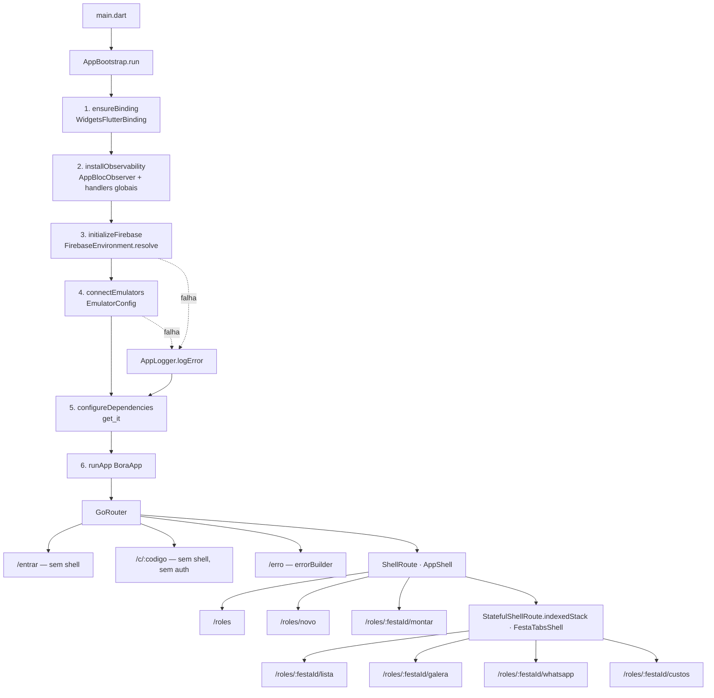

# Fundação — Design

**Spec**: `.specs/features/fundacao/spec.md`
**Context**: `.specs/features/fundacao/context.md`
**Status**: Draft
**Data**: 2026-08-13

> Escopo: FUND-01..FUND-20. Tudo que este design fixa é **herdado pelas dez specs seguintes** — por isso as escolhas viram AD no `.specs/STATE.md` (AD-002..AD-007).

---

## Restrições herdadas

| Fonte | Restrição que este design obedece |
|---|---|
| **AD-001** (`STATE.md`) | 11 specs, 4 marcos; `entrar` e `home` são features próprias → existem como pastas em `lib/features/` |
| `CLAUDE.md` | Flutter (um codebase mobile+web) · BLoC · Firebase · Clean Architecture feature-first · `core/calculo/` Dart puro · domínio em PT-BR, resto em inglês · `flutter_lints` local · sem CI |
| `context.md` | SDK externo (versão no README) · Firebase emulator-first · RN-30 como fixture bruta em `test/fixtures/` |
| Lessons | `scripts/lessons.py list --status confirmed` → *(no confirmed lessons)* — store ainda não existe |

**Pré-condição bloqueante mantida:** o SDK Flutter/Dart não está instalado (`flutter`, `dart`, `firebase` fora do PATH em 2026-08-12). O Execute não começa antes de `flutter --version` responder. Todas as versões de pacote abaixo foram lidas do pub.dev em 2026-08-13 e **não puderam ser resolvidas localmente** — ver Riscos R-7.

---

## Exploração de abordagens (registro da decisão)

Duas bifurcações eram herdadas por dez specs. Ambas foram apresentadas e confirmadas pelo usuário em 2026-08-13.

**Bifurcação 1 — rotas + DI**

| Abordagem | Trade-off | Veredito |
|---|---|---|
| **A · `go_router` + `get_it`, zero codegen** | Roteador do time do Flutter (URL limpa, path params, `errorBuilder`), DI manual com `reset()` nativo. Sem `build_runner` no ciclo de teste. Mais boilerplate de registro. | ✅ **Escolhida** |
| B · `go_router` + `get_it` + `injectable` | Menos boilerplate quando houver muitos repositórios; em troca todo teste passa a depender de codegen e o `.config.dart` entra no diff de cada feature. | Rejeitada |
| C · `auto_route` + `get_it` | Rotas tipadas; custo de codegen igual ao B e caminho menos documentado para o par "shell autenticado + rota pública fora dele" — que é justamente o requisito estrutural de FUND-08. | Rejeitada |

**Bifurcação 2 — forma do esqueleto de navegação**

| Abordagem | Trade-off | Veredito |
|---|---|---|
| **A · `ShellRoute` (chrome do app) + `StatefulShellRoute.indexedStack` (abas da festa)** | Preserva o estado das quatro abas permanentes (Lista · Galera · WhatsApp · Custos, arquivo 01 §5). Custa mais agora; é o que as specs 06–10 precisam. | ✅ **Escolhida** |
| B · Só `ShellRoute`, abas planas | Simples agora; cada troca de aba remonta a tela e trocar depois mexe da spec 06 em diante. | Rejeitada |
| C · Tabela plana sem shell | Mínimo agora; o header vira duplicação em oito telas quando a spec 01 chegar. | Rejeitada |

---

## Architecture Overview

Três eixos independentes, costurados por um único ponto de ordem (`AppBootstrap`):

1. **Bootstrap** — ordem determinística de inicialização, com o par Firebase/emulador isolado num `try/catch` (indisponibilidade é degradação, não crash).
2. **Navegação** — uma tabela de rotas com três zonas: pública (sem auth, sem chrome), erro, e o shell do app com o sub-shell de abas da festa.
3. **Plataforma** — DI, observabilidade, Firebase e responsividade como serviços de `core/`, todos com uma **costura injetável** para que cada AC seja verificável sem processo externo.



**Princípio de testabilidade que atravessa todo o design:** nenhum AC depende de rede, de emulador ligado ou de singleton do Firebase. Onde há singleton (`FirebaseAuth.instance`, `FirebaseFirestore.instance`), o design extrai a parte decidível (qual `FirebaseOptions`, qual host, qual porta, em que ordem) para funções puras e deixa o adaptador fino sem teste unitário — declarado explicitamente na tabela de cobertura.

---

## Code Reuse Analysis

Não há código no repositório. "Reuso" aqui significa: o que **não** vamos escrever.

| Recurso | Origem | Como usamos |
|---|---|---|
| `flutter create` | SDK | Gera `android/`, `ios/`, `web/`, `pubspec.yaml`, `analysis_options.yaml` — não escrevemos scaffold à mão |
| `go_router` 17.5.0 | pub.dev | `errorBuilder` (FUND-09), path params (FUND-08), `ShellRoute`/`StatefulShellRoute.indexedStack`, integração com `MaterialApp.router` |
| `get_it` 9.2.1 | pub.dev | `reset()` cobre FUND-12 AC2 sem código nosso |
| `flutter_bloc` 9.1.1 / `bloc` 9.x | pub.dev | `BlocObserver` já define `onChange`/`onTransition`/`onError` — só implementamos o sink |
| `usePathUrlStrategy()` | `flutter_web_plugins` (SDK) | URL sem `#` no web (FUND-10) |
| `MaterialApp.title` | SDK | Título da aba no web (FUND-10) — o `WidgetsApp` já propaga para o `document.title` |
| `firebase_core` 4.13.0 | pub.dev | Injeção automática do JS SDK no web — **não** mexemos em `web/index.html` |
| `flutter_lints` | pub.dev | `analysis_options.yaml` só faz `include:` |
| RN-30 / arquivo 01 §7 | `.specs/init-spec/` | Texto literal da fixture — copiado, não inventado |

**Integration points:** `firebase.json` (emuladores) ↔ `EmulatorConfig` (constantes Dart) — as duas fontes são cruzadas por teste para não divergirem.

---

## Estrutura de diretórios

```
pubspec.yaml · analysis_options.yaml · firebase.json · .firebaserc · README.md
lib/
  main.dart                         # só compõe e chama AppBootstrap
  app.dart                          # BoraApp — MaterialApp.router
  bootstrap/app_bootstrap.dart      # ordem determinística (FUND-15/17)
  core/
    di/injector.dart                # getIt · configureDependencies · resetDependencies
    routing/
      routes.dart                   # caminhos e construtores de rota
      app_router.dart               # buildAppRouter()
      app_shell.dart                # AppShell (chrome placeholder)
      festa_tabs_shell.dart         # FestaTabsShell (4 abas)
      placeholder_page.dart         # PlaceholderPage
      route_error_page.dart         # RouteErrorPage
      invite_code_format.dart       # validação ESTRUTURAL do :codigo
      url_strategy/                 # import condicional (stub + web)
    observability/
      app_logger.dart               # AppLogger (interface) + DebugAppLogger
      app_bloc_observer.dart        # AppBlocObserver
      global_error_handler.dart     # installGlobalErrorHandlers
    firebase/
      demo_firebase_options.dart    # opções sintéticas (projeto demo-bora)
      firebase_environment.dart     # resolve() + falha explícita em release
      emulator_config.dart          # hosts e portas
      firebase_bootstrap.dart       # adaptador fino sobre os singletons
    responsive/
      layout_mode.dart              # kCompactBreakpoint · LayoutMode · layoutModeForWidth
      responsive_builder.dart       # ResponsiveBuilder
    design_system/.gitkeep          # território da spec 01
    calculo/calculo.dart            # barrel só com doc comment — território da spec 02
  features/<entrar|home|montar|lista|galera|convite|convidado|custos>/
      domain/.gitkeep · data/.gitkeep · presentation/pages/<x>_page.dart
test/
  app_test.dart                     # smoke (FUND-03)
  architecture/
    calculo_isolation_test.dart     # FUND-06
    project_structure_test.dart     # FUND-04/05
  bootstrap/app_bootstrap_test.dart # FUND-15/17
  core/…                            # espelho de lib/core
  features/…                        # espelho de lib/features
  fixtures/rn30_estado_inicial.dart # FUND-18/19
  support/recording_app_logger.dart # duplo de teste do AppLogger
```

**`.gitkeep` é obrigatório em toda pasta sem `.dart`** — o git não versiona diretório vazio, e FUND-04/05 são verificados **num clone limpo**. Ver risco R-4.

**Desvio consciente do espelho:** `test/architecture/` e `test/support/` não têm par em `lib/` — são testes transversais e utilitários de teste. FUND-05 vale para o espelho de código de produção.

---

## Components

### `AppBootstrap`

- **Purpose**: executar a inicialização numa ordem fixa e garantir que a queda do Firebase não impeça o app de abrir.
- **Location**: `lib/bootstrap/app_bootstrap.dart`
- **Interfaces**:
  - `AppBootstrap({required AppLogger logger, required void Function() ensureBinding, required void Function() installObservability, required Future<void> Function() initializeFirebase, required Future<void> Function() connectEmulators, required Future<void> Function() configureDependencies})`
  - `Future<void> run(void Function() startApp)` — executa 1→6 na ordem do diagrama; envolve **apenas** os passos 3 e 4 em `try/catch`, delegando a exceção ao `logger`; `startApp` é sempre o último.
- **Dependencies**: `AppLogger`. Todos os passos entram como closures — nenhum import de Firebase aqui.
- **Reuses**: nada; é a costura que torna FUND-15 e FUND-17 testáveis sem Firebase.

> **Nota de conformidade com FUND-15:** a spec fixa `binding → Firebase → emulador → DI → runApp`. O design insere **`installObservability` entre binding e Firebase** — obrigatório, porque FUND-17 exige que a falha do Firebase seja *registrada*, e o handler precisa estar armado antes de haver o que registrar. A ordem dos cinco passos da spec é preservada integralmente.

### `AppLogger` · `DebugAppLogger`

- **Purpose**: único sink de observabilidade do app — é a costura que permite afirmar "o observador registrou".
- **Location**: `lib/core/observability/app_logger.dart`
- **Interfaces**:
  - `abstract interface class AppLogger`
  - `void logEvent(String message, {String? name, Object? data})`
  - `void logError(Object error, StackTrace? stackTrace, {String? name})`
  - `class DebugAppLogger implements AppLogger` — `dart:developer.log`, silencioso em release
- **Dependencies**: `dart:developer`
- **Reuses**: —

### `AppBlocObserver`

- **Purpose**: observador global de BLoC (FUND-13).
- **Location**: `lib/core/observability/app_bloc_observer.dart`
- **Interfaces**:
  - `AppBlocObserver(AppLogger logger)`
  - `onTransition(bloc, transition)` → registra `runtimeType` do bloc, `transition.event`, `transition.nextState`
  - `onChange(bloc, change)` → cobre `Cubit` (que não emite transição)
  - `onError(bloc, error, stackTrace)` → `logger.logError`
- **Dependencies**: `bloc`, `AppLogger`
- **Reuses**: `BlocObserver` do pacote `bloc`
- **Instalação**: `Bloc.observer = AppBlocObserver(logger)` dentro de `installObservability`.

### `installGlobalErrorHandlers`

- **Purpose**: nenhuma exceção fora de BLoC some em silêncio (FUND-14).
- **Location**: `lib/core/observability/global_error_handler.dart`
- **Interfaces**: `void installGlobalErrorHandlers(AppLogger logger)` — atribui `FlutterError.onError` e `WidgetsBinding.instance.platformDispatcher.onError` (este retorna `true`: erro tratado).
- **Dependencies**: `flutter/foundation`, `WidgetsBinding` (por isso roda **depois** de `ensureBinding`)
- **Reuses**: mecanismo nativo do framework — sem `runZonedGuarded`, que não é observável em teste.

### `injector`

- **Purpose**: container único do projeto; nenhuma feature cria o seu (edge case da spec).
- **Location**: `lib/core/di/injector.dart`
- **Interfaces**:
  - `final GetIt getIt = GetIt.instance;`
  - `Future<void> configureDependencies({AppLogger? logger, GoRouter Function()? routerFactory})` — **idempotente por flag privada `_configured`**: segunda chamada retorna sem registrar e sem lançar.
  - `Future<void> resetDependencies()` — `getIt.reset()` **e** zera `_configured`.
- **Registros da fundação**: `AppLogger` (singleton), `GoRouter` (lazy singleton), `FirebaseAuth`/`FirebaseFirestore` (lazy singletons — resolução tardia significa que, com Firebase caído, o erro aparece em quem usa, não no boot).
- **Dependencies**: `get_it`, `go_router`
- **Reuses**: `GetIt.reset()` entrega FUND-12 AC2 de graça.

> Por que flag privada e não `isRegistered<AppLogger>()`: um teste pode pré-registrar um duplo antes de chamar `configureDependencies` — a guarda por tipo registrado abortaria o resto da configuração em silêncio.

### `Routes` · `buildAppRouter`

- **Purpose**: tabela de rotas completa com placeholders (FUND-07..10).
- **Location**: `lib/core/routing/routes.dart`, `lib/core/routing/app_router.dart`
- **Interfaces**:
  - `abstract final class Routes` — `entrar='/entrar'`, `roles='/roles'`, `novoRole='/roles/novo'`, `erro='/erro'`, `convidadoPattern='/c/:codigo'`, e construtores `montar(festaId)`, `lista(festaId)`, `galera(festaId)`, `whatsapp(festaId)`, `custos(festaId)`, `convidado(codigo)`
  - `GoRouter buildAppRouter({String initialLocation = Routes.roles})` — `errorBuilder` → `RouteErrorPage`; `/c/:codigo` com `redirect` que manda para `Routes.erro` quando `isWellFormedInviteCode` é falso
- **Dependencies**: `go_router`, páginas de placeholder das features
- **Reuses**: `errorBuilder` cobre rota inexistente **e** `/c/` sem código (não casa com `:codigo` ⇒ cai no erro)

**Mapa de rotas canônico (herdado pelas specs 03–10):**

| Rota | Tela | Zona |
|---|---|---|
| `/entrar` | T-01 | sem shell |
| `/roles` | T-02 home | `ShellRoute` |
| `/roles/novo` | T-03 montar (novo rolê) | `ShellRoute` |
| `/roles/:festaId/montar` | T-03 montar (existente) | `ShellRoute` |
| `/roles/:festaId/lista` | T-04 | aba (`StatefulShellRoute`) |
| `/roles/:festaId/galera` | T-05 | aba |
| `/roles/:festaId/whatsapp` | T-06/T-07 | aba |
| `/roles/:festaId/custos` | T-09 | aba |
| `/c/:codigo` | T-08 convidado | **fora de qualquer shell, sem auth** |
| `/erro` + `errorBuilder` | destino de erro | sem shell |

Base `/roles` vem de W-R5 (`bora.app/roles`); `/c/:codigo` vem do link de RN-22/RN-24 (`bora.app/c/rafa18`).

### `AppShell` · `FestaTabsShell` · `PlaceholderPage` · `RouteErrorPage`

- **Purpose**: chrome mínimo e destinos identificáveis, **sem nenhum token da spec 01**.
- **Location**: `lib/core/routing/`
- **Interfaces**:
  - `AppShell({required Widget child})` — expõe `static const chromeKey = Key('app-shell-chrome')`; é a chave que FUND-08 usa para afirmar a **ausência** do shell na rota do convidado
  - `FestaTabsShell({required StatefulNavigationShell navigationShell})`
  - `PlaceholderPage({required String id, required String titulo})` — `Key('placeholder:$id')`
  - `RouteErrorPage({required String location})` — `Key('route-error')` + texto legível
- **Dependencies**: `flutter`, `go_router`
- **Reuses**: —

> Cada tela tem seu arquivo em `lib/features/<x>/presentation/pages/<x>_page.dart` devolvendo `PlaceholderPage` — assim as specs 03–10 trocam o corpo do arquivo **sem tocar na tabela de rotas**.

### `invite_code_format`

- **Purpose**: robustez estrutural de `/c/:codigo` (FUND-09) — **não** valida existência nem expiração (spec 09).
- **Location**: `lib/core/routing/invite_code_format.dart`
- **Interfaces**: `bool isWellFormedInviteCode(String? codigo)` — `RegExp(r'^[A-Za-z0-9_-]{1,64}$')`; `null`, vazio, tamanho absurdo e caractere inesperado ⇒ `false`
- **Dependencies**: nenhuma (Dart puro)

### `url_strategy` (import condicional)

- **Purpose**: URL sem `#` no web sem quebrar a compilação mobile (FUND-01 + FUND-10).
- **Location**: `lib/core/routing/url_strategy/`
- **Interfaces**: `void configureUrlStrategy()`
  - `url_strategy.dart` → `export 'url_strategy_stub.dart' if (dart.library.js_interop) 'url_strategy_web.dart';`
  - stub: no-op · web: `usePathUrlStrategy()` de `package:flutter_web_plugins/url_strategy.dart`
- **Dependencies**: `flutter_web_plugins` (SDK, só no ramo web)
- **Reuses**: padrão canônico de import condicional. Ver risco R-2.

### `FirebaseEnvironment` · `demoFirebaseOptions` · `EmulatorConfig` · `FirebaseBootstrap`

- **Purpose**: emulator-first verificável offline (FUND-16/17).
- **Location**: `lib/core/firebase/`
- **Interfaces**:
  - `const FirebaseOptions demoFirebaseOptions` — `projectId: 'demo-bora'`, `apiKey`/`appId`/`messagingSenderId` sintéticos **mas bem formados** (o `appId` respeita `1:<sender>:<plataforma>:<hash>`, que os SDKs nativos validam por formato)
  - `FirebaseOptions FirebaseEnvironment.resolve({required bool isRelease, String? projectIdFromEnv})` — em release sem `--dart-define=BORA_FIREBASE_PROJECT_ID` (ou com valor `demo-*`) **lança `StateError` com mensagem explícita apontando o README**; fora de release devolve `demoFirebaseOptions`
  - `EmulatorConfig` — `authPort = 9099`, `firestorePort = 8080`, `String host({required bool isAndroid, required bool isWeb})` → `10.0.2.2` no emulador Android, `localhost` no resto
  - `FirebaseBootstrap.initialize()` / `.connectEmulators()` — adaptador fino sobre `Firebase.initializeApp`, `useAuthEmulator`, `useFirestoreEmulator`
- **Dependencies**: `firebase_core`, `firebase_auth`, `cloud_firestore`
- **Nota de teste**: `resolve`, `host` e as portas são testados unitariamente com o flag injetado (nunca lendo `kReleaseMode` direto). `FirebaseBootstrap` **não tem teste unitário** — é adaptador sobre singleton; sua verificação é o Independent Test manual da spec (subir/derrubar emulador). Declarado aqui para o Verifier não tratar como lacuna silenciosa.

### `layout_mode` · `ResponsiveBuilder`

- **Purpose**: mecanismo de W-R3 (FUND-11) — **mecanismo, não aparência**.
- **Location**: `lib/core/responsive/`
- **Interfaces**:
  - `const double kCompactBreakpoint = 900.0;`
  - `enum LayoutMode { compact, expanded }`
  - `LayoutMode layoutModeForWidth(double width)` — `width < 900.0` ⇒ `compact`; `>= 900.0` ⇒ `expanded` (fronteira inclusiva à direita, edge case da spec)
  - `ResponsiveBuilder({required Widget Function(BuildContext, LayoutMode) builder})`
- **Dependencies**: `flutter` (só o `ResponsiveBuilder`; `layout_mode.dart` é Dart puro)

> Mora em `core/responsive/` e **não** em `core/design_system/`: aquela pasta é território da spec 01 e o breakpoint precisa ser consumível sem depender de tema. A spec 01 reexporta se quiser.

---

## Data Models

Único modelo da fundação — a fixture RN-30, **dados brutos** (context.md: as entidades `Festa`/`Pessoa`/`ItemDeLista` são da spec 02 e não podem nascer aqui).

```dart
// test/fixtures/rn30_estado_inicial.dart — Dart puro, sem Flutter, sem Firebase (FUND-19)
const Map<String, Object?> festaRn30 = {
  'nome': 'CHURRAS DO RAFA 🔥',
  'data': 'SÁB · 18 JUL',
  'hora': '14H',
  'local': 'Laje do Rafa — Vila Madalena',
  'duracaoHoras': 4,
  'confirmadosNaHome': 4,
  'pendentesNaHome': 2,
};

const List<Map<String, Object?>> pessoasRn30 = [
  {'nome': 'Rafa', 'papel': 'host',   'dieta': 'tudo',     'bebe': true,  'status': 'confirmado', 'voce': true},
  {'nome': 'Ana',  'papel': 'cohost', 'dieta': 'tudo',     'bebe': true,  'status': 'confirmado', 'voce': false},
  {'nome': 'Léo',  'papel': 'guest',  'dieta': 'veggie',   'bebe': true,  'status': 'confirmado', 'voce': false},
  {'nome': 'Bia',  'papel': 'guest',  'dieta': 'semporco', 'bebe': false, 'status': 'confirmado', 'voce': false},
  {'nome': 'Duda', 'papel': 'viewer', 'dieta': 'tudo',     'bebe': false, 'status': 'pendente',   'voce': false},
];

const List<String> itensPadraoRn30 = [
  'bovina', 'frango', 'pao_de_alho', 'refrigerante', 'agua', 'cerveja', 'cachaca',
];
```

- **Chaves em PT-BR** porque são vocabulário de domínio (CLAUDE.md); a estrutura é `Map`/`List` de primitivos — nada que possa ser confundido com modelo.
- `papel`/`dieta`/`bebe` vêm do arquivo 01 §7 (personas do protótipo) e existem porque RN-21 vai consumi-los na spec 02. Cor de avatar fica de fora: é token, território da spec 01.
- **`confirmadosNaHome: 4` e `pendentesNaHome: 2` convivem com as 5 pessoas nomeadas de propósito** — são os números literais de RN-30. A fixture não reconcilia; quem reconcilia é a spec 04.
- **Relationships**: nenhuma. A spec 02 tipa esta fixture quando `Festa`/`Pessoa`/`ItemDeLista` existirem.

---

## Error Handling Strategy

| Cenário | Tratamento | Impacto no usuário |
|---|---|---|
| Rota inexistente | `errorBuilder` → `RouteErrorPage` com a URL tentada | Página de erro legível, nunca tela branca |
| `/c/` sem código | Não casa com `:codigo` ⇒ cai no `errorBuilder` | Mesma página de erro |
| `/c/<código malformado>` | `redirect` → `Routes.erro` | Mesma página de erro (validação semântica é da spec 09) |
| `Firebase.initializeApp` falha | `try/catch` no `AppBootstrap` → `logger.logError` | **App abre** (FUND-17); features de dados falham quando usadas |
| Emulador fora do ar | Idem acima | Idem |
| Release sem projeto real | `FirebaseEnvironment.resolve` lança `StateError` explícito | Falha cedo e ruidosa, com a razão dita (FUND-16 AC3) |
| Erro de BLoC | `AppBlocObserver.onError` → `logger.logError` | Registrado com exceção + stack |
| Exceção fora de BLoC | `FlutterError.onError` / `platformDispatcher.onError` | Registrada em vez de descartada |
| Dependência não registrada | `get_it` lança na resolução | Erro de desenvolvimento, ruidoso por design |

---

## Risks & Concerns

Repositório sem código ⇒ nenhum concern de código legado. Os riscos são de ambiente e de integração.

| # | Concern | Local | Impacto | Mitigação |
|---|---|---|---|---|
| R-1 | **FlutterFire com projeto `demo-` é território conhecido de atrito**: alterar só o `projectId` já causou `invalid GOOGLE_APP_ID` no nativo (flutterfire#9507, #12965). Não pude verificar localmente — sem SDK. | `core/firebase/demo_firebase_options.dart` | Se o SDK nativo rejeitar, FUND-16 não fecha no Android/iOS | `appId`/`apiKey`/`messagingSenderId` sintéticos **bem formados**; a task de Firebase verifica empiricamente em mobile **e** web antes de seguir; fallback documentado: passar opções por `--dart-define` (custo: contraria emulator-first, então vira decisão do usuário, não do executor) |
| R-2 | `package:flutter_web_plugins` importado num `main.dart` que também compila para mobile — a doc oficial **não** afirma que é seguro | `core/routing/url_strategy/` | Quebra FUND-01 (mesmo `main.dart` nas duas plataformas) | Import condicional (`dart.library.js_interop`) desde a primeira linha; se o Execute provar que o import direto compila em mobile, o stub pode ser colapsado — não o contrário |
| R-3 | SDK Flutter/Dart ausente no PATH | máquina | Execute não começa | Já é pré-condição bloqueante da spec; a primeira task **verifica e para** |
| R-4 | Git não versiona diretório vazio — `lib/features/*/domain/` e `data/` somem no clone | árvore inteira | FUND-04/05 falham exatamente onde são verificados (clone limpo) | `.gitkeep` em toda pasta sem `.dart`; `project_structure_test.dart` roda no CI mental do clone |
| R-5 | Teste de isolamento passa **vacuamente** se `core/calculo/` não tiver `.dart` | `test/architecture/calculo_isolation_test.dart` | FUND-06 vira falso-verde | O teste afirma que o diretório existe **e** que varreu ≥1 arquivo; `calculo.dart` (barrel só com doc comment) garante o alvo |
| R-6 | Portas do `firebase.json` divergirem das constantes Dart | `firebase.json` ↔ `EmulatorConfig` | App aponta para porta morta e ninguém percebe | Teste lê `firebase.json` e compara com as constantes |
| R-7 | Versões (go_router 17.5.0, get_it 9.2.1, flutter_bloc 9.1.1, firebase_core 4.13.0) foram lidas do pub.dev, **não resolvidas** contra o SDK instalado | `pubspec.yaml` | `pub get` pode resolver diferente conforme a versão do SDK | Usar `flutter pub add` (resolve contra o SDK real) em vez de digitar versões; registrar no README a versão do SDK e o `pubspec.lock` versionado |
| R-8 | Emulador Android usa `10.0.2.2`, não `localhost` | `EmulatorConfig.host` | Conexão silenciosamente morta no Android | Resolvido por plataforma na própria função, com teste unitário das duas saídas |
| R-9 | FUND-10 tem metade não automatizável (URL sem `#` exige navegador) | `test/core/routing/` | Aceite parcialmente manual | Metade automatizada (título da aba) vira widget test; a metade do `#` entra como passo explícito no README, declarada na tabela de cobertura |

---

## Cobertura: requisito → componente → verificação

Insumo direto da fase Tasks. **A** = automatizado, **M** = manual (checklist do README).

| Req | Componente | Verificação | Tipo |
|---|---|---|---|
| FUND-01 | scaffold, `main.dart`, `app.dart` | `flutter run` mobile + `-d chrome` | M |
| FUND-02 | `analysis_options.yaml`, `pubspec.yaml` | `flutter analyze` → zero issues | A |
| FUND-03 | `test/app_test.dart` | `flutter test` executa ≥1 teste, exit 0 | A |
| FUND-04 | árvore `lib/` + `.gitkeep` | `project_structure_test.dart` | A |
| FUND-05 | árvore `test/` | `project_structure_test.dart` | A |
| FUND-06 | `calculo.dart` + varredura | `calculo_isolation_test.dart` (falha listando infrator; passa sem infrator) | A |
| FUND-07 | tabela de rotas + placeholders | `app_router_test.dart` — uma navegação por rota | A |
| FUND-08 | `/c/:codigo` fora do shell | `app_router_test.dart` — placeholder do convidado presente **e** `AppShell.chromeKey` ausente | A |
| FUND-09 | `errorBuilder` + `invite_code_format` | `app_router_test.dart` (rota inexistente, `/c/`, código malformado) + `invite_code_format_test.dart` | A |
| FUND-10 | `MaterialApp.title` / `configureUrlStrategy` | título por widget test (A); URL sem `#` no navegador (M) | A+M |
| FUND-11 | `layout_mode.dart`, `ResponsiveBuilder` | unit em 899.9 / 900.0 / 900.1 + widget test redimensionando | A |
| FUND-12 | `injector.dart` | `injector_test.dart` — dupla configuração e `reset` | A |
| FUND-13 | `AppBlocObserver` | `app_bloc_observer_test.dart` com bloc de mentira + `RecordingAppLogger` | A |
| FUND-14 | `installGlobalErrorHandlers` | `global_error_handler_test.dart` — dispara `FlutterError.onError` e `platformDispatcher.onError` | A |
| FUND-15 | `AppBootstrap` | `app_bootstrap_test.dart` — lista de passos na ordem exata | A |
| FUND-16 | `FirebaseEnvironment`, `EmulatorConfig` | `firebase_environment_test.dart` (release lança / debug devolve demo) + `emulator_config_test.dart` (portas ↔ `firebase.json`, host Android) | A |
| FUND-17 | `AppBootstrap` | passo do Firebase lança ⇒ `startApp` roda e o logger registrou | A |
| FUND-18 | `test/fixtures/rn30_estado_inicial.dart` | `rn30_estado_inicial_test.dart` — campo a campo contra RN-30 | A |
| FUND-19 | idem | varredura de import na fixture (mesma técnica de FUND-06) | A |
| FUND-20 | `README.md` | seguir do zero num clone limpo | M |

---

## Tech Decisions

| Decisão | Escolha | Rationale |
|---|---|---|
| Rotas | `go_router` 17.x | Pacote do time do Flutter; `errorBuilder` e path params cobrem FUND-08/09 sem código nosso |
| DI | `get_it` 9.x manual, sem codegen | `reset()` entrega FUND-12; nenhum `build_runner` no ciclo de teste das dez specs seguintes |
| Shell | `ShellRoute` + `StatefulShellRoute.indexedStack` | Abas permanentes da festa (arquivo 01 §5) preservam estado; `/c/:codigo` fora de tudo |
| Ordem de boot | `AppBootstrap` com passos injetados | Único jeito de afirmar ordem (FUND-15) e degradação (FUND-17) sem Firebase real |
| Observabilidade | `AppLogger` como interface | Sem ela, "o observador registrou" não é afirmável em teste |
| Erro global | `FlutterError.onError` + `platformDispatcher.onError` | `runZonedGuarded` não é observável em widget test |
| Firebase | Opções sintéticas `demo-bora`, sem `flutterfire configure` | context.md: emulator-first, sem projeto na nuvem |
| Release sem projeto | `StateError` explícito no `resolve` | FUND-16 AC3 — falha cedo, com a razão dita |
| Breakpoint | `core/responsive/`, `900.0`, `<` compacto | Não invade `core/design_system/` (spec 01); fronteira inclusiva à direita |
| URL strategy | Import condicional | Protege FUND-01 contra o risco R-2 |
| Fixture RN-30 | `Map`/`List` de primitivos em `test/fixtures/` | context.md: dado bruto, tipagem é da spec 02 |
| `entrar` e `home` | Pastas de feature próprias | Coerência com AD-001 |
| `pubspec.lock` | Versionado | Torna reprodutível a única coisa que o README não consegue fixar sozinho |

**Promovidos a decisão de projeto** (append em `.specs/STATE.md`): AD-002 (rotas+DI), AD-003 (mapa de rotas e shells), AD-004 (Firebase emulator-first + falha em release), AD-005 (observabilidade via `AppLogger`), AD-006 (features `entrar`/`home`), AD-007 (breakpoint em `core/responsive/`).

---

## Herança para as próximas specs

- **Spec 01 `design-system`**: reveste `PlaceholderPage`, `RouteErrorPage`, `AppShell` e `FestaTabsShell`; consome `LayoutMode` (não redefine o breakpoint).
- **Spec 02 `calculo`**: tipa a fixture RN-30 e nasce sob a vigilância de `calculo_isolation_test.dart`; substitui o barrel `calculo.dart`.
- **Specs 03–10**: cada uma troca o corpo de `features/<x>/presentation/pages/<x>_page.dart` e registra seus blocs em `configureDependencies` — **sem tocar em `app_router.dart`** salvo para adicionar sub-rota.
