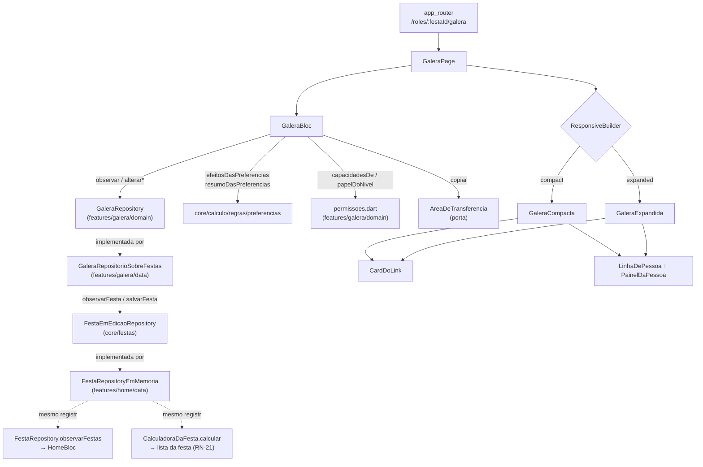
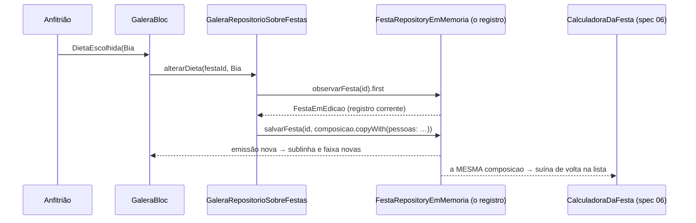

# A galera — Design

**Spec:** `.specs/features/galera/spec.md` (GAL-01..GAL-28)
**Context:** `.specs/features/galera/context.md`
**Status:** Draft
**Decisões ativas herdadas:** AD-001..AD-028 · **AD-026** (link perpétuo, papel lido na abertura) · **AD-022** (contadores são dado, não derivação) · **AD-016** (festa em memória atrás de porta, `Stream`) · **AD-008** (entidades em `core/calculo/dominio/`) · **AD-005** (`AppLogger`) · **AD-017** (guarda de sessão) · **AD-011/AD-012** (tokens e tipografia) · **AD-014** (rota nova afirma o destino) · **AD-021** (`mocktail` só sobre SDK de terceiro)
**Decisões propostas e ainda não registradas que esta spec consome:** **AD-029** (`core/festas/`, proposta por `montar`) · **AD-030** (estado de lista mora nas entidades de `core/`, proposta por `lista`)
**Decisão nova proposta:** **AD-031** — o modelo de acesso do produto: o **dado** (`codigo`, `NivelDoLink`) mora em `core/festas/`, e a **regra** (RN-22 × RN-23) mora em `lib/features/galera/domain/permissoes.dart`, consultável e nunca reimplementada. Ver §12.
**Lições confirmadas:** `python .claude/skills/tlc-spec-driven/scripts/lessons.py list --status confirmed` → **`(no confirmed lessons)`**. Nada a aplicar por esse canal.

---

## 1. Pré-requisito bloqueante — leia antes de planejar tasks

**Esta spec não pode entrar em Execute antes de `montar` (spec 05).** Não é ordem de conveniência: são dependências de compilação que não existem no disco hoje (conferido em 2026-08-27).

| O que falta | Onde nasce | Quem usa aqui |
|---|---|---|
| `lib/core/festas/` — `FestaEmEdicao`, `FestaEmEdicaoRepository`, barrel `festas.dart` | `montar` §6.1/§6.2 (proposta **AD-029**) | **Toda** leitura e escrita desta tela (§2.1) |
| `FestaRepositoryEmMemoria` implementando a segunda porta | `montar` E-2 | A única impl de `FestaEmEdicaoRepository` no M1/M2-pré-09 |
| `ResumoDeFesta.composicao` | `montar` E-3 | É o campo que torna a festa **um registro só** — o que faz GAL-09 e GAL-14 serem verdade |
| `buildAppRouter` já recebendo a porta de edição | `montar` E-4 | A fiação de `GaleraPage` (§4, E-2 daqui) |

`lib/features/galera/` tem hoje só o `PlaceholderPage`; `lib/core/festas/` não existe.

**Consequência para o plano:** `tasks.md` pode ser escrito agora — ele não depende do código. O Execute começa depois do merge de `montar`. Se a ordem inverter, `core/festas/` teria de nascer aqui e as duas specs colidem nos mesmos arquivos.

**`lista` e `galera` continuam paralelizáveis, com uma ressalva:** as duas emendam `core/festas/dominio/festa_em_edicao.dart` (`lista` E-c acrescenta `despesas`, esta spec acrescenta `convite`) e as duas emendam `core/calculo/dominio/composicao_da_festa.dart` (`lista` E-b acrescenta `noCarrinho`, esta acrescenta `copyWith`). São os dois arquivos de colisão. Ver §11.

---

## 2. Abordagens consideradas

A `spec.md` deixou três decisões ao Design (`context.md` §Agent's Discretion) e a A-01 foi escrita **antes** de a AD-029 existir. As duas primeiras são estruturais.

### 2.1 De onde vêm pessoas, código e nível — a decisão que carrega a spec

A A-01 pediu "porta própria `GaleraRepository`, impl em memória sobre **a mesma fonte de dado** da Home", num momento em que a única porta de festa era `FestaRepository`, de leitura só. Hoje existe (proposta) a `FestaEmEdicaoRepository`, e `ComposicaoDaFesta.pessoas` **é** a lista de pessoas nomeadas que esta tela edita.

| # | Abordagem | Consequência |
|---|---|---|
| **A** | `GaleraRepository` com store privado em `features/galera/data/`, semeado em paralelo | Leitura literal da A-01. **Falha GAL-14**: mudar a dieta da Bia não mudaria a lista da festa, porque a lista sai de `ComposicaoDaFesta` de *outro* registro. E **falha GAL-09**: dois registros da mesma festa divergem sem que nada avise. Rejeitada |
| **B** ✅ | `GaleraRepository` em `features/galera/domain/`, **adaptador sobre `FestaEmEdicaoRepository`** em `features/galera/data/`; `codigo` e `nivelDoLink` entram no registro da festa via `FestaEmEdicao.convite` | Um registro por festa. A preferência escrita aqui é a mesma que `CalculadoraDaFesta.calcular` lê — GAL-14 vira consequência estrutural, não disciplina. Honra a A-01 no que ela quis dizer (porta própria, reativa, fonte única) |
| **C** | Sem porta própria: o `GaleraBloc` fala direto com `FestaEmEdicaoRepository` | Uma camada a menos, mas espalha o *read-modify-write* pelo bloc e faz `presentation/` conhecer a porta de `core/` — o Success Criteria "trocar a impl por Firestore não exige mudar nenhum arquivo de `presentation/`" passa a depender de sorte |

**Escolhida: B.** É a única em que "fonte única de dado" é propriedade do desenho e não promessa. O adaptador é também o lugar exato onde o M2 troca *read-modify-write* por *field update* do Firestore, sem que bloc ou widget saibam.

**A A-01 é ajustada, não contrariada:** a porta é própria, é reativa e mora em `features/galera/domain/` — o que muda é que a implementação em memória **não tem store**; ela é uma vista sobre o store que já existe.

### 2.2 Onde mora `NivelDoLink` — dado na `core/`, regra na feature

`Festa` (em `core/calculo/dominio/`) exclui `link` e `nivelDoLink` **de propósito**, e o doc dela diz por quê: *"os dois são RN-22 e RN-23, domínio de `galera`. Esta entidade é estendida por quem precisar."* Esta spec não pode tocar `core/calculo/**` e não deveria: o nível não entra em conta nenhuma.

Mas ele também não pode ficar só na feature: **`convite` (spec 08) precisa do `codigo`** para montar a mensagem (T-06, RN-26b) e **`convidado` (spec 09) precisa do nível** para decidir o papel na abertura (RN-23, AD-026). Dois consumidores fora da feature — a mesma condição que subiu `autenticacao` na AD-019 e a porta de escrita na AD-029.

**Decisão:** o **dado** sobe, a **regra** fica.

| O quê | Onde | Por quê |
|---|---|---|
| `enum NivelDoLink { soVer, editarLista, coAnfitriao }` | `core/festas/dominio/nivel_do_link.dart` | É atributo da festa, como `local` e `duracaoHoras`. Se morasse em `features/galera/`, `core/festas/` teria de importar uma feature — inversão de camada |
| `class ConviteDaFesta { String codigo; NivelDoLink nivel }` em `FestaEmEdicao` | `core/festas/dominio/` | Idem. Agrupado num valor só porque código e nível são o mesmo assunto e viajam juntos para as specs 08 e 09 |
| `Capacidade`, `capacidadesDe(PapelNaFesta)`, `papelDoNivel(NivelDoLink)` | `features/galera/domain/permissoes.dart` | **GAL-19 AC7 exige** — e é o precedente literal de `papel_na_festa.dart`: *"Só o enum: a tabela de permissões de RN-22/RN-23 é domínio de `galera` e não mora nesta camada."* |

O enum é dado; a tabela é regra. É a mesma linha que o projeto já traçou uma vez, para o mesmo par de conceitos.

### 2.3 A chave da linha, e quem guarda "1 aberto por vez"

`BoraExpandableGroup` já resolve "só 1 aberta por vez" (§5) — mas com duas propriedades que não servem aqui:

1. o item é `({String titulo, Widget painel})`, e a linha de T-05 tem avatar, badge "VOCÊ", sublinha, tag de papel **e** caret;
2. o estado é **o índice** da linha aberta. GAL-26 manda o accordion **daquela pessoa** continuar aberto quando um RSVP chega pelo stream; com índice, uma pessoa nova antes dela na lista moveria a abertura para outra pessoa.

E o Edge Case de nomes repetidos mata a chave óbvia: `Pessoa` tem o nome como identidade (`calculo` A-24), então duas Anas colidem — tanto para saber qual linha está aberta quanto para saber **qual das duas** a escrita deve alterar.

**Decisão:** `ChaveDePessoa { String nome, int ocorrencia }`, onde `ocorrencia` é a posição entre os homônimos, na ordem do repositório (A-15). `[Ana, Léo, Ana]` → `Ana#0`, `Léo#0`, `Ana#1`. Estável sob **acréscimo** ao fim, que é a única mutação que o produto produz (RSVP acrescenta; remover pessoa não é oferecido, A-04). A chave é o que o bloc guarda como "aberta" **e** o endereço de toda escrita da porta — um conceito, não dois.

**Consequência:** `BoraExpandableRow`/`BoraExpandableGroup` **não** são usados como widget. Reusamos deles o que é token de comportamento — `caretAberto`, `caretFechado`, `espessuraDaBordaDoPainel` — para que o caret e a borda do painel não sejam números novos. Declarado em §5.3 e coberto por teste.

### 2.4 Quantos blocs — um

Um `GaleraBloc`. O card do link e a lista de pessoas leem **o mesmo** registro da festa; dois blocs assinariam o mesmo stream duas vezes e poderiam mostrar níveis diferentes do mesmo dado por um frame. O bloc vive **acima** do `ResponsiveBuilder`, como em `entrar`, `home` e `montar` — é o que faz GAL-23 AC3 (cruzar 900px preserva accordion aberto e nível selecionado) ser estrutural.

---

## 3. Architecture Overview



**A regra que o diagrama desenha:** existe **uma** seta de escrita saindo da feature, e ela vai para `GaleraRepository`. As três setas que chegam em `FestaRepositoryEmMemoria` (Home, calculadora, galera) partem do **mesmo registro** — é isso, e só isso, que faz GAL-09 e GAL-14 serem verdade sem nenhum mecanismo de sincronia.

---

## 4. Fronteira de arquivos e as emendas

A `spec.md` fechou a fronteira antes de a AD-029 existir e antes de haver desenho. Quatro arquivos fora dela são consequência mecânica da abordagem B — declarados aqui como emendas, no molde da E-1 de `entrar` e das E-1..E-5 de `montar`.

| # | Arquivo | Por quê | Forma |
|---|---|---|---|
| **E-1** | `lib/core/festas/dominio/**` (novo: `nivel_do_link.dart`, `convite_da_festa.dart`; alterado: `festa_em_edicao.dart`, barrel) | §2.2. `core/` não estava na lista porque a `spec.md` supunha que o dado do link ficaria na feature — o que quebraria as specs 08 e 09 | **Aditiva**: `FestaEmEdicao` ganha `convite` **com default** (`ConviteDaFesta.vazio`), entrando em `==`/`hashCode`. Nenhuma assinatura existente muda |
| **E-2** | `lib/core/routing/app_router.dart` | O `builder` de `galera` monta `const GaleraPage()` e **descarta o `festaId`**. Sem tocar aqui, a tela não sabe que festa mostrar. Precedente direto: `HomePage(festas:, logger:)` (spec 04) e a E-4 de `montar` | Um parâmetro novo em `buildAppRouter` (`required GaleraRepository galera`) e um `builder` que lê `state.pathParameters` |
| **E-3** | `lib/core/calculo/dominio/composicao_da_festa.dart` — **só** acrescentar `copyWith` | A composição **não tem `copyWith`**. Sem ele, o adaptador reconstrói `ComposicaoDaFesta(...)` campo a campo — e no dia em que `lista` acrescentar `noCarrinho` (E-b dela), a escrita da Galera **apaga o carrinho em silêncio**, sem teste que perceba. É perda de dado por omissão, a pior classe de bug deste desenho | **Aditiva** e sem comportamento: um método novo, nenhum campo, nenhuma regra. Não é fórmula — a proibição da `spec.md` é sobre aritmética de RN-xx |
| **E-4** | `test/support/app_de_teste.dart` | `abrirApp` precisa aceitar a porta da galera para os testes de rota montarem a tela | Parâmetro **opcional com default**, como o `festas:` que a spec 04 acrescentou |

**Continua intocado**, e é o que protege a baseline: `lib/core/design_system/**`, `lib/core/calculo/regras/**`, `lib/features/home/**`, `lib/features/{entrar,montar,lista,convite,convidado,custos}/**`, `test/support/festa_repository_que_falha.dart` e **todo** teste existente.

**`lib/core/di/injector.dart`** está na fronteira original ("só registro dos próprios"): registra `GaleraRepository` como lazy singleton sobre `getIt<FestaEmEdicaoRepository>()` e o passa a `buildAppRouter`.

---

## 5. Code Reuse Analysis

### 5.1 De `core/calculo` — consumido inteiro, nada reimplementado

| O que | Onde | Uso aqui |
|---|---|---|
| `efeitosDasPreferencias({pessoas, adultos})` | `regras/preferencias.dart` | Os três números da faixa amarela (GAL-13) |
| `resumoDasPreferencias(efeitos)` | `regras/preferencias.dart` | A string **inteira** da faixa. A feature concatena `'💡 '` e nada mais (GAL-13 AC5) |
| `CalculadoraDaFesta.calcular(composicao)` | `regras/calculadora_da_festa.dart` | **Não é chamada pela feature.** É o consumidor a jusante que prova GAL-14: o teste calcula sobre o registro **depois** da escrita da Galera e afirma kit veggie, suína e cerveja |
| `Pessoa`, `Dieta`, `PapelNaFesta`, `StatusDePresenca`, `ComposicaoDaFesta`, `ContagemDePessoas` | `dominio/` | Tipos de trabalho. Nenhuma entidade nova de pessoa nasce aqui (AD-008) |

`Pessoa.copyWith` tem uma limitação que o desenho aceita: com `bebe: bool?`, ela **não desfaz** um valor — dá para pôr `true` ou `false`, nunca voltar a *não declarado*. É exatamente o que T-05 desenha (o toggle tem dois estados, não três), então a limitação não é contornada; é declarada em §14.

### 5.2 De `core/festas` (AD-029) — a porta que já vai existir

`observarFesta(id) → Stream<FestaEmEdicao?>` e `salvarFesta(id, festa)`. `criarFesta` não é usada — a Galera não cria festa.

### 5.3 De `core/design_system` — composto, nunca estendido

| Componente | Uso |
|---|---|
| `BoraSurface` | O card do link (`fundo: BoraColors.ink`, `acento: BoraAccent.purple`), o painel do accordion, os botões de dieta |
| `BoraSegmentedControl` | "QUEM ABRIR O LINK PODE…" (`sobreCardEscuro: true`), "NÍVEL DE ACESSO" (3 opções, ativo `ink` = "ativo preto") e "BEBIDA" (2 opções, ativo preto) |
| `BoraStatusTag` + `BoraStatus` | A tag de papel. As quatro cores de §5 já moram no enum — a feature **mapeia papel → status**, nunca escolhe cor (GAL-08) |
| `BoraAvatar` | O avatar por pessoa, com a cor derivada do nome |
| `BoraToast` | "LINK COPIADO 🔗" — 1 por vez e 2200 ms já são do componente (RN-29, GAL-28) |
| `BoraPrimaryButton` | "+ CONVIDAR MAIS GENTE 🔗" (`acento: BoraAccent.purple`, `larguraTotal: true`) |
| `BoraSecondaryButton` | "COPIAR 🔗" — o botão claro sobre o card escuro |
| `BoraFooterBar` | O rodapé fixo do compacto. **Só no compacto** (W-R2, GAL-22 AC2) |
| `BoraExpandableRow` | **Só as constantes** — `caretAberto`, `caretFechado`, `espessuraDaBordaDoPainel`. Ver §2.3 |
| Tokens (`BoraColors`, `BoraTextStyles`, `BoraSpacing`, `BoraBorders`, `BoraAccent`) | Toda cor, tipo, vão e sombra. Nenhum literal em `lib/features/galera/**` |

**Uma composição sem componente pronto:** T-05 pede "RESTRIÇÃO ALIMENTAR (🍖/🥗/🚫, **ativo vermelho**)", e nenhum componente de §5 tem ativo vermelho. `BotaoDeDieta` é feature widget sobre `BoraSurface`, com o par de cores que §5 já fixou para fundo `primary`: `BoraStatus.paga` usa `fundo: primary, texto: ink` — é o precedente, e nenhuma cor nova entra. T-05 não chama isso de segmented, então são três botões numa linha, e a geometria do `BoraSegmentedControl` **não** é replicada. Candidato a variante do DS (`acentoAtivo:`) numa spec futura — registrado em §14, não feito aqui.

**A faixa amarela não é `BoraDashedNote`.** T-05 pede "faixa amarela borda 2px"; o componente de §3 é tracejado e branco. `FaixaDePreferencias` é `BoraSurface(fundo: BoraColors.yellow)` com o texto de §2 — o emoji-âncora 💡 vem da string, como T-05 escreve.

### 5.4 Padrões de código a repetir

| Padrão | Origem | Aqui |
|---|---|---|
| Bloc assina o stream **na construção** | `HomeBloc` | Não há evento de "carregar": RN-28 tem de chegar sem que a tela peça |
| Estado com `==`/`hashCode` à mão | `HomeState`, `EntrarState` | Sem isso, toda emissão idêntica do repositório reconstrói a lista inteira |
| Bloc **acima** do `ResponsiveBuilder` | `HomePage`, `MontarPage` | GAL-23 AC3 |
| Deps chegam **pelo roteador**, não por `getIt` | `HomePage(festas:, logger:)` | `GaleraPage(festaId:, galera:, logger:)` |
| Chave de página para o teste de rota | `HomePage.pageKey` (AD-014) | `GaleraPage.pageKey` |
| Copy num arquivo só | `home_textos.dart`, `entrar_textos.dart` | `galera_textos.dart` (§9) |
| Falha → `AppLogger` + estado visível, nunca tela branca | `HomeBloc._aoFalhar` | GAL-25 |

---

## 6. Data Models

### 6.1 `NivelDoLink` — novo, em `core/festas/dominio/`

```dart
/// Os três níveis de RN-23. A **nota** de cada um é copy da tela (§9); a
/// tradução para papel é regra e mora em `features/galera/domain/`.
enum NivelDoLink {
  soVer('sover'),
  editarLista('editarlista'),
  coAnfitriao('coanfitriao');

  const NivelDoLink(this.chave);
  final String chave;

  /// `null` para chave desconhecida — quem converte decide (o padrão de
  /// `Dieta.porChave` e `PapelNaFesta.porChave`).
  static NivelDoLink? porChave(String chave);

  /// A-12: **ausente ou desconhecido resolve para [soVer]** (menor
  /// privilégio); **festa nova nasce em [editarLista]**. As duas situações
  /// são diferentes e por isso são dois nomes, não um default só.
  static NivelDoLink resolver(String? chave) => ...;   // GAL-21
  static const NivelDoLink padraoDeFestaNova = editarLista;
}
```

### 6.2 `ConviteDaFesta` — novo, em `core/festas/dominio/`

```dart
class ConviteDaFesta {
  const ConviteDaFesta({required this.codigo, required this.nivel});

  final String codigo;          // 'rafa18' — a Galera **lê**, nunca gera (A-03)
  final NivelDoLink nivel;

  /// O convite de uma festa que ainda não tem código (festa nova, antes de a
  /// spec 09 gerar o dela). `codigo` vazio ⇒ a tela mostra o card sem URL
  /// clicável; ver §14.
  static const ConviteDaFesta vazio =
      ConviteDaFesta(codigo: '', nivel: NivelDoLink.padraoDeFestaNova);

  ConviteDaFesta copyWith({String? codigo, NivelDoLink? nivel});
  // == / hashCode à mão (A-19 de calculo)
}
```

`FestaEmEdicao` ganha `final ConviteDaFesta convite` com default `ConviteDaFesta.vazio`, entrando em `==`/`hashCode` (E-1).

**A URL não mora no dado.** `bora.app/c/<codigo>` é montada por `GaleraTextos.urlDoConvite(codigo)`, num lugar só — e é a **mesma string** exibida e copiada (Edge Case do escape). O host `bora.app` é literal de RN-23/T-05.

### 6.3 `Capacidade` e a tabela de RN-22 — `features/galera/domain/permissoes.dart`

Dart puro: **sem import de Flutter** (GAL-19 AC7), para a spec 09 traduzir em security rules sem arrastar UI.

```dart
enum Capacidade {
  verAFesta, confirmarPresenca, marcarOQueLeva, ajustarALista,
  editarTudo, cobrarAGalera, gerenciarPapeis, configurarNivelDoLink,
}

/// RN-22, linha a linha. As duas últimas capacidades são a diferença que a
/// tabela deixou implícita e que os atores de UC-12/UC-13 fixam (A-19).
const Map<PapelNaFesta, Set<Capacidade>> _tabelaRn22 = { ... };

Set<Capacidade> capacidadesDe(PapelNaFesta papel);
bool pode(PapelNaFesta papel, Capacidade capacidade);

/// RN-23 lido contra RN-22 (GAL-20 AC5).
PapelNaFesta papelDoNivel(NivelDoLink nivel);   // soVer→soVe · editarLista→convidado · coAnfitriao→coAnfitriao

/// Quem está usando o app, pela marca `voce` de `Pessoa` (§14, premissa P-1).
PapelNaFesta papelDoUsuario(List<Pessoa> pessoas);
```

A tabela é `const` e privada; o acesso é pelas duas funções. **O teste percorre as 32 células com valores escritos à mão** (GAL-19) — nunca um laço sobre `_tabelaRn22`, que compararia a tabela consigo mesma e passaria com ela inteira errada.

### 6.4 `ChaveDePessoa` — `features/galera/domain/`

```dart
/// O endereço estável de uma linha: nome + ocorrência entre homônimos (§2.3).
class ChaveDePessoa {
  const ChaveDePessoa(this.nome, this.ocorrencia);
  final String nome;
  final int ocorrencia;

  /// As chaves de [pessoas], na ordem do repositório (A-15).
  static List<ChaveDePessoa> de(List<Pessoa> pessoas);

  /// O índice de [chave] em [pessoas], ou `null` se ela não existe mais —
  /// o caso de a pessoa sumir entre a abertura do painel e a escrita.
  static int? indiceEm(List<Pessoa> pessoas, ChaveDePessoa chave);
}
```

### 6.5 `GaleraDaFesta` — o modelo de leitura, `features/galera/domain/`

```dart
class GaleraDaFesta {
  const GaleraDaFesta({
    required this.festaId,
    required this.convite,
    required this.composicao,
  });

  final String festaId;
  final ConviteDaFesta convite;
  final ComposicaoDaFesta composicao;

  List<Pessoa> get pessoas => composicao.pessoas;

  /// GAL-09 AC8: **derivado**, e tem de bater com o `confirmados` do
  /// `ResumoDeFesta` da mesma festa (AD-022). A Galera nunca escreve contador.
  int get confirmados => ...;
}
```

Carrega a `ComposicaoDaFesta` inteira, e não só `pessoas`, por dois motivos: `efeitosDasPreferencias` exige `adultos` (que vem de `contagem`), e a escrita é `composicao.copyWith(pessoas: …)` — com a lista solta, o adaptador teria de remontar a composição do zero, que é o buraco que a E-3 fecha.

### 6.6 `GaleraState` — `presentation/bloc/`

```dart
enum SituacaoDaGalera { carregando, comFesta, falhou }

class GaleraState {
  final SituacaoDaGalera situacao;
  final GaleraDaFesta? galera;
  final ChaveDePessoa? aberta;        // null ⇒ nenhum painel aberto (§2.3)
  final int copiasConcluidas;         // §8.2 — o gatilho do toast
}
```

`aberta` mora no **bloc**, não no widget: é o que faz GAL-26 (o accordion sobrevive à emissão do stream) e GAL-23 AC3 (sobrevive a cruzar 900px) serem estruturais em vez de sorte de `State`.

---

## 7. Components

### 7.1 `GaleraRepository` — porta, `features/galera/domain/`

```dart
abstract class GaleraRepository {
  Stream<GaleraDaFesta?> observarGalera(String festaId);

  Future<void> alterarDieta(String festaId, ChaveDePessoa quem, Dieta dieta);
  Future<void> alterarBebida(String festaId, ChaveDePessoa quem, bool bebe);
  Future<void> alterarPapel(String festaId, ChaveDePessoa quem, PapelNaFesta papel);
  Future<void> definirNivelDoLink(String festaId, NivelDoLink nivel);
}
```

**Quatro escritas com intenção, não um `salvar(estado)`.** É o que torna GAL-18 ("a festa continua com exatamente 1 anfitrião") e GAL-09 ("a Galera nunca escreve contador") afirmáveis **pela forma da porta**: não existe método que toque `status`, e `alterarPapel` recusa o alvo anfitrião. E é o que o M2 troca por *field update* do Firestore, um a um.

Sem `dispose()`: o dono do ciclo de vida do store é a porta de leitura da Home, já registrada com `dispose` no injector (mesmo argumento da `FestaEmEdicaoRepository`).

### 7.2 `GaleraRepositorioSobreFestas` — adaptador, `features/galera/data/`

- **Reusa**: `FestaEmEdicaoRepository` (AD-029).
- `observarGalera` = `observarFesta(id).map(...)`, convertendo `FestaEmEdicao?` em `GaleraDaFesta?`.
- Cada escrita: **lê o registro corrente**, aplica a mudança, chama `salvarFesta`.

**A regra que evita o clobber:** a escrita lê `await observarFesta(id).first` **no instante da chamada** — nunca um snapshot guardado pelo bloc ou pela tela. Sem isso, um painel aberto há um minuto gravaria por cima do que a lista escreveu nesse minuto. Com isso, a janela é o próprio turno do event loop.

**A recusa de GAL-18** mora aqui e no domínio, não na tela: `alterarPapel` com alvo cujo papel corrente é `anfitriao` **não escreve** e registra no logger. É a resposta ao Edge Case *"alguém tenta chegar ao controle de papel por outro caminho"* — a capacidade não existe para o alvo anfitrião, independentemente de quem pede.

**Idempotência (GAL-28):** cada escrita compara antes de gravar; valor igual ⇒ **nenhuma** chamada a `salvarFesta`. Afirmado com um duplo que conta gravações, não com "a tela não mudou".

### 7.3 `AreaDeTransferencia` — porta + adaptador (A-07)

```dart
// domain/ — Dart puro
abstract class AreaDeTransferencia {
  Future<void> copiar(String texto);
}

// data/ — o único arquivo da feature que importa flutter/services.dart
class AreaDeTransferenciaDoSistema implements AreaDeTransferencia { ... }  // Clipboard.setData
```

Chega à página como `const AreaDeTransferenciaDoSistema()` **por default** (não pelo roteador): é serviço de plataforma sem configuração e sem ciclo de vida, e o teste sobrescreve pelo parâmetro. O repositório, que tem estado, continua vindo do roteador.

### 7.4 `GaleraBloc` — `presentation/bloc/`

- **Interface**: `GaleraBloc(String festaId, GaleraRepository galera, AreaDeTransferencia area, AppLogger logger)`
- Assina `observarGalera(festaId)` na construção.
- **Eventos**: `GaleraRecebida`, `ObservacaoFalhou`, `LinhaAlternada(chave)`, `DietaEscolhida(chave, dieta)`, `BebidaAlternada(chave, bebe)`, `PapelEscolhido(chave, papel)`, `NivelEscolhido(nivel)`, `LinkCopiado`.
- **Não navega** (AD-020 e o precedente do `HomeBloc`).
- **Não calcula.** Chama `efeitosDasPreferencias` e `resumoDasPreferencias`; nenhuma outra aritmética existe na feature (GAL-15, §13).
- `LinhaAlternada` com a chave já aberta **fecha** — é a mesma intenção de `BoraExpandableGroup`.
- `GaleraRecebida` **preserva `aberta`** se a chave ainda existe na lista nova; descarta se sumiu (GAL-26).

### 7.5 `GaleraPage` e os widgets

- `GaleraPage({required String festaId, required GaleraRepository galera, required AppLogger logger, AreaDeTransferencia area = const AreaDeTransferenciaDoSistema()})`, com `static const Key pageKey = Key('galera')` (AD-014).
- `BlocProvider` → `BlocBuilder` → `ResponsiveBuilder` → `GaleraCompacta` | `GaleraExpandida`.
- Um `BlocListener` sobre `copiasConcluidas` dispara `BoraToast.mostrar` (§8.2).

| Widget | Papel |
|---|---|
| `GaleraCompacta` | T-05: header, card do link, faixa, seção PESSOAS, `BoraFooterBar` com o CTA |
| `GaleraExpandida` | W-04: coluna esquerda de **370px** (card do link + CTA logo abaixo, A-17), lista à direita; **sem** rodapé (W-R2). Rolagem só no documento (W-R4) |
| `CardDoLink` | O card escuro inteiro. Recebe `podeConfigurarNivel` — `false` ⇒ o segmented **some da árvore**, URL e "COPIAR 🔗" ficam (GAL-27 AC1) |
| `FaixaDePreferencias` | `'💡 ' + resumoDasPreferencias(...)`. String vazia ⇒ **não renderiza** (GAL-13 AC7) |
| `LinhaDePessoa` | Avatar, nome, badge "VOCÊ", sublinha, `BoraStatusTag`, caret |
| `PainelDaPessoa` | Anfitrião ⇒ **só** a nota 👑. Demais ⇒ NÍVEL DE ACESSO (condicionado a `podeGerenciarPapeis`), RESTRIÇÃO ALIMENTAR, BEBIDA |
| `BotaoDeDieta` | O botão de ativo vermelho (§5.3) |

Os dois layouts compartilham `CardDoLink`, `FaixaDePreferencias` e `LinhaDePessoa` — W-R1 exige o mesmo estado, e copy duplicada em dois arquivos diverge no primeiro ajuste.

---

## 8. Fluxos que valem um diagrama

### 8.1 A preferência que muda a lista (GAL-14) — por que não há sincronia nenhuma



O teste de GAL-14 não monta a tela da lista (que é da spec 06): ele chama `CalculadoraDaFesta.calcular` sobre o registro **depois** da escrita e afirma o item. É o aceite de UC-11 verificado no ponto onde ele é verdadeiro, sem depender de uma spec que ainda não existe.

**GAL-15 AC12 (o override sobrevive)** cai fora de graça: `overrides` é outro campo da composição e a escrita da Galera só toca `pessoas`. Com a E-3 (`copyWith`), isso é garantido pela ausência do campo na chamada; sem ela, dependeria de o adaptador lembrar de copiá-lo.

### 8.2 A cópia e o toast (GAL-03, GAL-05, GAL-28)

`LinkCopiado` → `area.copiar(url)`. **Sucesso** ⇒ `copiasConcluidas + 1`. **Falha** ⇒ `logger.logError` e o contador **não** muda.

O `BlocListener` compara `previous.copiasConcluidas != current.copiasConcluidas` e só então chama `BoraToast.mostrar`. Assim:

- os dois botões (GAL-03 AC6 e AC7) disparam o **mesmo** evento, e não há como divergirem;
- na falha não existe toast de sucesso, porque não existe incremento (GAL-05) — e nenhuma copy de erro é inventada;
- dois toques seguidos produzem um toast por vez, porque `BoraToast` já substitui o anterior (RN-29).

Um `bool copiou` não serviria: duas cópias seguidas não mudariam o estado, e o segundo toast não sairia.

### 8.3 O nível que não retroage (GAL-04)

`definirNivelDoLink` escreve **só** `convite.nivel`. `pessoas` não é argumento e não é tocada. O aceite de UC-13 deixa de ser disciplina: não há caminho de código, nesta feature, que escreva `papel` a partir de `nivel` — `papelDoNivel` é consultada pela **spec 09**, no momento da abertura do link, e por ninguém aqui.

---

## 9. Copy — literal, e num arquivo só

`presentation/galera_textos.dart`, no molde de `home_textos.dart`. Tudo abaixo é literal de T-05, RN-21, RN-23 ou RN-29, exceto os três itens marcados.

| Constante | Valor | Fonte |
|---|---|---|
| `titulo` | `A GALERA` | T-05 |
| `subtitulo(pessoas)` | `{n} pessoa(s) · {n} confirmada(s)` — com a fixture, `5 pessoas · 4 confirmadas` | T-05 **derivado** (A-10) |
| `semPessoas` | `nenhuma pessoa ainda` | **Premissa A-08** — declarada |
| `labelDoLink` | `LINK PRA CONVIDAR` | T-05 |
| `urlDoConvite(codigo)` | `bora.app/c/{codigo}` | RN-23 |
| `copiar` | `COPIAR 🔗` | T-05 |
| `quemAbrirPode` | `QUEM ABRIR O LINK PODE…` | T-05 |
| `niveis` | `SÓ VER` · `EDITAR LISTA` · `CO-ANFITRIÃO` | T-05 / RN-23 |
| `notaDoNivel(nivel)` | `convidados só veem a festa e confirmam presença` · `convidados marcam o que levam e ajustam a lista` · `acesso total: editam tudo e cobram a galera` | **RN-23, literais** |
| `faixa(resumo)` | `💡 ` + `resumoDasPreferencias(...)` | T-05 + RN-21 |
| `secaoPessoas` | `PESSOAS` | T-05 |
| `badgeVoce` | `VOCÊ` | T-05 |
| `sublinhaDe(pessoa)` | `{dieta} · bebe 🍺` / `{dieta} · não bebe 🚫`, omitindo o termo não declarado | T-05 + RN-21 (A-13, A-14) |
| `dietas` | `🍖 Come de tudo` · `🥗 Veggie` · `🚫 Sem porco` | **RN-21, literais** (A-13) |
| `secaoNivelDeAcesso` / `secaoRestricao` / `secaoBebida` | `NÍVEL DE ACESSO` · `RESTRIÇÃO ALIMENTAR` · `BEBIDA` | T-05 |
| `bebe` / `naoBebe` | `BEBE 🍺` · `NÃO BEBE 🚫` | T-05 |
| `papeis` | `CONVIDADO` · `CO-ANFITRIÃO` · `SÓ VÊ` | T-05 / RN-22 — vêm de `BoraStatus.rotulo`, não redigitados |
| `notaDoAnfitriao` | `👑 Anfitrião manda em tudo — acesso fixo.` | T-05 |
| `convidarMaisGente` | `+ CONVIDAR MAIS GENTE 🔗` | T-05 |
| `linkCopiado` | `LINK COPIADO 🔗` | **RN-29** — via `BoraToastTexts` se já estiver lá |
| `falha` | `NÃO DEU PRA CARREGAR A GALERA` | **SPEC_PRECISION_GAP** — ver §14 |

---

## 10. Error Handling Strategy

| Cenário | Tratamento | O que o usuário vê |
|---|---|---|
| Stream do repositório falha (GAL-25) | `logger.logError(name: 'galera')`; `situacao = falhou` por `copyWith` — o que já chegou continua válido, como no `HomeBloc` | A faixa de falha; o card do link e o CTA permanecem |
| `observarFesta` emite `null` (festa inexistente) | Mesmo estado `falhou` | Idem — nenhuma copy nova para um caso que a spec-fonte não desenha (§14) |
| Área de transferência falha (GAL-05) | `logger.logError`; **sem** incremento, **sem** toast | Nada muda; a URL continua na tela para cópia à mão |
| `salvarFesta` falha | `logger.logError`; o estado não muda porque a fonte da verdade é o stream — a UI simplesmente não reflete a mudança | Nenhuma copy de erro (não existe na spec-fonte) |
| `alterarPapel` com alvo anfitrião (GAL-18) | Não escreve; `logger.logEvent` | Impossível de alcançar pela tela — o painel do anfitrião não tem o controle |
| Escrita em pessoa que sumiu do registro | `ChaveDePessoa.indiceEm` devolve `null`; não escreve | Nada |

---

## 11. Risks & Concerns

| Concern | Onde | Impacto | Mitigação |
|---|---|---|---|
| **Colisão de merge com `lista`** em `core/festas/dominio/festa_em_edicao.dart` (E-c dela × E-1 daqui) e em `composicao_da_festa.dart` (E-b dela × E-3 daqui) | `core/festas/`, `core/calculo/dominio/` | Conflito textual se as duas rodarem em worktrees paralelos | As quatro emendas são **aditivas com default** — o conflito é textual, não semântico. Quem mergear depois rebaseia. Se possível, `galera` executa depois de `lista` |
| **Dependência de duas ADs não registradas** (AD-029, AD-030) | `.specs/STATE.md` | Se `montar` renumerar de novo, AD-031 muda de número | O handoff já registra uma colisão assim (AD-023→AD-029). A numeração é conferida na task que grava a AD, não antes |
| **Read-modify-write no adaptador** | `data/galera_repositorio_sobre_festas.dart` | Escrita concorrente da lista/montar pode ser sobrescrita | Ler o registro **no instante da escrita** (§7.2) e escrever só o campo da intenção. No M2, *field update* do Firestore elimina a janela |
| **`ComposicaoDaFesta` sem `copyWith`** | `core/calculo/dominio/composicao_da_festa.dart` | Reconstrução campo a campo **apaga em silêncio** campos que outras specs acrescentarem (`noCarrinho` de `lista`) | Emenda **E-3** — e é a razão de ela existir |
| **`ResumoDeFesta.confirmados` pode divergir da lista de pessoas** (custo declarado da AD-022) | `features/home/domain/resumo_de_festa.dart` | GAL-09 AC8 quebraria sem nada avisar | A porta desta feature **não tem** método que toque `status` (§7.1). Teste: depois de cada uma das quatro escritas, `ResumoDeFesta.confirmados` inalterado e igual à contagem de confirmados. A obrigação de manter os dois em sincronia ao gravar RSVP continua sendo da spec 09 |
| **`permissoes.dart` será importado pela spec 09** (acoplamento feature↔feature) | `features/galera/domain/` | O que a AD-019 e a AD-029 subiram para `core/` por bem menos | **Sancionado pela GAL-19 AC7**, que nomeia a pasta. Fica registrado como candidato à promoção para `core/` no M2, junto com `FestaRepository` (o mesmo movimento que a AD-029 já prevê) |
| **`BoraExpandableGroup` não é usado** apesar de existir para isto | `core/design_system/components/` | Risco de a Galera divergir do "1 aberta por vez" de §5 | §2.3 dá o motivo (item só com `String` e estado por índice). Reuso das constantes + teste afirmando um painel aberto por vez e o caret correto nos dois estados |
| **A tela do não-anfitrião (GAL-27) não é alcançável no produto** | `features/galera/presentation/` | Defesa nunca exercida — a classe de bug que o `home` já registrou | O par que discrimina é montar **duas vezes**, trocando só quem é `voce`: presença num, ausência (`findsNothing`) no outro |
| **`papelDoUsuario` sem ninguém marcado `voce`** | `domain/permissoes.dart` | Decide se o anfitrião de uma festa nova vê o segmented | Premissa **P-1** (§14), isolada numa função pura — trocar a decisão é trocar uma linha |

---

## 12. Tech Decisions

| Decisão | Escolha | Racional |
|---|---|---|
| Fonte do dado | Adaptador sobre `FestaEmEdicaoRepository` | §2.1 — é o que faz GAL-09 e GAL-14 serem estruturais |
| Onde mora o nível do link | Dado em `core/festas/`, regra em `features/galera/domain/` | §2.2 — precedente literal de `papel_na_festa.dart` |
| Forma da porta | Quatro escritas com intenção | §7.1 — GAL-18 e GAL-09 afirmáveis pela forma |
| Chave da linha | `ChaveDePessoa(nome, ocorrencia)` | §2.3 — o Edge Case dos homônimos exige, e a escrita ganha endereço |
| "1 aberto por vez" | No `GaleraBloc`, por chave | GAL-26 e GAL-23 AC3 |
| Gatilho do toast | Contador `copiasConcluidas` + `BlocListener` | §8.2 — um `bool` perderia a segunda cópia |
| Área de transferência | Porta, com adaptador `const` por default na página | §7.3 |
| Nível ausente/desconhecido | `NivelDoLink.resolver` → `soVer`; festa nova → `editarLista` | A-12: menor privilégio para dado, default de produto para festa nova |
| Faixa amarela | `BoraSurface` amarelo, **não** `BoraDashedNote` | §5.3 — o componente de §3 é tracejado e branco |
| Botão de dieta | Feature widget com `fundo: primary, texto: ink` | §5.3 — o par que `BoraStatus.paga` já fixou |

### AD proposta — **AD-031** (a registrar em `.specs/STATE.md` na primeira task do Execute)

> **Decision**: O modelo de acesso do BORA tem duas metades e elas moram em lugares diferentes. O **dado** — `enum NivelDoLink` e `ConviteDaFesta { codigo, nivel }`, campo de `FestaEmEdicao` — mora em `lib/core/festas/dominio/`. A **regra** — `enum Capacidade` (as oito de RN-22), `capacidadesDe(PapelNaFesta)`, `pode(papel, capacidade)` e `papelDoNivel(NivelDoLink)` — mora em `lib/features/galera/domain/permissoes.dart`, em Dart puro, sem import de Flutter. **Nenhuma feature reimplementa a tabela**: `convite`, `convidado` e `custos` consultam estas funções, e as security rules do Firestore da spec 09 são a tradução desta mesma tabela para o servidor. O papel do anfitrião não é atribuível nem removível por nenhum caminho de código.
> **Reason**: RN-22 é herdada por três specs (roadmap §5). Se não nascer consultável, nasce copiada — e três cópias divergem uma a uma sem que nenhum teste perceba. A separação dado/regra repete o que `core/calculo/dominio/papel_na_festa.dart` já declara por escrito para o mesmo par de conceitos ("só o enum: a tabela é domínio de `galera`"), e mantém `core/festas/` sem importar feature nenhuma. O nível sobe para `core/` porque tem dois consumidores fora da `galera` (o `codigo` na spec 08, o `nivel` na spec 09) — a mesma condição que motivou a AD-019 e a AD-029.
> **Trade-off**: as specs 08/09/10 passam a importar de `features/galera/domain/`, acoplamento feature↔feature que a AD-019 evitou em outro contexto. É sancionado pela GAL-19 AC7, que nomeia a pasta, e fica como candidato à promoção para `core/` no M2 — junto com a promoção de `FestaRepository` que a AD-029 já prevê.
> **Scope**: specs 07 `galera`, 08 `convite`, 09 `convidado` e 10 `custos`; e toda decisão futura de "quem pode o quê".

---

## 13. O guard de GAL-15 — a fórmula não vaza

Varredura sobre `lib/features/galera/**`, no molde de `test/architecture/calculo_isolation_test.dart`, **nomeando o arquivo infrator**. Depois de remover comentários e literais de string, nenhum arquivo pode conter:

| # | Proibido | Por quê |
|---|---|---|
| 1 | `0.4`, `0.3`, `0.15`, `0.5` e as demais constantes de RN-03/RN-05 | Quantidade por pessoa é da camada |
| 2 | `veggie ≥ 1`, `adultosQueBebem`, `max(0, adultos -` reescritos | RN-21 é `efeitosDasPreferencias`, não código daqui |
| 3 | `A lista já se ajusta às preferências` como template com interpolação | A frase inteira vem de `resumoDasPreferencias` (GAL-13 AC5); só a concatenação de `'💡 '` é da feature |
| 4 | `math.` fora de zero ocorrências | Não há aritmética a fazer aqui |

Mais dois guards herdados, sobre a mesma pasta: **nenhum literal de cor, fonte ou sombra** (spec 01) e **nenhum import de Flutter em `features/galera/domain/`** (GAL-19 AC7). O terceiro é o que garante que a spec 09 consiga traduzir a tabela sem arrastar UI — e é afirmado por varredura, não por convenção.

---

## 14. Desvios e lacunas declarados

- **P-1 — quem é o usuário do app quando ninguém está marcado `voce`.** `papelDoUsuario` devolve **`anfitriao`**. Racional: `/roles/:festaId/**` está atrás da guarda de sessão (AD-017) e é a área do dono do rolê; uma festa sem pessoa nomeada é uma festa recém-criada, e GAL-24 AC2 exige que o card do link e o CTA continuem **funcionais** ali. Não contraria a A-12: menor privilégio lá trata de **dado desconhecido que concede acesso a estranhos**; aqui o sujeito é o dono autenticado da rota. A decisão vive numa função pura; a autorização de verdade é servidora e nasce na spec 09.
- **`GaleraTextos.falha`** é **SPEC_PRECISION_GAP**: nenhuma tela de `04` ou `06` desenha a Galera falhando. A frase copia a voz que `HomeTextos.falha` e `EntrarTextos.indisponivel` já fixaram. Premissa, não literal de spec.
- **Festa inexistente** (`observarFesta` emite `null`) cai no mesmo estado `falhou`. A spec-fonte não desenha o caso e inventar copy própria seria pior — o requisito que vale (GAL-25) é "nunca tela branca".
- **`codigo` vazio** (festa criada antes de a spec 09 gerar códigos): o card do link renderiza sem URL e "COPIAR 🔗" fica desabilitado. Nenhuma copy nova; é o estado honesto de uma festa sem link, e some quando a 09 entrar. Não há AC para ele.
- **A bebida não volta a "não declarado"** depois do primeiro toque (§5.1). É o que T-05 desenha — toggle de dois estados. A Duda perde a distinção de A-14 assim que alguém tocar no toggle dela, e isso muda a cerveja de RN-21. Consequência aceita da tela literal, não descuido.
- **D-2 da `spec.md` (orçamento de acento) continua violada** na leitura estrita de §8: roxo e amarelo são estruturais, o vermelho é estado ativo. Declarada, não silenciada.
- **Variante de segmented com acento** (`BoraSegmentedControl(acentoAtivo:)`) é candidata ao design system; não é feita aqui porque a spec 01 está fora da fronteira.

---

## 15. Mapa requisito → componente

| ID | Onde vive |
|---|---|
| GAL-01 | `CardDoLink` + `GaleraTextos` (§9) |
| GAL-02 | `GaleraTextos.notaDoNivel` |
| GAL-03 | `GaleraBloc.LinkCopiado` + `BlocListener` → `BoraToast` (§8.2) |
| GAL-04 | `GaleraRepository.definirNivelDoLink` (§8.3) |
| GAL-05 | `AreaDeTransferencia` + o não-incremento de `copiasConcluidas` (§8.2) |
| GAL-06 | `GaleraTextos.subtitulo` sobre `GaleraDaFesta` |
| GAL-07 | `LinhaDePessoa` + `GaleraTextos.sublinhaDe` |
| GAL-08 | mapa `PapelNaFesta → BoraStatus` em `LinhaDePessoa` |
| GAL-09 | `GaleraDaFesta.confirmados` × `ResumoDeFesta.confirmados` (§11) |
| GAL-10 | `GaleraState.aberta` + `LinhaDePessoa`/`PainelDaPessoa` (§2.3) |
| GAL-11 | `alterarDieta` |
| GAL-12 | `alterarBebida` |
| GAL-13 | `FaixaDePreferencias` sobre `resumoDasPreferencias` |
| GAL-14 | o registro único + `CalculadoraDaFesta.calcular` no teste (§8.1) |
| GAL-15 | o guard de §13 + `ComposicaoDaFesta.copyWith` (E-3) |
| GAL-16 | `PainelDaPessoa` — ramo do anfitrião |
| GAL-17 | `alterarPapel` |
| GAL-18 | `alterarPapel` recusa o alvo anfitrião; nenhum método escreve `anfitriao` |
| GAL-19 | `permissoes.dart` — `capacidadesDe` |
| GAL-20 | `permissoes.dart` — `papelDoNivel` |
| GAL-21 | `NivelDoLink.resolver` / `padraoDeFestaNova` |
| GAL-22 | `GaleraExpandida` (370px, CTA à esquerda, sem rodapé) |
| GAL-23 | bloc acima do `ResponsiveBuilder`; rolagem só no documento |
| GAL-24 | `GaleraTextos.semPessoas` + faixa ausente |
| GAL-25 | `GaleraBloc._aoFalhar` + `AppLogger` (§10) |
| GAL-26 | `GaleraRecebida` preserva `aberta` (§7.4) |
| GAL-27 | `podeConfigurarNivel` / `podeGerenciarPapeis` a partir de `papelDoUsuario` |
| GAL-28 | comparação antes da escrita no adaptador (§7.2) |

**Cobertura:** 28 de 28 · 0 órfãos.
