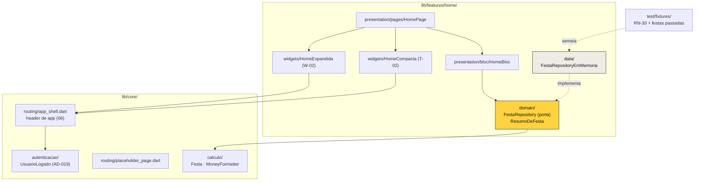

# Home — Design

**Spec**: `.specs/features/home/spec.md`
**Context**: `.specs/features/home/context.md`
**Status**: Draft — aguardando aprovação para Tasks
**Decisões ativas conferidas**: AD-001..AD-021 (`.specs/STATE.md`). Nenhuma é superada; **AD-016** (dado em memória), **AD-019** (`core/autenticacao/`) e **AD-020** (navegação por guarda) são consumidas como estão. Uma nasce deste design: **AD-022** (contadores da Home são dado da festa, não derivados).
**Lições confirmadas**: `lessons.py list --status confirmed` → vazio. As candidatas L-002 e L-008 informaram a §Estratégia de teste como raciocínio próprio.

---

## A questão que o design teve de resolver primeiro

RN-30 declara a festa exemplo com **cinco pessoas nomeadas** (4 confirmadas + Duda) e, na mesma frase, **"4 confirmados / 2 pendentes na Home"**. Os números não fecham: 4 + 2 = 6, e só há 5 pessoas.

Não é descuido de leitura minha — a fundação viu, preservou e **deixou registrado para esta spec resolver**. A fixture diz, no próprio doc: *"`confirmadosNaHome: 4` e `pendentesNaHome: 2` convivem com as cinco pessoas nomeadas de propósito: são os números literais de RN-30. A fixture não reconcilia — quem reconcilia é a spec 04."* E há um teste que **afirma a divergência** (`rn30_estado_inicial_test.dart:90-96`), justamente para ninguém "consertar" em silêncio.

**A resolução: os contadores são dado da festa, não derivação da lista de pessoas** (AD-022).

E isso não é conveniência para bater o literal — é o modelo certo. "Pendente" é quem foi **convidado e ainda não respondeu**, e no produto real o convite sai por link (RN-24): quem recebeu o link e não abriu não é uma `Pessoa` nomeada ainda. Derivar o contador da lista de nomeados tornaria impossível representar exatamente o caso que o produto tem de representar — e o número da Home passaria a mentir assim que o primeiro link fosse enviado.

Consequência direta: `HOME-06` continua exigindo a string literal `"4 confirmados · 2 pendentes"`, e ela sai do dado, não de uma contagem.

---

## Architecture Overview



**A seta que importa**: `HomeBloc → FestaRepository` (porta), nunca para a implementação. É o que permite trocar memória por Firestore no M2 sem tocar em bloc nem em tela — a promessa da AD-016.

---

## Code Reuse Analysis

| Componente | Local | Como é usado |
|---|---|---|
| `Festa`, `StatusDaFesta` | `core/calculo/dominio/` (AD-008) | A entidade da festa **já existe** — este design não cria outra |
| `MoneyFormatter` | `core/calculo/formatacao/` | Total das festas passadas (RN-13, HOME-14 AC3) |
| `UsuarioLogado.inicial` | `core/autenticacao/` (AD-019) | Inicial do avatar no header (HOME-01 AC2) |
| `BoraSurface`, `BoraRotatedTag`, `BoraPrimaryButton`, `BoraSecondaryButton`, `BoraAvatar`, `BoraDashedNote` | `core/design_system/components/` | Card da festa, tag de data +3°, botões, avatares empilhados, slot tracejado do NIVER |
| `BoraColors.yellow` | `core/design_system/tokens/` | Avatar do header e atalho do acerto (A-08) |
| `ResponsiveBuilder` + `LayoutMode` | `core/responsive/` (AD-007) | Split T-02 ⇄ W-02 em 900 |
| `GoRouterRefreshStream` | `core/routing/` | **Não** aqui — a Home usa `BlocBuilder`; a ponte é do roteador |
| `abrirApp` | `test/support/app_de_teste.dart` | Helper de teste de rota criado na spec 03 |
| `pumpComponent`, `carregarFontesArchivo` | `test/core/design_system/support/` | Testes de widget; **fontes obrigatórias** aqui, porque a Home mede muito texto |
| Fixture RN-30 (bruta e tipada) | `test/fixtures/` | Semente da impl em memória — **estendida, nunca reescrita** |

### Pontos de integração

| Sistema | Como conecta |
|---|---|
| Guarda de sessão (AD-017) | `/roles` já é rota protegida. A Home **não** verifica sessão — chegar aqui já prova que há uma |
| `core/autenticacao` | Só para `UsuarioLogado.inicial`. A Home não autentica nem desloga |
| Firestore | **Nada.** A porta existe para que o M2 o acrescente sem tocar nesta camada |

---

## Components

### `ResumoDeFesta`
- **Purpose**: a festa **como a Home precisa dela** — a entidade mais os números que só a Home mostra.
- **Location**: `lib/features/home/domain/resumo_de_festa.dart`
- **Interfaces**: `Festa festa`, `int confirmados`, `int pendentes`, `List<String> iniciais`, `int pessoas`, `double? total`
- **Nota**: **não** substitui `Festa` (AD-008) — a compõe. `confirmados`/`pendentes` moram aqui, e não em `Festa`, porque são estado de convite, não atributo da festa; e `pessoas`/`total` só existem para festa concluída (o arquivo de UC-24). Igualdade de valor, porque o `Stream` compara emissões.

### `FestaRepository` (porta)
- **Location**: `lib/features/home/domain/festa_repository.dart`
- **Interfaces**:
  - `Stream<List<ResumoDeFesta>> observarFestas()` — **`Stream`, não `Future`** (A-02)
  - `Future<void> dispose()`
- **Nota**: um método só. A Home não cria, não edita e não apaga festa — `/roles/novo` é da spec 05. Uma porta com métodos que ninguém chama seria contrato inventado.
- **Por que um stream sem produtor no M1**: RN-28 exige que o contador mude **sem refresh**. Ler uma vez e desenhar faria a spec 09 reescrever a Home inteira. O `Stream` é o contrato que sobrevive à troca de implementação.

### `FestaRepositoryEmMemoria`
- **Location**: `lib/features/home/data/festa_repository_em_memoria.dart`
- **Interfaces**: implementa a porta; `void emitir(List<ResumoDeFesta>)` para o teste empurrar mudança.
- **Nota**: é **código de produção**, não duplo de teste — é a implementação que o M1 roda de verdade (AD-016). Semeada pela fixture RN-30 por injeção, para que `lib/` não importe `test/`.

### `AppShell` (revestido)
- **Location**: `lib/core/routing/app_shell.dart` (modificar)
- **Nota**: preserva `AppShell.chromeKey` — os testes de `FUND-08` dependem dela e não podem ser enfraquecidos. A ação `+ NOVO ROLÊ` **só existe em expandido** (A-07): T-02 não desenha barra de app nenhuma.

### `HomeBloc`
- **Location**: `lib/features/home/presentation/bloc/`
- **Estado**: `carregando | comFestas(ativas, passadas) | vazia | falhou`
- **Nota**: assina `observarFestas()` no construtor e emite a cada chegada. **Não navega** (AD-020 vale igual aqui); os toques devolvem rota por callback e quem chama `context.go` é a página.

### `HomePage`, `HomeCompacta`, `HomeExpandida`
- **Location**: `lib/features/home/presentation/`
- **Nota**: mesmo padrão de `entrar` — bloc acima do `ResponsiveBuilder`, layouts só desenham. Aqui a navegação **é** imperativa (`context.go` para montar/whatsapp/custos), e isso não fere a AD-020: ela proíbe navegar por efeito de **sessão**, não por toque em botão.

---

## Data Models

```dart
class ResumoDeFesta {
  const ResumoDeFesta({
    required this.festa,
    this.confirmados = 0,
    this.pendentes = 0,
    this.iniciais = const [],
    this.pessoas,
    this.total,
  });

  final Festa festa;

  /// AD-022: dado, não derivação. "Pendente" é quem recebeu o link e ainda
  /// não respondeu — e quem não respondeu não é uma `Pessoa` nomeada ainda.
  final int confirmados;
  final int pendentes;

  /// As iniciais dos avatares empilhados, na ordem de exibição.
  final List<String> iniciais;

  /// Só para festa concluída (UC-24). `null` na que está chegando.
  final int? pessoas;
  final double? total;

  bool get ehPassada => festa.status == StatusDaFesta.passada;

  /// Quantos avatares não couberam — o "+N" tracejado de T-02.
  int excedenteDeAvatares(int visiveis) =>
      (confirmados - visiveis).clamp(0, confirmados);
}
```

---

## Error Handling Strategy

| Cenário | Tratamento | O que o usuário vê |
|---|---|---|
| Repositório emite lista vazia | Estado `vazia` | "nenhuma festa chegando" + "COMEÇAR OUTRA" (HOME-15) |
| Stream emite erro | Estado `falhou` + `AppLogger` | Mensagem de falha; "COMEÇAR OUTRA" permanece acessível |
| Festa sem passadas | Seção ARQUIVO renderiza vazia | Sem linha, sem erro (HOME-15 AC3) |
| Toque duplo em "MONTAR LISTA →" | Navegação idempotente por rota | Uma navegação (HOME-17) |
| Confirmação chega com a tela montada | `BlocBuilder` reconstrói | Contadores novos + atalho amarelo (HOME-09/10) |

---

## Estratégia de teste

Herda a regra da spec 03 e acrescenta duas:

1. **Copy da spec → literal no teste; token → o token.** Já valia; segue valendo.
2. **Fontes reais obrigatórias.** A Home mede muito texto em card estreito. Sem `carregarFontesArchivo`, `flutter test` usa fonte de glifo fixo e o layout estoura por artefato — o que já aconteceu em `entrar` e custou uma rodada de diagnóstico.
3. **Todo contador vem do dado, e o teste prova isso mudando o dado.** Afirmar só "4 confirmados · 2 pendentes" passaria com a string escrita à mão na tela. O par: mudar a fixture para outro número e ver a tela acompanhar.
4. **RN-28 tem par discriminante obrigatório**: com confirmação nova, atalho presente; sem, ausente. Um teste que só afirme presença passa com o botão sempre visível.

---

## Emendas de fronteira

| # | Arquivo | Mudança | Justificativa |
|---|---|---|---|
| E-1 | `test/fixtures/rn30_estado_inicial.dart` | **Acrescentar** as duas festas passadas | A fixture bruta é intocável no que já existe (a fundação provou por mutação que suas asserções discriminam). Acrescentar é aditivo; **reescrever seria apagar a prova** |
| E-2 | `lib/core/routing/{app_shell,placeholder_page}.dart` | Revestir (AD-013) | Já previsto na spec |

---

## Risks & Concerns

| Preocupação | Local | Impacto | Mitigação |
|---|---|---|---|
| Reconciliar 4+2 com 5 pessoas "consertando" o número | `rn30_estado_inicial.dart:13-15` | Apagaria um literal de RN-30 e quebraria o teste que afirma a divergência de propósito | AD-022: contador é dado. O teste existente fica **intocado** |
| `lib/` importar `test/fixtures/` para semear | `festa_repository_em_memoria.dart` | Código de produção dependendo de test | A semente entra por **injeção**: a impl recebe a lista, quem a monta com a fixture é o `main`/teste |
| A segunda festa passada é invenção minha | fixture | Virar "literal de spec" por descuido (foi o L-002 da fundação) | Marcada como assumption no `spec.md` (A-04) e com doc no código dizendo que **só a "Churras da laje" é literal de UC-24** |
| `AppShell` é usado por 7 rotas | `app_shell.dart` | Errar aqui custa retrabalho em todas | `chromeKey` preservada; os testes de FUND-08 continuam valendo como rede |
| Layout estourar em teste por fonte | testes de widget | Falso vermelho | `carregarFontesArchivo` obrigatório nesta feature |

---

## Tech Decisions

| Decisão | Escolha | Rationale |
|---|---|---|
| Contadores da Home | **Dado em `ResumoDeFesta`**, não derivação | AD-022 — "pendente" é quem tem o link e não respondeu, e essa pessoa não é `Pessoa` nomeada. Derivar tornaria o produto incapaz de representar o próprio exemplo |
| `ResumoDeFesta` × `Festa` | Compõe, não substitui | AD-008 fixou `Festa` em `core/calculo/dominio/`. Estado de convite não é atributo de festa |
| Porta com um método só | `observarFestas()` | A Home não cria nem edita festa. Método que ninguém chama é contrato inventado |
| Impl em memória em `lib/`, não em `test/` | `data/festa_repository_em_memoria.dart` | É o que o M1 **roda**, não um duplo (AD-016) |
| Semente da fixture | Por injeção | Impede `lib/` de importar `test/` |
| Navegação por toque | `context.go` na página | AD-020 proíbe navegar por efeito de **sessão**; toque em botão é navegação comum |

### Decisão que sobe para o `STATE.md`

- **AD-022** — Os contadores "confirmados/pendentes" da Home são **dado da festa**, não derivação da lista de pessoas nomeadas. RN-30 declara 5 nomeados e 4+2 na Home, e a divergência é real e intencional: pendente é quem recebeu o link (RN-24) e ainda não respondeu, e essa pessoa não existe como `Pessoa`. A fixture já registrava a divergência e um teste a afirma; nenhum dos dois é alterado.

---

## Mapa requisito → componente

| Requisito | Onde é cumprido |
|---|---|
| HOME-01, HOME-02, HOME-03 | `AppShell` revestido |
| HOME-04, HOME-05, HOME-06 | `HomeCompacta` / `HomeExpandida` + `ResumoDeFesta` |
| HOME-07, HOME-08, HOME-11 | `HomePage` (navegação por toque) |
| HOME-09, HOME-10 | `HomeBloc` sobre `observarFestas()` |
| HOME-12, HOME-13 | Seção "COMEÇAR OUTRA" nos dois layouts |
| HOME-14 | Seção ARQUIVO (expandido) + `MoneyFormatter` |
| HOME-15 | Estado `vazia` |
| HOME-16 | `HomeBloc` estado `falhou` + `AppLogger` |
| HOME-17 | `HomePage` (guarda de navegação) |
| HOME-18 | `PlaceholderPage` revestido |
| HOME-19 | `FestaRepository` + `FestaRepositoryEmMemoria` |

**Cobertura: 19/19.**

---

## Corte previsto para Tasks

~11 tasks, 4 fases: **contrato** (`ResumoDeFesta`, porta, impl em memória, fixture estendida) → **chrome** (`AppShell`, `PlaceholderPage`) → **bloc** → **telas** (T-02, W-02, estado vazio, arquivo). Dois batches.
