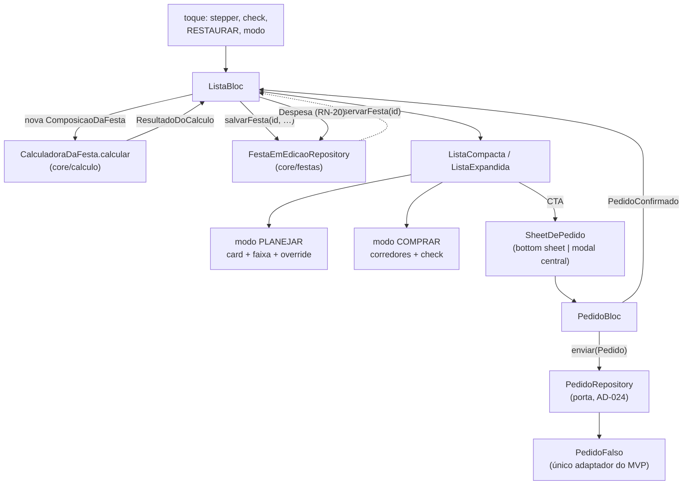
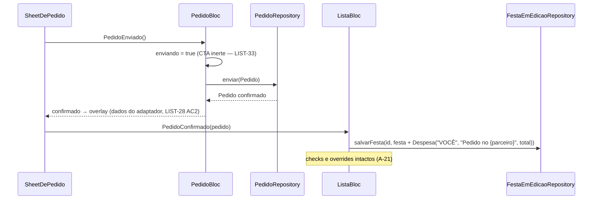

# Sua lista (lista turbinada) — Design

**Spec:** `.specs/features/lista/spec.md` (LIST-01..LIST-35)
**Context:** `.specs/features/lista/context.md`
**Status:** Draft
**Decisões ativas herdadas:** AD-001..AD-028 · **AD-023** (tabela curada) · **AD-024** (pedido atrás de porta) · **AD-010** (Copos & pratos aparece e não soma) · **AD-008** (entidades em `core/calculo/dominio/`) · **AD-009** (dinheiro arredonda uma vez) · **AD-016** (festa em memória atrás de porta) · **AD-017** (guarda de sessão) · **AD-018** ("QUEM LEVA?" fora do M1) · **AD-005** (`AppLogger`) · **AD-014** (rota nova afirma o destino)
**Decisão nova proposta:** **AD-030** — o estado de lista da festa (overrides, carrinho, despesas) mora nas entidades de `core/calculo`/`core/festas`, nunca na feature. Ver §12.

---

## 1. Pré-requisito bloqueante — leia antes de planejar tasks

**Esta spec não pode entrar em Execute antes de `montar` (spec 05).** Não é ordem de conveniência do ROADMAP; são três dependências de compilação que não existem no disco hoje:

| O que falta | Onde nasce | Quem usa aqui |
|---|---|---|
| `lib/core/festas/` — `FestaEmEdicao`, `FestaEmEdicaoRepository`, barrel `festas.dart` | `montar` §7.1 (proposta **AD-029**) | **Toda** leitura e escrita desta tela (A-15) |
| `core/calculo/formatacao/rotulo_de_quantidade.dart` | `montar` §7.2 (desvio autorizado) | A quantidade de cada linha, nos dois modos (LIST-03) |
| `FestaRepositoryEmMemoria` implementando a segunda porta | `montar` E-2 | A única impl de `FestaEmEdicaoRepository` no M1 |

Confirmado no disco em 2026-08-27: `lib/core/festas/` não existe, `lib/core/calculo/formatacao/` tem apenas `money_formatter.dart` e `rotulo_de_duracao.dart`, e `lib/features/lista/` tem só o `PlaceholderPage`.

**Consequência para o plano:** `tasks.md` pode ser escrito agora — ele não depende do código. O Execute de `lista` começa depois do merge de `montar`. Se a ordem inverter, as três peças acima teriam de nascer aqui, e aí `lista` e `montar` colidem nos mesmos arquivos de `core/`.

---

## 2. Abordagens consideradas

A spec deixou **quatro** decisões explicitamente ao Design (`context.md` §Agent's Discretion). Duas são estruturais e mereciam alternativas; as outras duas estão em §7.4 e §12.

### 2.1 Onde mora o conjunto "no carrinho" (emenda **E-b**)

| | Abordagem | Custo | Consequência |
|---|---|---|---|
| **A** ✅ | `Set<ChaveItem> noCarrinho` em **`ComposicaoDaFesta`**, aplicado por `CalculadoraDaFesta.calcular` sobre os itens que ela constrói | Baixo — um campo, um `contains` no construtor do item | `ItemDeLista.noCarrinho` **passa a significar alguma coisa** (hoje nasce sempre `false`) e `subtotalDoQueFalta`, que já filtra por ele, deixa de ser código morto. O check viaja junto da composição, atrás da porta, exatamente como `overrides` |
| **B** | `Set<ChaveItem> noCarrinho` em **`FestaEmEdicao`** | Médio — a feature reaplica o conjunto sobre os itens depois de calcular | `ItemDeLista.noCarrinho` continua sempre `false` e `subtotalDoQueFalta` continua morto; a feature passa a fazer o `where` do "o que falta" por conta própria — que é a regra de RN-27 morando no widget |
| **C** | Estado só do `ListaBloc`, sem persistir | Nulo | **Viola o aceite de UC-15** literalmente: o check tem de sobreviver à troca de aba, e trocar de aba destrói o bloc |

**Escolhida: A.** É a única em que o conjunto vive no mesmo lugar que `overrides` — que é o precedente exato: estado por item da lista, reaplicado a cada recálculo. É também a que faz duas funções já escritas e testadas em `core/calculo` (`ItemDeLista.noCarrinho`, `subtotalDoQueFalta`) passarem a ter efeito, em vez de deixá-las como defesa nunca exercida — o padrão que o sensor do Verifier da `home` pegou três vezes.

**Efeito colateral desejado:** o edge case "item marcado some da lista" resolve sozinho. `calcular` só constrói item que está na seleção; uma chave órfã no `Set` não produz item, e o contador reconta sobre a lista atual. Nunca "3 de 2 no carrinho", sem código de limpeza.

### 2.2 Onde mora o corredor de todo o catálogo (emenda **E-a**)

| | Abordagem | Custo | Consequência |
|---|---|---|---|
| **A** ✅ | Campo `Corredor corredor` **obrigatório** em `DefinicaoDeItem` | Baixo — 16 linhas no catálogo | O compilador cobra os 16: esquecer um item é erro de build, não item sumido do agrupamento em runtime. Irmão de `unidade`, `essencial`, `entraNoTotal` — dado declarado, como a spec pediu |
| **B** | `Map<ChaveItem, Corredor>` novo em `core/calculo/dominio/` | Baixo | Segunda estrutura para manter em sincronia com o catálogo; item novo entra no catálogo e some do mapa sem ninguém perceber |
| **C** | Mapa dentro de `lib/features/lista/` | Nulo | Cria a segunda fonte que a spec proíbe (E-a: "nunca duplicado na feature") |

**Escolhida: A**, com uma **guarda de coerência** que a spec não pediu e que o Design acrescenta: `PrecoDeMercado` **já** declara `corredor` para oito itens, então passam a existir duas declarações do mesmo fato. Teste em `core/calculo` afirma que, para todo `PrecoDeMercado` com `chave != null`, `catalogoDeItens[chave]!.corredor == preco.corredor`. Sem ela, as duas divergem no primeiro item que alguém reclassificar, e a lista agruparia diferente do que a barra de faixa diz.

### 2.3 Quantos blocs

**Dois, com ciclos de vida diferentes** — e é o ciclo de vida que faz o requisito, não a contagem:

- **`ListaBloc`**, um por tela, vive enquanto a aba vive. Guarda modo, item expandido, a `FestaEmEdicao` e o `ResultadoDoCalculo`. **Um bloc só para os dois modos**, porque LIST-30 exige que cruzar 900px preserve modo, checks, overrides *e* item expandido — com um bloc por modo isso vira sincronia manual entre dois estados.
- **`PedidoBloc`**, criado **com a sheet** e destruído com ela. É o que torna a A-08 verdadeira por construção: o endereço trocado "vale só para este pedido e some quando a sheet fecha sem confirmar" não precisa de um evento de reset que alguém pode esquecer de disparar — o estado morre com o widget. Ele recebe os itens e o endereço de origem como parâmetros de construção e devolve o `Pedido` confirmado; quem grava a `Despesa` é o `ListaBloc`.

---

## 3. Architecture Overview

Um caminho só, e ele já existe: **evento → nova `ComposicaoDaFesta` → `CalculadoraDaFesta.calcular` → `ListaState` → a tela pinta.** Nenhum widget soma, divide ou formata.



**As cinco superfícies de dinheiro e de onde cada uma vem** — a tabela que o guard de LIST-07 protege:

| Superfície | Função de `core/calculo` | Requisito |
|---|---|---|
| Valor da linha | `ItemDeLista.valor` (já resolve `precoOverride ?? precoBase`) | LIST-03, A-04 |
| Subtotal da categoria | `totalExato` / `totalDosEssenciais` | LIST-05 |
| Total com essenciais e "por adulto" | `ResultadoDoCalculo.totalComEssenciais` e `.porAdulto` | LIST-06 |
| Faixa real do rodapé | `faixaRealDaLista` (**novo — E-d**) | LIST-09 |
| Subtotal + frete = total do pedido | `subtotalDeItens` / `subtotalDoQueFalta` + `totalDoPedido` | LIST-23 |

---

## 4. Fronteira de arquivos e as emendas

A `spec.md` previu **duas** emendas em `core/` (E-a e E-b). O Design encontrou **cinco**. As três novas não são alargamento de escopo: são contas e dados que a tela precisa, que a camada não tem, e que a própria `spec.md` mandou nascer lá — *"conta que faltar **nasce lá**, como desvio registrado, nunca aqui"*.

| # | Emenda | Arquivo | Por que não pode ficar na feature |
|---|---|---|---|
| **E-a** | `Corredor corredor` obrigatório em `DefinicaoDeItem`, nos 16 itens | `core/calculo/dominio/catalogo_de_itens.dart` | Previsto pela `spec.md`. Dado de catálogo; duplicar na feature cria segunda fonte |
| **E-b** | `Set<ChaveItem> noCarrinho` em `ComposicaoDaFesta`, aplicado por `calcular` | `core/calculo/dominio/composicao_da_festa.dart` + `regras/calculadora_da_festa.dart` | Previsto pela `spec.md`. §2.1 |
| **E-c** | `List<Despesa> despesas` em `FestaEmEdicao` | `core/festas/dominio/festa_em_edicao.dart` | **Novo.** LIST-27 manda a `Despesa` ser "persistida com a festa para a spec 10 `custos` a ler" e não diz onde. `FestaEmEdicao` hoje é `{festa, composicao}` — não há onde gravar. Despesa não é entrada da calculadora, então não cabe em `ComposicaoDaFesta` |
| **E-d** | `FaixaReal faixaRealDaLista(Iterable<ItemDeLista>, Iterable<PrecoDeMercado>)` | `core/calculo/regras/faixa_de_preco.dart` | **Novo.** A regra da A-03 (coberto contribui com mín/máx da tabela; não coberto contribui com o próprio valor nas duas pontas) **não existe** na camada. `totalDeMercado` soma uma lista de `PrecoDeMercado`, que é outra coisa. Fazê-la na feature é a fórmula vazando |
| **E-e** | `Iterable<ItemDeLista> itensCobraveis(Iterable<ItemDeLista>)` — filtra por `entraNoTotal` | `core/calculo/regras/totais.dart` | **Novo.** A A-19 põe Copos & pratos fora do pedido e fora da faixa, além de fora do total. O predicado é a regra da AD-010, e ela já mora na camada (`totalDosEssenciais` filtra por `entraNoTotal`); expor o filtro evita a feature reescrevê-lo |

**Continua intocado** — é o que protege a baseline de 1137 testes: `lib/core/design_system/**`, `lib/features/{entrar,home,montar,galera,convite,convidado,custos}/**`, `test/support/**` e todo teste existente. As cinco emendas são **aditivas**: nenhuma assinatura pública muda de forma incompatível (`noCarrinho` e `despesas` entram com default vazio; `corredor` é o único obrigatório, e só no catálogo, que é `const` e interno à camada).

**Risco de merge com `montar`:** E-c toca `core/festas/`, que nasce em `montar`. Se as duas specs andarem em worktrees paralelos, este é o arquivo que colide. Mitigação: `lista` executa **depois** do merge de `montar` (§1), e então E-c é uma edição de um arquivo já em `main`.

---

## 5. Code Reuse Analysis

### 5.1 De `core/calculo` — consumido inteiro, nada reimplementado

| Peça | Como é usada aqui |
|---|---|
| `CalculadoraDaFesta.calcular` | **Única** fonte de itens, essenciais, total, `porAdulto` e fator. Uma chamada por transição de estado, no bloc |
| `ResultadoDoCalculo.{itens, essenciais, totalComEssenciais, porAdulto, temOverrides, todosOsItens}` | Rodapé, subtotais, RESTAURAR condicional (LIST-14 lê `temOverrides` direto) |
| `MoneyFormatter.reais` | **Todo** `R$` da tela: linha, subtotal, total, por adulto, extremos da faixa, subtotal/frete/total do pedido |
| `rotuloDeQuantidade` (nasce em `montar`) | A quantidade de cada linha nos dois modos |
| `comPassoDeQuantidade` / `comPassoDePreco` / `restaurado` / `semOverrides` | Os dois steppers e o RESTAURAR (LIST-11, LIST-14). Passos e mínimos de RN-12 já estão dentro delas |
| `posicaoDoMarcador` | A fração do marcador da barra — a tela **não** conhece média, mín nem máx para dividir |
| `totalDeMercado` | O caso literal das oito linhas: 286 / 234 / 356 (LIST-09 AC5) |
| `subtotalDeItens` / `subtotalDoQueFalta` / `totalDoPedido` | O resumo da sheet (LIST-23) |
| `tabelaDePrecosDeMercado` / `catalogoDeItens` / `ordemCanonicaDaLista` | Leitura de mercado, dados de catálogo e a ordem do card de PLANEJAR |
| `ChaveItem`, `ItemDeLista`, `OverrideDeItem`, `Corredor`, `Despesa`, `Festa` | O vocabulário. Nenhuma entidade nova de festa nasce na feature |

### 5.2 De `core/design_system` — composto, nunca estendido

| Componente | Onde |
|---|---|
| `BoraSegmentedControl(opcoes, indiceAtivo, onSelecionar)` | "🧮 PLANEJAR / 🛒 COMPRAR", no topo em compacto e no topo do rail em expandido |
| `BoraDashedNote(emoji, texto)` | As duas dicas tracejadas de T-04 |
| `BoraListCard` / `BoraListRow(emoji, titulo, sublinha, valor, onTap)` | O card de itens do modo PLANEJAR |
| `BoraExpandableRow(titulo, aberta, onAlternar, painel)` | A linha que abre com o caret ▴ e os dois steppers (LIST-10) |
| `BoraStepper(valor, onDecrementar, onIncrementar)` | QUANTIDADE e PREÇO. `onDecrementar: null` **é** o piso inerte de RN-12 |
| `BoraPriceRangeBar(fracao, rotuloMin, rotuloMax)` | A barra de faixa. Recebe a fração pronta — contrato de fronteira nº 1 de `faixa_de_preco.dart` |
| `BoraStatusTag(BoraStatus)` | A badge amarela `AUTO ∝ {fonte}` |
| `BoraFooterBar(label, valorFormatado, sublinha, cta)` | O rodapé fixo do compacto |
| `BoraBottomSheet(titulo, conteudo, onFechar)` | A sheet FAZER PEDIDO em compacto |
| `BoraPrimaryButton` / `BoraSecondaryButton` / `BoraPressSink` | CTAs, "TROCAR", "RESTAURAR" e os cartões-radio de parceiro |
| `BoraSurface` | O modal central do expandido e o overlay |

**Nenhum componente novo em `core/design_system/`.** O checkbox 26×26 (A-13) é composto dentro da feature — §7.6.

### 5.3 Padrões de código a repetir

| Padrão | Precedente | Uso aqui |
|---|---|---|
| `{feature}_textos.dart` com toda a copy literal, testado à parte | `lib/features/home/presentation/home_textos.dart` | `lista_textos.dart` — os literais de T-04, RN-27 e do overlay num arquivo só |
| `{feature}_compacta.dart` / `{feature}_expandida.dart` sob um `page.dart` que escolhe pelo `LayoutMode` | `home_compacta.dart` / `home_expandida.dart` | `lista_compacta.dart` / `lista_expandida.dart` |
| `Page.pageKey` + teste de rota que afirma o destino | AD-014, `HomePage.pageKey` | `ListaPage.pageKey` |
| Varredura que **nomeia o arquivo infrator** | `test/architecture/calculo_isolation_test.dart` | O guard de LIST-07 — §13 |
| Falha de porta → `logger.logError(…, name: …)`, estado da tela preservado | `HomeBloc._aoFalhar` | LIST-32 |
| Duplo escrito à mão para porta de domínio (não `mocktail`) | `FakeAutenticacaoRepository` (AD-021) | `PedidoFalsoDeTeste`, `FestaEmEdicaoRepositoryFake` |

---

## 6. Data Models

### 6.1 `DefinicaoDeItem` — campo novo (E-a)

```dart
class DefinicaoDeItem {
  const DefinicaoDeItem({
    …,
    required this.corredor,   // novo — obrigatório
  });

  /// O corredor de mercado do item — RN-27, agrupamento do modo COMPRAR.
  ///
  /// Dado de catálogo, irmão de [unidade] e [essencial]. Obrigatório de
  /// propósito: item novo sem corredor é erro de compilação, não item que
  /// some do agrupamento em runtime.
  final Corredor corredor;
}
```

**A atribuição dos 16** (LIST-17). As oito primeiras repetem o que `tabelaDePrecosDeMercado` já declara — e o teste de coerência de §2.2 impede que divirjam:

| Corredor | Itens |
|---|---|
| `acougue` | bovina, suina, frango |
| `hortifruti` | legumesParaGrelha |
| `padaria` | paoDeAlho |
| `bebidas` | refrigerante, suco, agua, cerveja, vodka, cachaca, whisky |
| `mercearia` | carvao, gelo, salGrosso, coposEPratos |

Os oito que a tabela cobre: bovina→`acougue`, legumes→`hortifruti`, paoDeAlho→`padaria`, cerveja e refrigerante→`bebidas`, carvao e gelo→`mercearia`. Conferido linha a linha contra `tabela_de_precos_de_mercado.dart`.

### 6.2 `ComposicaoDaFesta` — campo novo (E-b)

```dart
class ComposicaoDaFesta {
  const ComposicaoDaFesta({
    …,
    this.noCarrinho = const {},   // novo — default vazio, aditivo
  });

  /// As chaves marcadas como "já tá no carrinho" no modo COMPRAR — RN-27.
  ///
  /// Mora aqui, e não em `ItemDeLista`, porque o item é reconstruído a cada
  /// recálculo: guardar o check nele o perderia no primeiro toque de stepper.
  /// Irmão de [overrides] — mesmo escopo de vida, mesma reaplicação.
  final Set<ChaveItem> noCarrinho;
}
```

`CalculadoraDaFesta._itemDe` passa a preencher `noCarrinho: composicao.noCarrinho.contains(definicao.chave)`. É a única mudança em `calculadora_da_festa.dart`, e é o que faz `subtotalDoQueFalta` deixar de ser código morto.

**Igualdade profunda obrigatória** (L-011 do playbook): `==`/`hashCode` de `ComposicaoDaFesta` já são escritos à mão; o `Set` novo entra pelo mesmo helper de `igualdade.dart` que `itensSelecionados` usa. Sem isso, a supressão de eco de §8.2 não funciona.

### 6.3 `FestaEmEdicao` — campo novo (E-c)

```dart
class FestaEmEdicao {
  const FestaEmEdicao({
    required this.festa,
    required this.composicao,
    this.despesas = const [],   // novo — default vazio, aditivo
  });

  /// As despesas já lançadas na festa — RN-20.
  ///
  /// No M1 a única origem é o pedido por delivery (AD-024/AD-027). A spec 10
  /// `custos` lê daqui; "EU LEVO" da spec 09 escreve aqui.
  final List<Despesa> despesas;
}
```

Fica em `FestaEmEdicao` e **não** em `ComposicaoDaFesta` porque despesa não entra em `CalculadoraDaFesta.calcular` — pôr ali faria a composição carregar dado que a calculadora ignora, e mudaria a igualdade que decide se um recálculo é necessário.

### 6.4 `FaixaReal` e `faixaRealDaLista` (E-d)

```dart
/// A "faixa real: de R$ X a R$ Y" do rodapé de PLANEJAR — RN-11 · A-03.
class FaixaReal {
  const FaixaReal({required this.minimo, required this.maximo});
  final double minimo;
  final double maximo;
}

/// Soma a faixa sobre os itens de **uma lista**, que não é a tabela.
///
/// Item coberto por RN-11 contribui com (mínimo, máximo) da tabela; item que
/// a tabela não cobre contribui com o próprio [ItemDeLista.valor] nas duas
/// pontas — não se fabrica faixa para item sem linha.
///
/// Soma exata; quem arredonda é RN-13, uma única vez.
FaixaReal faixaRealDaLista(
  Iterable<ItemDeLista> itens,
  Iterable<PrecoDeMercado> tabela,
);
```

**Sem campo `media`.** O "MÉDIA TOTAL" do rodapé é `ResultadoDoCalculo.totalComEssenciais` (R$ 271, A-01), não uma média desta função — devolver um terceiro número aqui convidaria alguém a pintá-lo no rodapé e reabrir a D-1.

**Os números derivados foram conferidos à mão antes de o design fechar.** No estado padrão de RN-30, sobre a lista sem Copos & pratos:

| Contribuição | mín | máx |
|---|---|---|
| Cobertos (bovina 54–83, pão 20–30, refri 14–23, cerveja 64–92, carvão 18–28, gelo 24–36) | 194 | 292 |
| Não cobertos (frango + água + cachaça = 42,60 · sal 8) | 50,60 | 50,60 |
| **Total** | **244,60 → R$ 245** | **342,60 → R$ 343** |

Bate com "de R$ 245 a R$ 343" da `spec.md`. Aplicada às oito linhas da tabela (todas cobertas) a função degenera em `totalDeMercado` e devolve 234 / 356 — o que torna LIST-09 AC5 verificável pelas duas portas, e é assim que o teste deve afirmá-lo.

### 6.5 `itensCobraveis` (E-e)

```dart
/// Os itens que entram em dinheiro — AD-010 · RN-10.
///
/// Filtra por `DefinicaoDeItem.entraNoTotal`: 🍽️ Copos & pratos aparece na
/// lista e não soma. Fica fora do total, do pedido (A-19) e da faixa real.
Iterable<ItemDeLista> itensCobraveis(Iterable<ItemDeLista> itens);
```

### 6.6 `Pedido` e `ParceiroDeEntrega` — na feature, não em `core`

```dart
// lib/features/lista/domain/parceiro_de_entrega.dart
enum ParceiroDeEntrega {
  ifood(nome: 'iFood Mercado', eta: '40–60 min', frete: 12, soBebidas: false),
  rappi(nome: 'Rappi Turbo',   eta: '15–30 min', frete: 9,  soBebidas: false),
  ze(   nome: 'Zé Delivery',   eta: '30–45 min', frete: 0,  soBebidas: true);
  …
}

// lib/features/lista/domain/pedido.dart
class Pedido {
  const Pedido({
    required this.parceiro,
    required this.endereco,
    required this.itens,
    required this.subtotal,
    required this.frete,
    required this.total,
  });
}
```

**Por que não em `core/calculo/dominio/`, apesar da AD-008:** o critério da AD-008 é *entidade compartilhada*. `Pedido` tem **um** consumidor; o que atravessa a fronteira para `custos` é a `Despesa`, que já está em `core`. E `total_do_pedido.dart` decide o assunto por escrito: *"os parceiros de delivery, os ETAs e os valores de frete são da spec `lista`, dona de RN-27. Esta camada só soma."* Pôr `Pedido` em `core/calculo` acrescentaria à camada uma entidade que nenhuma RN calcula.

**Os fretes são números, não `R$`.** `frete: 12` é constante de dado, e o guard de LIST-07 proíbe o literal `R$` e os operadores — não números. A soma é `totalDoPedido(subtotal:, frete:)`, na camada.

### 6.7 `PedidoRepository` — a porta da AD-024

```dart
// lib/features/lista/domain/pedido_repository.dart
abstract class PedidoRepository {
  /// Envia o pedido ao parceiro e devolve o pedido confirmado.
  ///
  /// A única implementação do MVP é falsa (AD-024): não faz rede. Quando
  /// houver contrato, troca-se o adaptador — nem a tela nem os testes de
  /// aceite mudam.
  Future<Pedido> enviar(Pedido pedido);
}
```

`PedidoFalso` em `lib/features/lista/data/pedido_falso.dart`: devolve o pedido recebido, sem rede. **É ele que alimenta o overlay** (LIST-28 AC2) — o widget nunca monta o `Pedido` de exibição por conta própria, e é isso que o teste de LIST-28 afirma.

---

## 7. Components

### 7.1 `ListaBloc`
- **Local**: `lib/features/lista/presentation/bloc/`
- **Depende de**: `FestaEmEdicaoRepository`, `AppLogger`, `CalculadoraDaFesta`
- **Construção**: assina `observarFesta(festaId)`. Enquanto não emite, `ListaState.carregando`
- **Eventos**:
  - `ModoAlternado(ModoDaLista modo)` — só estado de UI, não grava
  - `ItemExpandido(ChaveItem? chave)` — `null` fecha; abrir um fecha o anterior por construção (é um campo, não um `Set`) — LIST-10
  - `QuantidadeAjustada(ChaveItem chave, int passos)` / `PrecoAjustado(ChaveItem chave, int passos)` — LIST-11
  - `OverridesRestaurados()` — `semOverrides()` — LIST-14
  - `ItemAlternadoNoCarrinho(ChaveItem chave)` — `Set` com `add`/`remove`: determinístico por construção (LIST-33)
  - `PedidoConfirmado(Pedido pedido)` — acrescenta a `Despesa` de RN-20 e grava — LIST-27
  - `FestaRecebida(FestaEmEdicao?)` / `PersistenciaFalhou(Object, StackTrace)` — internos
- **Estado**: `ListaState { carregando, festa, resultado, modo, chaveExpandida, faixaReal, falhouAoSalvar }`
- **Regra única de transição**: todo evento de usuário produz uma `ComposicaoDaFesta` nova → `calcular` → `faixaRealDaLista` → emite → `salvarFesta` assíncrono. Não existe segundo caminho de cálculo; o guard de §13 é o que impede um de aparecer

### 7.2 `PedidoBloc`
- **Local**: `lib/features/lista/presentation/bloc/`
- **Depende de**: `PedidoRepository`, `AppLogger`
- **Construção**: `PedidoBloc({required List<ItemDeLista> itens, required String enderecoDaFesta, …})` — nasce com a sheet, morre com ela (§2.3)
- **Eventos**: `ParceiroSelecionado`, `EnderecoTrocado(String)`, `PedidoEnviado()`
- **Estado**: `PedidoState { parceiro = ParceiroDeEntrega.ifood, endereco, subtotal, frete, total, enviando, confirmado, falhou }`
- **Idempotência (LIST-33)**: `PedidoEnviado` é ignorado quando `enviando || confirmado != null`. O CTA fica inerte enquanto `enviando`. Dois toques rápidos ⇒ um `enviar`, uma `Despesa`
- **Endereço vazio** volta a `enderecoDaFesta` no próprio handler, nunca fica vazio (A-08)

### 7.3 `ListaPage`
- **Local**: `lib/features/lista/presentation/pages/lista_page.dart`
- **Interface**: `ListaPage({required String festaId, required FestaEmEdicaoRepository festas, required PedidoRepository pedidos, required AppLogger logger})` + `static const pageKey`
- Escolhe `ListaCompacta` ou `ListaExpandida` por `layoutModeForWidth` (AD-007). **Um `BlocProvider` só**, acima da escolha — é o que faz LIST-30 (cruzar 900px preservando tudo) ser verdade por construção, e não por evento de restauração

### 7.4 Widgets — `presentation/widgets/`

| Widget | Papel |
|---|---|
| `lista_compacta.dart` | Header, segmented, dica, corpo do modo, `BoraFooterBar` |
| `lista_expandida.dart` | Grid `1fr / 370px` + rail sticky (§7.5) |
| `card_de_planejar.dart` | Card de itens na `ordemCanonicaDaLista` + bloco "ESSENCIAIS · ENTRAM SOZINHOS" com subtotais |
| `linha_de_item.dart` | Emoji, nome, quantidade, valor, ponto vermelho 8px, sub "média de N mercados", `BoraPriceRangeBar`, painel de override |
| `painel_de_override.dart` | Os dois `BoraStepper` |
| `card_de_comprar.dart` | Agrupamento por corredor, contagem "{N} itens", corredor vazio não renderiza |
| `linha_de_compra.dart` | `CheckboxDaLista` + linha a 45% quando marcada |
| `checkbox_da_lista.dart` | O 26×26 composto (§7.6) |
| `sheet_de_pedido.dart` | Conteúdo único, montado em `BoraBottomSheet` (compacto) ou `BoraSurface` em `showDialog` (expandido) — **um conteúdo, dois invólucros**, para os dois não divergirem |
| `cartao_de_parceiro.dart` | Cartão-radio; `onPressed: null` quando inerte (LIST-24) |
| `overlay_de_pedido.dart` | Tela cheia: 🛵, título, ETA + endereço inteiro, linha vermelha, "VOLTAR À LISTA" |
| `lista_textos.dart` | Toda a copy literal, num arquivo só |

**A quarta decisão do `context.md`** — o corte em tasks — fica para o `tasks.md`; a estimativa de §15 é de ~17 tasks em 7 fases.

### 7.5 O rail do expandido (LIST-29)

Ordem literal de W-04, de cima para baixo: **segmented** → bloco de total do modo ativo → "faixa real" (PLANEJAR) *ou* "{N} de {M} no carrinho" (COMPRAR) → "≈ R$ {x} por adulto" → CTA. Sticky. **Sem `BoraFooterBar`** em expandido (W-R2): a ausência é afirmada por teste, não presumida.

### 7.6 `CheckboxDaLista` — o 26×26 (A-13)

Composição pura de tokens do arquivo 02: `SizedBox(26, 26)`, borda 2px `BoraColors.ink`, `borderRadius: 0`, fundo `BoraColors.white` desmarcado e verde `#0B6B3A` marcado, ✓ branco. **Nenhum literal de cor no arquivo** — vem dos tokens, senão a varredura de cor da spec 01 morde (L-008: comparar com o token, nunca com o literal).

---

## 8. Fluxos que valem um diagrama

### 8.1 Pedido confirmado vira despesa (LIST-27)



Na falha: `PR` lança → `PB` emite `falhou` → **sem overlay, sem `PedidoConfirmado`, sem `Despesa`** → `logger.logError(name: 'lista')`. O `ListaBloc` nunca soube do pedido, então não há como haver despesa órfã (LIST-32).

### 8.2 Concorrência e o eco da porta (LIST-34)

O bloc é a autoridade: cada evento transforma a `FestaEmEdicao` local, emite **síncrono** e só então grava. `observarFesta` continua assinado, porque outra aba (`galera`, RN-21) pode mudar a composição com a Lista viva no `indexedStack`.

**Supressão de eco:** o bloc guarda a última `FestaEmEdicao` que gravou; emissão do stream **igual** a ela é o próprio eco e é descartada. Emissão **diferente** é externa e é adotada — e como checks e overrides moram na composição, eles vêm junto, sem código de reconciliação.

É por isso que §6.2 exige igualdade profunda: com `==` por identidade, todo eco pareceria "diferente" e um toque rápido de stepper seria sobrescrito por um recálculo obsoleto — exatamente o defeito que LIST-34 proíbe.

---

## 9. Copy — literal, e num arquivo só

| Elemento | Texto |
|---|---|
| Header | `SUA LISTA` |
| Segmented | `🧮 PLANEJAR` · `🛒 COMPRAR` |
| Dica PLANEJAR | `📊 Cada preço é a média real de mercados perto de você — a barra mostra o mín/máx que a galera achou.` |
| Dica COMPRAR | `✅ Organizado por corredor do mercado — marque o que já tá no carrinho.` |
| Categoria dos essenciais | `ESSENCIAIS · ENTRAM SOZINHOS` |
| Badge | `AUTO ∝ {fonte}` — fontes: `kg de carne`, `volume de bebida gelada`, `kg de carne`, `nº de pessoas` |
| Sub de mercado | `{quantidade} · média de {N} mercados` |
| Rodapé PLANEJAR | `MÉDIA TOTAL` · `R$ {total}` · `faixa real: de R$ {mín} a R$ {máx}` · `≈ R$ {x} por adulto` |
| Rodapé COMPRAR | `{N} de {M} no carrinho` · `≈ R$ {x} por adulto` |
| CTAs | `FAZER PEDIDO 🛒` (PLANEJAR) · `PEDIR O QUE FALTA 🛵` (COMPRAR) · `RESTAURAR` |
| Corredores | `AÇOUGUE` · `HORTIFRÚTI` · `PADARIA` · `BEBIDAS` · `MERCEARIA` — nesta ordem, `{N} itens` em cada |
| Sheet | `FAZER PEDIDO` · `ENTREGA POR` · `TROCAR` · `Subtotal` · `Frete` · `Total` · `CONFIRMAR PEDIDO →` |
| Parceiros | `iFood Mercado` 40–60 min · `Rappi Turbo` 15–30 min · `Zé Delivery` (só bebidas) 30–45 min |
| Overlay | `PEDIDO A CAMINHO!` · `Chega em {ETA} na {endereço}.` · `R$ {total} · rachado no acerto da festa` · `VOLTAR À LISTA` |
| Abas (P3) | `Lista` · `Galera` · `WhatsApp` · `Custos` |

**Zero toasts** (A-23). RN-29 não tem texto canônico para nenhuma ação desta tela, e inventar um seria copy nossa num produto de copy literal. O teste de LIST-07 afirma a ausência de `BoraToast` na árvore.

**Endereço inteiro no overlay** (D-6): o mesmo string que a sheet mostrou — `Laje do Rafa — Vila Madalena`, não `Laje do Rafa`.

---

## 10. Error Handling Strategy

| Cenário | Tratamento | O que o usuário vê |
|---|---|---|
| `salvarFesta` falha (override ou check) | `logger.logError(…, name: 'lista')`; estado da tela **não** revertido; `falhouAoSalvar: true`; interação segue | Nada muda — ele continua editando. *SPEC_PRECISION_GAP*: nenhuma spec desenha a Lista falhando ao gravar nem dá copy. O requisito literal de LIST-32 é "não perde o estado da tela nem trava a interação", e é isso que o teste afirma |
| `observarFesta` emite `null` | `ListaState` de festa inexistente: card vazio, R$ 0, CTA inerte — o mesmo caminho de LIST-31 | Tela vazia e coerente, sem crash. **Não** redireciona para `/erro`: a rota é válida |
| Stream de `observarFesta` falha | Loga e **mantém o último estado bom** (padrão `HomeBloc._aoFalhar`) | A tela continua com o que já tinha |
| `PedidoRepository.enviar` falha | Sem overlay, sem `Despesa`, `PedidoState.falhou = true`, `logError` | A sheet continua aberta, CTA volta a ativo. *SPEC_PRECISION_GAP*: T-04 não desenha erro de pedido e RN-29 não dá toast — a evidência do requisito é a **ausência** de overlay e de despesa, mais o registro no log |
| CTA inerte (nada falta / lista vazia) | `onPressed: null`; a sheet não abre | Botão apagado, sem toast e sem copy nova (A-07, A-11) |
| Zé Delivery com item fora de BEBIDAS | Cartão visível com o qualificador literal, `onPressed: null` | A explicação **é** o qualificador de RN-27; nenhuma copy de erro nova (A-09) |

---

## 11. Risks & Concerns

| Concern | Onde | Impacto | Mitigação |
|---|---|---|---|
| **Dependência de código que não existe** | `core/festas/`, `rotuloDeQuantidade` | `lista` não compila se rodar antes de `montar` | §1: pré-requisito bloqueante declarado; `tasks.md` pode ser escrito, Execute não pode começar |
| **Duas declarações do mesmo corredor** | `catalogo_de_itens.dart` (E-a) e `preco_de_mercado.dart` | Agrupamento diverge da barra de faixa sem ninguém ver | Teste de coerência em `core/calculo` para as 8 chaves comuns (§2.2) — falha nomeando o item divergente |
| **Defesa escrita e nunca exercida** — o padrão que o sensor da `home` pegou **três vezes** | Piso do stepper, supressão de eco, `null` de `observarFesta`, endereço vazio, guarda do Zé, idempotência do CTA | Guarda que a fixture já satisfaz passa sem prova | Alvo explícito: **cada uma** tem teste que falha se a defesa sair. É o item nº 1 da lista de verificação do Verifier |
| **Expressão de teto exercitada só abaixo do teto** (L-020) | `posicaoDoMarcador` com override acima do máximo | O `clamp` vira no-op e ninguém percebe | Edge case da `spec.md` vira teste: override que passa do máximo, marcador ainda dentro do trilho |
| **`ItemDeLista.noCarrinho` e `subtotalDoQueFalta` hoje são código morto** | `core/calculo` | Um campo sempre `false` e uma função que nunca filtra nada passam em qualquer teste | E-b os liga de verdade (§2.1); o teste de "PEDIR O QUE FALTA" com itens marcados é o que os exercita pela primeira vez |
| **Números derivados, não literais da spec-fonte** | Faixa real R$ 245–343 | Congelar um número errado em teste (L-002) | Conferido à mão em §6.4 contra as parcelas; o teste afirma o resultado da **função**, e a derivação fica escrita no doc para quem revisar |
| **Cinco emendas em `core/`, contra as duas previstas** | §4 | Alargamento silencioso da camada fechada | As três novas estão nomeadas, justificadas uma a uma e são aditivas; nenhuma muda comportamento existente. Vão para §14 como desvio declarado |
| **A tela mente sobre o pedido** | `overlay_de_pedido.dart` | "PEDIDO A CAMINHO!" sem pedido; despesa real de compra que não houve | Consequência **declarada** da AD-024, com ressalva de exposição pública na própria AD. O doc do `PedidoFalso` repete a ressalva no ponto onde alguém a leria |
| **`FestaTabsShell` sem desenho na spec-fonte** | LIST-35 | Visual inventado | A-17: última task, só tokens do arquivo 02, e a Lista renderiza sem ela — o valor da tela não fica preso à peça mais frágil |
| **Copos & pratos fora de três lugares** | E-e | Esquecer um dos três (total, pedido, faixa) e o subtotal do pedido divergir do total da tela | Um único predicado (`itensCobraveis`) usado nos três; teste que afirma a exclusão nas três superfícies |

---

## 12. Tech Decisions

| Decisão | Escolha | Racional |
|---|---|---|
| Onde mora o "no carrinho" | `ComposicaoDaFesta`, aplicado por `calcular` | §2.1 — liga dois pedaços de `core` que hoje são código morto |
| Onde mora o corredor | Campo obrigatório em `DefinicaoDeItem` + teste de coerência com a tabela | §2.2 — o compilador cobra os 16 |
| Onde mora a despesa do pedido | `FestaEmEdicao.despesas` (E-c) | Despesa não é entrada da calculadora; pôr na composição mudaria a igualdade que decide recálculo |
| Onde mora `Pedido` e os parceiros | `lib/features/lista/domain/` | `total_do_pedido.dart` já atribui parceiros, ETAs e fretes à spec `lista`; AD-008 vale para entidade **compartilhada**, e esta tem um consumidor |
| Quantos blocs | `ListaBloc` (tela) + `PedidoBloc` (vida da sheet) | §2.3 — o ciclo de vida do segundo **é** o requisito A-08 |
| Sheet e modal | Um conteúdo, dois invólucros | Impede compacto e expandido divergirem no primeiro ajuste |
| Concorrência | Bloc autoritativo + supressão de eco por igualdade de valor | §8.2 |

### AD proposta — **AD-030**

> **Decision**: O estado de lista de uma festa — overrides, conjunto "no carrinho" e despesas — mora nas entidades de `core/calculo`/`core/festas` (`ComposicaoDaFesta.overrides`, `ComposicaoDaFesta.noCarrinho`, `FestaEmEdicao.despesas`), atrás de `FestaEmEdicaoRepository`. **Nenhuma feature guarda estado de festa em bloc ou widget.** Estado por item que precisa sobreviver a um recálculo entra na composição; fato sobre a festa que a calculadora não consome entra em `FestaEmEdicao`.
> **Reason**: os aceites de UC-06 e UC-15 são literalmente "sobrevive à navegação dentro da festa", e trocar de aba destrói o bloc. Guardar no widget torna o aceite impossível; guardar em dois lugares (parte na composição, parte na feature) cria duas fontes para o estado da mesma lista. A fronteira "a calculadora consome?" é o que decide entre as duas entidades, e ela é objetiva.
> **Trade-off**: `ComposicaoDaFesta` cresce a cada tela que precisar de estado por item, e no M2 tudo isso vira documento do Firestore de uma vez. Em troca, `ItemDeLista.noCarrinho` e `subtotalDoQueFalta` deixam de ser código morto, e nenhuma feature reconcilia estado com a porta.
> **Scope**: `lista` agora; `galera`, `convidado` e `custos` herdam — quem precisar de estado por item da lista usa a composição, não a feature.
> **Date**: 2026-08-27 · **Status**: proposta (entra no `STATE.md` na T1 do Execute)

**Numeração:** `montar` reserva **AD-029** (`19f77a7`) e ainda não a registrou. Esta é a **AD-030**, e só é gravada depois daquela — se a ordem inverter, renumera-se aqui, nunca lá.

---

## 13. O guard de LIST-07 — a fórmula não vaza

Varredura sobre `lib/features/lista/**`, no molde de `calculo_isolation_test.dart`, **nomeando o arquivo infrator**. Depois de remover comentários e literais de string, nenhum arquivo pode conter:

| # | Proibido | Por quê |
|---|---|---|
| 1 | o literal `R$` (em string, **sem** stripping) | RN-13 é da camada; `MoneyFormatter` é o único que escreve `R$` |
| 2 | `.round(` `.floor(` `.ceil(` `.truncate(` `.roundToDouble(` `.toStringAsFixed(` | AD-009: dinheiro arredonda **uma vez**, na formatação |
| 3 | os operadores `*` `/` `%` | Subtotal, por adulto, fator e fração do marcador vêm prontos |
| 4 | `.fold(` `.reduce(` `.sum` | Somar itens é `totalExato` / `subtotalDeItens` / `faixaRealDaLista` |
| 5 | import de arquivo interno de `core/calculo/` ou de `core/festas/` | Os barrels `calculo.dart` e `festas.dart` são as únicas portas |

Cada regra tem teste próprio contra um **trecho sintético infrator** — varredura só verde contra código limpo não prova que morde (a lição que T24 de `montar` já registrou).

**Mais dois testes comportamentais**, porque varredura sozinha não pega formatador escrito à mão com outro nome:

1. Composição com total fracionário (o 210,60 do estado padrão) → o valor exibido é comparado com **`MoneyFormatter.reais(resultado.totalComEssenciais)`**, o token, nunca o literal (L-008). Formatador próprio que arredondasse diferente morre aqui.
2. A fração passada a `BoraPriceRangeBar` é comparada com **`posicaoDoMarcador(preco)`**, não com `0.379`. Uma divisão feita no widget passaria na regra 3 se escrita como `.ratio` de outra classe, e morre aqui.

---

## 14. Desvios e lacunas declarados

| Tipo | O quê | Onde fica registrado |
|---|---|---|
| SPEC_DEVIATION | Cinco emendas em camada declarada fechada, contra as duas previstas (E-a..E-e) | §4, e no doc de cada arquivo tocado |
| SPEC_DEVIATION | `Pedido` e os parceiros ficam na feature, não em `core/calculo/dominio/` (AD-008) | §6.6, e no doc de `pedido.dart` |
| SPEC_DEVIATION | Layout web em grid `1fr / 370px` em vez de "dentro do rail de W-03" (D-3 / A-16) | §7.5, já declarado na `spec.md` |
| SPEC_DEVIATION | Três acentos na tela contra os 2 do arquivo 02 §8 (D-4 / A-22) | §9, já declarado na `spec.md` |
| SPEC_PRECISION_GAP | Falha ao gravar não tem copy — nenhuma spec desenha a Lista falhando | §10 |
| SPEC_PRECISION_GAP | Falha do pedido não tem copy nem toast; a evidência é a ausência de overlay e de despesa | §10 |
| SPEC_PRECISION_GAP | `FestaTabsShell` sem desenho em `04` nem `06`; o visual sai só de tokens | §7.4, LIST-35, A-17 |
| Herdado, sem dono | `ItemDeLista.quemLeva` continua sem UI que o escreva (AD-018) | `context.md` §Deferred Ideas |

---

## 15. Mapa requisito → componente

| Requisito | Onde vive |
|---|---|
| LIST-01, LIST-02 | `lista_compacta.dart` + `lista_textos.dart` |
| LIST-03, LIST-05 | `card_de_planejar.dart` (`ordemCanonicaDaLista`, `totalExato`) |
| LIST-04 | `card_de_planejar.dart` + `BoraStatusTag`; subtotal por `totalDosEssenciais` |
| LIST-06 | `BoraFooterBar` / rail — `totalComEssenciais` e `porAdulto` |
| LIST-07 | `test/features/lista/architecture/` (§13) |
| LIST-08 | `linha_de_item.dart` + `BoraPriceRangeBar` + `posicaoDoMarcador` |
| LIST-09 | `faixaRealDaLista` (E-d) + rodapé |
| LIST-10, LIST-11, LIST-12 | `linha_de_item.dart`, `painel_de_override.dart`, `ListaBloc` |
| LIST-13, LIST-34 | `ListaBloc` (transição única + supressão de eco) |
| LIST-14 | rodapé + `ResultadoDoCalculo.temOverrides` |
| LIST-15, LIST-20 | `ComposicaoDaFesta` + `FestaEmEdicaoRepository` (AD-030) |
| LIST-16, LIST-17 | `card_de_comprar.dart` + `DefinicaoDeItem.corredor` (E-a) |
| LIST-18, LIST-19 | `linha_de_compra.dart`, `checkbox_da_lista.dart` |
| LIST-21, LIST-22, LIST-23, LIST-24, LIST-25 | `sheet_de_pedido.dart`, `cartao_de_parceiro.dart`, `PedidoBloc` |
| LIST-26 | `overlay_de_pedido.dart` |
| LIST-27 | `ListaBloc` + `FestaEmEdicao.despesas` (E-c) |
| LIST-28, LIST-32, LIST-33 | `PedidoRepository`, `PedidoFalso`, `PedidoBloc` |
| LIST-29, LIST-30 | `lista_expandida.dart` + `BlocProvider` acima da escolha de layout |
| LIST-31 | `ListaState` vazio, mesmo caminho de `observarFesta → null` |
| LIST-35 | `FestaTabsShell` em `lib/core/routing/` |

**Corte estimado:** ~17 tasks em 7 fases — (1) emendas em `core` com teste próprio, (2) `ListaBloc` + estado, (3) modo PLANEJAR, (4) override, (5) modo COMPRAR, (6) pedido, (7) web + rota + guard + abas. Acima do orçamento de um batch (~8), então o Execute **aciona a oferta de sub-agentes**: ~3 workers, fases inteiras, nunca partidas.
