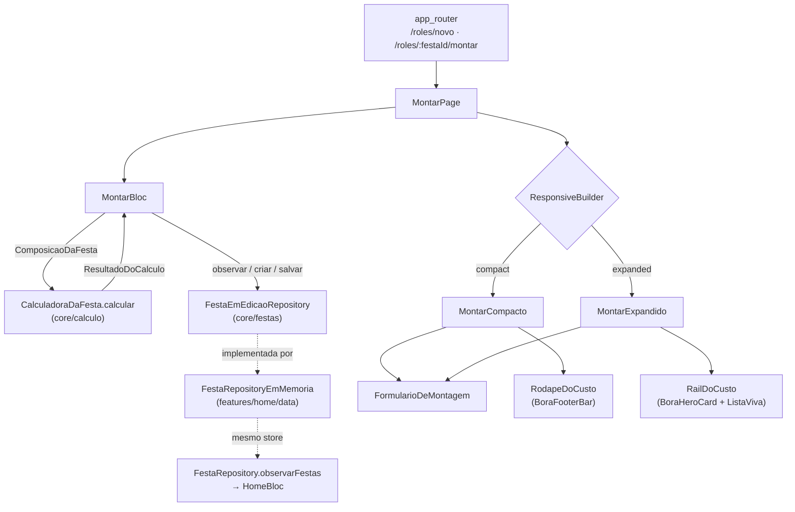

# Montar — Design

**Spec**: `.specs/features/montar/spec.md`
**Context**: `.specs/features/montar/context.md`
**Status**: Draft
**Decisões ativas conferidas**: AD-001..AD-028 (todas `active`) — nenhuma superseded por esta spec.
**Decisão nova proposta**: **AD-029** (porta de edição de festa em `lib/core/festas/`) — ver §Tech Decisions.
**Lições confirmadas**: `python .claude/skills/tlc-spec-driven/scripts/lessons.py list --status confirmed` devolveu **`(no confirmed lessons)`** — o store tem candidatas, nenhuma confirmada. Nada a aplicar por esse canal; as duas lições que o handoff do `home` deixou em prosa estão aplicadas em §Riscos (defesa nunca exercida, asserção que confere o objeto errado).

---

## 1. O que decide o desenho

Três forças, nesta ordem:

1. **A camada de cálculo é fechada e já resolve tudo.** `CalculadoraDaFesta.calcular(ComposicaoDaFesta)` devolve `ResultadoDoCalculo` com `itens`, `totalDosItens`, `porCabeca`, `fator` e `contagem`. `MoneyFormatter.reais` e `rotuloDeDuracao` entregam as strings prontas. **Nenhum widget e nenhum bloc desta feature faz conta** — eles chamam.
2. **Uma composição, dois quadros.** W-R1 exige estado único; T-03 e W-03 são arranjos diferentes do **mesmo** `MontarState`. Por isso o bloc vive **acima** do `ResponsiveBuilder` (o padrão que `entrar` e `home` já fixaram): cruzar 900px reorganiza a árvore sem destruir o estado.
3. **A festa tem que existir de verdade.** "🔥 CHURRASCO" cria um rolê que a Home enxerga. Isso só fecha se montar escrever **no mesmo store** que a Home lê — e é essa a única decisão estrutural desta spec.

---

## 2. Abordagens consideradas — onde mora a escrita da festa

Hoje existe **uma** porta de festa: `FestaRepository` (`lib/features/home/domain/festa_repository.dart`), com `observarFestas()` e `dispose()`, e só isso. O próprio doc dela declara o motivo: *"Um método de leitura só. A Home não cria, não edita e não apaga festa: `/roles/novo` é da spec 05 `montar`."* A spec 04 previu esta conversa e deixou o assunto para cá.

| # | Abordagem | Custo | Consequência |
|---|---|---|---|
| **A** | Engordar `FestaRepository` com `criarFesta`/`salvarFesta`/`observarFesta` | Baixo — a `spec.md` já pré-autoriza tocar `features/home/domain/**` | `montar` passa a importar de `home` (acoplamento feature↔feature, exatamente o que a **AD-019** subiu `autenticacao` para evitar); **quebra** `test/support/festa_repository_que_falha.dart`, que implementa a porta; e contraria o "um método de leitura só" que a própria porta declara |
| **B** ✅ | **Porta de escrita própria em `lib/core/festas/`**, falando só em tipos de `core/calculo` | Médio — uma pasta nova em `core/` e uma conversão em `home/data` | Zero import feature↔feature; **nenhum teste existente quebra** (a porta de leitura não é tocada); é a forma que a AD-019 já usou para o mesmo problema (dois consumidores ⇒ a porta sobe para `core/`) |
| **C** | Mover `FestaRepository` + `ResumoDeFesta` inteiros para `core/festas/` | Alto | Toca `home/**`, `core/routing/**`, `test/support/` e ~15 arquivos de teste da spec 04 — arrisca a baseline de 1137 testes por um ganho que a **B** já entrega |

**Escolhida: B.** É a única que resolve o acoplamento sem colocar a baseline em risco, e é a repetição literal de um precedente do projeto (AD-019: *"três consumidores fora de `entrar` obrigam a subida"*). A promoção completa de `FestaRepository` para `core/festas/` — a abordagem **C** — é o movimento natural do **M2**, quando o Firestore substituir a implementação em memória (AD-016); fica registrado como pendência, não como dívida escondida.

**Uma instância, duas portas.** `FestaRepositoryEmMemoria` passa a implementar as duas: a Home continua lendo `observarFestas()`, montar escreve por `FestaEmEdicaoRepository`, e **é o mesmo objeto** — é isso que faz o rolê criado em `/roles/novo` aparecer na Home sem nenhum mecanismo de sincronia.

---

## 3. Architecture Overview



**A regra que o diagrama desenha:** só existe **uma** seta entrando em `CalculadoraDaFesta`, e ela sai do bloc. Nenhum widget tem seta para a camada de cálculo a não ser para ler tipos (`ItemDeLista`, `ChaveItem`) e para chamar `MoneyFormatter`.

---

## 4. Emendas à fronteira de arquivos da `spec.md`

A `spec.md` fechou a fronteira antes de o desenho existir. Cinco arquivos fora dela são consequência mecânica da abordagem B e da fiação de rota — declarados aqui como emendas, no molde da **E-1** de `entrar`:

| # | Arquivo | Por quê |
|---|---|---|
| **E-1** | `lib/core/festas/**` (novo) | A porta de escrita da abordagem B. `core/` não estava na lista porque a `spec.md` supunha a abordagem A. |
| **E-2** | `lib/features/home/data/festa_repository_em_memoria.dart` | Precisa implementar a segunda porta. A `spec.md` autorizou `home/domain/**`; a implementação mora em `home/data/`. Mudança **aditiva**: `observarFestas()` e `dispose()` ficam como estão. |
| **E-3** | `lib/features/home/domain/resumo_de_festa.dart` | O registro de festa do store passa a carregar a `ComposicaoDaFesta`. Campo novo **com default**, entrando em `==`/`hashCode` — nenhum uso existente muda. Já pré-autorizado em espírito ("só se `FestaRepository` precisar de método novo"). |
| **E-4** | `lib/core/routing/app_router.dart` | O `builder` de `/roles/:festaId/montar` hoje monta `const MontarPage()` e **descarta o `festaId`**. Sem tocar aqui, MONT-16 e MONT-17 são impossíveis. Precedente direto: a spec 04 fez o mesmo por `HomePage(festas:, logger:)`. |
| **E-5** | `test/support/app_de_teste.dart` | `abrirApp` precisa aceitar a porta de edição para que os testes de rota montem montar. Parâmetro **opcional com default** — nenhum teste existente muda de comportamento. |

**O que continua intocado**, e é o que protege a baseline de 1137 testes: `lib/core/design_system/**`, `lib/features/home/domain/festa_repository.dart`, `lib/features/home/presentation/**`, `test/support/festa_repository_que_falha.dart` e **todo** teste existente.

**Exceção autorizada em `core/calculo/`**: um arquivo novo de formatação (`rotulo_de_quantidade.dart`) — ver §7.2. A `spec.md` já previu esse caminho: *"conta que faltar **nasce lá**, como desvio registrado, nunca aqui"*.

---

## 5. Code Reuse Analysis

### 5.1 O que já existe e é consumido inteiro

| Componente | Local | Como é usado |
|---|---|---|
| `CalculadoraDaFesta.calcular` | `core/calculo/regras/calculadora_da_festa.dart` | **Única** fonte de itens, total, por cabeça e fator. Chamada uma vez por transição de estado, no bloc. |
| `MoneyFormatter.reais` | `core/calculo/formatacao/` | **Todo** `R$` da tela: rodapé, card-herói, valor de linha, subtotal. |
| `rotuloDeDuracao` | `core/calculo/formatacao/` | "4 horas" / "Dia todo" no card-herói (A-15). |
| `totalExato` | `core/calculo/regras/totais.dart` | Subtotal por categoria da lista viva — **é a soma que já existe**; a feature não escreve `fold`. |
| `catalogoDeItens` · `ordemCanonicaDaLista` | `core/calculo/dominio/` | Nome, emoji e unidade dos chips e das linhas; a ordem da lista viva. |
| `ComposicaoDaFesta` · `ContagemDePessoas` · `ChaveItem` · `ItemDeLista` · `Festa` | `core/calculo/dominio/` (AD-008) | O vocabulário inteiro. Nenhuma entidade nova de festa nasce aqui. |
| `BoraStepper` | `design_system/components/` | As três linhas de H/M/C. `onDecrementar: null` no piso 0 ⇒ `opacity .7` e sem emissão — **é o mecanismo de UC-03 E1**, já pronto. |
| `BoraSelectionChip` | idem | Os 11 chips. |
| `BoraSegmentedControl` | idem | 2h / 4h / 6h / Dia. |
| `BoraHeroCard` | idem | Card-herói do rail (label amarela, valor, sublinha; sombra 6px vermelha). |
| `BoraFooterBar` | idem | Rodapé fixo do compacto ("SAI POR" + valor + sublinha + CTA). |
| `BoraListCard` / `BoraListRow` | idem | Cada categoria da lista viva: uma linha por item + uma linha de subtotal. |
| `BoraPrimaryButton` · `BoraSecondaryButton` | idem | "FECHAR LISTA →", "MANDAR NO GRUPO 📲", "SALVAR ROLÊ". |
| `BoraToast` + `BoraToastTexts.roleSalvo` | idem | "ROLÊ SALVO ✊" — o teste compara com o **token**, nunca com o literal *(L-008)*. |
| `BoraTextField` | idem | Edição inline de nome e data no header. |
| `BoraSurface` · tokens | idem | Toda forma, borda, sombra e cor. |
| `ResponsiveBuilder` / `LayoutMode` | `core/responsive/` (AD-007) | A troca em 900px. |
| `Routes.montar/lista/whatsapp/roles` | `core/routing/routes.dart` | Nenhuma URL montada por concatenação. |
| `AppLogger` | `core/observability/` (AD-005) | MONT-19. |
| `FestaRepositoryEmMemoria` | `features/home/data/` | O store único (E-2). |

### 5.2 Padrões copiados, não reinventados

| Padrão | Origem | Aplicação |
|---|---|---|
| Bloc acima do `ResponsiveBuilder` | `home_page.dart:48-51`, `entrar_page.dart` | Cruzar 900px não recria o bloc — **é o mecanismo de W-R3 + W-R1**. |
| Deps chegam **pelo roteador**, não por `getIt` | `HomePage(festas:, logger:)` | `MontarPage(festaId:, festas:, logger:)`. Nenhum teste de widget configura DI. |
| `<Feature>Textos` com a copy junta | `home_textos.dart`, `entrar_textos.dart` | `montar_textos.dart`, com os pares que divergem por plataforma (A-09). |
| Varredura de fronteira que **nomeia o arquivo infrator** | `test/architecture/calculo_isolation_test.dart`, `design_system_boundary_test.dart` | O guard de MONT-08. |
| Chave de página para o teste de rota afirmar o destino | `HomePage.pageKey` (AD-014) | `MontarPage.pageKey`. |
| `context.go` para toque em botão (não fere AD-020) | `home_page.dart:83` | Os dois CTAs de saída. |

---

## 6. Data Models

### 6.1 `FestaEmEdicao` — novo, em `core/festas/dominio/`

```dart
/// A festa **como montar precisa dela**: identidade + composição.
///
/// Fala só em tipos de `core/calculo` (AD-008) — é isso que mantém a porta em
/// `core/` sem que ela conheça `ResumoDeFesta`, que é da Home.
class FestaEmEdicao {
  const FestaEmEdicao({required this.festa, required this.composicao});

  final Festa festa;                  // nome, data, hora, local, duracaoHoras
  final ComposicaoDaFesta composicao; // contagem, pessoas, itens, duração

  FestaEmEdicao copyWith({Festa? festa, ComposicaoDaFesta? composicao});
  // == / hashCode escritos à mão (AD-019 / A-19 de calculo)
}
```

**Sem `id`.** O id é o **endereço**, não atributo: ele viaja no parâmetro de rota e nos argumentos da porta. `Festa` não tem id (a spec nunca definiu um) e esta spec não inventa.

**`duracaoHoras` aparece nos dois lados** (`Festa.duracaoHoras` e `ComposicaoDaFesta.duracaoHoras`) porque as duas entidades já existiam assim. **A composição manda**: é ela que entra na calculadora. `Festa.duracaoHoras` é espelhado a cada gravação, num lugar só (`MontarState.paraFestaEmEdicao()`), e há teste afirmando que os dois não divergem — divergência silenciosa entre eles é exatamente o tipo de bug que o sensor caça.

### 6.2 `FestaEmEdicaoRepository` — novo, em `core/festas/dominio/`

```dart
abstract class FestaEmEdicaoRepository {
  /// A festa de [id], agora e a cada mudança. `null` = não existe.
  /// `Stream` pela mesma razão da porta de leitura (AD-016): é o contrato que
  /// sobrevive à troca para Firestore no M2.
  Stream<FestaEmEdicao?> observarFesta(String id);

  /// Cria a festa e devolve o `festaId` — MONT-17.
  Future<String> criarFesta(FestaEmEdicao rascunho);

  /// Grava nome, data e composição de uma festa existente — MONT-18.
  Future<void> salvarFesta(String id, FestaEmEdicao festa);
}
```

Sem `dispose()`: quem detém o ciclo de vida do store é a porta de leitura, que já o expõe e já está registrada com `dispose` no injector. Duas portas sobre o mesmo objeto com dois `dispose` fechariam o controller duas vezes.

### 6.3 `ResumoDeFesta` — campo aditivo (E-3)

```dart
final ComposicaoDaFesta composicao;  // default: ComposicaoDaFesta(contagem: ContagemDePessoas(), duracaoHoras: 4)
```

Entra em `==`/`hashCode`. A Home não o lê; o store precisa dele para que o registro da festa seja **um só**. Guardar a composição num mapa paralelo dentro do repositório criaria duas fontes para a mesma festa.

### 6.4 `MontarState` — em `features/montar/presentation/bloc/`

```dart
class MontarState {
  final String? festaId;              // null enquanto é rascunho não persistido
  final Festa festa;                  // nome e data que o header mostra e edita
  final ComposicaoDaFesta composicao; // a entrada da calculadora
  final ResultadoDoCalculo resultado; // a saída, recalculada a cada transição
  final bool falhouAoSalvar;          // MONT-19 — sem copy na tela, ver §10
}
```

`resultado` **mora no estado**. É o que garante que existe um único ponto de cálculo por transição e que card-herói, lista viva e rodapé leem **o mesmo objeto** — MONT-12 ("recalculam juntos") deixa de ser disciplina e vira estrutura: não há como um deles ficar para trás.

### 6.5 `SecaoDaMontagem` — em `features/montar/domain/`

```dart
enum SecaoDaMontagem { naGrelha, naGeladeira, prosFortes }

const Map<SecaoDaMontagem, List<ChaveItem>> chipsPorSecao = {
  naGrelha:     [bovina, suina, frango],
  naGeladeira:  [paoDeAlho, refrigerante, suco, agua, cerveja],
  prosFortes:   [vodka, cachaca, whisky],          // AD-018: nas duas plataformas
};

/// A seção de um item **calculado** — inclui o que não tem chip.
SecaoDaMontagem? secaoDe(ChaveItem chave);  // legumesParaGrelha → naGrelha (A-08)
                                            // essenciais → null (A-06: não aparecem)
```

**Uma declaração serve os dois usos**: as seções do formulário e o agrupamento da lista viva (A-07). Duas listas separadas divergiriam no primeiro ajuste — e a lista viva mostraria um item numa categoria em que o chip não está.

### 6.6 `rascunhoInicial` — em `features/montar/domain/`

```dart
FestaEmEdicao rascunhoInicial({required DateTime hoje});
```

- `nome`: **"CHURRAS NOVO"** (A-04).
- `data`: rótulo do **próximo sábado** a partir de `hoje`, no formato de `Festa.data` — `SÁB · 18 JUL` (A-04). `hoje` entra por parâmetro: relógio injetado é o que torna o default testável sem esperar sábado.
- `hora` e `local`: **string vazia**. *SPEC_PRECISION_GAP*: nenhuma tela do M1 coleta nem renderiza os dois (a Home desenha só `festa.data`), e "14H" seria hora inventada numa festa real.
- `contagem`: **0/0/0**. UC-03 E1 é o estado honesto de abertura — o app não inventa convidado.
- `itensSelecionados`: os **itens padrão de RN-30** (bovina, frango, pão de alho, refrigerante, água, cerveja, cachaça). "Itens padrão" é o termo da própria RN-30, e é o que faz "🔥 CHURRASCO" abrir como **template**, não como formulário em branco.
- `duracaoHoras`: **4** — o default de RN-30 e o ativo do segmented.

Um teste amarra `itensSelecionados` a `itensPadraoRn30Tipados` da fixture, para que a declaração em `lib/` e a fixture de teste **não possam divergir** (e `lib/` continua sem importar `test/fixtures/`).

---

## 7. Components

### 7.1 `core/festas/` (novo)

- **Propósito**: a porta de escrita e leitura-de-uma festa, compartilhada por `montar` (escreve) e pela implementação que a Home também usa (lê).
- **Local**: `lib/core/festas/festas.dart` (barrel — **única** porta de entrada, como `calculo.dart` e `autenticacao.dart`), `dominio/festa_em_edicao.dart`, `dominio/festa_em_edicao_repository.dart`.
- **Depende de**: `core/calculo/calculo.dart` apenas.
- **Não tem `dados/`**: a implementação do M1 é `FestaRepositoryEmMemoria` (AD-016); no M2 vira Firestore.

### 7.2 `core/calculo/formatacao/rotulo_de_quantidade.dart` (novo — desvio autorizado)

- **Propósito**: `String rotuloDeQuantidade(double quantidade, UnidadeDeItem unidade)` → `"1,2 kg"`, `"8 latas"`, `"2 garrafas"`, `"1 kit"`.
- **Por que na camada e não na feature**: W-03 pede a quantidade na linha da lista viva, e escrever isso exige decidir casas decimais, vírgula do pt-BR e plural — **formatação de número**, irmã de `MoneyFormatter` e `rotuloDeDuracao`, que a `spec.md` proíbe expressamente em `lib/features/montar/**`. Fazê-lo no widget seria a primeira fórmula vazando, que é o risco nº 1 declarado na `spec.md`.
- **Interface**: função de topo, exportada pelo barrel `calculo.dart`.
- **SPEC_DEVIATION**: nenhuma RN define este rótulo. A regra de arredondamento é herdada, não inventada — inteiro quando a quantidade é inteira, uma casa decimal quando não é (o mesmo 0,1 kg que a AD-009 já fixa para a carne). Nenhum número novo entra no sistema.

### 7.3 `MontarBloc`

- **Local**: `lib/features/montar/presentation/bloc/`
- **Depende de**: `FestaEmEdicaoRepository`, `AppLogger`, `CalculadoraDaFesta`.
- **Construção**: com `festaId != null`, assina `observarFesta(id)`; com `festaId == null`, emite `rascunhoInicial(hoje: DateTime.now())` e **não** grava nada — abrir `/roles/novo` não cria festa (MONT-17).
- **Eventos**:
  - `ContagemAlterada(TipoDeCabeca tipo, int delta)` — `tipo ∈ {homens, mulheres, criancas}`; o piso de 0 é aplicado aqui, e a UI reflete passando `onDecrementar: null` (MONT-14).
  - `ItemAlternado(ChaveItem chave)` — `Set` com `add`/`remove`: alternar é determinístico por construção (MONT-20).
  - `DuracaoAlterada(int horas)`
  - `NomeAlterado(String nome)` — vazio ⇒ volta ao default (P1-5 AC6).
  - `DataAlterada(String data)`
  - `SalvarPedido` — o "SALVAR ROLÊ" do rail (MONT-23).
  - `FestaRecebida(FestaEmEdicao?)` / `PersistenciaFalhou(Object, StackTrace)` — internos.
- **Contrato central**: **todo** handler termina em `_emitirComCalculo(emit, composicao, festa)`, que chama `CalculadoraDaFesta.calcular` **uma vez** e emite. Não existe caminho que emita sem recalcular — MONT-04 vira invariante do bloc, não disciplina de quem escreve o handler.
- **Não navega.** Quem navega é a página, ouvindo o estado (§8.1).

### 7.4 `MontarPage`

- **Local**: `lib/features/montar/presentation/pages/montar_page.dart` (substitui o placeholder)
- **Interface**: `MontarPage({String? festaId, required FestaEmEdicaoRepository festas, required AppLogger logger})`
- **Responsabilidades**: prover o bloc; trocar de layout pelo `ResponsiveBuilder`; **navegar** (os dois CTAs de saída, o voltar, e o `replace` do rascunho→persistido); disparar o toast de "SALVAR ROLÊ".
- **`static const Key pageKey = Key('montar')`** — é por ela que o teste de rota afirma o destino (AD-014).

### 7.5 Widgets

| Widget | Local | Papel |
|---|---|---|
| `MontarCompacto` | `presentation/widgets/` | T-03: header próprio (voltar + "A CONTA DO ROLÊ" + identidade editável), formulário rolando, `RodapeDoCusto` fixo embaixo. |
| `MontarExpandido` | idem | W-03: linha de título + grid `1fr / 370px`, formulário à esquerda rolando, `RailDoCusto` à direita. **Sem** rodapé fixo (W-R2, MONT-13). |
| `FormularioDeMontagem` | idem | As cinco seções, **compartilhado pelos dois layouts**; recebe os rótulos por parâmetro, porque quatro deles divergem por plataforma (A-09). É o que faz W-R1 ser estrutural. |
| `CardDeContagem` | idem | O card com as três linhas de `BoraStepper`. |
| `SecaoDeChips` | idem | Label de seção + `Wrap` de `BoraSelectionChip`, dirigido por `chipsPorSecao`. |
| `SecaoDeDuracao` | idem | Label + `BoraSegmentedControl` (máx 360px no expandido, por W-03). |
| `CabecalhoDoRole` | idem | Nome + data, alternando entre rótulo e `BoraTextField` no toque (MONT-15). |
| `RodapeDoCusto` | idem | `BoraFooterBar(label: 'SAI POR', valorFormatado:, sublinha:, cta: BoraPrimaryButton('FECHAR LISTA →'))`. |
| `RailDoCusto` | idem | `BoraHeroCard` + `ListaViva` + "MANDAR NO GRUPO 📲" + "SALVAR ROLÊ". |
| `ListaViva` | idem | Uma seção por `SecaoDaMontagem` **não vazia**: label + `BoraListCard` com uma `BoraListRow` por item e uma linha final "SUBTOTAL". Rola dentro de `maxHeight: 330` (W-03, MONT-13). |

**Nenhum componente novo de design system.** W-03 diz "nenhum componente novo: os mesmos tokens, bordas 2px, sombras duras e chips do arquivo 02", e o desenho acima cumpre — o subtotal é uma `BoraListRow` sem emoji-âncora próprio, não um componente.

---

## 8. Fluxos

### 8.1 Rascunho → festa persistida (MONT-17)

```mermaid
sequenceDiagram
    participant U as Anfitrião
    participant P as MontarPage
    participant B as MontarBloc
    participant R as FestaEmEdicaoRepository
    U->>P: abre /roles/novo
    P->>B: cria (festaId: null)
    B-->>P: estado com rascunhoInicial (nada gravado)
    U->>B: primeiro toque (stepper/chip/duração/nome/data)
    B->>B: recalcula e emite
    B->>R: criarFesta(rascunho já com a mudança)
    R-->>B: festaId
    B-->>P: estado com festaId
    P->>P: context.replace('/roles/{festaId}/montar')
    Note over P,B: a página remonta; o bloc novo assina observarFesta(id)<br/>e recebe exatamente o que acabou de ser gravado
```

`replace`, e não `go`: a URL do rascunho não deve virar entrada de histórico — voltar do rolê recém-criado tem de ir para a Home, não para um `/roles/novo` vazio.

### 8.2 Persistência coalescida (MONT-21)

O recálculo é **síncrono** dentro do handler — a ordem é a da fila de eventos do bloc, e não existe recálculo obsoleto. A gravação é assíncrona, e é aí que mora o risco de uma escrita velha sobrescrever uma nova. O bloc usa **single-flight com coalescência**:

```
_persistir():
  se já está gravando → marca pendente e retorna
  senão → grava o estado CORRENTE; ao terminar, se ficou pendente, limpa e grava de novo
```

Assim a última gravação sempre carrega o estado mais novo, e N toques rápidos produzem no máximo 2 escritas em voo — nunca uma escrita com valor antigo depois de uma com valor novo. Toque duplo no CTA navega uma vez só porque `context.go` para a mesma rota é idempotente (o padrão de HOME-17).

### 8.3 Recálculo ao vivo (MONT-04, MONT-12)

Um caminho só: evento → nova `ComposicaoDaFesta` → `CalculadoraDaFesta.calcular` → `MontarState` → os três consumidores (rodapé, card-herói, lista viva) leem `state.resultado`. **Não existe botão "calcular"** e não existe segundo caminho de cálculo — o guard de MONT-08 é o que impede que apareça um.

---

## 9. Copy — literal, e por plataforma

| Elemento | Compacto (T-03) | Expandido (W-03) |
|---|---|---|
| Título | `A CONTA DO ROLÊ` | `A CONTA DO ROLÊ` |
| Identidade | `{NOME}` · `{DATA}` no header | `{NOME DA FESTA} · {DATA}` à direita da linha de título |
| Seção de pessoas | `CONFIRMADOS + EXTRAS SEM APP` | `QUEM CONFIRMOU` |
| Steppers | `👨 Homens` · `👩 Mulheres` · `🧒 Crianças` | idem |
| Seções de chips | `NA GRELHA` · `NA GELADEIRA` · `PROS FORTES` | idem (AD-018) |
| Duração | `QUANTO TEMPO DE FESTA?` | `ATÉ QUE HORAS?` |
| Opções | `2h` · `4h` · `6h` · `Dia` | idem |
| Bloco do dinheiro | `SAI POR` + total + `≈ R$ {x} / cabeça` | `SAI POR · {N} PESSOAS · {duração}` + total + `dividido dá R$ {x} por cabeça` |
| CTA | `FECHAR LISTA →` | `MANDAR NO GRUPO 📲` |
| Ação secundária | — | `SALVAR ROLÊ` (A-14) → toast `BoraToastTexts.roleSalvo` |
| Subtotal da lista viva | — | `SUBTOTAL` |

Os quatro rótulos que divergem ficam divergindo: unificar seria escolher qual spec desobedecer (A-09). `≈ R$ {x} / cabeça` e `dividido dá R$ {x} por cabeça` mostram **o mesmo número** (`resultado.porCabeca`) — só a frase muda.

---

## 10. Error Handling Strategy

| Cenário | Tratamento | O que o usuário vê |
|---|---|---|
| `criarFesta`/`salvarFesta` falha (MONT-19) | `logger.logError(erro, stack, name: 'montar')` (AD-005); o estado da tela **não** é revertido; `falhouAoSalvar: true`; a interação segue | Nada muda na tela — ele continua montando. *SPEC_PRECISION_GAP*: nenhuma spec desenha montar falhando nem dá copy; inventar uma faixa de erro aqui seria copy fora da spec. O requisito literal é "não perde o estado da tela nem trava a interação", e é isso que é afirmado por teste. |
| `observarFesta(id)` emite `null` (festa inexistente) | O bloc trata como rascunho: emite `rascunhoInicial` sem `festaId` | A tela abre montável em vez de quebrar. Não redireciona para `/erro`: a rota é válida, o dado é que não está lá. |
| Stream de `observarFesta` falha | Mesmo caminho de `PersistenciaFalhou`: loga e mantém o último estado bom (o padrão de `HomeBloc._aoFalhar`) | A tela continua com o que já tinha. |
| `/roles/**` sem sessão | Guarda de rota (AD-017), herdada | Vai para `/entrar`. |
| Decremento no piso 0 | `onDecrementar: null` ⇒ `opacity .7`, sem emissão | O `−` fica inerte (UC-03 E1). |

---

## 11. Risks & Concerns

| Concern | Local | Impacto | Mitigação |
|---|---|---|---|
| **A `spec.md` diz "chip selecionado no acento vermelho" (P1-1 AC2, A-16); §5 do arquivo 02 diz fundo `ink` + texto `cream`** | `spec.md` P1-1 AC2 vs `bora_selection_chip.dart:47-55` | Obedecer a `spec.md` significaria pintar um componente fechado fora do token dele, violando o `CLAUDE.md` | **SPEC_DEVIATION declarado**: prevalece §5. O vermelho de T-03 é do **segmented** ("ativo vermelho"), do CTA e da sombra do card-herói. O AC vira "o chip selecionado renderiza o par `ink`/`cream` de §5, distinto do não selecionado" — afirmado contra o contrato do componente, nunca contra um literal de cor no teste |
| **`app_router.dart` descarta o `festaId`** (`const MontarPage()` nas duas rotas) | `lib/core/routing/app_router.dart:112,131` | MONT-16 e MONT-17 impossíveis; hoje `/roles/novo` e `/roles/x/montar` renderizam a **mesma** tela | Emenda **E-4**. O `test/support/app_de_teste.dart` já registra que isso fez três mutantes de navegação sobreviverem no Verifier de `home` — por isso os testes de rota daqui afirmam `rotaAtual()`, não o widget montado |
| **Remontagem no `replace` do rascunho** | §8.1 | Uma edição feita entre `criarFesta` e a remontagem se perderia | `criarFesta` grava o estado **já com a mudança**, e o bloc novo lê do store. Coberto por teste que edita, espera a rota mudar e afirma que a composição continua igual |
| **`duracaoHoras` duplicado** entre `Festa` e `ComposicaoDaFesta` | §6.1 | Divergência silenciosa: o card-herói mostraria uma duração e a conta usaria outra | Espelhamento num ponto só + teste que afirma a igualdade após mudar a duração. Alvo declarado do sensor |
| **`ResumoDeFesta` ganha campo em `==`** (E-3) | `resumo_de_festa.dart` | O `HomeBloc` compara emissões; um campo novo em `==` muda o que conta como mudança | Aditivo com default — duas festas sem composição continuam iguais. Suíte da spec 04 roda intacta como prova |
| **Editar a data é editar um rótulo de texto** | `Festa.data` é `String` por A-23 de `calculo` | Nada valida "SÁB · 18 JUL"; o usuário pode escrever qualquer coisa | Declarado. Nenhuma tela de `04`/`06` desenha date picker, e `Festa` não tem `DateTime` — inventar os dois seria inventar produto. O texto é normalizado para CAIXA ALTA (§7 do arquivo 02). Reabre quando `galera` precisar de data real |
| **Defesa escrita e nunca exercida** — o padrão que o sensor de `home` achou **três vezes** | Todo o novo código | Guarda que a fixture já satisfaz passa sem prova | Alvo explícito: o piso 0 do stepper, a coalescência de escrita, o `null` de `observarFesta` e o "nome vazio volta ao default" **cada um** tem teste que falha se a defesa sair |
| **Asserção que confere o objeto errado** — o padrão que o `code-review` de `home` achou duas vezes | Testes de widget | `find.text` passa com o defeito presente (o "+ CONVIDAR" preto sobre preto) | Os testes de valor monetário comparam com `MoneyFormatter.reais(...)` (o token) e afirmam o *widget* que pinta, não só a existência do texto |
| **Sem conferência visual de T-03 possível hoje** | Handoff da spec 04 | O mesmo obstáculo de captura a 390×820 que deixou T-02 sem conferir | Não bloqueia: a tela é verificada por teste de widget nas duas viewports. A conferência visual entra junto com a de T-02, quando o caminho de captura for resolvido |
| **`core/festas` com a única implementação dentro de uma feature** | §7.1 | Porta em `core/` implementada em `features/home/data/` é assimétrico | Consciente e temporário: é a forma da AD-016 (porta abstrata + impl em memória). No M2 a impl Firestore nasce em `core/festas/dados/` e a de memória vira duplo |

---

## 12. Tech Decisions

| Decisão | Escolha | Racional |
|---|---|---|
| Onde mora a escrita da festa | Porta nova em `core/festas/`, falando só em tipos de `core/calculo` | §2, abordagem B. **Vira AD-029** |
| Onde mora o `ResultadoDoCalculo` | No `MontarState` | Um cálculo por transição; rodapé, card-herói e lista viva leem o mesmo objeto (MONT-12 estrutural) |
| Rail sticky | Coluna irmã que **não rola**, ao lado de um formulário que rola | Sticky por construção — o mesmo truque do header do `AppShell`. Sem `Sliver` e sem plugin |
| Subtotal por categoria | `totalExato(itensDaCategoria)` de `core/calculo` | A soma já existe na camada; a feature não escreve `fold` |
| Rótulo de quantidade | Formatador novo em `core/calculo/formatacao/` | §7.2 — formatação de número é da camada |
| Default do rascunho | Itens padrão de RN-30 + 4h, contagem 0/0/0 | "Itens padrão" é o termo da própria RN-30 e é o que faz o template ser template; contagem inventada seria convidado inventado |
| Navegação | `context.go` nos CTAs, `context.replace` no rascunho→persistido | `go` é idempotente (HOME-17); `replace` não deixa `/roles/novo` no histórico |
| Guard de MONT-08 | Varredura léxica + teste comportamental | §13 |

### AD-029 (a registrar em `.specs/STATE.md` ao fim do Execute)

> **Decision**: A escrita de festa mora em `lib/core/festas/` — `FestaEmEdicao` e a porta `FestaEmEdicaoRepository`, atrás do barrel `festas.dart`, falando **só** em tipos de `core/calculo`. `FestaRepository` (leitura da Home) permanece em `features/home/domain/` e **não** é tocada; `FestaRepositoryEmMemoria` implementa as duas sobre o mesmo store. Nenhuma feature importa a porta da outra.
> **Reason**: dois consumidores (a Home lê, `montar` escreve) obrigam a subida, exatamente como a AD-019 decidiu para `autenticacao`. E o próprio doc de `FestaRepository` declara que ela é "um método de leitura só" e que `/roles/novo` é da spec 05 — engordá-la contrariaria o contrato herdado por seis specs e quebraria `FestaRepositoryQueFalha`.
> **Trade-off**: uma porta em `core/` cuja única implementação mora numa feature, até o M2. Mover `FestaRepository` inteira agora (abordagem C) tocaria ~15 arquivos de teste da spec 04 e arriscaria a baseline de 1137 testes.
> **Scope**: `montar` agora; `lista`, `galera`, `convite`, `convidado` e `custos` herdam — quem precisar escrever festa usa esta porta, e a promoção completa para `core/festas/` acontece no M2, com o Firestore.

---

## 13. O guard de MONT-08 — a fórmula não vaza

Varredura sobre `lib/features/montar/**`, no molde de `calculo_isolation_test.dart`, **nomeando o arquivo infrator**. Depois de remover comentários (`//`, `///`, `/* */`) e literais de string, nenhum arquivo pode conter:

| # | Proibido | Por quê |
|---|---|---|
| 1 | o literal `R$` (em string, sem stripping) | RN-13 é da camada; `MoneyFormatter` é o único que escreve `R$` |
| 2 | `.round(` `.floor(` `.ceil(` `.truncate(` `.roundToDouble(` `.toStringAsFixed(` | Arredondar e formatar número é da camada (AD-009: dinheiro arredonda **uma vez**, na formatação) |
| 3 | os operadores `*` `/` `%` | Per capita, subtotal e fator vêm prontos. Constante de layout se escreve como literal, não como conta |
| 4 | `.fold(` `.reduce(` `.sum` | Somar lista de itens é `totalExato` |
| 5 | import de arquivo interno de `core/calculo/` | O barrel `calculo.dart` é a única porta (contrato do próprio barrel) |

**Mais um teste comportamental**, porque varredura sozinha não discrimina um formatador escrito à mão com outro nome: uma composição cujo total tem centavos (o 210,60 do estado padrão) é renderizada e o valor exibido é comparado com **`MoneyFormatter.reais(resultado.totalDosItens)`** — o token, nunca um literal *(L-008)*. Um formatador próprio que arredondasse para baixo passaria na varredura e morre aqui.

---

## 14. Desvios e lacunas declarados

| Tipo | O quê | Onde fica registrado |
|---|---|---|
| SPEC_DEVIATION | Chip selecionado é `ink`/`cream` de §5, não vermelho (contra P1-1 AC2 e A-16) | §11, e no doc de `SecaoDeChips` |
| SPEC_DEVIATION | `rotuloDeQuantidade` nasce em `core/calculo`, camada declarada fechada pela `spec.md` | §7.2, e no doc do arquivo |
| SPEC_DEVIATION | `app_router.dart` passa a receber a porta de edição e o `festaId` (E-4) | §4, e comentário no router |
| SPEC_PRECISION_GAP | `hora` e `local` do rascunho ficam vazios — nenhuma tela do M1 os coleta ou mostra | §6.6 |
| SPEC_PRECISION_GAP | Falha de gravação não tem copy na tela — nenhuma spec desenha montar falhando | §10 |
| SPEC_PRECISION_GAP | Data editada como texto livre; nenhuma spec desenha date picker e `Festa.data` é rótulo (A-23) | §11 |
| SPEC_PRECISION_GAP | Sem botão voltar no expandido — `06` diz "voltar quando aplicável" e nenhuma tela define quando (herdado do D-2 da spec 04) | §7.5 |
| Assumption | Rascunho abre com os itens padrão de RN-30 e 4h, contagem 0/0/0 | §6.6 |

---

## 15. Rastreabilidade — requisito → componente

| Requisito | Onde é atendido |
|---|---|
| MONT-01 | `MontarCompacto` + `FormularioDeMontagem` + `chipsPorSecao` |
| MONT-02 | `SecaoDeChips`, `SecaoDeDuracao`, `CardDeContagem` + eventos do bloc |
| MONT-03 | `RodapeDoCusto` (`BoraFooterBar`) |
| MONT-04 | `MontarBloc._emitirComCalculo` (invariante) |
| MONT-05 | `MontarState.resultado` + `RodapeDoCusto` — teste com a composição de RN-30 |
| MONT-06 | `MontarTextos` (`≈ R$ {x} / cabeça`) sobre `resultado.porCabeca` |
| MONT-07 | `MoneyFormatter`, `rotuloDeDuracao`, `resultado.fator` |
| MONT-08 | Guard de varredura + teste comportamental (§13) |
| MONT-09 | `MontarExpandido` + `FormularioDeMontagem` com os rótulos web |
| MONT-10 | `RailDoCusto` (`BoraHeroCard` → `ListaViva` → CTA) |
| MONT-11 | `ListaViva` + `secaoDe` (A-07, A-08); essenciais ausentes por `resultado.itens` (A-06) |
| MONT-12 | `MontarState.resultado` — objeto único lido pelos três |
| MONT-13 | `ListaViva` (`maxHeight: 330`) + `MontarExpandido` sem `BoraFooterBar` |
| MONT-14 | `ContagemAlterada` (piso 0) + `onDecrementar: null` |
| MONT-15 | `CabecalhoDoRole` + `NomeAlterado`/`DataAlterada` |
| MONT-16 | `MontarBloc` com `festaId` → `observarFesta` |
| MONT-17 | §8.1 — `criarFesta` + `context.replace` |
| MONT-18 | `salvarFesta` a cada mudança + `observarFesta` na volta |
| MONT-19 | `PersistenciaFalhou` → `AppLogger`, estado preservado |
| MONT-20 | `Set.add/remove` + `context.go` idempotente |
| MONT-21 | §8.2 — fila do bloc + escrita coalescida |
| MONT-22 | `MontarPage._fecharLista` / `_mandarNoGrupo` → `Routes.lista` / `Routes.whatsapp` |
| MONT-23 | `SalvarPedido` + `BoraToast` com `BoraToastTexts.roleSalvo` |
| MONT-24 | `resultado.itens` já traz os efeitos de RN-21; `ListaViva` os exibe |

**Cobertura**: 24 de 24 requisitos com componente dono. 0 órfãos.
